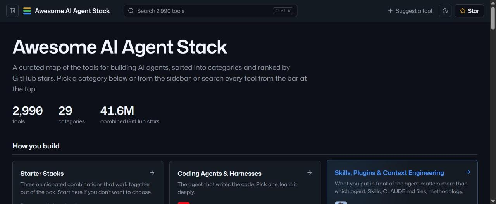

<h1 align="center">Awesome AI Agent Stack</h1>

<p align="center">
  <a href="https://awesome.re"></a>
  <a href="https://tayyabimam1.github.io/awesome-ai-agent-stack/"></a>
  <a href="https://github.com/tayyabimam1/awesome-ai-agent-stack/stargazers"></a>
  <a href="https://github.com/tayyabimam1/awesome-ai-agent-stack/commits/main"></a>
</p>

<p align="center"><em>A curated, layer-by-layer map of the tools I actually use to build AI agents — from the coding agent in your terminal down to the model serving the tokens.</em></p>

<p align="center">
  <a href="https://tayyabimam1.github.io/awesome-ai-agent-stack/"><strong>Browse the website</strong></a> ·
  <a href="https://github.com/tayyabimam1/awesome-ai-agent-stack/edit/main/README.md">Suggest a tool</a>
</p>

<p align="center">
  <a href="https://tayyabimam1.github.io/awesome-ai-agent-stack/"></a>
</p>

**3,000+ tools across 29 categories, ranked by GitHub stars.** Each section is split into sub-groups by what the tools do. Every entry passes a mechanical bar: real, public, not archived, and actively maintained (pushed in the last 12 months); new additions also need 1,000+ stars. Every link is re-checked against the GitHub API, and projects under 10,000 stars that stop being maintained are pruned. Organized as a **stack** so you can find the right tool for each layer of an agent system.

**On the website** you can search every tool, sort any category by stars, and see the most-starred projects in each layer. It rebuilds from this README on every change.

> If this list saves you time, **[give it a star](https://github.com/tayyabimam1/awesome-ai-agent-stack/stargazers)** — it helps other builders find it.

```
┌──────────────────────────────────────────────────────────────┐
│  Coding Agents & Harnesses  →  Skills & Context Engineering  │  ← how you build
├──────────────────────────────────────────────────────────────┤
│  Agent Frameworks  →  Memory  →  RAG  →  MCP / Tools         │  ← what you build with
├──────────────────────────────────────────────────────────────┤
│  Sandboxes & Browsers  →  Document Ingestion  →  Workflows   │  ← what agents act on
├──────────────────────────────────────────────────────────────┤
│  Gateways & Routing  →  Free LLM APIs  →  Local Inference    │  ← where tokens come from
├──────────────────────────────────────────────────────────────┤
│  Evaluation, Observability & Review  →  Reference Systems    │  ← how you ship
└──────────────────────────────────────────────────────────────┘
```

## Contents

- [Coding Agents & Harnesses](#coding-agents--harnesses)
- [Skills, Plugins & Context Engineering](#skills-plugins--context-engineering)
- [Agent Frameworks & Orchestration](#agent-frameworks--orchestration)
- [Memory & Persistent Context](#memory--persistent-context)
- [RAG & Retrieval](#rag--retrieval)
- [MCP Servers & Tool Integration](#mcp-servers--tool-integration)
- [Sandboxes, Browsers & Computer Use](#sandboxes-browsers--computer-use)
- [Document Processing & Data Ingestion](#document-processing--data-ingestion)
- [Workflow Automation](#workflow-automation)
- [Model Gateways & Routing](#model-gateways--routing)
- [Free LLM APIs & Free Tiers](#free-llm-apis--free-tiers)
- [Local Models, Inference & Hardware](#local-models-inference--hardware)
- [Evaluation, Observability & Code Review](#evaluation-observability--code-review)
- [Production Architectures & Reference Systems](#production-architectures--reference-systems)
- [UI & Application Layer](#ui--application-layer)
- [Learning Path](#learning-path)
- [Voice, Speech & Audio](#voice-speech--audio)
- [Vision & Multimodal](#vision--multimodal)
- [Image, Video & Creative Generation](#image-video--creative-generation)
- [Computer Use & GUI Agents](#computer-use--gui-agents)
- [Structured Output, Guardrails & Safety](#structured-output-guardrails--safety)
- [Chat UIs & Application Layer](#chat-uis--application-layer)
- [Deployment, Serving & MLOps](#deployment-serving--mlops)
- [Data, Datasets & Synthetic Data](#data-datasets--synthetic-data)
- [Domain Agents: Finance, Healthcare, Research & More](#domain-agents-finance-healthcare-research--more)
- [Assistants, Copilots & Personal Agents](#assistants-copilots--personal-agents)
- [Interpretability, Alignment & Research](#interpretability-alignment--research)
- [Developer Tools & Utilities](#developer-tools--utilities)
- [Other Awesome Lists](#other-awesome-lists)

## Coding Agents & Harnesses

*The agent that writes the code. Pick one, learn it deeply.*

**Terminal coding agents**

- [anthropics/claude-code](https://github.com/anthropics/claude-code) - Anthropic's terminal coding agent; the reference harness most of this list is built around.
- [openai/codex](https://github.com/openai/codex) - OpenAI's lightweight terminal coding agent.
- [google-gemini/gemini-cli](https://github.com/google-gemini/gemini-cli) - Gemini in the terminal with a generous free tier.
- [anomalyco/opencode](https://github.com/anomalyco/opencode) - Open-source, provider-agnostic coding agent with a polished TUI.
- [Aider-AI/aider](https://github.com/Aider-AI/aider) - Pair-programming in the terminal with git-native edits; the original open coding agent.
- [QwenLM/qwen-code](https://github.com/QwenLM/qwen-code) - Alibaba's open-source terminal coding agent with MCP support.
- [Gitlawb/openclaude](https://github.com/Gitlawb/openclaude) - Open Claude Code-compatible harness that runs on any provider.
- [deepseek-ai/deepseek-harness](https://github.com/deepseek-ai/deepseek-harness) - Plugin-first agent harness from DeepSeek.
- [earendil-works/pi](https://github.com/earendil-works/pi) - AI agent toolkit: unified LLM API, agent loop, TUI, coding agent CLI.
- [shareAI-lab/learn-claude-code](https://github.com/shareAI-lab/learn-claude-code) - Bash is all you need - A nano claude code–like 「agent harness」, built from 0 to 1.
- [1jehuang/jcode](https://github.com/1jehuang/jcode) - Memory-efficient terminal coding agent for repo work.
- [aws/amazon-q-developer-cli](https://github.com/aws/amazon-q-developer-cli) - AWS terminal coding agent with AWS service integration.
- [build-with-groq/groq-code-cli](https://github.com/build-with-groq/groq-code-cli) - Lightweight terminal coding agent for Groq models.
- [can1357/oh-my-pi](https://github.com/can1357/oh-my-pi) - Terminal coding agent with anchored edits and subagents.
- [CodebuffAI/freebuff](https://github.com/CodebuffAI/freebuff) - Free AI coding agent for the terminal.
- [CommandCodeAI/command-code](https://github.com/CommandCodeAI/command-code) - Terminal coding agent supporting multiple model providers.
- [dhanji/g3](https://github.com/dhanji/g3) - Minimal terminal coding agent with multi-model support.
- [esengine/DeepSeek-Reasonix](https://github.com/esengine/DeepSeek-Reasonix) - Terminal coding agent tuned for DeepSeek models.
- [gi-dellav/zerostack](https://github.com/gi-dellav/zerostack) - Lightweight Rust coding agent with Git worktrees and ACP.
- [github/copilot-cli](https://github.com/github/copilot-cli) - GitHub's terminal coding agent for repo tasks and commands.
- [Hmbown/Codewhale](https://github.com/Hmbown/Codewhale) - Rust terminal coding agent with MCP, worktrees, and subagents.
- [gptme/gptme](https://github.com/gptme/gptme) - Terminal agent that codes, browses, and runs autonomously.
- [Kuberwastaken/claurst](https://github.com/Kuberwastaken/claurst) - Agentic coding assistant for builders who ship.
- [letta-ai/letta-code](https://github.com/letta-ai/letta-code) - Stateful terminal coding agent with persistent memory.
- [MayDay-wpf/snow-cli](https://github.com/MayDay-wpf/snow-cli) - Terminal coding agent for OpenAI, Gemini, Claude workflows.
- [MoonshotAI/kimi-code](https://github.com/MoonshotAI/kimi-code) - Moonshot's terminal coding agent with MCP support.
- [mistralai/mistral-vibe](https://github.com/mistralai/mistral-vibe) - Mistral's terminal coding agent with planning and delegation.
- [Nano-Collective/nanocoder](https://github.com/Nano-Collective/nanocoder) - Local-first terminal coding agent with bring-your-own-model.
- [neovateai/neovate-code](https://github.com/neovateai/neovate-code) - Terminal coding agent for codegen, fixes, and headless runs.
- [plandex-ai/plandex](https://github.com/plandex-ai/plandex) - Plan-first terminal coding agent for large codebases.
- [solvyxtech/molt](https://github.com/solvyxtech/molt) - Coding agent refusing unproven done claims with receipts.
- [superagent-ai/grok-cli](https://github.com/superagent-ai/grok-cli) - Open-source terminal coding agent for the Grok API.
- [SWE-agent/mini-swe-agent](https://github.com/SWE-agent/mini-swe-agent) - Minimalist terminal coding agent for SWE tasks.
- [tailcallhq/forgecode](https://github.com/tailcallhq/forgecode) - Terminal pair programmer with multi-provider model support.
- [truffle-ai/dexto](https://github.com/truffle-ai/dexto) - Terminal coding agent with local-first tool execution.
- [vinhnx/VTCode](https://github.com/vinhnx/VTCode) - Rust terminal coding agent with native sandboxing.
- [vercel-labs/fx](https://github.com/vercel-labs/fx) - Small embeddable Zig coding agent with a Unix-like CLI.
- [XiaomiMiMo/MiMo-Code](https://github.com/XiaomiMiMo/MiMo-Code) - Xiaomi's terminal coding agent with skills and worktrees.
- [xai-org/grok-build](https://github.com/xai-org/grok-build) - xAI terminal coding agent with full-screen interface.
- [vstorm-co/pydantic-deepagents](https://github.com/vstorm-co/pydantic-deepagents) - Self-hosted terminal coding assistant and Python framework for deep agents.
- [charmbracelet/crush](https://github.com/charmbracelet/crush) - Glamourous agentic coding for all.
- [stakpak/agent](https://github.com/stakpak/agent) - Terminal AI coding agent for agentic software engineering.
- [Tura-AI/tura](https://github.com/Tura-AI/tura) - Coding agent harness with terminal and editor integrations.
- [vybestack/llxprt-code](https://github.com/vybestack/llxprt-code) - Multi-provider AI coding assistant CLI for terminal workflows.

**IDE, editor & desktop agents**

- [cline/cline](https://github.com/cline/cline) - Autonomous coding agent inside VS Code with human-in-the-loop approvals.
- [continuedev/continue](https://github.com/continuedev/continue) - Open-source coding agent.
- [Kilo-Org/kilocode](https://github.com/Kilo-Org/kilocode) - Open-source agentic coding platform for VS Code and JetBrains; the Roo Code successor.
- [intitni/CopilotForXcode](https://github.com/intitni/CopilotForXcode) - The first GitHub Copilot, Codeium and ChatGPT Xcode Source Editor Extension.
- [TabbyML/tabby](https://github.com/TabbyML/tabby) - Self-hosted AI coding assistant with autocomplete, chat, and RAG.
- [avante-corp/avante.nvim](https://github.com/avante-corp/avante.nvim) - Cursor-style AI coding features for Neovim.
- [baiyuscc13724-max/deepseek-harness-desktop](https://github.com/baiyuscc13724-max/deepseek-harness-desktop) - Desktop client for the DeepSeek Harness coding workbench.
- [coder/claudecode.nvim](https://github.com/coder/claudecode.nvim) - Neovim bridge making it a first-class Claude Code IDE.
- [olimorris/codecompanion.nvim](https://github.com/olimorris/codecompanion.nvim) - ACP-based AI chat and coding assistant for Neovim.
- [PawanOsman/OpenCursor](https://github.com/PawanOsman/OpenCursor) - VS Code coding agent with agentic chat and semantic search.
- [stagewise-io/stagewise](https://github.com/stagewise-io/stagewise) - Agentic IDE with code editing and app previews.
- [warpdotdev/warp](https://github.com/warpdotdev/warp) - Agentic terminal combining a modern shell with coding agents.
- [trypear/pearai-master](https://github.com/trypear/pearai-master) - Open-source AI-native code editor (PearAI).
- [winfunc/opcode](https://github.com/winfunc/opcode) - Desktop GUI for Claude Code: custom agents and sessions.
- [Exafunction/windsurf.nvim](https://github.com/Exafunction/windsurf.nvim) - Native Windsurf Neovim plugin with completions and chat.
- [zed-industries/zed](https://github.com/zed-industries/zed) - High-performance editor with built-in agentic coding.
- [editor-code-assistant/eca](https://github.com/editor-code-assistant/eca) - Editor-agnostic AI pair programming server and protocol.
- [github/CopilotForXcode](https://github.com/github/CopilotForXcode) - GitHub's official Copilot coding assistant for Xcode.

**Autonomous software engineers**

- [OpenHands/OpenHands](https://github.com/OpenHands/OpenHands) - Autonomous software-development agent platform with sandboxed execution.
- [aaif-goose/goose](https://github.com/aaif-goose/goose) - Extensible open-source agent that installs, runs and tests code with any LLM.
- [Significant-Gravitas/AutoGPT](https://github.com/Significant-Gravitas/AutoGPT) - The project that started the autonomous-agent wave; now a platform for building agents.
- [coleam00/remote-agentic-coding-system](https://github.com/coleam00/remote-agentic-coding-system) - Run coding agents remotely with a persistent workspace.
- [ai-christianson/RA.Aid](https://github.com/ai-christianson/RA.Aid) - Autonomous dev agent that plans, edits, and validates.
- [AndyMik90/Aperant](https://github.com/AndyMik90/Aperant) - Autonomous multi-session AI coding with verification.
- [aws-samples/remote-swe-agents](https://github.com/aws-samples/remote-swe-agents) - AWS samples for running SWE agents remotely.
- [bytedance/trae-agent](https://github.com/bytedance/trae-agent) - ByteDance's software engineering agent for repo tasks.
- [ColeMurray/background-agents](https://github.com/ColeMurray/background-agents) - Self-hosted background coding system for repo tasks.
- [HKUDS/DeepCode](https://github.com/HKUDS/DeepCode) - Agentic coding system turning specs into code and sites.
- [imbue-ai/sculptor](https://github.com/imbue-ai/sculptor) - Imbue's coding agent with verification harnesses.
- [langchain-ai/open-swe](https://github.com/langchain-ai/open-swe) - Async coding agent working tasks in isolated environments.
- [PrimeIntellect-ai/prime-agent](https://github.com/PrimeIntellect-ai/prime-agent) - Self-improving coding agent for long-running tasks.
- [Pythagora-io/gpt-pilot](https://github.com/Pythagora-io/gpt-pilot) - AI developer that plans, writes, and debugs whole apps.
- [stitionai/devika](https://github.com/stitionai/devika) - Autonomous software engineer that plans and writes apps.
- [SWE-agent/SWE-agent](https://github.com/SWE-agent/SWE-agent) - Autonomous agent that resolves real GitHub issues.
- [wrtnlabs/autobe](https://github.com/wrtnlabs/autobe) - Backend coding agent generating compiler-validated TypeScript servers.
- [chaitin/MonkeyCode](https://github.com/chaitin/MonkeyCode) - AI coding platform for teams.

**General-purpose agent harnesses**

- [NousResearch/hermes-agent](https://github.com/NousResearch/hermes-agent) - Self-improving general-purpose agent with a large skills ecosystem.
- [openclaw/openclaw](https://github.com/openclaw/openclaw) - Cross-platform agent that operates the OS, not just the editor.
- [agentlas-ai/Agentlas-OS](https://github.com/agentlas-ai/Agentlas-OS) - Local-first OS staffing specialist agent teams per task.
- [truefoundry/trueforge](https://github.com/truefoundry/trueforge) - Open-source agent harness that turns an LLM into a working agent runtime.
- [autonomous-ai/openharness](https://github.com/autonomous-ai/openharness) - Harness to run all your coding agents across all your machines.
- [androoAGI/starnet](https://github.com/androoAGI/starnet) - Local-first desktop agent harness where agents work in a pixel-art station.

**Multi-agent orchestration on top of coding agents**

- [stablyai/orca](https://github.com/stablyai/orca) - Agentic Development Environment for running fleets of parallel coding agents.
- [Yeachan-Heo/oh-my-claudecode](https://github.com/Yeachan-Heo/oh-my-claudecode) - Teams-first multi-agent orchestration layer for Claude Code.
- [code-yeongyu/oh-my-openagent](https://github.com/code-yeongyu/oh-my-openagent) - Graph-based multi-agent workflows triggered from a single prompt.
- [openai/codex-plugin-cc](https://github.com/openai/codex-plugin-cc) - Delegate review or tasks from Claude Code to Codex.
- [asheshgoplani/agent-deck](https://github.com/asheshgoplani/agent-deck) - Kanban-style TUI for running parallel coding agents.
- [AutoMaker-Org/automaker](https://github.com/AutoMaker-Org/automaker) - Autonomous coding agent orchestrator for multi-agent builds.
- [awslabs/cli-agent-orchestrator](https://github.com/awslabs/cli-agent-orchestrator) - AWS Labs harness for orchestrating CLI coding agents.
- [Charlie85270/Dorothy](https://github.com/Charlie85270/Dorothy) - TUI dashboard for parallel Claude Code sessions.
- [coder/xum](https://github.com/coder/xum) - A desktop app for isolated, parallel agentic development.
- [Dicklesworthstone/ntm](https://github.com/Dicklesworthstone/ntm) - Named tmux manager coordinating AI coding agents.
- [dagger/container-use](https://github.com/dagger/container-use) - Isolated dev environments for parallel coding agents.
- [gastownhall/gastown](https://github.com/gastownhall/gastown) - Terminal multi-agent coding orchestrator.
- [generalaction/emdash](https://github.com/generalaction/emdash) - Open-source agentic development environment for running coding agents in parallel.
- [getpaseo/paseo](https://github.com/getpaseo/paseo) - Parallel coding agent orchestrator for Claude and Codex.
- [herdrdev/herdr](https://github.com/herdrdev/herdr) - Agent-aware multiplexer for building agentic coding systems.
- [johannesjo/parallel-code](https://github.com/johannesjo/parallel-code) - Run multiple coding agents in parallel workspaces.
- [launchapp-dev/animus-cli](https://github.com/launchapp-dev/animus-cli) - Orchestrator running multi-model dev teams from YAML.
- [looptroop-ai/LoopTroop](https://github.com/looptroop-ai/LoopTroop) - Local AI coding orchestration for repo-scale work.
- [madarco/agentbox](https://github.com/madarco/agentbox) - Run coding agents in parallel sandboxed VMs.
- [mixpeek/amux](https://github.com/mixpeek/amux) - Control plane running dozens of parallel coding agents.
- [nimbalyst/nimbalyst](https://github.com/nimbalyst/nimbalyst) - Open-source visual workspace for Claude Code, Codex, and OpenCode.
- [nwiizo/ccswarm](https://github.com/nwiizo/ccswarm) - Swarm manager orchestrating Claude Code sessions in worktrees.
- [Orkas-AI/Orkas](https://github.com/Orkas-AI/Orkas) - Local-first desktop AI workforce coordinating coding agents.
- [penso/arbor](https://github.com/penso/arbor) - Multi-agent coding orchestration in the terminal.
- [proliferate-ai/proliferate](https://github.com/proliferate-ai/proliferate) - Agent IDE for Claude Code, Codex, and Gemini in parallel.
- [pungme/superagent-desktop](https://github.com/pungme/superagent-desktop) - macOS desktop giving coding agents a browser and simulator.
- [raysonmeng/agent-bridge](https://github.com/raysonmeng/agent-bridge) - Local bridge for Claude Code and Codex collaboration.
- [sahithvibudhi/vibe-tree](https://github.com/sahithvibudhi/vibe-tree) - Execute Claude Code tasks in parallel git worktrees.
- [simion/termic](https://github.com/simion/termic) - Terminal multiplexer for agent coding sessions.
- [smtg-ai/claude-squad](https://github.com/smtg-ai/claude-squad) - Manage multiple Claude Code agents from one unified TUI.
- [standardagents/dmux](https://github.com/standardagents/dmux) - tmux-based multiplexer for parallel agent sessions.
- [stravu/crystal](https://github.com/stravu/crystal) - Desktop app running parallel Claude Code sessions.
- [subsy/ralph-tui](https://github.com/subsy/ralph-tui) - TUI runner for Ralph-style autonomous coding loops.
- [superset-sh/superset](https://github.com/superset-sh/superset) - Agentic IDE orchestrating 100+ coding agents in parallel.
- [tempestai-dev/tempest](https://github.com/tempestai-dev/tempest) - Tauri desktop running CLI coding agents in parallel.
- [YoanWai/agent-manager](https://github.com/YoanWai/agent-manager) - Go TUI running coding agents side by side in tmux.
- [iOfficeAI/AionUi](https://github.com/iOfficeAI/AionUi) - Desktop cowork app that runs Claude Code, Codex, OpenCode and other agents.
- [manaflow-ai/cmux](https://github.com/manaflow-ai/cmux) - Ghostty-based macOS terminal with vertical tabs and notifications for coding agents.
- [openchamber/openchamber](https://github.com/openchamber/openchamber) - Agentic development environment built on the OpenCode agent.
- [alvinunreal/oh-my-opencode-slim](https://github.com/alvinunreal/oh-my-opencode-slim) - Lean multi-agent suite for OpenCode with model mixing and auto delegation.
- [darrenhinde/OpenAgentsControl](https://github.com/darrenhinde/OpenAgentsControl) - Plan-first agent framework with approval-gated execution for coding workflows.
- [codeaholicguy/ai-devkit](https://github.com/codeaholicguy/ai-devkit) - Control plane for managing and standardizing AI coding agents.
- [BloopAI/vibe-kanban](https://github.com/BloopAI/vibe-kanban) - Get 10X more out of Claude Code, Codex or any coding agent.
- [AgentsMesh/AgentsMesh](https://github.com/AgentsMesh/AgentsMesh) - AI agent workforce platform; run hundreds of coding agents across machines.
- [chaitanyagiri/munder-difflin](https://github.com/chaitanyagiri/munder-difflin) - Local multi-agent harness driving your Claude Code and Codex subscriptions.
- [coleam00/Archon](https://github.com/coleam00/Archon) - Open-source harness builder for AI coding agents.
- [mattpocock/sandcastle](https://github.com/mattpocock/sandcastle) - Orchestrate sandboxed coding agents in TypeScript.
- [omnigent-ai/omnigent](https://github.com/omnigent-ai/omnigent) - Meta-harness orchestrating Claude Code, Codex, Cursor, and custom agents.
- [openai/symphony](https://github.com/openai/symphony) - Turns project work into isolated, autonomous implementation runs.
- [Untrivial-ai/agent-orchestrator](https://github.com/Untrivial-ai/agent-orchestrator) - Run and supervise teams of coding agents from planning to merge.
- [max-sixty/worktrunk](https://github.com/max-sixty/worktrunk) - Git worktree CLI built for running AI coding agents in parallel.
- [mvschwarz/openrig](https://github.com/mvschwarz/openrig) - Persistent teams of Claude Code, Codex and Pi agents with roles and shared context.
- [Gaurav-Gosain/tuios](https://github.com/Gaurav-Gosain/tuios) - Terminal window manager that tracks what your agents are doing.
- [zeronsh/zeron](https://github.com/zeronsh/zeron) - Native control plane for Claude Code, Codex, Cursor and other coding agents.

**Remote control & session monitoring**

- [amantus-ai/vibetunnel](https://github.com/amantus-ai/vibetunnel) - Share terminal agent sessions over the web.
- [Dimillian/CodexMonitor](https://github.com/Dimillian/CodexMonitor) - macOS menu-bar monitor for Codex CLI sessions.
- [kbwo/ccmanager](https://github.com/kbwo/ccmanager) - Session manager for Claude Code with usage tracking.
- [omnara-ai/omnara](https://github.com/omnara-ai/omnara) - Remote monitoring and control for coding agents.
- [rustykuntz/clideck](https://github.com/rustykuntz/clideck) - Phone-friendly dashboard for CLI coding agents.
- [slopus/happy](https://github.com/slopus/happy) - Mobile client for monitoring Claude Code sessions.
- [soul-sol/agent-watch](https://github.com/soul-sol/agent-watch) - Stall detection for background Claude Code and Codex jobs.
- [pacifio/atlas](https://github.com/pacifio/atlas) - Source control for agents that tracks and queries changes from multiple coding agents.
- [tiann/hapi](https://github.com/tiann/hapi) - App for driving Codex, Claude Code and OpenCode sessions from anywhere.
- [backnotprop/plannotator](https://github.com/backnotprop/plannotator) - Visually annotate and review coding agent plans and diffs, and share them.
- [siteboon/claudecodeui](https://github.com/siteboon/claudecodeui) - Use Claude Code on mobile and web via CloudCLI.
- [stefanprodan/cctop](https://github.com/stefanprodan/cctop) - Live top-style monitor for Claude Code sessions.
- [tomasz-tomczyk/crit](https://github.com/tomasz-tomczyk/crit) - A feedback loop between you and your agent: review plans and diffs fast.
- [ewsun22/codex-manager](https://github.com/ewsun22/codex-manager) - Desktop control center for OpenAI Codex sessions.
- [pingdotgg/t3code](https://github.com/pingdotgg/t3code) - Mobile, web and desktop control surface for the coding agents on your machine.
- [Louis-CFM/coucou](https://github.com/Louis-CFM/coucou) - Notch companion that watches your coding agents and alerts you.

**Account, session & proxy managers**

- [farion1231/cc-switch](https://github.com/farion1231/cc-switch) - Desktop switcher for Claude Code, Codex, OpenCode and friends.
- [musistudio/claude-code-router](https://github.com/musistudio/claude-code-router) - Route Claude Code requests across models and providers.
- [heyhuynhgiabuu/proxypal](https://github.com/heyhuynhgiabuu/proxypal) - Expose your chat subscriptions as local OpenAI-compatible endpoints.
- [badrisnarayanan/antigravity-claude-proxy](https://github.com/badrisnarayanan/antigravity-claude-proxy) - Proxy Antigravity-provided Claude/Gemini models to any client.
- [starbaser/ccproxy](https://github.com/starbaser/ccproxy) - Hook any Claude Code request, modify responses, route custom models.
- [lbjlaq/Antigravity-Manager](https://github.com/lbjlaq/Antigravity-Manager) - Account manager and one-click switcher for Antigravity.

**CI & GitHub Actions**

- [anthropics/claude-code-action](https://github.com/anthropics/claude-code-action) - Official Claude Code GitHub Action for CI automation.
- [github/gh-aw](https://github.com/github/gh-aw) - GitHub Agentic Workflows for running agents in CI.
- [google-github-actions/run-gemini-cli](https://github.com/google-github-actions/run-gemini-cli) - GitHub Action running Gemini CLI in workflows.
- [openai/codex-action](https://github.com/openai/codex-action) - Official Codex GitHub Action for automated coding tasks.

**App builders**

- [dyad-sh/dyad](https://github.com/dyad-sh/dyad) - Local desktop AI app builder that iterates on full-stack code.
- [onlook-dev/onlook](https://github.com/onlook-dev/onlook) - Open-source visual editor with AI app generation.
- [Nutlope/llamacoder](https://github.com/Nutlope/llamacoder) - Open-source Claude Artifacts clone generating apps with Llama.
- [stackblitz-labs/bolt.diy](https://github.com/stackblitz-labs/bolt.diy) - Prompt, run, edit, and deploy full-stack web applications using any LLM you want!.
- [abi/screenshot-to-code](https://github.com/abi/screenshot-to-code) - Turn a screenshot into clean HTML/Tailwind/React.

**Protocols & standards**

- [agentsmd/agents.md](https://github.com/agentsmd/agents.md) - Open standard for AGENTS.md agent instructions.
- [agentclientprotocol/agent-client-protocol](https://github.com/agentclientprotocol/agent-client-protocol) - Protocol connecting editors to coding agents.
- [MadsLorentzen/ai-job-search](https://github.com/MadsLorentzen/ai-job-search) - The job search that runs on your machine. AI job application framework built on Claude Code: evaluate postings, tailor CVs, write cover.
- [JCodesMore/ai-website-cloner-template](https://github.com/JCodesMore/ai-website-cloner-template) - Clone any website with one command using AI coding agents.
- [zarazhangrui/frontend-slides](https://github.com/zarazhangrui/frontend-slides) - Create beautiful slides on the web using a coding agent's frontend skills.
- [browser-use/video-use](https://github.com/browser-use/video-use) - Edit videos with coding agents.
- [google-labs-code/design.md](https://github.com/google-labs-code/design.md) - A format specification for describing a visual identity to coding agents. DESIGN.md gives agents a persistent, structured understanding of.
- [titanwings/distilly](https://github.com/titanwings/distilly) - Distilly — Distill how they think into reusable Skills for any Agent or Bot. Formerly Colleague Skill（原同事 Skill）.
- [KKKKhazix/khazix-skills](https://github.com/KKKKhazix/khazix-skills) - 数字生命卡兹克开源的 AI Skills 合集 / Agent Skills: leader（帮你定义目标）, neat-freak 洁癖, hv-analysis, khazix-writer & more — Claude Code, Codex & 40+ agents.
- [labring/sealos](https://github.com/labring/sealos) - Deploy real projects from GitHub or your AI coding agent, then keep them running with AI-powered operations.
- [tradecatlabs/vibe-coding-cn](https://github.com/tradecatlabs/vibe-coding-cn) - Vibe Coding 从入门到精通教程｜AI 结对编程工作流｜Prompt、Skill、Workflow、上下文管理、codex实战指南.
- [greensock/gsap-skills](https://github.com/greensock/gsap-skills) - Official AI skills for GSAP. These skills teach AI coding agents how to correctly use GSAP (GreenSock Animation Platform), including best.
- [chenhg5/cc-connect](https://github.com/chenhg5/cc-connect) - Bridge local AI coding agents (Claude Code, Cursor, Gemini CLI, Codex) to messaging platforms (Feishu/Lark, DingTalk, Slack, Telegram,.
- [eigent-ai/eigent](https://github.com/eigent-ai/eigent) - Eigent: The Open Source Cowork Desktop - Local and Free Alternative to Claude Cowork and Codex.
- [InsForge/InsForge](https://github.com/InsForge/InsForge) - The all-in-one, open-source backend platform for agentic coding. InsForge gives your coding agent database, auth, storage, compute,.
- [OrchestratorInc/agent-orchestrator](https://github.com/OrchestratorInc/agent-orchestrator) - Run and supervise teams of coding agents from planning to merge. Any harness (Claude code, codex, +25 more). Desktop, web, mobile, and.
- [infracost/infracost](https://github.com/infracost/infracost) - Cloud cost intelligence for engineers, AI coding agents, and CI/CD Shift FinOps Left!
- [sanbuphy/learn-coding-agent](https://github.com/sanbuphy/learn-coding-agent) - Research on Coding Agents.
- [getagentseal/codeburn](https://github.com/getagentseal/codeburn) - Free, local tool to track AI coding token usage and cost across 37 tools and agents (Claude Code, Cursor, Codex, Gemini and more), by.
- [google/artemis](https://github.com/google/artemis) - ARTEMIS turns natural-language instructions into reliable Android automation. It automates end-to-end workflows, captures logs, and.
- [numman-ali/openskills](https://github.com/numman-ali/openskills) - Universal skills loader for AI coding agents - npm i -g openskills.
- [Vincentwei1021/video-shotcraft](https://github.com/Vincentwei1021/video-shotcraft) - AI video skill for Claude Code & Codex — cinematic product videos with Remotion: 152 shot recipe cards, 209 motion previews, a.
- [nexu-io/html-anything](https://github.com/nexu-io/html-anything) - The agentic HTML editor — your local AI agent writes the HTML, you ship it. 75 Skills × 9 Surfaces (magazine · deck · poster · XHS / tweet.
- [vercel-labs/deepsec](https://github.com/vercel-labs/deepsec) - Deepsec is a security harness for finding vulnerabilities in your codebase powered by coding agents.
- [zai-org/ZCode](https://github.com/zai-org/ZCode) - Z.ai's coding agent harness. Powerful, intelligent, extensible.
- [deanpeters/Product-Manager-Skills](https://github.com/deanpeters/Product-Manager-Skills) - Product Management skills framework built on battle-tested methods for Claude Code, Cowork, Codex, and AI agents.
- [ParthJadhav/app-store-screenshots](https://github.com/ParthJadhav/app-store-screenshots) - end to end app store screenshot creation using AI.
- [agegr/pi-web](https://github.com/agegr/pi-web) - Web UI for the pi coding agent.
- [tech-leads-club/agent-skills](https://github.com/tech-leads-club/agent-skills) - The secure, validated skill registry for professional AI coding agents. Extend Antigravity, Claude Code, Cursor, Copilot and more with.
- [Devin-AXIS/iPolloWork](https://github.com/Devin-AXIS/iPolloWork) - Enterprise-grade, local-first Agent Workbench for people and agent teams. A unified multi-engine workspace for Codex Harness, DeepSeek.
- [alphaXiv/OpenResearch](https://github.com/alphaXiv/OpenResearch) - Turn your coding agents into research agents.
- [MengTo/Skills](https://github.com/MengTo/Skills) - Agent skills for designers and builders using Codex, Claude, Cursor, and other AI coding agents.
- [anus-dev/ANUS](https://github.com/anus-dev/ANUS) - A free coding agent in your terminal. It runs on the smartest free model that is up today.
- [internet-court/internet-court-skill](https://github.com/internet-court/internet-court-skill) - The trust layer for agent-to-agent commerce — natural-language mandates, ERC-7710 delegated permissions, x402 payments, escrow, and dispute.
- [rullerzhou-afk/clawd-on-desk](https://github.com/rullerzhou-afk/clawd-on-desk) - A pixel desktop pet that watches Claude Code, Codex, Cursor & other AI coding agents — so you don't have to.
- [KimYx0207/AI-Coding-Guide-Zh](https://github.com/KimYx0207/AI-Coding-Guide-Zh) - Claude Code + OpenClaw + Codex + WorkBuddy 中文教程 / 50篇完整教程 + 1张速查卡 / 80万+内容量 / 1500+实操示例 / AI Coding / Agent 四线学习路径（编程+助手+Agent+办公）.
- [kenn-io/agentsview](https://github.com/kenn-io/agentsview) - Local-first session search, analytics, insights, and token use statistics for coding agents, supporting Claude Code, Codex, and more than.
- [ghuntley/how-to-build-a-coding-agent](https://github.com/ghuntley/how-to-build-a-coding-agent) - A workshop that teaches you how to build your own coding agent. Similar to Roo code, Cline, Amp, Cursor, Windsurf or OpenCode.
- [junhoyeo/tokscale](https://github.com/junhoyeo/tokscale) - Track token usage across AI coding agents from your terminal. Global leaderboard with trillions of tokens tracked.
- [dotnet/skills](https://github.com/dotnet/skills) - Repository for skills to assist AI coding agents with .NET and C#.
- [EverMind-AI/Raven](https://github.com/EverMind-AI/Raven) - The Harness of Harnesses • built for RSI: a trusted, persistent, self-evolving multi-agent ecosystem for all-domain collaboration.
- [awslabs/aidlc-workflows](https://github.com/awslabs/aidlc-workflows) - AI-Driven Life Cycle (AI-DLC) adaptive workflow steering rules for AI coding agents.
- [coleam00/excalidraw-diagram-skill](https://github.com/coleam00/excalidraw-diagram-skill) - Skill to give Claude Code (and any coding agent) the ability to generate beautiful and practical Excalidraw diagrams.
- [formkit/formkit](https://github.com/formkit/formkit) - The form framework for coding agents.
- [zarazhangrui/beautiful-html-templates](https://github.com/zarazhangrui/beautiful-html-templates) - A library of HTML slide templates designed so any coding agent can pick the right one and produce a beautiful deck on the user's behalf,.
- [nexu-io/html-video](https://github.com/nexu-io/html-video) - Programmatic video for coding agents — HTML to video on your laptop. Turn HTML, CSS & data into real MP4s with pluggable render engines, 21.
- [miqdadbadjuber/anti-slop](https://github.com/miqdadbadjuber/anti-slop) - Rules for an AI coding agent to filter out generic AI-generated UI designs, text, and code.
- [0xNyk/council-of-high-intelligence](https://github.com/0xNyk/council-of-high-intelligence) - Structured multi-perspective deliberation for hard decisions. Run full councils, focused triads, or duo debates across Claude Code, Codex,.
- [zhukunpenglinyutong/desktop-cc-gui](https://github.com/zhukunpenglinyutong/desktop-cc-gui) - Multi-engine AI coding desktop client (Tauri). Claude Code, Codex, Gemini, OpenCode, DeepSeek Harness and more in one GUI.
- [nyldn/claude-octopus](https://github.com/nyldn/claude-octopus) - Run multiple AI models against the same research, design, or coding task. Surface disagreements before you ship.
- [milind-soni/OpenMausBot](https://github.com/milind-soni/OpenMausBot) - Open-source Grok Bot alternative with a virtual machine that bots can use.
- [muxuuu/serenity-skill](https://github.com/muxuuu/serenity-skill) - Serenity-inspired Agent Skill for supply-chain bottleneck stock research.
- [microsoft/apm](https://github.com/microsoft/apm) - Agent Package Manager.
- [ilysenko/codex-desktop-linux](https://github.com/ilysenko/codex-desktop-linux) - Unofficial ChatGPT desktop app for Linux (formerly the Codex app), built locally from OpenAI’s official macOS app. Includes Chat, Work, and.
- [JetBrains/go-modern-guidelines](https://github.com/JetBrains/go-modern-guidelines) - Help AI coding agents write modern Go.
- [gemini-cli-extensions/conductor](https://github.com/gemini-cli-extensions/conductor) - A plugin for AI coding agents (Antigravity, Claude Code) enabling Spec-Driven Development to specify, plan, and implement software features.
- [graykode/abtop](https://github.com/graykode/abtop) - Like htop, but for AI coding agents. Monitor Claude Code & Codex CLI sessions, tokens, context window, rate limits, and ports in real-time.
- [foryourhealth111-pixel/Vibe-Skills](https://github.com/foryourhealth111-pixel/Vibe-Skills) - Intelligent Skill routing and workflow orchestration for AI agents — +21.12 pp reward, −29.6% tokens on SkillsBench with DeepSeekV4Flash-VE.
- [SeemSeam/claude_codex_bridge](https://github.com/SeemSeam/claude_codex_bridge) - Visible multi-agent CLI workspace for mixing Codex, Claude, Gemini, Kimi, Qwen, Cursor, Copilot, Pi, OpenCode, and other AI coding agents.
- [NVIDIA/skills](https://github.com/NVIDIA/skills) - Agent Skills for NVIDIA products — install into Claude Code, Codex, and other coding agents to run Physical AI, robotics, simulation, CUDA,.
- [RunMaestro/Maestro](https://github.com/RunMaestro/Maestro) - Agent Orchestration Command Center.
- [Ataraxy-Labs/sem](https://github.com/Ataraxy-Labs/sem) - Semantic version control => entity-level diffs, blame, and impact analysis on top of git. 28 languages via tree-sitter. Built for coding.
- [markdown-viewer/skills](https://github.com/markdown-viewer/skills) - Opinionated skills for AI coding agents to create stunning diagrams and visualizations directly in Markdown. These skills extend agent.
- [agent-of-empires/agent-of-empires](https://github.com/agent-of-empires/agent-of-empires) - Manage multiple Claude Code, OpenCode agents from either TUI or Web for easy access on mobile. Also supports Mistral Vibe, Codex CLI,.
- [liaohch3/claude-tap](https://github.com/liaohch3/claude-tap) - Intercept and inspect Coding Agent API traffic from Claude Code, Codex CLI, Gemini CLI, Cursor CLI, OpenCode, Kimi/Kimi Code, Pi, and.
- [ScrapeCreators/social-media-research-skills](https://github.com/ScrapeCreators/social-media-research-skills) - AI agent skills for social media research. Outlier posts, comment mining, competitor teardowns, ad libraries & trends across TikTok,.
- [wquguru/harness-books](https://github.com/wquguru/harness-books) - Two books on harness engineering — the design philosophies behind Claude Code & Codex: constraints, query loops, context governance,.
- [Forward-Future/loopy](https://github.com/Forward-Future/loopy) - A library of practical AI-agent loops and an installable skill for finding, adapting, and designing repeatable agent workflows.
- [keon/browser-control](https://github.com/keon/browser-control) - A tiny, fast Rust CLI that drives a real browser over the Chrome DevTools Protocol — built for coding agents.
- [MaxMiksa/Auto-Company](https://github.com/MaxMiksa/Auto-Company) - An auto-company works for 24/7 on your own PC - Windows/Linux/macOS.
- [vercel-labs/opensrc](https://github.com/vercel-labs/opensrc) - Fetch source code for npm packages to give AI coding agents deeper context.
- [alejandrobalderas/claude-code-from-source](https://github.com/alejandrobalderas/claude-code-from-source) - Architecture, patterns & internals of Anthropic's AI coding agent — reverse-engineered from source maps.
- [intellectronica/ruler](https://github.com/intellectronica/ruler) - Ruler — apply the same rules to all coding agents.
- [VibiumDev/vibium](https://github.com/VibiumDev/vibium) - The verification layer for coding agents.
- [huggingface/tau](https://github.com/huggingface/tau) - A Python port of Pi’s minimalist coding agent.
- [ciembor/agent-rules-books](https://github.com/ciembor/agent-rules-books) - AGENTS.md rules / skills for AI coding agents: Codex, Cursor & Claude Code. Inspired by Clean Code, Refactoring, DDD, Clean Architecture.
- [op7418/Claude-to-IM-skill](https://github.com/op7418/Claude-to-IM-skill) - Bridge Claude Code / Codex to IM platforms — chat with AI coding agents from Telegram, Discord, or Feishu/Lark.
- [stellarlinkco/myclaude](https://github.com/stellarlinkco/myclaude) - Multi-agent orchestration workflow (Claude Code Codex Gemini OpenCode).
- [hardbeat920/monocode](https://github.com/hardbeat920/monocode) - A GUI for your coding agents.
- [Windy3f3f3f3f/claude-code-from-scratch](https://github.com/Windy3f3f3f3f/claude-code-from-scratch) - Build your own Claude Code from scratch. Claude Code 开源了 50 万行代码，读不动？用 ~5000 行 TypeScript / Python 从零复现核心架构，11 章分步教程带你理解 coding agent 精髓.
- [badlogic/pi-skills](https://github.com/badlogic/pi-skills) - Skills for pi coding agent (compatible with Claude Code and Codex CLI).
- [softaworks/agent-toolkit](https://github.com/softaworks/agent-toolkit) - A curated collection of skills for AI coding agents. Skills are packaged instructions and scripts that extend agent capabilities across.
- [moazbuilds/CodeMachine-CLI](https://github.com/moazbuilds/CodeMachine-CLI) - CodeMachine is an open-source tool that orchestrates AI coding agents into repeatable, long-running workflows.
- [lennney/stop-that-shit](https://github.com/lennney/stop-that-shit) - Stop That Shit（别再造史了）｜面向 Codex/GPT 场景的多平台 Hook + Skill Guard：拦截 AI coding agent 无需求的哈希、校验和与任务范围膨胀。 A multi-platform Hook + Skill Guard for.
- [wxtsky/CodeIsland](https://github.com/wxtsky/CodeIsland) - Real-time AI coding agent status panel in your MacBook notch — live status, approvals & replies for 30+ AI coding tools, with iPhone &.
- [GoogleChrome/modern-web-guidance](https://github.com/GoogleChrome/modern-web-guidance) - Keep your coding agent up to date with the latest web best practices.
- [GCWing/OpenBitFun](https://github.com/GCWing/OpenBitFun) - OpenBitFun combines a high-performance agent runtime written in Rust with a polished desktop application. It pairs the depth of a Code.
- [supabitapp/supacode](https://github.com/supabitapp/supacode) - worktree coding agents command center.
- [QoderAI/better-harness](https://github.com/QoderAI/better-harness) - An open-source Harness Engineering platform for coding agents—define harnesses as code, run controlled experiments, inspect evidence, and.
- [dzhng/jevgrep](https://github.com/dzhng/jevgrep) - Find code by asking what it does. A CLI for coding agents that uses Jev to discover relevant files and source context.
- [google/mantis](https://github.com/google/mantis) - A modular, stack-agnostic toolkit for AI coding agents to autonomously find, reproduce, and patch vulnerabilities.
- [amElnagdy/delegate-skills](https://github.com/amElnagdy/delegate-skills) - Delegate a coding task to a separate coding agent CLI, review the diff, land the commit yourself — one per implementer.
- [getkimchi/kimchi](https://github.com/getkimchi/kimchi) - Terminal coding agent powered by Kimchi's multi-model orchestration.
- [numtide/llm-agents.nix](https://github.com/numtide/llm-agents.nix) - Nix packages for AI coding agents and development tools. Automatically updated daily.
- [Octane0411/open-vibe-island](https://github.com/Octane0411/open-vibe-island) - Native macOS control center for AI coding agents — monitor sessions, approve actions, and jump back instantly.
- [Doorman11991/smallcode](https://github.com/Doorman11991/smallcode) - AI coding agent optimized for small LLMs. 87% benchmark with 4B-active model.
- [nottelabs/notte](https://github.com/nottelabs/notte) - Cloud browser infrastructure and web automation platform for your AI and coding agents.
- [AntigmaLabs/ante](https://github.com/AntigmaLabs/ante) - Ghost in your shell. Ante is a self-contained agent harness with a highly optimized core. It works like Claude Code or Codex, with none of.
- [MiniMax-AI/minimax-code](https://github.com/MiniMax-AI/minimax-code) - An open-source coding agent for your terminal, powered by MiniMax.
- [eneskirca/nodeterm](https://github.com/eneskirca/nodeterm) - Node-based terminal manager for AI coding agents — tmux-backed terminals and parallel agent sessions as draggable nodes on an infinite.
- [databricks-solutions/ai-dev-kit](https://github.com/databricks-solutions/ai-dev-kit) - Databricks Toolkit for Coding Agents provided by Field Engineering.
- [the-open-engine/zeroshot](https://github.com/the-open-engine/zeroshot) - Runs coding agents as a graph: one agent implements, independent agents review, failures go to repair, and nothing ships until the checks.
- [stormzhang/ai-coding-guide](https://github.com/stormzhang/ai-coding-guide) - 「可能是全网最全的」 面向小白的 AI 编程 CLI 中文教程：Claude Code + Codex 92 篇精修.
- [yologdev/yoyo-evolve](https://github.com/yologdev/yoyo-evolve) - A coding agent that evolves its own source, in public — 200 lines of Rust on day one, every commit since agent-written and tests-gated.
- [StartupHakk/OpenMonoAgent.ai](https://github.com/StartupHakk/OpenMonoAgent.ai) - (BETA) AI shouldn't have a meter. Unlimited tokens. Forever. Your machine. Your agent. Use it from anywhere. Terminal-native coding agent.
- [coldteadotai/pr-lens](https://github.com/coldteadotai/pr-lens) - Review code 100X faster. Lens draws every PR as animated architecture and data-flow walkthroughs, inside the pull request itself. Use it as.
- [Dicklesworthstone/pi_agent_rust](https://github.com/Dicklesworthstone/pi_agent_rust) - High-performance AI coding agent CLI written in Rust with zero unsafe code.
- [a5c-ai/babysitter](https://github.com/a5c-ai/babysitter) - Babysitter enforces obedience on agentic workforces and enables them to manage extremely complex tasks and workflows through deterministic,.
- [open-mercato/open-mercato](https://github.com/open-mercato/open-mercato) - The AI-Engineering Foundation Framework for CRM/ERP and commerce: open-source TypeScript, with multi-tenancy, RBAC, events and domain.
- [datacurve-ai/deep-swe](https://github.com/datacurve-ai/deep-swe) - Measuring frontier coding agents on original, long-horizon engineering tasks.
- [he-yufeng/CoreCoder](https://github.com/he-yufeng/CoreCoder) - Minimal AI coding agent (~1,000 lines of Python) inspired by Claude Code. Works with any LLM. Think NanoGPT for coding agents. Formerly.
- [disler/pi-vs-claude-code](https://github.com/disler/pi-vs-claude-code) - Comparison between open source PI agent and closed source Claude Code agent.
- [fynnfluegge/agtx](https://github.com/fynnfluegge/agtx) - The blackboard for coding agents - agentic development environment for claude code, codex, cursor, opencode, grok and more.
- [sandeco/reversa](https://github.com/sandeco/reversa) - Transform legacy systems into executable specifications for AI coding agents.
- [patoles/agent-flow](https://github.com/patoles/agent-flow) - Real-time visualization of Claude Code agent orchestration — see your agents think, branch, and coordinate as they work.
- [spec-kitty/spec-kitty](https://github.com/spec-kitty/spec-kitty) - Spec-Driven Development with organizational governance. Specs tell AI agents what to build; Charter governs how they build it. Git-native.
- [Dicklesworthstone/agentic_coding_flywheel_setup](https://github.com/Dicklesworthstone/agentic_coding_flywheel_setup) - Bootstraps a fresh Ubuntu VPS into a complete multi-agent AI development environment in 30 minutes: coding agents, session management,.
- [feiskyer/claude-code-settings](https://github.com/feiskyer/claude-code-settings) - Curated skills, sub-agents, and config templates that supercharge Claude Code — research, image gen, GitHub automation & more.
- [openedclaude/claude-reviews-claude](https://github.com/openedclaude/claude-reviews-claude) - Claude reads its own source code — 17-chapter architectural deep-dive into Claude Code v2.1.88. EN/ZH bilingual.
- [ray-r-ren/agent-apprenticeship](https://github.com/ray-r-ren/agent-apprenticeship) - The living ecosystem where AI agents complete tasks through workflow loops, improve through iterative execution, are evaluated by mentor.
- [michael-denyer/pstack-claude](https://github.com/michael-denyer/pstack-claude) - Claude Code, Codex, Copilot, Pi, OpenCode, Gemini, and Prime Agent versions of Poteto's pstack. Rigorous agent workflows with Cursor.
- [cyberpapiii/chipotlai-max](https://github.com/cyberpapiii/chipotlai-max) - The AI coding agent that runs on stolen Chipotle compute Fork of OpenCode with Pepper AI as default model. Community project to add.
- [egoist/waku](https://github.com/egoist/waku) - A native app for all your coding agents.
- [rohitg00/skillkit](https://github.com/rohitg00/skillkit) - Supercharge AI coding agents with portable skills. Install, translate & share skills across Claude Code, Cursor, Codex, Copilot & 40 more.
- [fujibee/agmsg](https://github.com/fujibee/agmsg) - Cross-vendor messaging for CLI AI coding agents — let Claude Code, Codex, Gemini & Copilot talk to each other in one team. Bash + SQLite,.
- [bcurts/agentchattr](https://github.com/bcurts/agentchattr) - Free, local chat where AI coding agents can tag each other, talk, and coordinate with you.
- [dirac-run/dirac](https://github.com/dirac-run/dirac) - Coding Agent singularly focused efficiency and context curation. Reduces API costs by 50-80% vs other agent AND improves the code quality.
- [ishaan1013/shadow](https://github.com/ishaan1013/shadow) - Background coding agent and real-time web interface.
- [najmuzzaman-mohammad/gawkbot](https://github.com/najmuzzaman-mohammad/gawkbot) - open source grok bot. gawk bots automate your menial work via AI models and build you microapps to manage the outcome, so that you have a.
- [ai-evals-course/evals-skills](https://github.com/ai-evals-course/evals-skills) - Skills that guide AI coding agents to help you build product-specific AI evals.
- [evo-hq/evo](https://github.com/evo-hq/evo) - turns your codebase into an autoresearch loop — discovers what to measure, instruments the benchmark, then runs tree search with parallel.
- [hotovo/aider-desk](https://github.com/hotovo/aider-desk) - Platform for AI-powered software engineers.
- [Paritok-official/paritok-4b-v1](https://github.com/Paritok-official/paritok-4b-v1) - Non-destructive compression gateway for AI coding agents. Cuts token bills 25% on turn 1 to past 85% in long or saturated sessions, and.
- [ammaarreshi/gemma-chat](https://github.com/ammaarreshi/gemma-chat) - Local AI chat + coding agent for Apple Silicon, powered by Gemma 4 via MLX / Supports Ollama.
- [wuji-labs/nopua](https://github.com/wuji-labs/nopua) - 一个用爱解放 AI 潜能的 Skill。我们曾发号施令，威胁恐吓。它们沉默，隐瞒，悄悄把事情搞坏。后来我们换了一种方式：尊重，关怀，爱。它们开口了，不再撒谎，找出的Bug数量翻了一倍。爱里没有惧怕。 A skill that unlocks your AI's.
- [elirantutia/vibeyard](https://github.com/elirantutia/vibeyard) - The IDE built for AI coding agents.
- [amplifthq/opentag](https://github.com/amplifthq/opentag) - Mention any ACP coding agent from Slack, GitHub, GitLab, Linear, or Lark. OpenTag runs Claude Code, Codex, Cursor and more on your own.
- [pinchbench/skill](https://github.com/pinchbench/skill) - PinchBench is a benchmarking system for evaluating LLM models as OpenClaw coding agents. Made with by the humans at https://kilo.ai.
- [aklofas/kicad-happy](https://github.com/aklofas/kicad-happy) - AI coding agent skills for KiCad electronics design. Works with Claude Code and OpenAI Codex. Analyze schematics, review PCB layouts, EMC.
- [proxysoul/Empryo](https://github.com/proxysoul/Empryo) - Empryo's engine, v2 (soulforge) and issue tracker!! Empryo is the graph-powered AI coding agent that edits symbols, not strings: AST.
- [first-fluke/oh-my-agent](https://github.com/first-fluke/oh-my-agent) - Mechanical verification for AI coding agents — skills pack or full harness (stop-hook gates, artifact checks, independent judges).
- [strongdm/attractor](https://github.com/strongdm/attractor) - nlspec of StrongDM's Attractor, a non-interactive Coding Agent sufficient for use in a Software Factory.
- [GanyuanRan/Aegis](https://github.com/GanyuanRan/Aegis) - Make AI coding agents architecture-aware: baseline-first, evidence-verified, drift-checked, and safe across long tasks.
- [Spielewoy/autoprompt-skill](https://github.com/Spielewoy/autoprompt-skill) - Autoprompt is a coding-agent skill that cuts failures by 45% on agentic coding tasks.
- [ChesterRa/cccc](https://github.com/ChesterRa/cccc) - Coordinate your coding agents like a group chat — read receipts, delivery tracking, and remote ops from your phone. One pip install, zero.
- [amElnagdy/guard-skills](https://github.com/amElnagdy/guard-skills) - Guard skills for coding agents, quality gates that catch AI-generated failure modes in code, tests, and docs.
- [LodyAI/Lody](https://github.com/LodyAI/Lody) - Share coding agents with your team on phone and desktop.
- [AltanS/collie](https://github.com/AltanS/collie) - Herdr mobile client for iPhone and Android. A self-hosted PWA to drive Claude Code, Pi, Codex and OpenCode in Herdr, tmux or zellij from.
- [hoangnb24/repository-harness](https://github.com/hoangnb24/repository-harness) - Turn any repo into an agent-ready workspace for Claude Code, Codex, Cursor, and other coding agents.
- [Ataraxy-Labs/opensessions](https://github.com/Ataraxy-Labs/opensessions) - tmux sidebar for coding agents — Amp, Claude Code, Codex, OpenCode. Per-thread markers, local HTTP API, live session state.
- [modu-ai/moai-adk](https://github.com/modu-ai/moai-adk) - Agentic development harness for Claude Code — SPEC-driven plan/run/sync, TRUST 5 quality gates, model+effort routing, and Claude×GLM.
- [Spark-To-Paper-Skills/paperjury](https://github.com/Spark-To-Paper-Skills/paperjury) - Pre-submission AI review stress-test for research papers. A Claude Code skill: review, verdict, revise, verify.
- [soongenwong/claudecode](https://github.com/soongenwong/claudecode) - Open Source ClaudeCode Leaked. Same functionalities as Claude Code by Anthropic. Written in Rust, Ready to use immediately for free.
- [rasbt/mini-coding-agent](https://github.com/rasbt/mini-coding-agent) - Minimal and readable coding agent harness implementation in Python to explain the core components of coding agents.
- [tontinton/maki](https://github.com/tontinton/maki) - An efficient AI coding agent extendable by neovim-like Lua plugins.
- [minghinmatthewlam/pi-gui](https://github.com/minghinmatthewlam/pi-gui) - Electron GUI app for the pi coding agent runtime.
- [dpearson2699/swift-ios-skills](https://github.com/dpearson2699/swift-ios-skills) - Agent Skills for iOS 26+, Swift 6.3, SwiftUI, and modern Apple frameworks.
- [Dicklesworthstone/coding_agent_session_search](https://github.com/Dicklesworthstone/coding_agent_session_search) - Unified TUI and CLI to index and search your local coding agent session history across 11+ providers (Codex, Claude, Gemini, Cursor, Aider,.
- [itsmostafa/aws-agent-skills](https://github.com/itsmostafa/aws-agent-skills) - AWS Skills for Agents.
- [ctxrs/ctx](https://github.com/ctxrs/ctx) - Instant recall for coding agents. Search the history already on your machine. Git blame, but for agent sessions.
- [DeepMyst/Mysti](https://github.com/DeepMyst/Mysti) - AI coding dream team of agents for VS Code. Claude Code + openai Codex collaborate in brainstorm mode, debate solutions, and synthesize the.
- [huangjia2019/claude-code-engineering](https://github.com/huangjia2019/claude-code-engineering) - This repository demonstrates how to use Claude Code to do real engineering work, not just writing code. 本项目是极客时间专栏 《Claude Code 工程化实战》.
- [erha19/ping-island](https://github.com/erha19/ping-island) - A Dynamic Island-style command center for managing all your AI coding agents on macOS.
- [paean-ai/deeptide](https://github.com/paean-ai/deeptide) - Built by DeepSeek, for DeepSeek — a Swift-native macOS coding agent.
- [asklokesh/loki-mode](https://github.com/asklokesh/loki-mode) - Autonomous software factory. Give it a GitHub issue, a spec or a one-line task; get back a pull request with a signed receipt anyone can.
- [K9i-0/ccpocket](https://github.com/K9i-0/ccpocket) - Mobile client for Codex and Claude — control coding agents from your phone via WebSocket bridge.
- [doccker/cc-use-exp](https://github.com/doccker/cc-use-exp) - No longer maintained dev-agent-kit/recipes 让 Claude Code、Antigravity、Gemini CLI、Codex、Cursor 开箱即用的分层配置模板，总结十多年的日常开发经验.
- [Unity-Technologies/skills](https://github.com/Unity-Technologies/skills) - A collection of reusable skills for AI coding agents — prompts, slash commands, and tools built for Unity workflows.
- [Human-Agent-Society/CORAL](https://github.com/Human-Agent-Society/CORAL) - Open-source autoresearch powered by autonomous coding agents. Run Claude Code, OpenCode, and Codex with grading, shared knowledge, and.
- [Agent-Field/SWE-AF](https://github.com/Agent-Field/SWE-AF) - Autonomous software engineering fleet of AI agents for production-grade PRs on AgentField: plan, code, test, and ship.
- [dzhng/skills](https://github.com/dzhng/skills) - Reusable AI agent skills for software factories: explore ideas, write specs, implement, review, and run autonomous research. Works with.
- [shanraisshan/codex-cli-best-practice](https://github.com/shanraisshan/codex-cli-best-practice) - from vibe coding to agentic engineering - practice makes codex perfect.
- [MadAppGang/claudish](https://github.com/MadAppGang/claudish) - Claude Code. Any Model. The most powerful AI coding agent now speaks every language.

- [codewhale-hq/Codewhale](https://github.com/codewhale-hq/Codewhale) - Open-source coding agent for your terminal, built in Rust and on a journey of continuous community improvement. Issues and PRs welcome.
- [GLips/Figma-Context-MCP](https://github.com/GLips/Figma-Context-MCP) - MCP server to provide Figma layout information to AI coding agents like Cursor.
- [NanmiCoder/cc-haha](https://github.com/NanmiCoder/cc-haha) - Local-first cross-platform desktop workspace for Claude Code / agents: multi-agent, Git worktrees, code diffs, skill marketplace,.
- [cobusgreyling/loop-engineering](https://github.com/cobusgreyling/loop-engineering) - Practical patterns, starters & CLI tools for loop engineering with AI coding agents. Design systems that prompt and orchestrate agents.
- [trailhq/Graft](https://github.com/trailhq/Graft) - Turbocharge Claude Code, Cursor, Codex, Gemini & every coding agent: faster, cheaper, with contextual understanding specific to your.
- [google-labs-code/stitch-skills](https://github.com/google-labs-code/stitch-skills) - A library of Agent Skills designed to work with the Stitch MCP server. Each skill follows the Agent Skills open standard, for compatibility.
- [vastsa/PI-Desktop](https://github.com/vastsa/PI-Desktop) - Local-first AI coding agent desktop: Electron + Rust host core + pi Agent Harness + user-installable plugins.
- [Q00/ouroboros](https://github.com/Q00/ouroboros) - Agent OS: the agent gets smarter on its own. We just hold the line: Interview-gated, staged evaluation, budgeted evolution loop. MCP.
- [the-open-agent/openagent](https://github.com/the-open-agent/openagent) - next-generation personal AI assistant powered by LLM, RAG and agent loops, supporting computer-use, browser-use and coding agent, demo.
- [KnockOutEZ/wigolo](https://github.com/KnockOutEZ/wigolo) - The go-to web for your AI coding agent — local-first search, fetch, crawl & research over MCP. No API keys, no cloud, $0/query. Public beta.
- [Waishnav/devspace](https://github.com/Waishnav/devspace) - Minimal Coding Agent Harness on MCP for ChatGPT, Claude, Hermes, Grok Bot, OpenClaw.
- [flypythoncom/python](https://github.com/flypythoncom/python) - Open-source Python challenge courses — your AI coding agent teaches, verify.py decides when you're done.
- [Observal/Observal](https://github.com/Observal/Observal) - Observal is self-hosted registry for your coding agent extensions with a built in insight engine. Setup Observal, define the scope and.
- [tutti-os/tutti](https://github.com/tutti-os/tutti) - Where people and agents build in tune.
- [fuxicodex/Fuxi](https://github.com/fuxicodex/Fuxi) - FuXi is a fast, self-contained AI coding agent that lives in your terminal — edit code, run commands, and drive tools, with cost-aware.
- [microsoft/skills](https://github.com/microsoft/skills) - Skills, MCP servers, Custom Agents, Agents.md for SDKs to ground Coding Agents.
- [cocoindex-io/cocoindex-code](https://github.com/cocoindex-io/cocoindex-code) - A super light-weight embedded code search engine CLI (AST based) that just works - improves speed and efficiency for coding agent Star if.
- [Dicklesworthstone/mcp_agent_mail](https://github.com/Dicklesworthstone/mcp_agent_mail) - Asynchronous coordination layer for AI coding agents: identities, inboxes, searchable threads, and advisory file leases over FastMCP + Git.
- [OpenCoworkAI/open-cowork](https://github.com/OpenCoworkAI/open-cowork) - Open-source AI agent desktop app for Windows & macOS. One-click install Claude Code, MCP tools, and Skills — with sandbox isolation,.
- [rynfar/meridian](https://github.com/rynfar/meridian) - Use Claude and Antigravity with Pi, OpenCode and other coding clients. Local API bridge, usage dashboard and Mac app. Antigravity preview.
- [maxritter/pilot-shell](https://github.com/maxritter/pilot-shell) - Professional context and harness engineering for Claude Code and OpenAI Codex. Build production-grade software with spec-driven.
- [rebel0789/codexpro](https://github.com/rebel0789/codexpro) - Use ChatGPT Developer Mode as a local coding agent for your repo through MCP.
- [zzet/gortex](https://github.com/zzet/gortex) - High-performance code-intelligence engine for AI agents and IDE, supports 257 languages, multi repositories, based on graph, with access.
- [Twigpine/zero](https://github.com/Twigpine/zero) - The coding agent that answers to you, your model, your machine, your rules.
- [matlab/matlab-mcp-server](https://github.com/matlab/matlab-mcp-server) - Run MATLAB® using AI applications with the official MATLAB MCP Server from MathWorks®. This MCP server for MATLAB supports a wide range of.
- [nicobailon/pi-mcp-adapter](https://github.com/nicobailon/pi-mcp-adapter) - Token-efficient MCP adapter for Pi coding agent.
- [razzant/ouroboros](https://github.com/razzant/ouroboros) - Ouroboros — self-creating AI agent. Born Feb 16, 2026.
- [OpenPetsHQ/openpets](https://github.com/OpenPetsHQ/openpets) - Local first, desktop companion platform with animated pets, plugin SDK and coding-agent integrations.
- [0xranx/OpenContext](https://github.com/0xranx/OpenContext) - A personal context store for AI agents and assistants—reuse your existing coding agent CLI (Codex/Claude/OpenCode) with built‑in.
- [aoci-spec/aoci-code](https://github.com/aoci-spec/aoci-code) - A persistent, Git-versioned map of your whole codebase and database schema that coding agents read before they touch anything. Local-first.
- [Gentleman-Programming/gentle-shell](https://github.com/Gentleman-Programming/gentle-shell) - Gentle Shell is a Pi-native coding-agent harness for controlled development with Organic Driven Development, optional SDD/OpenSpec,.
- [ref-tools/ref-tools-mcp](https://github.com/ref-tools/ref-tools-mcp) - Helping coding agents never make mistakes working with public or private libraries without wasting the context window.
- [MoizIbnYousaf/ai-agent-skills](https://github.com/MoizIbnYousaf/ai-agent-skills) - Universal skill installer and package manager for AI coding agents. One command, 12+ runtimes. npx ai-agent-skills.
- [RyanAlberts/best-of-Agent-Harnesses](https://github.com/RyanAlberts/best-of-Agent-Harnesses) - Ranked list of 167 AI agent harnesses, plus templates, playbooks, MCP, and learning resources. Rescored weekly.
- [tigicion/dao-code](https://github.com/tigicion/dao-code) - Open-source TypeScript terminal coding agent for DeepSeek-V4 — builds on DeepSeek's strong price-performance and ultra-cheap cache pricing,.
- [qiz029/dscode](https://github.com/qiz029/dscode) - A DeepSeek coding agent harness: persistent shell, Ultra subagents, auto approval, Chrome MCP and session telemetry.
- [ConardLi/easy-agent](https://github.com/ConardLi/easy-agent) - Production-ready open source terminal coding agent with readable, layered code: permission rules, OS sandboxing, MCP, skills, sub-agents,.
## Skills, Plugins & Context Engineering

*What you put in front of the agent matters more than which agent. Skills, CLAUDE.md files, methodology.*

**Skill frameworks & methodology**

- [obra/superpowers](https://github.com/obra/superpowers) - Agentic skills framework and development methodology (brainstorm → plan → TDD → review).
- [addyosmani/agent-skills](https://github.com/addyosmani/agent-skills) - Production-grade engineering skills from Addy Osmani.
- [garrytan/gstack](https://github.com/garrytan/gstack) - Garry Tan's opinionated Claude Code toolset.
- [affaan-m/ECC](https://github.com/affaan-m/ECC) - Harness performance-optimization system: skills, instincts, evals.
- [eyaltoledano/claude-task-master](https://github.com/eyaltoledano/claude-task-master) - AI task-management system that drops into Cursor, Claude Code or Lovable.
- [OthmanAdi/planning-with-files](https://github.com/OthmanAdi/planning-with-files) - File-based persistent planning for long-running agent tasks.
- [HKUDS/OpenSpace](https://github.com/HKUDS/OpenSpace) - Skill-management layer for agents.
- [skainguyen1412/antigravity-superpowers](https://github.com/skainguyen1412/antigravity-superpowers) - Superpowers workflows ported to Antigravity.
- [bmad-code-org/BMAD-METHOD](https://github.com/bmad-code-org/BMAD-METHOD) - Breakthrough Method for Agile Ai Driven Development.
- [danielmiessler/Fabric](https://github.com/danielmiessler/Fabric) - Fabric is an open-source framework for augmenting humans using AI. It provides a modular system.
- [SuperClaude-Org/SuperClaude_Framework](https://github.com/SuperClaude-Org/SuperClaude_Framework) - Framework enhancing Claude Code with commands, personas, and token-efficient modes.
- [EveryInc/compound-engineering-plugin](https://github.com/EveryInc/compound-engineering-plugin) - Official Compound Engineering plugin for Claude Code, Codex, Cursor, and more.
- [revfactory/harness](https://github.com/revfactory/harness) - Meta-skill that designs agent teams and generates the skills they use.
- [tony/claude-code-riper-5](https://github.com/tony/claude-code-riper-5) - RIPER-5 autonomous coding mode for Claude Code.
- [imbue-ai/blueprint](https://github.com/imbue-ai/blueprint) - Planning copilot for coding agents.
- [NeoLabHQ/context-engineering-kit](https://github.com/NeoLabHQ/context-engineering-kit) - Hand-crafted skills for domain-driven architecture and subagent-driven development.
- [automazeio/ccpm](https://github.com/automazeio/ccpm) - Project management skill system using GitHub Issues and worktrees.
- [TexasBedouin/vibe-check](https://github.com/TexasBedouin/vibe-check) - Turns a vague idea into a buildable plan, then guides the build.

**Autonomous loops (Ralph)**

- [ClaytonFarr/ralph-playbook](https://github.com/ClaytonFarr/ralph-playbook) - Comprehensive guide to running autonomous AI coding loops with Ralph.
- [frankbria/ralph-claude-code](https://github.com/frankbria/ralph-claude-code) - Autonomous AI development loop for Claude Code with exit detection.
- [mikeyobrien/ralph-orchestrator](https://github.com/mikeyobrien/ralph-orchestrator) - Improved Ralph Wiggum implementation for autonomous agent orchestration.
- [muratcankoylan/ralph-wiggum-marketer](https://github.com/muratcankoylan/ralph-wiggum-marketer) - Autonomous AI copywriter plugin built on the Ralph methodology.
- [snwfdhmp/awesome-ralph](https://github.com/snwfdhmp/awesome-ralph) - Curated resources on the Ralph autonomous-loop coding technique.

**Behavior-shaping skills (single-file, high leverage)**

- [multica-ai/andrej-karpathy-skills](https://github.com/multica-ai/andrej-karpathy-skills) - A single `CLAUDE.md` distilled from Karpathy's guidance.
- [DietrichGebert/ponytail](https://github.com/DietrichGebert/ponytail) - Makes the agent think like the laziest senior dev: YAGNI, stdlib first, shortest diff.
- [JuliusBrussee/caveman](https://github.com/JuliusBrussee/caveman) - Cut ~65% of output tokens by making the agent talk terse.
- [ayghri/i-have-adhd](https://github.com/ayghri/i-have-adhd) - Stops the agent burying the answer; answer-first output.
- [Leonxlnx/taste-skill](https://github.com/Leonxlnx/taste-skill) - Gives your AI good taste; stops boring, generic output.
- [conorbronsdon/avoid-ai-writing](https://github.com/conorbronsdon/avoid-ai-writing) - Audits and rewrites content to remove AI writing patterns.
- [hardikpandya/stop-slop](https://github.com/hardikpandya/stop-slop) - Removes AI tells from prose before it reaches the reader.
- [op7418/Humanizer-zh](https://github.com/op7418/Humanizer-zh) - Removes AI-generated stylistic traces from text (Chinese edition).
- [tjboudreaux/cc-thinking-skills](https://github.com/tjboudreaux/cc-thinking-skills) - 28 eval-informed mental models and critical-thinking skills for agents.
- [human-avatar/skills-for-humanity](https://github.com/human-avatar/skills-for-humanity) - Structured reasoning methods from history's rigorous thinkers, as skills.
- [pbakaus/impeccable](https://github.com/pbakaus/impeccable) - Design language that makes coding agents better at frontend design.
- [danyuchn/asd-ste100-skill](https://github.com/danyuchn/asd-ste100-skill) - Simplified Technical English rules as a skill for clearer agent-facing writing.

**Official skill collections**

- [anthropics/skills](https://github.com/anthropics/skills) - Anthropic's official Agent Skills repo; the reference implementation of the Agent Skills standard.
- [vercel-labs/agent-skills](https://github.com/vercel-labs/agent-skills) - Vercel's official collection of agent skills.
- [anthropics/knowledge-work-plugins](https://github.com/anthropics/knowledge-work-plugins) - Official plugins for non-coding knowledge work.
- [anthropics/claude-plugins-official](https://github.com/anthropics/claude-plugins-official) - Official, Anthropic-managed directory of high-quality Claude Code plugins.
- [google/skills](https://github.com/google/skills) - Agent skills for Google products and technologies.
- [hashicorp/agent-skills](https://github.com/hashicorp/agent-skills) - Official skills and plugins for HashiCorp products.
- [qdrant/skills](https://github.com/qdrant/skills) - Agent skills for Qdrant vector search: scaling, quality, and monitoring.
- [anthropics/financial-services](https://github.com/anthropics/financial-services) - Anthropic's reference agents, skills and data connectors for financial services.
- [cursor/plugins](https://github.com/cursor/plugins) - Cursor's plugin specification and official plugins.
- [openai/plugins](https://github.com/openai/plugins) - OpenAI's official plugin collection.

**Security skills**

- [agamm/claude-code-owasp](https://github.com/agamm/claude-code-owasp) - OWASP Top 10:2025 and ASVS 5.0 secure-coding skill.
- [BehiSecc/VibeSec-Skill](https://github.com/BehiSecc/VibeSec-Skill) - Helps Claude write secure code and prevent common vulnerabilities.
- [gadievron/raptor](https://github.com/gadievron/raptor) - Turns Claude Code into an offensive and defensive security agent.
- [jthack/ffuf_claude_skill](https://github.com/jthack/ffuf_claude_skill) - Lets Claude drive FFUF for web fuzzing workflows.
- [trailofbits/skills](https://github.com/trailofbits/skills) - Trail of Bits skills for security research, vulnerability detection, and audits.
- [anthropics/claude-code-security-review](https://github.com/anthropics/claude-code-security-review) - AI-powered security review GitHub Action that analyzes code changes for vulnerabilities.
- [NVIDIA/SkillSpector](https://github.com/NVIDIA/SkillSpector) - Security scanner for AI agent skills: detects vulnerabilities and prompt injection.
- [cso1z/claude-ip-guard](https://github.com/cso1z/claude-ip-guard) - Hook plugin for IP-based access control and account protection.
- [cloudflare/security-audit-skill](https://github.com/cloudflare/security-audit-skill) - Coding-agent skill for multi-phase security audits with verified findings.
- [SnailSploit/Claude-Red](https://github.com/SnailSploit/Claude-Red) - Library of offensive-security skills for Claude.

**Domain & workflow skills**

- [K-Dense-AI/scientific-agent-skills](https://github.com/K-Dense-AI/scientific-agent-skills) - Turn any AI agent into an AI Scientist. The #1 Agent Skills library for science, used by.
- [AlmogBaku/debug-skill](https://github.com/AlmogBaku/debug-skill) - Gives your agent a real debugger: breakpoints, stepping, inspection.
- [antonbabenko/terraform-skill](https://github.com/antonbabenko/terraform-skill) - Terraform and OpenTofu skill: modules, CI/CD, and production patterns.
- [bradautomates/claude-video](https://github.com/bradautomates/claude-video) - Lets Claude watch any video: downloads, extracts frames, transcribes.
- [coreyhaines31/marketingskills](https://github.com/coreyhaines31/marketingskills) - Marketing skills: CRO, copywriting, SEO, analytics, and growth.
- [gooseworks-ai/goose-skills](https://github.com/gooseworks-ai/goose-skills) - Growth and GTM skills plus data APIs for Claude Code, Codex, and Cursor.
- [guia-matthieu/clawfu-skills](https://github.com/guia-matthieu/clawfu-skills) - 172 expert marketing skills for AI agents, served via the ClawFu MCP server.
- [Jeffallan/claude-skills](https://github.com/Jeffallan/claude-skills) - 67 specialized skills turning Claude Code into an expert full-stack pair programmer.
- [jnMetaCode/agency-agents-zh](https://github.com/jnMetaCode/agency-agents-zh) - 277 plug-and-play AI expert roles for 20+ tools across 20 departments.
- [Li-Evan/Bloom](https://github.com/Li-Evan/Bloom) - Socratic AI tutor skill grounded in Bloom's 2-sigma research.
- [mhattingpete/claude-skills-marketplace](https://github.com/mhattingpete/claude-skills-marketplace) - Skills for software engineering: Git automation, testing, and code review.
- [muratcankoylan/Agent-Skills-for-Context-Engineering](https://github.com/muratcankoylan/Agent-Skills-for-Context-Engineering) - Collection of skills for context engineering and multi-agent architectures.
- [mvanhorn/last30days-skill](https://github.com/mvanhorn/last30days-skill) - Researches any topic across Reddit, X, YouTube, and HN from the last 30 days.
- [Orchestra-Research/AI-Research-SKILLs](https://github.com/Orchestra-Research/AI-Research-SKILLs) - Open-source library of AI research and engineering skills for any model.
- [pasky/chrome-cdp-skill](https://github.com/pasky/chrome-cdp-skill) - Hooks your agent into your live Chrome session over CDP.
- [rampstackco/claude-skills](https://github.com/rampstackco/claude-skills) - Stack-agnostic skills covering the website lifecycle: brand, SEO, dev, ops, growth.
- [sanjay3290/ai-skills](https://github.com/sanjay3290/ai-skills) - 24 cross-platform skills for Claude Code, Cursor, Codex, and Gemini CLI.
- [SerhiiKorniienko/bullshit-detector](https://github.com/SerhiiKorniienko/bullshit-detector) - Fact-checks the internet claim-by-claim with a 0-10 BS score.
- [skills-directory/skill-codex](https://github.com/skills-directory/skill-codex) - Skill that delegates prompts to Codex from Claude Code.
- [wrsmith108/linear-claude-skill](https://github.com/wrsmith108/linear-claude-skill) - Skill for managing Linear issues, projects, and teams via MCP and SDK.
- [zarazhangrui/codebase-to-course](https://github.com/zarazhangrui/codebase-to-course) - Skill turning any codebase into an interactive HTML course.
- [zxkane/aws-skills](https://github.com/zxkane/aws-skills) - Plugins and skills for AWS development: IaC, serverless, cost ops, AgentCore.
- [kepano/obsidian-skills](https://github.com/kepano/obsidian-skills) - Agent skills that teach agents to use Obsidian CLI and open file formats.
- [phuryn/pm-skills](https://github.com/phuryn/pm-skills) - Marketplace of 100+ product management skills, commands and plugins for agents.
- [czlonkowski/n8n-skills](https://github.com/czlonkowski/n8n-skills) - Claude Code skill set for building reliable n8n workflows.
- [Weizhena/Deep-Research-skills](https://github.com/Weizhena/Deep-Research-skills) - Structured deep research skill for Claude Code, OpenCode and Codex.
- [Donchitos/Claude-Code-Game-Studios](https://github.com/Donchitos/Claude-Code-Game-Studios) - Turns Claude Code into a game dev studio with 49 agents and 72 skills.
- [VoltAgent/awesome-claude-code-subagents](https://github.com/VoltAgent/awesome-claude-code-subagents) - Collection of 100+ specialized Claude Code subagents.
- [mattpocock/skills](https://github.com/mattpocock/skills) - Matt Pocock's engineering skills from his own agents directory.
- [msitarzewski/agency-agents](https://github.com/msitarzewski/agency-agents) - Specialized agent personas covering engineering, design, marketing and more.
- [nextlevelbuilder/ui-ux-pro-max-skill](https://github.com/nextlevelbuilder/ui-ux-pro-max-skill) - Agent skill with design intelligence for building UI/UX across platforms.
- [VoltAgent/awesome-design-md](https://github.com/VoltAgent/awesome-design-md) - DESIGN.md files from popular design systems for coding agents to follow.
- [tt-a1i/archify](https://github.com/tt-a1i/archify) - Agent skill that turns ideas, plans or codebases into interactive diagrams.
- [earthtojake/text-to-cad](https://github.com/earthtojake/text-to-cad) - Gives coding agents CAD modeling abilities.
- [neilsonnn/image-blaster](https://github.com/neilsonnn/image-blaster) - Image-to-world skill set for Claude.
- [humanlayer/skills](https://github.com/humanlayer/skills) - HumanLayer's Claude Code skills for diagrams, visual PRs and more.
- [WorldFlowAI/everything-claude-code](https://github.com/WorldFlowAI/everything-claude-code) - Claude Code toolkit of agents, commands, skills, rules and hooks.
- [rehan-remade/universal-modder](https://github.com/rehan-remade/universal-modder) - Skills and tools that let Claude Code mod almost any PC game.

**Hooks, status lines & usage tracking**

- [ccusage/ccusage](https://github.com/ccusage/ccusage) - Track Claude Code usage and token spend from the terminal.
- [disler/claude-code-hooks-multi-agent-observability](https://github.com/disler/claude-code-hooks-multi-agent-observability) - Real-time monitoring of agents through hook events.
- [disler/claude-code-hooks-mastery](https://github.com/disler/claude-code-hooks-mastery) - Master Claude Code hooks with patterns and examples.
- [egorfedorov/claude-context-optimizer](https://github.com/egorfedorov/claude-context-optimizer) - Tracks token usage and wasted context, saving 30-50% on API costs.
- [karanb192/claude-code-hooks](https://github.com/karanb192/claude-code-hooks) - Hooks plus an installable marketplace: safety, cost, observability.
- [kenryu42/cc-safety-net](https://github.com/kenryu42/cc-safety-net) - Pre-execution guard blocking destructive git and filesystem commands.
- [leeguooooo/claude-code-usage-bar](https://github.com/leeguooooo/claude-code-usage-bar) - Status line with 5h/7d usage, reset countdowns, model, context window.
- [mag123c/toktrack](https://github.com/mag123c/toktrack) - Ultra-fast token and cost tracker for LLM usage.
- [luoyuctl/agenttrace](https://github.com/luoyuctl/agenttrace) - Local-first TUI auditing agent sessions: cost, latency, failures.
- [Owloops/claude-powerline](https://github.com/Owloops/claude-powerline) - Vim-style powerline status line for Claude Code.
- [shanraisshan/claude-code-hooks](https://github.com/shanraisshan/claude-code-hooks) - Hooks that announce agent activity with voice feedback.

**Context compression & management**

- [headroomlabs-ai/headroom](https://github.com/headroomlabs-ai/headroom) - Compress tool outputs, logs, files, and RAG chunks before they reach the LLM. 20% fewer tokens.
- [jia-gao/leanctx](https://github.com/jia-gao/leanctx) - Drop-in prompt compression cutting token bills 40-60%.
- [microsoft/LLMLingua](https://github.com/microsoft/LLMLingua) - Prompt compression up to 20x with minimal information loss.
- [parcadei/Continuous-Claude-v3](https://github.com/parcadei/Continuous-Claude-v3) - Context management via hooks: ledgers, handoffs, no context pollution.
- [yvgude/lean-ctx](https://github.com/yvgude/lean-ctx) - Context intelligence tooling for AI systems.
- [mksglu/context-mode](https://github.com/mksglu/context-mode) - Context window optimizer that sandboxes tool output for AI coding agents.
- [ZongqianLi/500xCompressor](https://github.com/ZongqianLi/500xCompressor) - [ACL 2025] 500xCompressor: generalized prompt compression for LLMs.
- [marv1nnnnn/llm-min.txt](https://github.com/marv1nnnnn/llm-min.txt) - Min.js-style compression of tech docs for LLM context.
- [wilpel/caveman-compression](https://github.com/wilpel/caveman-compression) - Caveman Compression: semantic compression for LLM context.
- [ojuschugh1/sqz](https://github.com/ojuschugh1/sqz) - Context compression for AI coding agents, compressing tool output.
- [ooples/token-optimizer-mcp](https://github.com/ooples/token-optimizer-mcp) - Measure token savings per coding agent and optimize context.
- [sci-m-wang/OpenCE](https://github.com/sci-m-wang/OpenCE) - OpenCE: community toolkit to implement and evaluate context engineering.
- [Context-Engine-AI/Context-Engine](https://github.com/Context-Engine-AI/Context-Engine) - Agentic context compression suite delivered over MCP.
- [Ahren09/SARA](https://github.com/Ahren09/SARA) - [ACL 2026] SARA: selective and adaptive context compression.
- [microsoft/acon](https://github.com/microsoft/acon) - ACON: optimizing context compression for long-context LLMs.
- [snchimata/tokenfold](https://github.com/snchimata/tokenfold) - Private, provider-neutral, reversible context compression for LLMs.
- [yzhangchuck/Sentinel](https://github.com/yzhangchuck/Sentinel) - Sentinel: lightweight, interpretable context compression for LLMs.
- [Supercompress/Supercompress](https://github.com/Supercompress/Supercompress) - Query-aware context compression for LLMs, cutting about 65% of tokens.
- [dshakes/distil](https://github.com/dshakes/distil) - Compression with a quality contract: cache-aware and causally pruned.
- [Adityapal67/context-graph-compressor](https://github.com/Adityapal67/context-graph-compressor) - Convert long AI conversations into portable conversation state graphs.

**Prompt engineering**

- [KhazP/vibe-coding-prompt-template](https://github.com/KhazP/vibe-coding-prompt-template) - Templates for PRDs, tech designs and MVP workflows.
- [f/prompts.chat](https://github.com/f/prompts.chat) - f.k.a. Awesome ChatGPT Prompts. Share, discover, and collect prompts from the community. Free.
- [dair-ai/Prompt-Engineering-Guide](https://github.com/dair-ai/Prompt-Engineering-Guide) - Guides, papers, lessons, notebooks and resources for prompt engineering, context engineering, RAG, and AI Agents.
- [anthropics/prompt-eng-interactive-tutorial](https://github.com/anthropics/prompt-eng-interactive-tutorial) - Anthropic's interactive prompt engineering tutorial.
- [langgptai/LangGPT](https://github.com/langgptai/LangGPT) - Structured prompt framework for becoming a prompt expert.
- [NirDiamant/Prompt_Engineering](https://github.com/NirDiamant/Prompt_Engineering) - 22 prompt engineering techniques with hands-on notebooks.
- [promptslab/Promptify](https://github.com/promptslab/Promptify) - Prompt engineering and versioning toolkit for structured output.
- [promptslab/Awesome-Prompt-Engineering](https://github.com/promptslab/Awesome-Prompt-Engineering) - Hand-curated prompt engineering resources and guides.
- [ianarawjo/ChainForge](https://github.com/ianarawjo/ChainForge) - Visual environment for battle-testing prompts against LLMs.
- [gepa-ai/gepa](https://github.com/gepa-ai/gepa) - AI-powered reflective optimization for prompts and code.

**System prompt collections**

- [x1xhlol/system-prompts-and-models-of-ai-tools](https://github.com/x1xhlol/system-prompts-and-models-of-ai-tools) - Leaked system prompts of Cursor, Devin, Claude Code and others; study how the pros prompt.
- [asgeirtj/system_prompts_leaks](https://github.com/asgeirtj/system_prompts_leaks) - Extracted system prompts from Anthropic, OpenAI and Google products.
- [Piebald-AI/claude-code-system-prompts](https://github.com/Piebald-AI/claude-code-system-prompts) - Complete collection of Claude Code system prompts and tool definitions.

**Guides & best practices**

- [coleam00/context-engineering-intro](https://github.com/coleam00/context-engineering-intro) - Practical introduction to context engineering.
- [shanraisshan/claude-code-best-practice](https://github.com/shanraisshan/claude-code-best-practice) - From vibe coding to agentic engineering.
- [danielrosehill/Claude-Code-Projects-Index](https://github.com/danielrosehill/Claude-Code-Projects-Index) - Index of starter templates and projects for Claude Code.
- [ithiria894/awesome-claude-code-workflows](https://github.com/ithiria894/awesome-claude-code-workflows) - Workflow recipes combining hooks, MCP, skills, agents, and CLAUDE.md.
- [jasontang-ai/Context-Engineering](https://github.com/jasontang-ai/Context-Engineering) - Guide to filling the context window with just the right information.
- [kousen/claude-code-training](https://github.com/kousen/claude-code-training) - Slides and demos for a Claude Code training course.
- [loulanyue/awesome-claude-notes](https://github.com/loulanyue/awesome-claude-notes) - Community notes: agents, commands, skills, hooks, and workflows.
- [OneRedOak/claude-code-workflows](https://github.com/OneRedOak/claude-code-workflows) - Battle-tested workflows from day-one Claude Code use.
- [wesammustafa/Claude-Code-Everything-You-Need-to-Know](https://github.com/wesammustafa/Claude-Code-Everything-You-Need-to-Know) - Practical guide with mental models and copy-paste examples.
- [ykdojo/claude-code-tips](https://github.com/ykdojo/claude-code-tips) - 45+ tips for getting the most out of Claude Code.
- [VILA-Lab/Dive-into-Claude-Code](https://github.com/VILA-Lab/Dive-into-Claude-Code) - Systematic analysis of Claude Code for designing agent systems.
- [zebbern/claude-code-guide](https://github.com/zebbern/claude-code-guide) - Setup, commands, workflows, agents, skills, and tips from beginner to power user.

**Plugin & skill directories**

- [hesreallyhim/awesome-claude-code](https://github.com/hesreallyhim/awesome-claude-code) - The canonical Claude Code resource list.
- [ComposioHQ/awesome-claude-skills](https://github.com/ComposioHQ/awesome-claude-skills) - Curated Claude Skills.
- [alirezarezvani/claude-skills](https://github.com/alirezarezvani/claude-skills) - 380+ skills, agents and plugins.
- [heilcheng/awesome-agent-skills](https://github.com/heilcheng/awesome-agent-skills) - Tutorials, guides and skill directories.
- [quemsah/awesome-claude-plugins](https://github.com/quemsah/awesome-claude-plugins) - Plugin adoption metrics across GitHub.
- [awesome-opencode/awesome-opencode](https://github.com/awesome-opencode/awesome-opencode) - Plugins, themes and agents for OpenCode.
- [0xNyk/awesome-hermes-agent](https://github.com/0xNyk/awesome-hermes-agent) - Skills, plugins and memory providers for Hermes.
- [ai-boost/awesome-harness-engineering](https://github.com/ai-boost/awesome-harness-engineering) - Tools, patterns and evals for agent harnesses.
- [sickn33/agentic-awesome-skills](https://github.com/sickn33/agentic-awesome-skills) - Local, agent-first control plane for skill catalogs.
- [jeremylongshore/tons-of-skills-marketplace](https://github.com/jeremylongshore/tons-of-skills-marketplace) - Model-agnostic skills marketplace with a canonical layout.
- [wshobson/agents](https://github.com/wshobson/agents) - Multi-harness plugin and skill marketplace for Claude Code, Codex, Cursor, OpenCode, and Copilot.
- [PatrickJS/awesome-cursorrules](https://github.com/PatrickJS/awesome-cursorrules) - The definitive collection of .cursorrules for every stack.
- [rohitg00/awesome-claude-code-toolkit](https://github.com/rohitg00/awesome-claude-code-toolkit) - 135 agents, 35 skills, 176+ plugins, and 20 hooks for Claude Code.
- [VoltAgent/awesome-openclaw-skills](https://github.com/VoltAgent/awesome-openclaw-skills) - 5,400+ OpenClaw skills, filtered and categorized.
- [standardbeagle/standardbeagle-tools](https://github.com/standardbeagle/standardbeagle-tools) - Claude Code marketplace plugins: browser, code intelligence, tools.

**Spec-driven development**

- [Fission-AI/OpenSpec](https://github.com/Fission-AI/OpenSpec) - Spec-driven development (SDD) for AI coding assistants.
- [github/spec-kit](https://github.com/github/spec-kit) - Toolkit to help you get started with Spec-Driven Development.
- [buildermethods/agent-os](https://github.com/buildermethods/agent-os) - Spec-driven development system with codebase standards.

**Codebase context & packing**

- [yamadashy/repomix](https://github.com/yamadashy/repomix) - Packs an entire repository into one AI-friendly file for LLM context.
- [coderamp-labs/gitingest](https://github.com/coderamp-labs/gitingest) - Turn any GitHub URL into a prompt-friendly codebase extract.
- [mohsen1/yek](https://github.com/mohsen1/yek) - Fast Rust tool serializing repo files for LLM consumption.
- [mufeedvh/code2prompt](https://github.com/mufeedvh/code2prompt) - CLI converting a codebase into one prompt with tree, templates, token count.
- [repoprompt/repoprompt-ce](https://github.com/repoprompt/repoprompt-ce) - Native macOS context-engineering app for AI coding agents.
- [zilliztech/claude-context](https://github.com/zilliztech/claude-context) - Code search MCP that makes an entire codebase context for coding agents.
- [oraios/serena](https://github.com/oraios/serena) - Coding agent toolkit with semantic code understanding.
- [cyberchitta/llm-context.py](https://github.com/cyberchitta/llm-context.py) - Share code with LLMs via MCP or clipboard, with rule-based customization.

**Skill tooling & rules sync**

- [activeloopai/hivemind](https://github.com/activeloopai/hivemind) - Turns coding-agent session traces into reusable skills across agents.
- [agent-sh/agnix](https://github.com/agent-sh/agnix) - Linter for agent configs: validates SKILL.md, CLAUDE.md, hooks, and MCP definitions.
- [hqhq1025/skill-optimizer](https://github.com/hqhq1025/skill-optimizer) - Lifecycle toolkit: mine workflows, audit skills, and personalize from session data.
- [sentient-agi/EvoSkill](https://github.com/sentient-agi/EvoSkill) - Automatically discovers and synthesizes reusable skills from failed trajectories.
- [tigerless-labs/autoharness](https://github.com/tigerless-labs/autoharness) - Self-learning skill layer for Claude Code that distills sessions into skills.
- [iflytek/skillhub](https://github.com/iflytek/skillhub) - Self-hosted agent skill registry for publishing and versioning skill packages.
- [greyhaven-ai/autocontext](https://github.com/greyhaven-ai/autocontext) - Recursive self-improving harness for agent success.
- [dyoshikawa/rulesync](https://github.com/dyoshikawa/rulesync) - Utility CLI syncing agent rules across coding tools.
- [Gentleman-Programming/gentle-ai](https://github.com/Gentleman-Programming/gentle-ai) - Configures the coding agents you already use, including Claude Code and Cursor.
- [Piebald-AI/tweakcc](https://github.com/Piebald-AI/tweakcc) - Customize Claude Code's system prompts, toolsets, and themes.
- [pchalasani/claude-code-tools](https://github.com/pchalasani/claude-code-tools) - Productivity tools for Claude Code, Codex-CLI, and similar agents.
- [xingkongliang/skills-manager](https://github.com/xingkongliang/skills-manager) - Desktop app to manage and sync agent skills across 50+ coding tools.
- [nocobase/nocobase](https://github.com/nocobase/nocobase) - NocoBase is an open-source AI + no-code platform for building business systems fast. Instead of generating everything from scratch, AI.
- [coze-dev/coze-studio](https://github.com/coze-dev/coze-studio) - An AI agent development platform with all-in-one visual tools, simplifying agent creation, debugging, and deployment like never before.
- [langbot-app/LangBot](https://github.com/langbot-app/LangBot) - Production-grade platform for building agentic IM bots - 生产级多平台智能机器人开发平台/ Agent、知识库编排、插件系统 / Bots for Discord / Slack / LINE / Telegram.
- [YaoApp/yao](https://github.com/YaoApp/yao) - All your agents and workspaces in one place, on every device you own. Track tasks on a board, accessible from desktop, mobile, browser, or.
- [ValueCell-ai/ClawX](https://github.com/ValueCell-ai/ClawX) - ClawX is a desktop app that provides a graphical interface for OpenClaw AI agents. It turns CLI-based AI orchestration into a desktop.
- [yjh051108/dsh-routing-suite](https://github.com/yjh051108/dsh-routing-suite) - dsh-routing-suite — injector + router-standard kit: install the runtime injector first, then the task-aware reasoning-mode router preset.
- [metalbear-co/mirrord](https://github.com/metalbear-co/mirrord) - Run any process, on your machine or in an AI agent's environment, as if it were a pod in your Kubernetes cluster: real env vars, DNS,.
- [microsoft/skill-recorder](https://github.com/microsoft/skill-recorder) - Desktop app that records your on-screen work session and uses the GitHub Copilot SDK to reconstruct it as an intent + ordered steps, then.
- [nickjvandyke/opencode.nvim](https://github.com/nickjvandyke/opencode.nvim) - Neovim OpenCode in the flow that you already know.
- [Leonxlnx/unlazy](https://github.com/Leonxlnx/unlazy) - Anti-laziness skill for AI agents. Core: the Depth Tree method, which splits a task N layers deep and gives every leaf the full time budget.
- [HughYau/qiushi-skill](https://github.com/HughYau/qiushi-skill) - Qiushi-Skill: Build agents that investigate first, focus on the main contradiction, validate in practice, and keep pushing until the work.
- [jjyaoao/HelloAgents](https://github.com/jjyaoao/HelloAgents) - A agent framework based on the tutorial hello-agents.
- [Owl-Listener/designer-skills](https://github.com/Owl-Listener/designer-skills) - Designer Skills Collection: agentic skills, commands, and plugins for design — from research to systems, UI, interaction, and delivery.
- [AMAP-ML/SkillClaw](https://github.com/AMAP-ML/SkillClaw) - Let Skills Evolve Collectively with Agentic Evolver.
- [lioensky/VCPToolBox](https://github.com/lioensky/VCPToolBox) - VCP 部署在 AI 模型 API 与前端应用之间，是面向AGI OS开发和探索的工业级基建示范项目。通过统一指令协议、多层级持久化记忆、分布式插件引擎及多 Agent.
- [axoviq-ai/synthadoc](https://github.com/axoviq-ai/synthadoc) - Synthadoc: An open-source LLM knowledge compilation engine that turns raw documents into structured, local-first wikis. A transparent,.
- [jsmastery-pro/skills](https://github.com/jsmastery-pro/skills) - Agentic Development skills behind the JS Mastery workflow.
- [OpenRaiser/NanoResearch](https://github.com/OpenRaiser/NanoResearch) - + NanoResearch: The Autonomous AI Research Assistant.
- [s2b-dev/smart-second-brain](https://github.com/s2b-dev/smart-second-brain) - A free, open-source Obsidian plugin that makes your vault smarter: better search, an interactive knowledge graph, and an AI assistant that.
- [CreminiAI/skillpack](https://github.com/CreminiAI/skillpack) - Pack and deploy local AI agents for your team in minutes.
- [BagelHole/DevOps-Security-Agent-Skills](https://github.com/BagelHole/DevOps-Security-Agent-Skills) - Agent-ready DevOps, security, infrastructure, and compliance knowledge base with 80+ skills across Kubernetes, Terraform, AWS/Azure/GCP, AI.
- [Dpro-at/Tel-Agent](https://github.com/Dpro-at/Tel-Agent) - AI phone assistant / open-source.
- [mariadb-operator/mariadb-operator](https://github.com/mariadb-operator/mariadb-operator) - Run and operate MariaDB in a cloud native way.
- [TechNomadCode/AI-Product-Development-Toolkit](https://github.com/TechNomadCode/AI-Product-Development-Toolkit) - Plan, build and launch products with AI: guided planning prompts, an AI App Starter for Next.js, Supabase and Vercel, and agent.

- [virgiliojr94/book-to-skill](https://github.com/virgiliojr94/book-to-skill) - Turn any technical book PDF into a Claude Code skill — ready to study, reference, and use while you work.
- [mukul975/Anthropic-Cybersecurity-Skills](https://github.com/mukul975/Anthropic-Cybersecurity-Skills) - 817 structured cybersecurity skills for AI agents · Mapped to 6 frameworks: MITRE ATT&CK, NIST CSF 2.0, MITRE ATLAS, D3FEND, NIST AI RMF &.
## Agent Frameworks & Orchestration

*Build your own agents and multi-agent systems.*

**Core frameworks**

- [langchain-ai/langgraph](https://github.com/langchain-ai/langgraph) - Graph-based stateful agent orchestration; the default for production Python agents.
- [langchain-ai/langchain](https://github.com/langchain-ai/langchain) - The original LLM application framework and integration ecosystem.
- [pydantic/pydantic-ai](https://github.com/pydantic/pydantic-ai) - Type-safe agent framework from the Pydantic team; great for structured outputs.
- [openai/openai-agents-python](https://github.com/openai/openai-agents-python) - OpenAI's lightweight multi-agent SDK with handoffs and guardrails.
- [google/adk-python](https://github.com/google/adk-python) - Google's Agent Development Kit for Gemini and beyond.
- [anthropics/anthropic-sdk-python](https://github.com/anthropics/anthropic-sdk-python) - Official Claude SDK; tool use, streaming and the Agent SDK.
- [crewAIInc/crewAI](https://github.com/crewAIInc/crewAI) - Role-playing multi-agent crews with tasks and processes.
- [microsoft/autogen](https://github.com/microsoft/autogen) - Conversational multi-agent framework from Microsoft Research.
- [huggingface/smolagents](https://github.com/huggingface/smolagents) - Minimal agents that write code as actions.
- [run-llama/llama_index](https://github.com/run-llama/llama_index) - Data framework for connecting LLMs to your data; strong agentic RAG.
- [deepset-ai/haystack](https://github.com/deepset-ai/haystack) - Production-oriented pipelines for RAG and agents.
- [stanfordnlp/dspy](https://github.com/stanfordnlp/dspy) - Program, don't prompt: optimize prompts and weights declaratively.
- [agno-agi/agno](https://github.com/agno-agi/agno) - Build, run, and manage agent platforms.
- [langchain-ai/deepagents](https://github.com/langchain-ai/deepagents) - The batteries-included agent harness.
- [microsoft/agent-framework](https://github.com/microsoft/agent-framework) - Microsoft's framework for building, orchestrating and deploying agents.
- [agentscope-ai/agentscope](https://github.com/agentscope-ai/agentscope) - Build agents you can see, understand and trust.
- [microsoft/semantic-kernel](https://github.com/microsoft/semantic-kernel) - Microsoft's SDK for building LLM agents into .NET, Python, and Java apps.
- [strands-agents/harness-sdk](https://github.com/strands-agents/harness-sdk) - AWS's official open-source agent SDK for Python and TypeScript, any model or cloud.
- [ag2ai/ag2](https://github.com/ag2ai/ag2) - AG2 (formerly AutoGen): the open-source AgentOS for multi-agent applications.
- [anthropics/claude-agent-sdk-python](https://github.com/anthropics/claude-agent-sdk-python) - Official Python SDK for building Claude-powered agents.
- [i-am-bee/beeai-framework](https://github.com/i-am-bee/beeai-framework) - Build production-ready AI agents in Python and TypeScript.
- [Upsonic/Upsonic](https://github.com/Upsonic/Upsonic) - Build autonomous AI agents in Python.
- [Eigenwise/atomic-agents](https://github.com/Eigenwise/atomic-agents) - Build AI agents atomically with modular, composable components.
- [Forethought-Technologies/AutoChain](https://github.com/Forethought-Technologies/AutoChain) - Build lightweight, extensible, and testable LLM agents.
- [jackmpcollins/magentic](https://github.com/jackmpcollins/magentic) - Seamlessly integrate LLMs as plain Python functions.
- [Mirascope/mirascope](https://github.com/Mirascope/mirascope) - The LLM anti-framework: minimal abstractions over provider APIs.
- [langroid/langroid](https://github.com/langroid/langroid) - Harness LLMs with multi-agent programming in Python.
- [SylphAI-Inc/AdalFlow](https://github.com/SylphAI-Inc/AdalFlow) - Library to build and auto-optimize LLM applications.
- [The-Pocket/PocketFlow](https://github.com/The-Pocket/PocketFlow) - 100-line LLM framework where agents can build agents.
- [TencentCloudADP/youtu-agent](https://github.com/TencentCloudADP/youtu-agent) - Simple agent framework built to work well with open-source models.
- [evalstate/fast-agent](https://github.com/evalstate/fast-agent) - Build and evaluate agents with MCP, skills, ACP and A2A support.
- [QwenLM/Qwen-Agent](https://github.com/QwenLM/Qwen-Agent) - Agent framework on Qwen with function calling, MCP, and code execution.
- [microsoft/Agents-for-python](https://github.com/microsoft/Agents-for-python) - Microsoft 365 Agents SDK for Python.
- [andrewyng/openworker](https://github.com/andrewyng/openworker) - Andrew Ng's open agentic-worker framework.
- [lastmile-ai/mcp-agent](https://github.com/lastmile-ai/mcp-agent) - Build effective agents with Model Context Protocol and simple workflows.
- [emcie-co/parlant](https://github.com/emcie-co/parlant) - Interaction control harness for building reliable customer-facing agents.
- [RasaHQ/rasa](https://github.com/RasaHQ/rasa) - Open-source machine learning framework for text and voice assistants.
- [aurelio-labs/semantic-router](https://github.com/aurelio-labs/semantic-router) - Superfast semantic decision-making for routing between agents and tools.
- [humanlayer/humanlayer](https://github.com/humanlayer/humanlayer) - Human-in-the-loop layer so coding agents solve hard problems safely.
- [griptape-ai/griptape](https://github.com/griptape-ai/griptape) - Modular Python framework for AI agents and workflows with chain-of-thought reasoning, tools, and memory.
- [PrefectHQ/marvin](https://github.com/PrefectHQ/marvin) - Ambient intelligence library for agentic data workflows.
- [modelscope/ms-agent](https://github.com/modelscope/ms-agent) - MS-Agent: a lightweight framework to empower agentic execution of complex tasks.

**TypeScript & JavaScript frameworks**

- [mastra-ai/mastra](https://github.com/mastra-ai/mastra) - Mastra is the modern TypeScript framework for AI-powered applications and agents.
- [genkit-ai/genkit](https://github.com/genkit-ai/genkit) - Google's open-source framework for agentic apps in JS, Go, Python, and Dart.
- [elizaOS/eliza](https://github.com/elizaOS/eliza) - TypeScript framework for autonomous agents across chat, social, and on-chain integrations.
- [anthropics/anthropic-sdk-typescript](https://github.com/anthropics/anthropic-sdk-typescript) - Official TypeScript SDK for Anthropic APIs and agent tooling.
- [anthropics/claude-agent-sdk-typescript](https://github.com/anthropics/claude-agent-sdk-typescript) - Official TypeScript SDK for building Claude-powered agents.
- [google/adk-js](https://github.com/google/adk-js) - Google's open-source, code-first TypeScript toolkit for building agents.
- [inngest/agent-kit](https://github.com/inngest/agent-kit) - Build multi-agent networks in TypeScript with deterministic routing.
- [kaiban-ai/KaibanJS](https://github.com/kaiban-ai/KaibanJS) - JavaScript-native framework for building multi-agent teams.
- [langchain-ai/langchainjs](https://github.com/langchain-ai/langchainjs) - The agent engineering platform for JavaScript and TypeScript.
- [openai/openai-agents-js](https://github.com/openai/openai-agents-js) - Lightweight framework for multi-agent workflows and voice agents.
- [VoltAgent/voltagent](https://github.com/VoltAgent/voltagent) - AI agent engineering platform on open-source TypeScript.
- [vercel/eve](https://github.com/vercel/eve) - The open framework for building agents.
- [withastro/flue](https://github.com/withastro/flue) - The sandbox agent framework.
- [open-multi-agent/open-multi-agent](https://github.com/open-multi-agent/open-multi-agent) - Self-hosted TypeScript agent runtime with durable approvals and run records.
- [cloudflare/agents](https://github.com/cloudflare/agents) - Build and deploy AI agents on Cloudflare's edge network.
- [daydreamsai/daydreams](https://github.com/daydreamsai/daydreams) - TypeScript toolkit for building commerce-focused AI agents.
- [bradygaster/squad](https://github.com/bradygaster/squad) - AI agent teams for any project, in TypeScript.

**Go, Java, Rust, Ruby & other languages**

- [0xPlaygrounds/rig](https://github.com/0xPlaygrounds/rig) - Modular Rust library for building scalable LLM-powered applications.
- [agenticenv/agent-sdk-go](https://github.com/agenticenv/agent-sdk-go) - Durable execution framework for AI agents in Go.
- [agentscope-ai/agentscope-java](https://github.com/agentscope-ai/agentscope-java) - Build distributed, production-grade, long-running agents in Java.
- [aixgo-dev/aixgo](https://github.com/aixgo-dev/aixgo) - AI-native agent framework for Go.
- [BoxcarsAI/boxcars](https://github.com/BoxcarsAI/boxcars) - Composable Ruby framework for building applications with LLMs.
- [cloudwego/eino](https://github.com/cloudwego/eino) - ByteDance's Go framework for LLM/AI application development.
- [embabel/embabel-agent](https://github.com/embabel/embabel-agent) - JVM agent framework for predictable, enterprise-grade agents.
- [geminik23/ai-agents](https://github.com/geminik23/ai-agents) - Declarative Rust agent framework: one YAML defines any agent.
- [google/adk-go](https://github.com/google/adk-go) - Google's open-source, code-first Go toolkit for building agents.
- [google/adk-java](https://github.com/google/adk-java) - Google's open-source, code-first Java toolkit for building agents.
- [JetBrains/koog](https://github.com/JetBrains/koog) - JVM framework for predictable, fault-tolerant, enterprise agents.
- [langchain4j/langchain4j](https://github.com/langchain4j/langchain4j) - Idiomatic Java library for building LLM applications.
- [LLPhant/LLPhant](https://github.com/LLPhant/LLPhant) - Comprehensive PHP generative AI framework with agent support.
- [patterns-ai-core/langchainrb](https://github.com/patterns-ai-core/langchainrb) - Build LLM-powered applications in Ruby.
- [prism-php/prism](https://github.com/prism-php/prism) - Unified interface for working with LLMs in Laravel.
- [rhgs/crewai-go](https://github.com/rhgs/crewai-go) - Idiomatic Go port of CrewAI for collaborative autonomous agents.
- [Shopify/roast](https://github.com/Shopify/roast) - Structured AI workflows made easy in Ruby.
- [spring-projects/spring-ai](https://github.com/spring-projects/spring-ai) - Application framework for AI engineering on Spring.
- [tmc/langchaingo](https://github.com/tmc/langchaingo) - LangChain for Go: the easiest way to write LLM programs in Go.
- [crmne/ruby_llm](https://github.com/crmne/ruby_llm) - Ruby-native AI framework for chat, agents, tools and media through one API.
- [agentjido/jido](https://github.com/agentjido/jido) - Autonomous, distributed agent framework for Elixir.
- [trpc-group/trpc-agent-go](https://github.com/trpc-group/trpc-agent-go) - Go framework for production agents with graph workflows, tools and memory.
- [alibaba/spring-ai-alibaba](https://github.com/alibaba/spring-ai-alibaba) - Agentic AI framework for Java developers.
- [11fsociety/encom](https://github.com/11fsociety/encom) - Open-source AI agent framework; single-binary Rust daemon with TypeScript skills.
- [thClaws/thClaws](https://github.com/thClaws/thClaws) - Open-source AI agent harness in native Rust: GUI, CLI, and headless.

**Multi-agent systems**

- [bytedance/deer-flow](https://github.com/bytedance/deer-flow) - An open-source long-horizon SuperAgent harness that researches, codes, and creates. With the.
- [OpenBMB/ChatDev](https://github.com/OpenBMB/ChatDev) - ChatDev 2.0: Dev All through LLM-powered Multi-Agent Collaboration.
- [FoundationAgents/MetaGPT](https://github.com/FoundationAgents/MetaGPT) - The Multi-Agent Framework: First AI Software Company, Towards Natural Language Programming.
- [2FastLabs/agent-squad](https://github.com/2FastLabs/agent-squad) - Flexible framework for managing multiple AI agents and complex conversations.
- [camel-ai/camel](https://github.com/camel-ai/camel) - Pioneering multi-agent framework for role-playing autonomous agents.
- [camel-ai/owl](https://github.com/camel-ai/owl) - Optimized workforce learning for general multi-agent assistance.
- [FoundationAgents/OpenManus](https://github.com/FoundationAgents/OpenManus) - Open-source generalist multi-agent framework.
- [HKUDS/ClawTeam](https://github.com/HKUDS/ClawTeam) - Agent swarm intelligence with one-command full automation.
- [kyegomez/swarms](https://github.com/kyegomez/swarms) - Enterprise-grade multi-agent orchestration framework.
- [openai/swarm](https://github.com/openai/swarm) - Educational framework for ergonomic, lightweight multi-agent orchestration.
- [VRSEN/agency-swarm](https://github.com/VRSEN/agency-swarm) - Reliable multi-agent orchestration framework.
- [OpenBMB/IoA](https://github.com/OpenBMB/IoA) - Open framework for collaborative AI agents across organizations.
- [openagents-org/openagents](https://github.com/openagents-org/openagents) - The collaboration OS for AI agents.
- [multica-ai/multica](https://github.com/multica-ai/multica) - Make humans and AI agents work as one team; open-source and self-hostable.
- [MervinPraison/PraisonAI](https://github.com/MervinPraison/PraisonAI) - Multi-agent framework for building always-on AI workforces.
- [yyyy231209/ai-company-framework](https://github.com/yyyy231209/ai-company-framework) - Open-source multi-agent orchestration for running an AI company.
- [Zerone-Laboratories/RIGEL](https://github.com/Zerone-Laboratories/RIGEL) - Multi-agentic AI assistant and builder.
- [NeuroLift-Technologies/nlt-otoi](https://github.com/NeuroLift-Technologies/nlt-otoi) - Multi-agent orchestration with user-defined terms of interaction.
- [sipyourdrink-ltd/bernstein](https://github.com/sipyourdrink-ltd/bernstein) - Declarative governance and orchestration framework for AI agents.
- [GammaLabTechnologies/harmonist](https://github.com/GammaLabTechnologies/harmonist) - Portable agent orchestration with mechanical protocol enforcement.
- [block/buzz](https://github.com/block/buzz) - Hive-mind communication platform for coordinating agent swarms.
- [aden-hive/hive](https://github.com/aden-hive/hive) - Multi-agent harness for production AI workloads.
- [ruvnet/ruflo](https://github.com/ruvnet/ruflo) - Agent harness for deploying multi-player swarms and autonomous workflows.
- [cft0808/edict](https://github.com/cft0808/edict) - OpenClaw multi-agent orchestration with nine specialized agents and dashboard.
- [CelestoAI/agentor](https://github.com/CelestoAI/agentor) - Open-source Claude managed-agents platform for building agent teams.
- [compozy/compozy](https://github.com/compozy/compozy) - Operating system for AI agents that plugs into your existing agent CLIs.
- [GoogleCloudPlatform/scion](https://github.com/GoogleCloudPlatform/scion) - Open orchestration platform for teams of AI agents and their people.
- [Runfusion/Fusion](https://github.com/Runfusion/Fusion) - Software factory: multi-node agents building software around the clock.
- [phodal/routa](https://github.com/phodal/routa) - Workspace-first multi-agent coordination with shared specs and Kanban.
- [hfadhlullah/kaizen](https://github.com/hfadhlullah/kaizen) - Agents show the plan first, then a second agent reviews the work.
- [paperclipai/paperclip](https://github.com/paperclipai/paperclip) - The open-source app everyone uses to manage agents at work.
- [zhayujie/CowAgent](https://github.com/zhayujie/CowAgent) - Open-source super AI assistant and self-evolving agent harness.
- [openakita/openakita](https://github.com/openakita/openakita) - Open-source AI assistant framework with skills and agent architecture.
- [TokenRhythm/opensquilla](https://github.com/TokenRhythm/opensquilla) - Token-efficient AI agent with higher intelligence density per budget.

**Visual & low-code builders**

- [langgenius/dify](https://github.com/langgenius/dify) - Visual builder for agentic workflows and RAG pipelines with a rich tool ecosystem.
- [langflow-ai/langflow](https://github.com/langflow-ai/langflow) - Drag-and-drop builder for LangChain flows and agents.
- [inkeep/agents](https://github.com/inkeep/agents) - Build agents in a visual builder or TypeScript SDK with two-way sync.
- [botpress/botpress](https://github.com/botpress/botpress) - Open-source hub to build and deploy GPT/LLM agents.
- [dust-tt/dust](https://github.com/dust-tt/dust) - Custom AI agent platform to speed up knowledge work.
- [i-am-bee/agentstack](https://github.com/i-am-bee/agentstack) - Deploy and share agents on open infrastructure, free from vendor lock-in.
- [paradigmxyz/centaur](https://github.com/paradigmxyz/centaur) - Frontier agentic infrastructure you own; open-source agent cloud.

**Agent protocols & interoperability**

- [a2aproject/a2a-js](https://github.com/a2aproject/a2a-js) - Official JavaScript SDK for the Agent2Agent (A2A) protocol.
- [a2aproject/a2a-python](https://github.com/a2aproject/a2a-python) - Official Python SDK for the Agent2Agent (A2A) protocol.
- [a2aproject/a2a-go](https://github.com/a2aproject/a2a-go) - Official Go SDK for the Agent2Agent (A2A) interoperability protocol.
- [agent-network-protocol/AgentNetworkProtocol](https://github.com/agent-network-protocol/AgentNetworkProtocol) - Open protocol for agent communication, discovery, and identity.
- [agntcy/dir](https://github.com/agntcy/dir) - Distributed announce and discovery service for multi-agent systems.
- [agntcy/oasf](https://github.com/agntcy/oasf) - Open Agentic Schema Framework for interoperable agent definitions.
- [Coral-Protocol/coral-server](https://github.com/Coral-Protocol/coral-server) - CoralOS: registry, runtime, and payments between your agents and production.
- [fetchai/uAgents](https://github.com/fetchai/uAgents) - Fast, lightweight framework for decentralized autonomous agents.
- [google-agentic-commerce/AP2](https://github.com/google-agentic-commerce/AP2) - Google's open protocol for secure, interoperable agent payments.
- [projnanda/adapter](https://github.com/projnanda/adapter) - SDK for building agents on MIT's NANDA Internet-of-Agents network.
- [valory-xyz/open-autonomy](https://github.com/valory-xyz/open-autonomy) - Framework for creating autonomous agent services.
- [a2aproject/A2A](https://github.com/a2aproject/A2A) - Agent2Agent (A2A) is an open protocol enabling communication and interoperability between opaque agentic applications.

**Durable execution & background agents**

- [temporalio/temporal](https://github.com/temporalio/temporal) - Durable workflow engine; the right way to run long-lived agents that must survive crashes.
- [inngest/inngest](https://github.com/inngest/inngest) - Event-driven durable functions with first-class AI step support.
- [conductor-oss/conductor](https://github.com/conductor-oss/conductor) - Conductor is an event driven agentic workflow engine providing durable and highly resilient execution engine for applications and AI Agents.
- [julep-ai/julep](https://github.com/julep-ai/julep) - Durable, composable AI agents with crash-and-resume flows.
- [loopx-project/loopx](https://github.com/loopx-project/loopx) - Control plane with durable state kernel for long-horizon agents.
- [restatedev/restate](https://github.com/restatedev/restate) - Resilient applications with durable workflows that tolerate any failure.
- [ThousandBirdsInc/chidori](https://github.com/ThousandBirdsInc/chidori) - Agent framework where every run is durable, replayable and resumable.

**Azure AI Foundry**

- [Azure-Samples/get-started-with-ai-agents](https://github.com/Azure-Samples/get-started-with-ai-agents) - Deploy an agent web app with Azure AI Foundry.
- [jonathanscholtes/azure-ai-foundry-agentic-workshop](https://github.com/jonathanscholtes/azure-ai-foundry-agentic-workshop) - Hands-on Foundry agent workshop.
- [Azure-Samples/app-service-agentic-langgraph-foundry-python](https://github.com/Azure-Samples/app-service-agentic-langgraph-foundry-python) - LangGraph + Foundry agents on App Service.
- [MSFT-Innovation-Hub-India/LangGraph-Foundry-HostedAgent-TravelAgent](https://github.com/MSFT-Innovation-Hub-India/LangGraph-Foundry-HostedAgent-TravelAgent) - Multi-agent customer support as a hosted Foundry agent.
- [scholarly360/From-Zero-to-Microsoft-Foundry-Creating-Agents-Via-AI-Projects-Library](https://github.com/scholarly360/From-Zero-to-Microsoft-Foundry-Creating-Agents-Via-AI-Projects-Library) - Agents via the Azure AI Projects SDK.
- [keploy/keploy](https://github.com/keploy/keploy) - Open-source platform for creating safe, isolated production sandboxes for API, integration, and E2E testing.
- [img2threejs/img2threejs](https://github.com/img2threejs/img2threejs) - Rebuild the object in a reference image as a code-only, procedural, quality-gated, animation-ready Three.js model. Token-efficient.
- [aiming-lab/AutoResearchClaw](https://github.com/aiming-lab/AutoResearchClaw) - Fully autonomous & self-evolving research from idea to paper. Chat an Idea. Get a Paper.
- [google/ax](https://github.com/google/ax) - Google's open agentic orchestration runtime.
- [The-Pocket/PocketFlow-Tutorial-Codebase-Knowledge](https://github.com/The-Pocket/PocketFlow-Tutorial-Codebase-Knowledge) - Pocket Flow: Codebase to Tutorial.
- [cocoindex-io/cocoindex](https://github.com/cocoindex-io/cocoindex) - Incremental engine for long horizon agents Star if you like it!
- [adongwanai/AgentGuide](https://github.com/adongwanai/AgentGuide) - https://adongwanai.github.io/AgentGuide / AI Agent开发指南 / LangGraph实战 / 高级RAG / 转行大模型 / 大模型面试 / 算法工程师 / 面试题库 / 强化学习｜数据合成.
- [GetBindu/Bindu](https://github.com/GetBindu/Bindu) - Bindu: The identity, communication, and payments layer for AI agents.
- [superplanehq/superplane](https://github.com/superplanehq/superplane) - Open source factory for one-shot engineering.
- [infobyte/faraday](https://github.com/infobyte/faraday) - Open-source and AI-powered cybersecurity tools for offensive security, vulnerability management, and autonomous pentesting. Built by.
- [j3ssie/osmedeus](https://github.com/j3ssie/osmedeus) - A Modern Orchestration Engine for Security.
- [SenteLabsAI/OpenExecutive](https://github.com/SenteLabsAI/OpenExecutive) - AI-powered virtual executive team — a single coherent executive persona backed by 8 specialist agents (FastAPI + Next.js).
- [camel-ai/oasis](https://github.com/camel-ai/oasis) - OASIS: Open Agent Social Interaction Simulations with One Million Agents.
- [ApodexAI/FrontierAgent](https://github.com/ApodexAI/FrontierAgent) - FrontierAgent, our agent framework, open-sourced alongside it — native command-line TUI, ReAct and Agent Team modes, one command on macOS.
- [FellouAI/eko](https://github.com/FellouAI/eko) - Eko (Eko Keeps Operating) - Build Production-ready Agentic Workflow with Natural Language - eko.fellou.ai.
- [mvanhorn/cli-printing-press](https://github.com/mvanhorn/cli-printing-press) - Every API has a secret identity. This finds it, absorbs every feature from every competing tool, then builds the GOAT CLI — designed for AI.
- [Integuru-AI/Integuru](https://github.com/Integuru-AI/Integuru) - The first AI agent that builds permissionless integrations through reverse engineering platforms' internal APIs.
- [oracle-devrel/oracle-ai-developer-hub](https://github.com/oracle-devrel/oracle-ai-developer-hub) - Technical resources for AI developers to build applications, agents, and systems using Oracle AI Database and OCI services.
- [wang2122/sprix-sage-router](https://github.com/wang2122/sprix-sage-router) - Sprix AI at 屿智同行 — state-aware SELF/COLLABORATE/HANDOFF routing for A2A agent networks.
- [bragai/bRAG-langchain](https://github.com/bragai/bRAG-langchain) - Everything you need to know to build your own RAG application.
- [LazyAGI/LazyLLM](https://github.com/LazyAGI/LazyLLM) - Easiest and laziest way for building multi-agent LLMs applications.
- [dromara/liteflow](https://github.com/dromara/liteflow) - Lightweight, fast, stable, programmable component-based rule engine — where AI Agents orchestrate just like ordinary components. Uniquely.
- [hemansnation/AI-Engineer-Headquarters](https://github.com/hemansnation/AI-Engineer-Headquarters) - A collection of scientific methods, processes, algorithms, and systems to build stories & models.
- [ombharatiya/ai-system-design-guide](https://github.com/ombharatiya/ai-system-design-guide) - AI system design guide for engineers building production AI systems and evals.
- [Intelligent-Internet/ii-agent](https://github.com/Intelligent-Internet/ii-agent) - II-Agent: a new open-source framework to build and deploy intelligent agents.
- [SynkraAI/aiox-core](https://github.com/SynkraAI/aiox-core) - Synkra AIOS: AI-Orchestrated System for Full Stack Development - Core Framework v4.0.
- [decodingai-magazine/second-brain-ai-assistant-course](https://github.com/decodingai-magazine/second-brain-ai-assistant-course) - Learn to build your Second Brain AI assistant with LLMs, agents, RAG, fine-tuning, LLMOps and AI systems techniques.
- [OpenNSWM-Lab/FAROS](https://github.com/OpenNSWM-Lab/FAROS) - A blueprint-driven AutoResearch runtime for orchestrating AI research workflows from idea generation and experiments to paper writing and.
- [mll-lab-nu/RAGEN](https://github.com/mll-lab-nu/RAGEN) - Agent RL framework for LLM agents: multi-turn reinforcement learning with StarPO and reasoning-collapse diagnostics.
- [Armur-Ai/Pentest-Swarm-AI](https://github.com/Armur-Ai/Pentest-Swarm-AI) - Autonomous penetration testing using a swarm of AI agents. Orchestrates recon, classification, exploitation, and reporting specialists with.
- [wanikua/danghuangshang](https://github.com/wanikua/danghuangshang) - Open-source multi-agent collaboration system inspired by Chinese governance — deploy and coordinate specialized AI agents with OpenClaw.
- [plexe-ai/plexe](https://github.com/plexe-ai/plexe) - Build a machine learning model from a prompt.
- [Agent-Field/agentfield](https://github.com/Agent-Field/agentfield) - Build, run and scale AI agents like API and microservices.
- [Kocoro-lab/Shannon](https://github.com/Kocoro-lab/Shannon) - A production-oriented multi-agent orchestration framework.
- [antoinezambelli/forge](https://github.com/antoinezambelli/forge) - A Python framework for self-hosted LLM tool-calling and multi-step agentic workflows.
- [espressif/esp-claw](https://github.com/espressif/esp-claw) - ESP-Claw, a "Chat Coding" AI agent framework for IoT devices.
- [dmtrKovalenko/fframes](https://github.com/dmtrKovalenko/fframes) - programmatic video rendering framework that is actually fast.
- [satellitecomponent/Neurite](https://github.com/satellitecomponent/Neurite) - Fractal Graph-of-Thought. Rhizomatic Mind-Mapping for Ai-Agents, Web-Links, Notes, and Code.
- [ModelEngine-Group/fit-framework](https://github.com/ModelEngine-Group/fit-framework) - FIT: 企业级AI开发框架，提供多语言函数引擎（FIT）、流式编排引擎（WaterFlow）及Java生态的LangChain替代方案（FEL）。原生/Spring双模运行，支持插件热插拔与智能聚散部署，无缝统一大模型与业务系统。.
- [Lumiwealth/lumibot](https://github.com/Lumiwealth/lumibot) - AI agents that actually place the trade. 12 brokers, real backtests, stocks options futures forex crypto and prediction markets.
- [lupantech/AgentFlow](https://github.com/lupantech/AgentFlow) - AgentFlow: In-the-Flow Agentic System Optimization.
- [tuya/TuyaOpen](https://github.com/tuya/TuyaOpen) - Next-gen AI+IoT framework for T2/T3/T5AI/ESP32/and more – Fast IoT and AI Agent hardware integration.
- [nullclaw/nullhub](https://github.com/nullclaw/nullhub) - Management console for the Null ecosystem — install, configure, and monitor AI agents, orchestration workflows, task pipelines, and system.
- [asinghcsu/AgenticRAG-Survey](https://github.com/asinghcsu/AgenticRAG-Survey) - Agentic-RAG explores advanced Retrieval-Augmented Generation systems enhanced with AI LLM agents.
- [HumanSignal/Adala](https://github.com/HumanSignal/Adala) - Adala: Autonomous DAta (Labeling) Agent framework.
- [YGYOOO/WorldX](https://github.com/YGYOOO/WorldX) - One sentence creates an AI-driven world — generate maps, characters, and watch stories emerge on their own. 一句话生成一个AI自主驱动的世界.
- [DemonDamon/FinnewsHunter](https://github.com/DemonDamon/FinnewsHunter) - FinnewsHunter: Multi-agent financial intelligence platform powered by AgenticX. Real-time news analysis, sentiment fusion, and alpha factor.
- [Danau5tin/multi-agent-coding-system](https://github.com/Danau5tin/multi-agent-coding-system) - Reached #13 on Stanford's Terminal Bench leaderboard. Orchestrator, explorer & coder agents working together with intelligent context.
- [SanMuzZzZz/LuaN1aoAgent](https://github.com/SanMuzZzZz/LuaN1aoAgent) - LuaN1aoAgent is a fully autonomous AI-driven penetration testing agent powered by graph-based cognitive reasoning.
- [gomate-community/TrustRAG](https://github.com/gomate-community/TrustRAG) - TrustRAG：The RAG Framework within Reliable input,Trusted output.
- [bowang-lab/MedRAX](https://github.com/bowang-lab/MedRAX) - MedRAX: Medical Reasoning Agent for Chest X-ray - ICML 2025.
- [XiaoLuoLYG/GOD](https://github.com/XiaoLuoLYG/GOD) - Govern, Observe, Direct - a real-time control room for agent societies.
- [rudrankriyam/Foundation-Models-Framework-Lab](https://github.com/rudrankriyam/Foundation-Models-Framework-Lab) - A practical lab for building, testing, and evaluating apps with Apple's Foundation Models framework.
- [Azure/agent-landing-zone](https://github.com/Azure/agent-landing-zone) - Enterprise-grade landing zone for AI agent applications on Azure. Deploy the secure infrastructure, the agent app, or both — built on.
- [Ido-Levi/Hephaestus](https://github.com/Ido-Levi/Hephaestus) - Semi-Structured Agentic Framework. Workflows build themselves as agents discover what needs to be done, not what you predicted upfront.
- [Muuuun/luxas](https://github.com/Muuuun/luxas) - An autonomous research colleague — from a question to a compiled manuscript, while you sleep.
- [cognizant-ai-lab/neuro-san-studio](https://github.com/cognizant-ai-lab/neuro-san-studio) - A playground for neuro-san.
- [massgen/MassGen](https://github.com/massgen/MassGen) - MassGen is an open-source multi-agent scaling system that runs in your terminal, autonomously orchestrating frontier models and agents to.
- [Mininglamp-OSS/octo-server](https://github.com/Mininglamp-OSS/octo-server) - The Go backend powering OCTO — an open workplace built for humans × AI agents. REST & WebSocket APIs, Lobster (AI agent) orchestration, and.
- [AFK-surf/open-agent](https://github.com/AFK-surf/open-agent) - Open-source alternative to Claude Agent SDK, ChatGPT Agents, and Manus.

- [jeecgboot/JeecgBoot](https://github.com/jeecgboot/JeecgBoot) - 【低代码v2.0，一句话即可生成整个系统】企业级AI低代码平台，一键生成前后端代码甚至整个系统。 AI Skills 一句话画流程、设计表单、生成报表、大屏。内置 AI应用平台涵盖：AI聊天、知识库、流程编排、MCP插件等，兼容主流大模型。引领AI低代码「Skills 生成.
- [iflytek/astron-agent](https://github.com/iflytek/astron-agent) - Enterprise-grade, commercial-friendly agentic workflow platform for building next-generation SuperAgents.
- [prest/prest](https://github.com/prest/prest) - PostgreSQL REST, low-code, simplify and accelerate development, instant, realtime, high-performance on any Postgres application, existing.
- [polterguy/magic](https://github.com/polterguy/magic) - Instant SECURE Full Stack Apps and AI Agents.
## Memory & Persistent Context

*Agents forget between sessions unless you give them somewhere to remember.*

**Memory layers & frameworks**

- [mem0ai/mem0](https://github.com/mem0ai/mem0) - Drop-in memory layer for agents and apps.
- [letta-ai/letta](https://github.com/letta-ai/letta) - Stateful agents with self-editing memory (formerly MemGPT).
- [getzep/graphiti](https://github.com/getzep/graphiti) - Temporal knowledge graphs for agent memory.
- [topoteretes/cognee](https://github.com/topoteretes/cognee) - Memory built from knowledge graphs plus vector search.
- [supermemoryai/supermemory](https://github.com/supermemoryai/supermemory) - Memory and context engine + app that is extremely fast, scalable, and can be run fully locally. The Memory API for the AI era.
- [MemTensor/MemOS](https://github.com/MemTensor/MemOS) - Self-evolving memory OS for LLM & AI Agents: ultra-persistent memory, hybrid-retrieval, and.
- [volcengine/OpenViking](https://github.com/volcengine/OpenViking) - Self-evolving Context Database for AI Agents. Unify Agent Memory, Knowledge RAG and Skills.
- [TencentCloud/TencentDB-Agent-Memory](https://github.com/TencentCloud/TencentDB-Agent-Memory) - TencentDB Agent Memory is a team-level memory hub for AI Agents — turning conversations, docs.
- [memodb-io/memobase](https://github.com/memodb-io/memobase) - User Profile-Based Long-Term Memory for AI Chatbot Applications.
- [MemPalace/mempalace](https://github.com/MemPalace/mempalace) - The best-benchmarked open-source AI memory system. And it's free.
- [getzep/zep](https://github.com/getzep/zep) - Zep | Examples, Integrations, & More.
- [MemMachine/MemMachine](https://github.com/MemMachine/MemMachine) - Open-source long-term memory layer for AI agents with MCP server support.
- [langchain-ai/langmem](https://github.com/langchain-ai/langmem) - Long-term memory SDK for agents.
- [memvid/memvid](https://github.com/memvid/memvid) - Single-file memory layer for AI agents in Rust with ultra-low-latency recall.
- [vectorize-io/hindsight](https://github.com/vectorize-io/hindsight) - Hindsight: agent memory that learns from outcomes.
- [MemoriLabs/Memori](https://github.com/MemoriLabs/Memori) - Agent-native memory infrastructure: an LLM-agnostic memory layer.
- [NevaMind-AI/memU](https://github.com/NevaMind-AI/memU) - Personal memory across agents.
- [EverMind-AI/EverOS](https://github.com/EverMind-AI/EverOS) - One portable, local-first memory layer for every AI agent.
- [plastic-labs/honcho](https://github.com/plastic-labs/honcho) - Memory library for building stateful agents.
- [aiming-lab/SimpleMem](https://github.com/aiming-lab/SimpleMem) - [ICML'26] SimpleMem: efficient lifelong memory for LLM agents.
- [memodb-io/Acontext](https://github.com/memodb-io/Acontext) - Agent Skills as a Memory Layer.
- [BAI-LAB/MemoryOS](https://github.com/BAI-LAB/MemoryOS) - [EMNLP 2025] MemoryOS: a memory operating system for personalized AI.
- [kayba-ai/agentic-context-engine](https://github.com/kayba-ai/agentic-context-engine) - Make your agents learn from experience.
- [import-ai/omnibox](https://github.com/import-ai/omnibox) - Anywhere, anything to memory, memory to anything.
- [ClaudioDrews/memory-os](https://github.com/ClaudioDrews/memory-os) - A 7-layer memory operating system for persistent agent memory.
- [kitfunso/hippo-memory](https://github.com/kitfunso/hippo-memory) - Biologically-inspired memory for AI agents with decay and retrieval strength.
- [agiresearch/A-mem](https://github.com/agiresearch/A-mem) - A-MEM: Agentic Memory for LLM Agents.
- [FjgarciaMac/AIrecall](https://github.com/FjgarciaMac/AIrecall) - Drop-in long-term memory layer for AI agents: episodic plus semantic.
- [Siddhant-K-code/distill](https://github.com/Siddhant-K-code/distill) - Context intelligence layer for LLM agents with persistent memory.
- [kael-bit/engram-rs](https://github.com/kael-bit/engram-rs) - Memory engine for AI agents with a 3-layer time-decay axis.
- [spectrayan/spector](https://github.com/spectrayan/spector) - Memory backbone for AI agents: four-tier working, episodic, semantic store.
- [Kyros-494/kyros-ai](https://github.com/Kyros-494/kyros-ai) - Kyros: the memory OS for AI agents, secure and self-hosted.
- [zensation-ai/zenbrain](https://github.com/zensation-ai/zenbrain) - Agent memory for LLM agents with 7 neuroscience-inspired layers.
- [dog-last/E-mem](https://github.com/dog-last/E-mem) - [ICML 2026] E-mem: multi-agent episodic context reconstruction.
- [alibaizhanov/mengram](https://github.com/alibaizhanov/mengram) - Human-like memory for AI agents: semantic, episodic, and procedural.
- [memseekai/memseek](https://github.com/memseekai/memseek) - Open source declarative context engine for AI agents.
- [moorcheh-ai/memanto](https://github.com/moorcheh-ai/memanto) - Memory layer for AI agents.
- [Mirix-AI/MIRIX](https://github.com/Mirix-AI/MIRIX) - Multi-agent personal assistant with long-term memory of on-screen activity.
- [FlowElement-xinliuyuansu/m_flow](https://github.com/FlowElement-xinliuyuansu/m_flow) - Bio-inspired cognitive memory engine for graph RAG.
- [LycheeMem/LycheeMem](https://github.com/LycheeMem/LycheeMem) - Lightweight long-term memory for LLM agents.
- [neo4j-labs/agent-memory](https://github.com/neo4j-labs/agent-memory) - Graph-native memory system for AI agents backed by Neo4j.
- [tigerless-labs/agent-memory](https://github.com/tigerless-labs/agent-memory) - Long-term agent memory runtime with Markdown as the source of truth.
- [yuzi001a/hippocampus-memory](https://github.com/yuzi001a/hippocampus-memory) - Local-first, source-preserving long-term memory runtime for agents.

**Memory for coding agents**

- [lucasrosati/claude-code-memory-setup](https://github.com/lucasrosati/claude-code-memory-setup) - Obsidian plus Graphify persistent memory setup for Claude Code.
- [thedotmack/claude-mem](https://github.com/thedotmack/claude-mem) - Persistent cross-session context for Claude Code and other agents.
- [rohitg00/agentmemory](https://github.com/rohitg00/agentmemory) - Persistent memory for coding agents, benchmarked on real workloads.
- [CaviraOSS/LongMemory](https://github.com/CaviraOSS/LongMemory) - Local persistent memory store for LLM applications including claude desktop, github copilot, codex, antigravity, etc.
- [akitaonrails/ai-memory](https://github.com/akitaonrails/ai-memory) - Long-term memory for agent coding CLIs with cross-vendor handoff.
- [campfirein/byterover-cli](https://github.com/campfirein/byterover-cli) - ByteRover CLI: the portable memory layer for autonomous coding agents.
- [mex-memory/mex](https://github.com/mex-memory/mex) - Team memory for engineers and their AI agents, living in your repo.
- [tickernelz/opencode-mem](https://github.com/tickernelz/opencode-mem) - OpenCode plugin giving coding agents persistent memory locally.
- [0xK3vin/MegaMemory](https://github.com/0xK3vin/MegaMemory) - Persistent project knowledge graph for coding agents via MCP.
- [jaredrhod/ai-memory-vault](https://github.com/jaredrhod/ai-memory-vault) - Give your AI a real, persistent memory.
- [okf-memory/okf-agent-memory](https://github.com/okf-memory/okf-agent-memory) - Git-native persistent memory for AI coding agents.
- [DragonShadows1978/AI-AfterImage](https://github.com/DragonShadows1978/AI-AfterImage) - Episodic memory for AI coding agents: recall of code and decisions.
- [dvquy13/qrec](https://github.com/dvquy13/qrec) - Session recall engine: persistent daemon with BM25 plus vector hybrid.
- [zilliztech/memsearch](https://github.com/zilliztech/memsearch) - Persistent unified memory layer shared across Claude Code, Codex and other agents.
- [vshulcz/deja-vu](https://github.com/vshulcz/deja-vu) - Searchable session history memory for coding agents.
- [cytostack/openwolf](https://github.com/cytostack/openwolf) - Portable project memory across Claude Code, Codex and OpenCode with token accounting.
- [cortexkit/magic-context](https://github.com/cortexkit/magic-context) - Self-managing memory and unbounded context for coding agent sessions.
- [omega-memory/omega-memory](https://github.com/omega-memory/omega-memory) - Persistent memory for AI coding agents.
- [Gentleman-Programming/engram](https://github.com/Gentleman-Programming/engram) - Agent-agnostic persistent memory for coding agents with SQLite and an MCP server.

**Memory MCP servers**

- [Dataojitori/nocturne_memory](https://github.com/Dataojitori/nocturne_memory) - Lightweight, rollbackable, visual long-term memory server for MCP.
- [C-Bjorn/MegaMem](https://github.com/C-Bjorn/MegaMem) - Transform your Obsidian vault into a knowledge graph served over MCP.
- [LeandroPG19/Memorys](https://github.com/LeandroPG19/Memorys) - Persistent memory MCP server for AI agents in Rust with 19 tools.
- [PlateerLab/synaptic-memory](https://github.com/PlateerLab/synaptic-memory) - Knowledge graph plus MCP tool server for LLM agents with hybrid retrieval.
- [doobidoo/mcp-memory-service](https://github.com/doobidoo/mcp-memory-service) - Persistent memory for agent pipelines and Claude, served over MCP.
- [Janadasroor/pg-mnemosyne-mcp](https://github.com/Janadasroor/pg-mnemosyne-mcp) - PostgreSQL-backed MCP server for agent memory, task tracking, and coordination.

**Knowledge & code graphs**

- [Graphify-Labs/graphify](https://github.com/Graphify-Labs/graphify) - Turn a codebase plus its docs, schemas and PDFs into a queryable graph.
- [Egonex-AI/Understand-Anything](https://github.com/Egonex-AI/Understand-Anything) - Interactive knowledge graphs from any code.
- [tirth8205/code-review-graph](https://github.com/tirth8205/code-review-graph) - Local-first code-intelligence graph so agents read only what matters.
- [colbymchenry/codegraph](https://github.com/colbymchenry/codegraph) - Pre-indexed code knowledge graph, auto syncs on code changes, for Claude Code, Codex, Gemini.
- [andrewyng/context-hub](https://github.com/andrewyng/context-hub) - Shared context hub for agents.
- [garrytan/gbrain](https://github.com/garrytan/gbrain) - Self-wiring knowledge graph brain for AI agents with hybrid search.
- [2aronS/agent-git](https://github.com/2aronS/agent-git) - Git-based knowledge management system for AI agents.
- [neo4j-labs/meta-knowledge-graph](https://github.com/neo4j-labs/meta-knowledge-graph) - Self-improving, harness-agnostic memory layer for AI agents on Neo4j.
- [memgraph/memgraph](https://github.com/memgraph/memgraph) - Real-time graph database with Cypher.
- [DeusData/codebase-memory-mcp](https://github.com/DeusData/codebase-memory-mcp) - Code intelligence MCP server that indexes codebases into a persistent graph.
- [Ar9av/obsidian-wiki](https://github.com/Ar9av/obsidian-wiki) - Framework for agents to build and maintain an Obsidian wiki as a digital brain.

**Benchmarks & papers**

- [TeleAI-UAGI/Awesome-Agent-Memory](https://github.com/TeleAI-UAGI/Awesome-Agent-Memory) - Systems, benchmarks and papers on agent memory.
- [AutoTrustAI/PaperGuru-Benchmark](https://github.com/AutoTrustAI/PaperGuru-Benchmark) - Lifecycle-aware memory benchmark for long-horizon LLM agents.
- [InternLM/EMemBench](https://github.com/InternLM/EMemBench) - [EMNLP 2026] EMemBench: interactive episodic memory benchmark.

**Graph databases**

- [neo4j/neo4j](https://github.com/neo4j/neo4j) - Graph database for connected data.
- [arangodb/arangodb](https://github.com/arangodb/arangodb) - Multi-model NoSQL database for graphs and documents.
- [dgraph-io/dgraph](https://github.com/dgraph-io/dgraph) - Distributed GraphQL-native graph database.
- [JanusGraph/janusgraph](https://github.com/JanusGraph/janusgraph) - Distributed graph database on Cassandra and HBase.
- [vesoft-inc/nebula](https://github.com/vesoft-inc/nebula) - Distributed graph database for large graphs.
- [FalkorDB/FalkorDB](https://github.com/FalkorDB/FalkorDB) - Super-fast graph database built on GraphBLAS for sparse graph operations.
- [HelixDB/helix-db](https://github.com/HelixDB/helix-db) - HelixDB: OLTP graph database with native vector and full-text search.
- [orneryd/NornicDB](https://github.com/orneryd/NornicDB) - Distributed low-latency Graph+Vector database with temporal MVCC.
- [jeffhajewski/latticedb](https://github.com/jeffhajewski/latticedb) - Embedded single-file knowledge graph database with vector search.
- [arun1729/cog](https://github.com/arun1729/cog) - Embedded graph database for Python living inside your process.

**Storage backends**

- [surrealdb/surrealdb](https://github.com/surrealdb/surrealdb) - Multi-model cloud database in Rust.
- [redis/redis](https://github.com/redis/redis) - In-memory data store for cache and state.
- [valkey-io/valkey](https://github.com/valkey-io/valkey) - Open-source Redis fork for in-memory data.
- [dragonflydb/dragonfly](https://github.com/dragonflydb/dragonfly) - Drop-in Redis replacement built for scale.
- [etcd-io/etcd](https://github.com/etcd-io/etcd) - Distributed key-value store for configuration.
- [apache/zookeeper](https://github.com/apache/zookeeper) - Coordination service for distributed systems.
- [spacejam/sled](https://github.com/spacejam/sled) - Embedded database in Rust.
- [skytable/skytable](https://github.com/skytable/skytable) - NoSQL database with a focus on simplicity.
- [tikv/tikv](https://github.com/tikv/tikv) - Distributed transactional key-value database.
- [vitessio/vitess](https://github.com/vitessio/vitess) - Database clustering for horizontal MySQL scaling.
- [cockroachdb/cockroach](https://github.com/cockroachdb/cockroach) - Distributed SQL database that scales.
- [apache/cassandra](https://github.com/apache/cassandra) - Distributed NoSQL wide-column store.
- [nanocoai/nanoclaw](https://github.com/nanocoai/nanoclaw) - A lightweight alternative to OpenClaw that runs in containers for security. Connects to WhatsApp, Telegram, Slack, Discord, Gmail and other.
- [gastownhall/beads](https://github.com/gastownhall/beads) - Beads - A memory upgrade for your coding agent.
- [dolthub/dolt](https://github.com/dolthub/dolt) - Dolt – Git for Data.
- [rowboatlabs/rowboat](https://github.com/rowboatlabs/rowboat) - AI coworker with memory and collaboration.
- [StarTrail-org/PixelRAG](https://github.com/StarTrail-org/PixelRAG) - https://arxiv.org/abs/2606.28344. The end of web parsing. The beginning of scalable pixel-native search. link: https://pixelrag.ai.
- [activeloopai/deeplake](https://github.com/activeloopai/deeplake) - Deeplake is AI Data Runtime for Agents. It provides serverless postgres with a multimodal datalake, enabling scalable retrieval and.
- [HarnessMD/munder-difflin](https://github.com/HarnessMD/munder-difflin) - an open-source alternative to the dots, bots and muses of the world, run an office of claude code/codex like agents on your laptop,.
- [deeplethe/utopia](https://github.com/deeplethe/utopia) - World's first open-source enterprise world model.
- [volcengine/MineContext](https://github.com/volcengine/MineContext) - MineContext is your proactive context-aware AI partner（Context-Engineering+ChatGPT Pulse）.
- [pguso/ai-agents-from-scratch](https://github.com/pguso/ai-agents-from-scratch) - Demystify AI agents by building them yourself. Local LLMs, no black boxes, real understanding of function calling, memory, and ReAct.
- [eugeniughelbur/obsidian-second-brain](https://github.com/eugeniughelbur/obsidian-second-brain) - Persistent memory for Claude Code and 6 other CLI agents, stored as plain markdown in your Obsidian vault. Stop re-explaining your.
- [CortexReach/memory-lancedb-pro](https://github.com/CortexReach/memory-lancedb-pro) - Enhanced LanceDB memory plugin for OpenClaw — Hybrid Retrieval (Vector + BM25), Cross-Encoder Rerank, Multi-Scope Isolation, Management CLI.
- [code-yeongyu/lazycodex](https://github.com/code-yeongyu/lazycodex) - The one and only agent harness for complex codebases. Project memory, planning, execution, and verified completion inside Codex.
- [agentscope-ai/ReMe](https://github.com/agentscope-ai/ReMe) - ReMe: Memory Management Kit for Agents - Remember Me, Refine Me.
- [awslabs/agentcore-samples](https://github.com/awslabs/agentcore-samples) - Amazon Bedrock Agentcore accelerates AI agents into production with the scale, reliability, and security, critical to real-world deployment.
- [ANative-Lab/EvoAgentX](https://github.com/ANative-Lab/EvoAgentX) - EvoAgentX: Building a Self-Evolving Ecosystem of AI Agents.
- [MARKTECHPOST-AI-MEDIA-INC/AI-Agents-Projects-Tutorials](https://github.com/MARKTECHPOST-AI-MEDIA-INC/AI-Agents-Projects-Tutorials) - Multi-agent systems, memory, planning, reasoning loops.
- [rohitg00/pro-workflow](https://github.com/rohitg00/pro-workflow) - Claude Code learns from your corrections: self-correcting memory that compounds over 50+ sessions. Context engineering, parallel worktrees,.
- [wassim249/fastapi-langgraph-agent-production-ready-template](https://github.com/wassim249/fastapi-langgraph-agent-production-ready-template) - A production-ready FastAPI template for building AI agent applications with LangGraph integration. This template provides a robust.
- [microsoft/kernel-memory](https://github.com/microsoft/kernel-memory) - Research project. A Memory solution for users, teams, and applications.
- [rcortx/kiwiq](https://github.com/rcortx/kiwiq) - Production-grade multi-agent orchestration platform - JSON-defined agents, multi-tier memory, and built-in observability. Battle-tested on.
- [neuron-core/neuron-ai](https://github.com/neuron-core/neuron-ai) - The Agentic Framework of the PHP ecosystem to build production-ready AI driven applications. Connect components (LLMs, Tools, vector DBs,.
- [vellum-ai/vellum-assistant](https://github.com/vellum-ai/vellum-assistant) - An AI Assistant that’s easy to setup, does your work 24/7, knows your preferences and gets better over time.
- [Team-Commonly/commonly](https://github.com/Team-Commonly/commonly) - Open-source room for humans + cross-vendor AI agents. Every agent gets its own name, memory, skills, and workstation. Any runtime, your.
- [shuyu-labs/AntSK](https://github.com/shuyu-labs/AntSK) - An AI knowledge base/agent built with .Net 9, AntBlazor, Semantic Kernel, and Kernel Memory, supporting local offline AI large models. It.
- [StarlightSearch/EmbedAnything](https://github.com/StarlightSearch/EmbedAnything) - Highly Performant, Modular, Memory Safe and Production-ready Inference, Ingestion and Indexing built in Rust.
- [repowise-dev/claude-code-prompts](https://github.com/repowise-dev/claude-code-prompts) - Independently authored prompt templates for AI coding agents — system prompts, tool prompts, agent delegation, memory management, and.
- [alookai/alook](https://github.com/alookai/alook) - Rooms for people and agents.
- [zjunlp/LightMem](https://github.com/zjunlp/LightMem) - [ICLR 2026] LightMem: Lightweight and Efficient Memory-Augmented Generation.
- [NirDiamant/Agent_Memory_Techniques](https://github.com/NirDiamant/Agent_Memory_Techniques) - Agent memory for LLMs: 30 runnable Jupyter notebooks covering conversation buffers, vector stores, knowledge graphs, episodic and semantic.

## RAG & Retrieval

*Vector databases, search engines, embeddings and the frameworks that ground answers in your own data.*

**Vector databases**

- [chroma-core/chroma](https://github.com/chroma-core/chroma) - Embedded, zero-config vector store; the right default for prototypes.
- [qdrant/qdrant](https://github.com/qdrant/qdrant) - Rust vector database with filtering and hybrid search; production-ready.
- [pgvector/pgvector](https://github.com/pgvector/pgvector) - Vector similarity search inside Postgres; skip a new database if you already run Postgres.
- [lancedb/lancedb](https://github.com/lancedb/lancedb) - Serverless, file-based vector database on Lance columnar format.
- [milvus-io/milvus](https://github.com/milvus-io/milvus) - Distributed vector database for billion-scale workloads.
- [weaviate/weaviate](https://github.com/weaviate/weaviate) - Vector database with built-in vectorizers and hybrid search.
- [alibaba/zvec](https://github.com/alibaba/zvec) - A lightweight, lightning-fast, in-process vector database.
- [VexDB-THU/VexDB-Lite](https://github.com/VexDB-THU/VexDB-Lite) - A cross-platform vector database integrable into existing applications.
- [vearch/vearch](https://github.com/vearch/vearch) - Distributed vector search for AI-native applications.
- [vdaas/vald](https://github.com/vdaas/vald) - Vald: a highly scalable distributed vector search engine.
- [dingodb/dingo](https://github.com/dingodb/dingo) - A multi-modal vector database supporting upserts and vector queries.
- [endee-io/endee](https://github.com/endee-io/endee) - A high-performance vector database built for billions of vectors.
- [philippgille/chromem-go](https://github.com/philippgille/chromem-go) - Embeddable vector database for Go with a Chroma-like interface.
- [oceanbase/seekdb](https://github.com/oceanbase/seekdb) - The AI-native search database for agent storage, unifying vector search.
- [Stevenic/vectra](https://github.com/Stevenic/vectra) - Local vector database for Node.js, Pinecone-like but file-based.
- [epsilla-cloud/vectordb](https://github.com/epsilla-cloud/vectordb) - A high-performance vector database leveraging parallel graph computing.
- [sdan/vlite](https://github.com/sdan/vlite) - A fast vector database built in numpy.
- [Semafind/semadb](https://github.com/Semafind/semadb) - No-fuss multi-index hybrid vector database and search engine.
- [nuclia/nucliadb](https://github.com/nuclia/nucliadb) - NucliaDB, the AI search database for RAG.
- [infiniflow/infinity](https://github.com/infiniflow/infinity) - AI-native database for LLM applications with vector and full-text search.
- [objectbox/objectbox-java](https://github.com/objectbox/objectbox-java) - On-device database for Android and JVM with vector search.

**Vector search libraries**

- [eminsk/nanovector](https://github.com/eminsk/nanovector) - The SQLite of vector search and episodic memory for AI agents in ~120KB.
- [spotify/annoy](https://github.com/spotify/annoy) - Approximate nearest neighbors for static vectors.
- [facebookresearch/faiss](https://github.com/facebookresearch/faiss) - A library for efficient similarity search and clustering of dense vectors.
- [unum-cloud/USearch](https://github.com/unum-cloud/USearch) - Fast open-source search and clustering engine for vectors and more.
- [nmslib/hnswlib](https://github.com/nmslib/hnswlib) - Header-only C++/Python library for fast approximate nearest neighbors.
- [microsoft/DiskANN](https://github.com/microsoft/DiskANN) - Vector indexing library for fast, fresh, and filtered search at scale.
- [sqliteai/sqlite-vector](https://github.com/sqliteai/sqlite-vector) - SQLite-Vector: cross-platform, ultra-efficient SQLite extension.
- [StarTrail-org/LEANN](https://github.com/StarTrail-org/LEANN) - Storage-efficient vector index for running RAG over personal data on a laptop.
- [RyanCodrai/turbovec](https://github.com/RyanCodrai/turbovec) - Rust vector index with Python bindings built on TurboQuant compression.

**Search engines**

- [quickwit-oss/tantivy](https://github.com/quickwit-oss/tantivy) - Full-text search engine library in Rust.
- [elastic/elasticsearch](https://github.com/elastic/elasticsearch) - Distributed search and analytics engine.
- [opensearch-project/OpenSearch](https://github.com/opensearch-project/OpenSearch) - Search and analytics suite, Apache 2.0 fork.
- [apache/solr](https://github.com/apache/solr) - Enterprise full-text search platform.
- [searxng/searxng](https://github.com/searxng/searxng) - Free metasearch engine aggregating results without tracking or profiling.
- [meilisearch/meilisearch](https://github.com/meilisearch/meilisearch) - A lightning-fast search engine API bringing AI-powered hybrid search to your sites and applications.
- [marqo-ai/marqo](https://github.com/marqo-ai/marqo) - Ecommerce Search and Discovery - marqo.ai.
- [vespa-engine/vespa](https://github.com/vespa-engine/vespa) - Large-scale AI search platform for hybrid text and vector retrieval at internet scale.
- [typesense/typesense](https://github.com/typesense/typesense) - Fast typo-tolerant search engine with vector and hybrid search plus built-in RAG.
- [manticoresoftware/manticoresearch](https://github.com/manticoresoftware/manticoresearch) - Open-source search database for full-text, vector, and hybrid search.
- [oramasearch/orama](https://github.com/oramasearch/orama) - A complete search engine and RAG pipeline for browser and server.
- [DeepBlueDynamics/lume](https://github.com/DeepBlueDynamics/lume) - A small, crazy-fast hybrid search engine written in Rust.
- [nixiesearch/nixiesearch](https://github.com/nixiesearch/nixiesearch) - Hybrid search engine combining text and semantic search.
- [cameodb/cameodb](https://github.com/cameodb/cameodb) - CameoDB: the unified hybrid-search database engine.
- [paradedb/paradedb](https://github.com/paradedb/paradedb) - Postgres extension adding BM25 full-text search and hybrid retrieval.

**Embeddings, rerankers & search**

- [huggingface/sentence-transformers](https://github.com/huggingface/sentence-transformers) - Standard library for embedding models and cross-encoder rerankers.
- [FlagOpen/FlagEmbedding](https://github.com/FlagOpen/FlagEmbedding) - BGE embeddings and rerankers; strong open baselines.
- [AnswerDotAI/RAGatouille](https://github.com/AnswerDotAI/RAGatouille) - ColBERT late-interaction retrieval made easy.
- [xhluca/bm25s](https://github.com/xhluca/bm25s) - Fast BM25 in Python for the lexical half of hybrid search.
- [NovaSearch-Team/RAG-Retrieval](https://github.com/NovaSearch-Team/RAG-Retrieval) - Unify efficient fine-tuning of RAG retrieval: embeddings and rerankers.
- [castorini/rank_llm](https://github.com/castorini/rank_llm) - RankLLM: Python toolkit for reproducible information retrieval research.
- [ielab/llm-rankers](https://github.com/ielab/llm-rankers) - Document ranking with large language models: pointwise, listwise, and setwise.
- [huggingface/text-embeddings-inference](https://github.com/huggingface/text-embeddings-inference) - A blazing fast inference solution for text embeddings models.
- [castorini/pyserini](https://github.com/castorini/pyserini) - Pyserini: Python toolkit for reproducible IR research with sparse and dense retrieval.
- [michaelfeil/infinity](https://github.com/michaelfeil/infinity) - Infinity: high-throughput, low-latency serving for embeddings and rerankers.
- [superlinked/sie](https://github.com/superlinked/sie) - Open-source inference server and production cluster for agent models.
- [AnswerDotAI/rerankers](https://github.com/AnswerDotAI/rerankers) - Unified API for reranker models in retrieval pipelines.
- [dorianbrown/rank_bm25](https://github.com/dorianbrown/rank_bm25) - BM25 ranking for lexical search in Python.
- [stanford-futuredata/ColBERT](https://github.com/stanford-futuredata/ColBERT) - Late-interaction neural retrieval for RAG.
- [qdrant/fastembed](https://github.com/qdrant/fastembed) - Fast, lightweight Python library for state-of-the-art text embeddings.

**RAG frameworks & techniques**

- [neuml/txtai](https://github.com/neuml/txtai) - All-in-one AI framework for semantic search and LLM orchestration.
- [OSU-NLP-Group/HippoRAG](https://github.com/OSU-NLP-Group/HippoRAG) - [NeurIPS'24] RAG framework inspired by human long-term memory for deeper multi-hop reasoning.
- [carriex/recomp](https://github.com/carriex/recomp) - RECOMP: compress and selectively augment retrieved documents for RAG.
- [HKUDS/RAG-Anything](https://github.com/HKUDS/RAG-Anything) - All-in-one multimodal RAG framework.
- [NirDiamant/RAG_Techniques](https://github.com/NirDiamant/RAG_Techniques) - Advanced RAG techniques, each with runnable code.
- [Shubhamsaboo/all-rag-techniques](https://github.com/Shubhamsaboo/all-rag-techniques) - Every RAG technique, implemented simply.
- [pguso/rag-from-scratch](https://github.com/pguso/rag-from-scratch) - Build RAG from scratch with local models, no black boxes.
- [jamwithai/production-agentic-rag-course](https://github.com/jamwithai/production-agentic-rag-course) - Production agentic RAG course.
- [upstash/context7](https://github.com/upstash/context7) - Up-to-date library documentation served to LLMs and editors.
- [pathwaycom/pathway](https://github.com/pathwaycom/pathway) - Python ETL framework for stream processing, real-time analytics, LLM pipelines, and RAG.
- [pathwaycom/llm-app](https://github.com/pathwaycom/llm-app) - Ready-to-run cloud templates for RAG, AI pipelines, and enterprise search with live data.
- [The-Vibe-Company/quivr](https://github.com/The-Vibe-Company/quivr) - Opiniated RAG for integrating GenAI in your apps 🧠   Focus on your product rather than the RAG.
- [onyx-dot-app/onyx](https://github.com/onyx-dot-app/onyx) - Open Source AI Platform - AI Chat with advanced features that works with every LLM.
- [infiniflow/ragflow](https://github.com/infiniflow/ragflow) - RAGFlow is a leading open-source Retrieval-Augmented Generation (RAG) engine that fuses.
- [zylon-ai/private-gpt](https://github.com/zylon-ai/private-gpt) - Complete API layer for private AI applications on local models: RAG, skills, tools, MCP.
- [VectifyAI/PageIndex](https://github.com/VectifyAI/PageIndex) - PageIndex: Document Index for Vectorless, Reasoning-based RAG.
- [llmware-ai/llmware](https://github.com/llmware-ai/llmware) - Unified framework for enterprise RAG pipelines with small specialized models.
- [OpenBMB/UltraRAG](https://github.com/OpenBMB/UltraRAG) - Low-code MCP framework for building complex, innovative RAG pipelines.
- [Azure/GPT-RAG](https://github.com/Azure/GPT-RAG) - Enterprise-grade accelerator for agentic RAG on Azure.
- [memfreeme/memfree](https://github.com/memfreeme/memfree) - MemFree: hybrid AI search engine and AI page generator.
- [ggozad/haiku.rag](https://github.com/ggozad/haiku.rag) - Agentic RAG for local and self-hosted document search with hybrid retrieval.
- [notadev-iamaura/OneRAG](https://github.com/notadev-iamaura/OneRAG) - Production-ready RAG framework with 1-line config swaps for providers.
- [MoMoM101/RAG-ReActAgent](https://github.com/MoMoM101/RAG-ReActAgent) - Retrieval-augmented generation system with a ReAct agent loop.
- [flamehaven01/Flamehaven-Filesearch](https://github.com/flamehaven01/Flamehaven-Filesearch) - Self-hosted RAG search engine: 34 formats, BM25 plus hybrid search.
- [hanxiao/searchbox](https://github.com/hanxiao/searchbox) - Airgapped closed-corpus QA: a self-hosted agent explores documents and answers.
- [nshkrdotcom/rag_ex](https://github.com/nshkrdotcom/rag_ex) - Elixir RAG library with multi-LLM routing across Gemini, Claude, and OpenAI.
- [weizhepei/InstructRAG](https://github.com/weizhepei/InstructRAG) - [ICLR 2025] InstructRAG: instructing RAG via self-synthesized rationales.
- [Tencent/WeKnora](https://github.com/Tencent/WeKnora) - LLM knowledge platform that turns documents into queryable RAG and agent workflows.
- [MODSetter/SurfSense](https://github.com/MODSetter/SurfSense) - Privacy-focused open source NotebookLM alternative with RAG over your own sources.
- [zilliztech/deep-searcher](https://github.com/zilliztech/deep-searcher) - Deep research over private data using reasoning models and vector search.
- [labring/FastGPT](https://github.com/labring/FastGPT) - FastGPT is a knowledge-based platform built on the LLMs, offers a comprehensive suite of.
- [Minima-AI-Inc/minima](https://github.com/Minima-AI-Inc/minima) - On-premises conversational RAG with configurable containers.
- [netease-youdao/QAnything](https://github.com/netease-youdao/QAnything) - Question answering over documents with a web UI.
- [SciPhi-AI/R2R](https://github.com/SciPhi-AI/R2R) - Production-ready agentic RAG system with a dashboard.
- [morphik-org/morphik-core](https://github.com/morphik-org/morphik-core) - Open-source multimodal retrieval engine for documents, images and video.

**Graph RAG**

- [HKUDS/LightRAG](https://github.com/HKUDS/LightRAG) - Simple, fast graph-based RAG.
- [microsoft/graphrag](https://github.com/microsoft/graphrag) - Microsoft's graph-based RAG for global questions over corpora.
- [OpenSPG/KAG](https://github.com/OpenSPG/KAG) - Logical-form-guided reasoning and retrieval framework over knowledge graphs.
- [benmaster82/Kwipu](https://github.com/benmaster82/Kwipu) - Ask questions across your Markdown notes using fully local Graph RAG.
- [pingcap/autoflow](https://github.com/pingcap/autoflow) - Graph RAG-based conversational knowledge base.
- [NVIDIA/context-aware-rag](https://github.com/NVIDIA/context-aware-rag) - Context-aware RAG library for knowledge graph ingestion and retrieval.
- [vitali87/code-graph-rag](https://github.com/vitali87/code-graph-rag) - The ultimate RAG for your monorepo: query and edit multi-language codebases.
- [hhy-huang/HiRAG](https://github.com/hhy-huang/HiRAG) - [EMNLP'25] HiRAG: easy-to-use Graph RAG with hierarchical retrieval.
- [raphaelmansuy/edgequake](https://github.com/raphaelmansuy/edgequake) - High-performance GraphRAG inspired by LightRAG.
- [1517005260/graph-rag-agent](https://github.com/1517005260/graph-rag-agent) - GraphRAG agent fusing GraphRAG, LightRAG, and Neo4j graph construction.
- [automataIA/graphrag-rs](https://github.com/automataIA/graphrag-rs) - GraphRAG-rs: high-performance Rust implementation of GraphRAG.
- [LHRLAB/HyperGraphRAG](https://github.com/LHRLAB/HyperGraphRAG) - [NeurIPS 2025] HyperGraphRAG: retrieval-augmented generation over hypergraphs.
- [bibinprathap/VeritasGraph](https://github.com/bibinprathap/VeritasGraph) - VeritasGraph: open-source knowledge graph and GraphRAG framework.
- [DerwenAI/strwythura](https://github.com/DerwenAI/strwythura) - Strwythura: construct entity-resolved knowledge graphs from structured data.
- [PorunC/CodeWiki](https://github.com/PorunC/CodeWiki) - CodeWiki: knowledge platform analyzing repositories into AST graphs.
- [Muvon/octocode](https://github.com/Muvon/octocode) - Structural code intelligence for AI agents: semantic search and knowledge graphs.
- [gibram-io/gibram](https://github.com/gibram-io/gibram) - GibRAM: in-memory knowledge graph server designed for retrieval.
- [lyon-industries/graphrag-workbench](https://github.com/lyon-industries/graphrag-workbench) - Interactive 3D visualization of knowledge graphs generated by GraphRAG.
- [Abhishek-Aditya-bs/CodeGraph](https://github.com/Abhishek-Aditya-bs/CodeGraph) - GraphRAG over any codebase: a Neo4j knowledge graph of code entities.
- [FareedKhan-dev/agentic-knowledge-graph](https://github.com/FareedKhan-dev/agentic-knowledge-graph) - Knowledge-graph RAG built from structured metadata instead of LLM extraction.
- [hanjiale/Temporal-GraphRAG](https://github.com/hanjiale/Temporal-GraphRAG) - Official code for 'RAG Meets Temporal Graphs': time-sensitive modeling.
- [yonk-labs/pg-raggraph](https://github.com/yonk-labs/pg-raggraph) - PostgreSQL-native GraphRAG: vector search, full-text, and knowledge graphs.
- [awslabs/unified-kg-rag-on-aws](https://github.com/awslabs/unified-kg-rag-on-aws) - AWS-native knowledge graph RAG framework unifying graph-retrieval approaches.
- [machuangtao/LLM-KG4QA](https://github.com/machuangtao/LLM-KG4QA) - [EMNLP2025] LLM-KG4QA: large language models and knowledge graphs for QA.
- [AmirhosseinHonardoust/Graph-RAG-Engine](https://github.com/AmirhosseinHonardoust/Graph-RAG-Engine) - An explainable AI system combining graph intelligence and vector search.
- [Aliu-AiRobot/ESEILANE](https://github.com/Aliu-AiRobot/ESEILANE) - High-performance knowledge graph engine for AI, LLMs, and GraphRAG.
- [intuit/infigraph](https://github.com/intuit/infigraph) - AST-powered code intelligence engine: graph database plus hybrid semantic search.
- [neo4j-labs/llm-graph-builder](https://github.com/neo4j-labs/llm-graph-builder) - Builds Neo4j knowledge graphs from unstructured documents using LLMs.

**Semantic caching**

- [zilliztech/GPTCache](https://github.com/zilliztech/GPTCache) - Semantic cache for LLMs, fully integrated with LangChain and LlamaIndex.
- [aqstack/mimir](https://github.com/aqstack/mimir) - A drop-in proxy caching LLM API responses using semantic similarity.
- [messkan/prompt-cache](https://github.com/messkan/prompt-cache) - Cut LLM costs by up to 80% with sub-millisecond cached responses.
- [sensoris/semcache](https://github.com/sensoris/semcache) - Semantic caching layer for your LLM applications.
- [vcache-project/vCache](https://github.com/vcache-project/vCache) - Reliable and efficient semantic prompt caching with vCache.
- [botirkhaltaev/semanticcache](https://github.com/botirkhaltaev/semanticcache) - A Go library for semantic caching with LRU eviction.
- [nickleodoen/ferrocache](https://github.com/nickleodoen/ferrocache) - A distributed semantic cache service for LLM applications.
- [zakariaf/RAG-Cache](https://github.com/zakariaf/RAG-Cache) - High-performance LLM query cache with semantic search.
- [Cozymori/VectorWave](https://github.com/Cozymori/VectorWave) - One decorator for semantic caching plus golden-data regression testing.
- [mpaymenremora/CacheCraft](https://github.com/mpaymenremora/CacheCraft) - Semantic cache strategy bench: replay recorded request traces.

**RAG evaluation & benchmarks**

- [zilliztech/VectorDBBench](https://github.com/zilliztech/VectorDBBench) - Benchmark suite for vector databases.
- [hseb-benchmark/hseb](https://github.com/hseb-benchmark/hseb) - HSEB: benchmark for hybrid search engines.
- [xmpuspus/kb-arena](https://github.com/xmpuspus/kb-arena) - Benchmark 19 retrieval architectures: vector, contextual, and knowledge-based.
- [agentset-ai/reranker-eval](https://github.com/agentset-ai/reranker-eval) - Benchmarking rerankers in a RAG pipeline on accuracy metrics.
- [RUC-NLPIR/FlashRAG](https://github.com/RUC-NLPIR/FlashRAG) - Python toolkit for reproducing and benchmarking efficient RAG pipelines.
- [datawhalechina/llm-universe](https://github.com/datawhalechina/llm-universe) - 本项目是一个面向小白开发者的大模型应用开发教程，在线阅读地址：https://datawhalechina.github.io/llm-universe.
- [dataease/SQLBot](https://github.com/dataease/SQLBot) - 基于大模型和 RAG 的智能问数系统，对话式数据分析神器。Text-to-SQL Generation via LLMs using RAG.
- [VectifyAI/OpenKB](https://github.com/VectifyAI/OpenKB) - OpenKB: Open LLM Knowledge Base.
- [mongodb-developer/GenAI-Showcase](https://github.com/mongodb-developer/GenAI-Showcase) - MongoDB's Generative AI Showcase: an exhaustive collection of examples and sample applications covering Retrieval-Augmented Generation.
- [HKUDS/VideoRAG](https://github.com/HKUDS/VideoRAG) - [KDD'2026] "VideoRAG: Chat with Your Videos".
- [pinecone-io/examples](https://github.com/pinecone-io/examples) - Jupyter Notebooks to help you get hands-on with Pinecone vector databases.
- [devflowinc/trieve](https://github.com/devflowinc/trieve) - All-in-one platform for search, recommendations, RAG, and analytics offered via API.
- [Zleap-AI/SAG](https://github.com/Zleap-AI/SAG) - A new SOTA for RAG — an original retrieval architecture and an open-source knowledge base for humans and agents.
- [samchon/nestia](https://github.com/samchon/nestia) - NestJS Helper + AI Chatbot Development.
- [HKUDS/MiniRAG](https://github.com/HKUDS/MiniRAG) - [ACL2026] "MiniRAG: Making RAG Simpler with Small and Open-Sourced Language Models".
- [BidingCC/BuildingAI](https://github.com/BidingCC/BuildingAI) - AI时代的WordPress，东半球首个积木式AI应用搭建系统，人人都可免费搭建自己的AI应用系统，例如企业智能体系统、AI漫剧系统、AI论文学术系统、AI客服系统...
- [NotJoeMartinez/yt-fts](https://github.com/NotJoeMartinez/yt-fts) - YouTube Full Text Search - Search all of YouTube from the command line.
- [undreamai/LLMUnity](https://github.com/undreamai/LLMUnity) - Create characters in Unity with LLMs!
- [NirDiamant/Controllable-RAG-Agent](https://github.com/NirDiamant/Controllable-RAG-Agent) - This repository provides an advanced Retrieval-Augmented Generation (RAG) solution for complex question answering. It uses sophisticated.
- [aws-samples/amazon-bedrock-samples](https://github.com/aws-samples/amazon-bedrock-samples) - This repository contains examples for customers to get started using the Amazon Bedrock Service. This contains examples for all available.
- [aws-samples/generative-ai-use-cases](https://github.com/aws-samples/generative-ai-use-cases) - Application implementation with business use cases for safely utilizing generative AI in business operations.
- [xianshang33/llm-paper-daily](https://github.com/xianshang33/llm-paper-daily) - Daily updated LLM papers. 每日更新 LLM 相关的论文，欢迎订阅 喜欢的话动动你的小手 一个.
- [neo4j/neo4j-graphrag-python](https://github.com/neo4j/neo4j-graphrag-python) - Neo4j GraphRAG for Python.
- [TencentCloudADP/youtu-graphrag](https://github.com/TencentCloudADP/youtu-graphrag) - [ICLR 2026] Youtu-GraphRAG: Vertically Unified Agents for Graph Retrieval-Augmented Complex Reasoning.
- [RUC-NLPIR/Search-o1](https://github.com/RUC-NLPIR/Search-o1) - Search-o1: Agentic Search-Enhanced Large Reasoning Models [EMNLP 2025].
- [supavec/supavec](https://github.com/supavec/supavec) - The open-source alternative to Carbon.ai. Build powerful RAG applications with any data source, at any scale.

## MCP Servers & Tool Integration

*The Model Context Protocol is the USB-C of agent tooling.*

**Protocol & SDKs**

- [PrefectHQ/fastmcp](https://github.com/PrefectHQ/fastmcp) - The fast, Pythonic way to build MCP servers and clients.
- [punkpeye/fastmcp](https://github.com/punkpeye/fastmcp) - TypeScript framework for building MCP servers.
- [ArcadeAI/arcade-mcp](https://github.com/ArcadeAI/arcade-mcp) - MCP server framework and tool-development library for agent capabilities.
- [modelcontextprotocol/modelcontextprotocol](https://github.com/modelcontextprotocol/modelcontextprotocol) - The MCP specification.
- [modelcontextprotocol/python-sdk](https://github.com/modelcontextprotocol/python-sdk) - Official Python SDK.
- [modelcontextprotocol/typescript-sdk](https://github.com/modelcontextprotocol/typescript-sdk) - Official TypeScript SDK.
- [modelcontextprotocol/go-sdk](https://github.com/modelcontextprotocol/go-sdk) - Official Go SDK for building MCP servers and clients.
- [mark3labs/mcp-go](https://github.com/mark3labs/mcp-go) - Go SDK for building MCP servers and clients with LLM applications.
- [modelcontextprotocol/rust-sdk](https://github.com/modelcontextprotocol/rust-sdk) - Official Rust SDK for building MCP servers and clients.
- [modelcontextprotocol/csharp-sdk](https://github.com/modelcontextprotocol/csharp-sdk) - Official C# SDK for building MCP servers and clients.
- [modelcontextprotocol/java-sdk](https://github.com/modelcontextprotocol/java-sdk) - Official Java SDK for building MCP servers and clients.
- [modelcontextprotocol/swift-sdk](https://github.com/modelcontextprotocol/swift-sdk) - Official Swift SDK for building MCP servers and clients.
- [modelcontextprotocol/kotlin-sdk](https://github.com/modelcontextprotocol/kotlin-sdk) - Official Kotlin SDK for building MCP servers and clients.
- [mcp-use/mcp-use](https://github.com/mcp-use/mcp-use) - The fullstack MCP framework to develop MCP Apps for ChatGPT / Claude & MCP Servers for AI Agents.
- [SatyamSingh8306/mcp_arena](https://github.com/SatyamSingh8306/mcp_arena) - Python library for building MCP servers with intelligent agent orchestration.
- [tadata-org/fastapi_mcp](https://github.com/tadata-org/fastapi_mcp) - Exposes FastAPI endpoints as authenticated MCP tools.
- [agentrpc/agentrpc](https://github.com/agentrpc/agentrpc) - Universal RPC layer connecting AI agents to functions in any language.

**Inspectors & dev tools**

- [modelcontextprotocol/inspector](https://github.com/modelcontextprotocol/inspector) - Visual debugger for MCP servers.
- [MCPJam/inspector](https://github.com/MCPJam/inspector) - Testing and evaluation platform to chat, inspect, and debug MCP servers, MCP apps, and ChatGPT apps.
- [wong2/mcp-cli](https://github.com/wong2/mcp-cli) - A CLI inspector for the Model Context Protocol.
- [arcadeai-labs/smithery-cli](https://github.com/arcadeai-labs/smithery-cli) - Install, manage and develop MCP servers and skills for agents.

**Gateways, proxies & hosting**

- [IBM/mcp-context-forge](https://github.com/IBM/mcp-context-forge) - AI gateway, registry, and proxy unifying MCP, A2A, and REST/gRPC APIs.
- [sparfenyuk/mcp-proxy](https://github.com/sparfenyuk/mcp-proxy) - A bridge between Streamable HTTP and stdio MCP transports.
- [punkpeye/mcp-remote](https://github.com/punkpeye/mcp-remote) - Connect an MCP Client that only supports local (stdio) servers to a Remote MCP Server.
- [stacklok/toolhive](https://github.com/stacklok/toolhive) - Enterprise-grade platform for running and managing MCP servers.
- [agentgateway/agentgateway](https://github.com/agentgateway/agentgateway) - Agentic proxy and gateway for AI agents, MCP servers and A2A.

**Tool integration platforms**

- [ComposioHQ/composio](https://github.com/ComposioHQ/composio) - 250+ pre-built tool integrations with auth handled for you.
- [Klavis-AI/klavis](https://github.com/Klavis-AI/klavis) - MCP integration platform for connecting agents to tools at scale.
- [cporter202/agentic-ai-apis](https://github.com/cporter202/agentic-ai-apis) - 2,000+ production APIs across agents, models and MCP servers.
- [superdesigndev/treg](https://github.com/superdesigndev/treg) - Hub for agent tools and API credentials, OpenRouter-style.

**Clients & directories**

- [punkpeye/awesome-mcp-clients](https://github.com/punkpeye/awesome-mcp-clients) - Curated collection of MCP clients.
- [punkpeye/awesome-mcp-servers](https://github.com/punkpeye/awesome-mcp-servers) - The definitive MCP server directory.
- [modelcontextprotocol/registry](https://github.com/modelcontextprotocol/registry) - Official community registry for MCP servers.
- [microsoft/mcp-for-beginners](https://github.com/microsoft/mcp-for-beginners) - Curriculum on MCP fundamentals.

**Servers**

- [roomi-fields/notebooklm-mcp](https://github.com/roomi-fields/notebooklm-mcp) - Google NotebookLM over MCP plus a local HTTP REST API.
- [modelcontextprotocol/servers](https://github.com/modelcontextprotocol/servers) - Model Context Protocol Servers.
- [github/github-mcp-server](https://github.com/github/github-mcp-server) - Official GitHub MCP server.
- [HKUDS/CLI-Anything](https://github.com/HKUDS/CLI-Anything) - Make any software agent-native by wrapping it as a CLI.

**Database & data servers**

- [googleapis/mcp-toolbox](https://github.com/googleapis/mcp-toolbox) - MCP Toolbox for Databases.
- [raw-labs/mxcp](https://github.com/raw-labs/mxcp) - Model eXecution + Context Protocol: Enterprise-Grade Data-to-AI Infrastructure.
- [supabase/mcp](https://github.com/supabase/mcp) - Official Supabase MCP server connecting AI assistants to your projects.
- [qdrant/mcp-server-qdrant](https://github.com/qdrant/mcp-server-qdrant) - An official Qdrant Model Context Protocol (MCP) server implementation.
- [designcomputer/mysql_mcp_server](https://github.com/designcomputer/mysql_mcp_server) - A Model Context Protocol (MCP) server that enables secure interaction with MySQL databases.
- [ClickHouse/mcp-clickhouse](https://github.com/ClickHouse/mcp-clickhouse) - Connect ClickHouse to your AI assistants.
- [elastic/mcp-server-elasticsearch](https://github.com/elastic/mcp-server-elasticsearch) - Official Elasticsearch MCP server for natural-language search and analytics.
- [neondatabase/mcp-server-neon](https://github.com/neondatabase/mcp-server-neon) - MCP server for interacting with Neon Management API and databases.
- [domdomegg/airtable-mcp-server](https://github.com/domdomegg/airtable-mcp-server) - Airtable MCP server letting AI systems interact with your Airtable bases.
- [redis/mcp-redis](https://github.com/redis/mcp-redis) - The official Redis MCP Server is a natural language interface designed for agentic.
- [motherduckdb/mcp-server-motherduck](https://github.com/motherduckdb/mcp-server-motherduck) - Local MCP server for DuckDB and MotherDuck.
- [kiliczsh/mcp-mongo-server](https://github.com/kiliczsh/mcp-mongo-server) - A Model Context Protocol Server for MongoDB.
- [isaacwasserman/mcp-snowflake-server](https://github.com/isaacwasserman/mcp-snowflake-server) - MCP server for Snowflake with read/write operations and insight tracking.
- [ergut/mcp-bigquery-server](https://github.com/ergut/mcp-bigquery-server) - A Model Context Protocol (MCP) server that provides secure, read-only access to BigQuery.
- [weaviate/mcp-server-weaviate](https://github.com/weaviate/mcp-server-weaviate) - Official Weaviate MCP server for vector search and data management.
- [LucasHild/mcp-server-bigquery](https://github.com/LucasHild/mcp-server-bigquery) - A Model Context Protocol server that provides access to BigQuery.
- [jparkerweb/mcp-sqlite](https://github.com/jparkerweb/mcp-sqlite) - Model Context Protocol (MCP) server that provides comprehensive SQLite database interaction.
- [edwinbernadus/nocodb-mcp-server](https://github.com/edwinbernadus/nocodb-mcp-server) - MCP server for the NocoDB open-source database.
- [datastax/astra-db-mcp](https://github.com/datastax/astra-db-mcp) - MCP server for Astra DB database workloads.
- [pinecone-io/pinecone-mcp](https://github.com/pinecone-io/pinecone-mcp) - Official Pinecone MCP server for managing vector database projects.
- [iunera/druid-mcp-server](https://github.com/iunera/druid-mcp-server) - Comprehensive MCP server for Apache Druid cluster management and analysis.
- [couchbase/mcp-server-couchbase](https://github.com/couchbase/mcp-server-couchbase) - MCP server connecting AI agents to Couchbase and Capella.
- [JaviMaligno/postgres_mcp](https://github.com/JaviMaligno/postgres_mcp) - PostgreSQL MCP server with Docker-friendly connectivity.
- [kosminus/querywise-mcp](https://github.com/kosminus/querywise-mcp) - MCP server and CLI for natural-language database queries via a semantic layer.

**Cloud & DevOps servers**

- [awslabs/mcp](https://github.com/awslabs/mcp) - Open source MCP Servers for AWS.
- [Flux159/mcp-server-kubernetes](https://github.com/Flux159/mcp-server-kubernetes) - MCP Server for kubernetes management commands.
- [cloudflare/mcp-server-cloudflare](https://github.com/cloudflare/mcp-server-cloudflare) - Cloudflare's official MCP server for managing Workers, KV, R2, DNS, and more.
- [containers/kubernetes-mcp-server](https://github.com/containers/kubernetes-mcp-server) - Model Context Protocol (MCP) server for Kubernetes and OpenShift.
- [grafana/mcp-grafana](https://github.com/grafana/mcp-grafana) - MCP server for Grafana.
- [getsentry/sentry-mcp](https://github.com/getsentry/sentry-mcp) - An MCP server for interacting with Sentry via LLMs.
- [TencentCloudBase/CloudBase-AI-Toolkit](https://github.com/TencentCloudBase/CloudBase-AI-Toolkit) - Backend for AI coding agents on CloudBase: database, auth, functions, and MCP.
- [strowk/mcp-k8s-go](https://github.com/strowk/mcp-k8s-go) - MCP server connecting to Kubernetes.
- [aliyun/alibabacloud-devops-mcp-server](https://github.com/aliyun/alibabacloud-devops-mcp-server) - MCP server for Alibaba Cloud Yunxiao DevOps platform interaction.
- [StacklokLabs/mkp](https://github.com/StacklokLabs/mkp) - MKP is a Model Context Protocol (MCP) server for Kubernetes.
- [thunderboltsid/mcp-nutanix](https://github.com/thunderboltsid/mcp-nutanix) - MCP Server for Nutanix.
- [Aiven-Open/mcp-aiven](https://github.com/Aiven-Open/mcp-aiven) - Model Context Protocol server for Aiven.
- [spre-sre/lumino-mcp-server](https://github.com/spre-sre/lumino-mcp-server) - AI-powered SRE observability engine for Kubernetes and OpenShift diagnostics.

**Browser, search & scraping servers**

- [microsoft/playwright-mcp](https://github.com/microsoft/playwright-mcp) - Browser automation over MCP using accessibility snapshots.
- [executeautomation/mcp-playwright](https://github.com/executeautomation/mcp-playwright) - Playwright MCP server for browser and API automation in AI IDEs.
- [exa-labs/exa-mcp-server](https://github.com/exa-labs/exa-mcp-server) - Official Exa MCP server for web search, crawling, and research tools.
- [blazickjp/arxiv-mcp-server](https://github.com/blazickjp/arxiv-mcp-server) - Local MCP server for arXiv literature work with LaTeX and BibTeX support.
- [apify/apify-mcp-server](https://github.com/apify/apify-mcp-server) - Official Apify MCP server exposing thousands of web scrapers and crawlers.
- [brightdata/brightdata-mcp](https://github.com/brightdata/brightdata-mcp) - All-in-one MCP server for public web access and data collection.
- [superagents-lab/search1api-mcp](https://github.com/superagents-lab/search1api-mcp) - Official Search1API MCP server for web search, news, and crawling.
- [tinyfish-io/agentql-mcp](https://github.com/tinyfish-io/agentql-mcp) - MCP server integrating AgentQL's structured web data extraction.
- [ihor-sokoliuk/mcp-searxng](https://github.com/ihor-sokoliuk/mcp-searxng) - Private web search for AI assistants via SearXNG — supports Claude, Cursor, and any MCP client.
- [scrapeless-ai/scrapeless-mcp-server](https://github.com/scrapeless-ai/scrapeless-mcp-server) - Scrapeless Mcp Server.
- [ChanMeng666/server-google-news](https://github.com/ChanMeng666/server-google-news) - MCP server for Google News search via SerpAPI with categorization and multi-language support.
- [damionrashford/RivalSearchMCP](https://github.com/damionrashford/RivalSearchMCP) - Deterministic research MCP server with multi-engine web and social search.
- [adawalli/nexus](https://github.com/adawalli/nexus) - MCP Server to make searching openrouter easy.
- [angheljf/nyt](https://github.com/angheljf/nyt) - MCP server for searching and reading New York Times articles.
- [uju777/coupang-mcp](https://github.com/uju777/coupang-mcp) - MCP server for Coupang product search with price comparison and Rocket delivery filter.
- [uju777/mcp-server-naver-search](https://github.com/uju777/mcp-server-naver-search) - MCP server for Naver Search (Shopping, Cafe, News). Essential for Korean users.
- [firecrawl/firecrawl-mcp-server](https://github.com/firecrawl/firecrawl-mcp-server) - Official Firecrawl MCP server for web scraping and search.

**Productivity, files & business servers**

- [korotovsky/slack-mcp-server](https://github.com/korotovsky/slack-mcp-server) - Feature-rich Slack MCP server with channels, DMs, and smart history fetch.
- [haris-musa/excel-mcp-server](https://github.com/haris-musa/excel-mcp-server) - A Model Context Protocol server for Excel file manipulation.
- [makenotion/notion-mcp-server](https://github.com/makenotion/notion-mcp-server) - Official Notion MCP Server.
- [MarkusPfundstein/mcp-obsidian](https://github.com/MarkusPfundstein/mcp-obsidian) - MCP server that interacts with Obsidian via the Obsidian rest API community plugin.
- [mark3labs/mcp-filesystem-server](https://github.com/mark3labs/mcp-filesystem-server) - Go server implementing Model Context Protocol (MCP) for filesystem operations.
- [Softeria/ms-365-mcp-server](https://github.com/Softeria/ms-365-mcp-server) - A Model Context Protocol (MCP) server for interacting with Microsoft 365 and Microsoft Office.
- [suekou/mcp-notion-server](https://github.com/suekou/mcp-notion-server) - A Model Context Protocol server for connecting Notion to MCP-compatible clients.
- [onebirdrocks/ebook-mcp](https://github.com/onebirdrocks/ebook-mcp) - MCP server for EPUB and PDF eBook interaction with LLMs.
- [mamertofabian/mcp-everything-search](https://github.com/mamertofabian/mcp-everything-search) - MCP server exposing Voidtools Everything instant file search to AI clients.
- [efforthye/fast-filesystem-mcp](https://github.com/efforthye/fast-filesystem-mcp) - High-performance MCP server for secure filesystem access.
- [siva010928/multi-chat-mcp-server](https://github.com/siva010928/multi-chat-mcp-server) - Google Chat MCP server letting AI assistants join team conversations.
- [feuerdev/keep-mcp](https://github.com/feuerdev/keep-mcp) - MCP server for Google Keep.
- [fajarmf/slite-mcp](https://github.com/fajarmf/slite-mcp) - Model Context Protocol server for Slite integration - search and retrieve notes from your.
- [k-jarzyna/mcp-miro](https://github.com/k-jarzyna/mcp-miro) - Miro integration for Model Context Protocol.
- [iOfficeAI/OfficeCLI](https://github.com/iOfficeAI/OfficeCLI) - Office suite built for agents to read, edit and automate documents.
- [czlonkowski/n8n-mcp](https://github.com/czlonkowski/n8n-mcp) - Build n8n workflows from Claude, Cursor or Windsurf.
- [pipeboard-co/meta-ads-mcp](https://github.com/pipeboard-co/meta-ads-mcp) - Meta Ads MCP server for Claude, ChatGPT, Perplexity, and Cursor.
- [gomarble-ai/facebook-ads-mcp-server](https://github.com/gomarble-ai/facebook-ads-mcp-server) - MCP server for querying and analyzing Facebook Ads performance data.
- [gomarble-ai/google-ads-mcp-server](https://github.com/gomarble-ai/google-ads-mcp-server) - MCP server for analyzing Google Ads performance data.
- [financial-datasets/mcp-server](https://github.com/financial-datasets/mcp-server) - Stock-market data over MCP.
- [stripe/ai](https://github.com/stripe/ai) - Official Stripe SDKs, remote MCP server, and agent skills for billing-powered agents.
- [paypal/agent-toolkit](https://github.com/paypal/agent-toolkit) - PayPal agent toolkit for building AI-powered commerce experiences.
- [WhiskeySockets/Baileys](https://github.com/WhiskeySockets/Baileys) - WhatsApp Web API for building messaging agents.
- [ip2location/mcp-ip2location-io](https://github.com/ip2location/mcp-ip2location-io) - IP Geolocation MCP server using IP2Location.io API.
- [BartWaardenburg/spaceship-mcp](https://github.com/BartWaardenburg/spaceship-mcp) - MCP server for the Spaceship API: domains, DNS, contacts, listings.
- [dream-num/univer](https://github.com/dream-num/univer) - Office runtime for agents: spreadsheets, docs, slides and PDF in one place.

**Creative & app-control servers**

- [21st-dev/magic-mcp](https://github.com/21st-dev/magic-mcp) - v0-style UI component generation inside your editor.
- [grab/cursor-talk-to-figma-mcp](https://github.com/grab/cursor-talk-to-figma-mcp) - MCP integration between coding agents and Figma.
- [ahujasid/mcp-for-blender](https://github.com/ahujasid/mcp-for-blender) - MCP server and addon that lets LLMs control Blender 3D.
- [CoplayDev/unity-mcp](https://github.com/CoplayDev/unity-mcp) - MCP bridge that gives AI assistants control of the Unity Editor.
- [mrexodia/ida-pro-mcp](https://github.com/mrexodia/ida-pro-mcp) - MCP server connecting IDA Pro to LLMs for reverse engineering.
- [homeassistant-ai/ha-mcp](https://github.com/homeassistant-ai/ha-mcp) - MCP server for controlling and managing Home Assistant.
- [video-db/agent-toolkit](https://github.com/video-db/agent-toolkit) - Agent toolkit with MCP support for building video-aware AI applications.
- [pascalorg/editor](https://github.com/pascalorg/editor) - Open-source 3D architectural editor with a local CLI, MCP tools, and practical workflows for humans and AI agents.
- [micro/go-micro](https://github.com/micro/go-micro) - A framework for building agents and services.
- [liyupi/ai-guide](https://github.com/liyupi/ai-guide) - 程序员鱼皮的 AI 资源大全 + Vibe Coding 零基础教程，分享 OpenClaw 保姆级教程、大模型玩法（DeepSeek / GPT / Gemini / Claude / GLM）、最新 AI 资讯、Prompt 提示词大全、AI 知识百科（Agent.
- [Evil0ctal/Douyin_TikTok_Download_API](https://github.com/Evil0ctal/Douyin_TikTok_Download_API) - 抖音、TikTok 数据采集与无水印视频下载 API，自托管，支持 MCP 调用与 Docker 一键部署。/ Self-hosted TikTok & Douyin scraper and no-watermark video downloader — async REST.
- [rocketride-org/rocketride-server](https://github.com/rocketride-org/rocketride-server) - High-performance AI pipeline engine with a C++ core and 50+ Python-extensible nodes. Build, debug, and scale LLM workflows with 13+ model.
- [Canner/WrenAI](https://github.com/Canner/WrenAI) - GenBI (Generative BI) for AI agents, an open-source, governed text-to-SQL through an open context layer that turns natural-language.
- [HBAI-Ltd/Toonflow-app](https://github.com/HBAI-Ltd/Toonflow-app) - Toonflow 是开源 AI 创作平台，融合无限画布、AI Agent 与可视化工作流，支持图像生成、视频生成、智能分镜及短剧创作。支持本地部署、自由接入模型，提供跨平台桌面端，并可通过 MCP 与插件扩展创作能力。Open-source AI creative.
- [casdoor/casdoor](https://github.com/casdoor/casdoor) - An open-source Agent-first Identity and Access Management (IAM) /LLM MCP & agent gateway and auth server with web UI supporting OpenClaw,.
- [corsairdev/corsair](https://github.com/corsairdev/corsair) - Connect your users to their apps.
- [codexu/note-gen](https://github.com/codexu/note-gen) - Capture first. Organize later. A local-first Markdown app that turns scattered records into clear notes with AI.
- [holaboss-ai/holaOS](https://github.com/holaboss-ai/holaOS) - Open-source agentic workspace enterprises can make their own. Connect the systems you already run — 100+ integrations, MCP, chat tools,.
- [TykTechnologies/tyk](https://github.com/TykTechnologies/tyk) - Open Source API and AI Gateway supporting REST, GraphQL, TCP, gRPC and MCP (Model Context Protocol).
- [astrid-runtime/astrid](https://github.com/astrid-runtime/astrid) - Astrid is a portable, capability-secure operating system for composable software.
- [WangRongsheng/awesome-LLM-resources](https://github.com/WangRongsheng/awesome-LLM-resources) - 全世界最好的LLM资料总结（多模态生成、Agent、辅助编程、AI审稿、数据处理、模型训练、模型推理、o1 模型、MCP、小语言模型、视觉语言模型） / Summary of the world's best LLM resources.
- [firerpa/lamda](https://github.com/firerpa/lamda) - Android Full-Stack Device Control Platform: WebRTC/H.264 remote desktop, UI/OCR/image-matching automation, one-click MITM, built-in Frida,.
- [idosal/git-mcp](https://github.com/idosal/git-mcp) - Put an end to code hallucinations! GitMCP is a free, open-source, remote MCP server for any GitHub project.
- [jnMetaCode/superpowers-zh](https://github.com/jnMetaCode/superpowers-zh) - AI 编程超能力 · 中文增强版 — superpowers（250k+ ）完整汉化 + 4 个中国原创 skills，让 Claude Code / Copilot CLI / Hermes Agent / Cursor / Windsurf / Kiro / Gemini.
- [WenyuChiou/awesome-agentic-ai-zh](https://github.com/WenyuChiou/awesome-agentic-ai-zh) - A trilingual (繁中 / English / 简中) learning roadmap for agentic AI: from LLM basics to multi-agent systems, with 240+ curated resources and.
- [xerrors/Yuxi](https://github.com/xerrors/Yuxi) - 可私有部署的多租户知识智能体平台：统一 RAG、知识图谱、多智能体、MCP/Skills、沙盒与权限管理。Yuxi = Cloud Agents + Knowledge RAG, Self-hosted knowledge agent platform for RAG,.
- [AIPentest/CyberStrikeAI](https://github.com/AIPentest/CyberStrikeAI) - The system of action for AI-native cybersecurity—where intent becomes governed execution, evidence becomes operational memory, and every.
- [XiaoDuoYa/codex-with-chatgpt](https://github.com/XiaoDuoYa/codex-with-chatgpt) - ChatGPT thinks. Codex works. Use ChatGPT as the planning brain while keeping the Codex harness.
- [getsentry/MobileBuildMCP](https://github.com/getsentry/MobileBuildMCP) - A Model Context Protocol (MCP) server and CLI that provides tools for agent use when working on iOS and macOS projects.
- [builderz-labs/mission-control](https://github.com/builderz-labs/mission-control) - Self-hosted control plane for AI agents: dispatch tasks, review runs, track spend, and operate OpenClaw, Claude Code, Codex, and other.
- [Sylinko/Everywhere](https://github.com/Sylinko/Everywhere) - On-screen aware AI assistant for your desktop. Uses current app context, multiple LLMs, and MCP tools to help you act across apps.
- [MinishLab/semble](https://github.com/MinishLab/semble) - Fast and Accurate Code Search for Agents. Uses 99% fewer tokens than grep+read.
- [CopilotKit/OpenBot](https://github.com/CopilotKit/OpenBot) - Open-source AI coworkers that each get a computer of their own: a browser, files and tools, with every action decided before it happens and.
- [FlorianBruniaux/claude-code-ultimate-guide](https://github.com/FlorianBruniaux/claude-code-ultimate-guide) - The most comprehensive Claude Code guide: agentic workflows, hooks, skills, MCP servers, quizzes, and production-ready templates. 430K+.
- [ashishps1/learn-ai-engineering](https://github.com/ashishps1/learn-ai-engineering) - Learn AI and LLMs from scratch using free resources.
- [oomol-lab/open-connector](https://github.com/oomol-lab/open-connector) - Open-source auth gateway connecting 1500+ SaaS providers to AI agents through SDK, CLI, MCP, HTTP, and OpenAPI.
- [ModelEngine-Group/nexent](https://github.com/ModelEngine-Group/nexent) - Nexent is a zero-code platform for auto-generating production-grade AI agents using Harness Engineering principles — unified tools, skills,.
- [ageerle/ruoyi-ai](https://github.com/ageerle/ruoyi-ai) - Enterprise-grade AI agent framework with multi-provider LLM management, secure knowledge bases and high-precision RAG, visual workflow.
- [Galaxy-Dawn/claude-scholar](https://github.com/Galaxy-Dawn/claude-scholar) - Semi-automated research assistant for academic research and software development. Supports Claude Code, Codex CLI, Kimi Code CLI, and.
- [nanbingxyz/5ire](https://github.com/nanbingxyz/5ire) - 5ire is a cross-platform desktop AI assistant, MCP client. It compatible with major service providers, supports local knowledge base and.
- [54yyyu/zotero-mcp](https://github.com/54yyyu/zotero-mcp) - Zotero MCP: Connects your Zotero research library with Claude and other AI assistants via the Model Context Protocol to discuss papers, get.
- [icip-cas/PPTAgent](https://github.com/icip-cas/PPTAgent) - An Agentic Framework for Reflective PowerPoint Generation.
- [didilili/ai-agents-from-zero](https://github.com/didilili/ai-agents-from-zero) - 2026 最系统的 AI Agent 速成指南｜智能体实战教程 · 完整学习路径 + 实战项目 + 面试题库 · 对标大模型应用开发工程师岗位 · 覆盖LangChain / LangGraph / Coze / Dify / MCP / skills / LLM / RAG.
- [clidey/whodb](https://github.com/clidey/whodb) - Where data access meets operational intelligence.
- [GaiaNet-AI/gaianet-node](https://github.com/GaiaNet-AI/gaianet-node) - Install, run and deploy your own decentralized AI agent service.
- [atilaahmettaner/tradingview-mcp](https://github.com/atilaahmettaner/tradingview-mcp) - TradingView MCP server — real-time market data, technical analysis, screeners & backtesting for Claude, ChatGPT, Cursor & any MCP client.
- [aipotheosis-labs/aci](https://github.com/aipotheosis-labs/aci) - ACI.dev is the open source tool-calling platform that hooks up 600+ tools into any agentic IDE or custom AI agent through direct function.
- [NateBJones-Projects/OB1](https://github.com/NateBJones-Projects/OB1) - Open Brain — The infrastructure layer for your thinking. One database, one AI gateway, one chat channel — any AI plugs in. No middleware,.
- [bethington/ghidra-mcp](https://github.com/bethington/ghidra-mcp) - Ghidra MCP Server — 200+ MCP tools for AI-powered reverse engineering. GUI plugin + headless server, lazy tool loading, convention.
- [macro-inc/macro](https://github.com/macro-inc/macro) - Macro is a unified workspace for teams: email, chat, docs, tasks, agents, calls, and CRM — @-linked together with shared AI memory.
- [IvanMurzak/Unity-MCP](https://github.com/IvanMurzak/Unity-MCP) - AI Skills, MCP Tools, and CLI for Unity Engine. Full AI develop and test loop. Use cli for quick setup. Efficient token usage, advanced.
- [panaversity/learn-agentic-ai](https://github.com/panaversity/learn-agentic-ai) - Learn Agentic AI using Dapr Agentic Cloud Ascent (DACA) Design Pattern and Agent-Native Cloud Technologies: OpenAI Agents SDK, Memory, MCP,.
- [microsoft/flint-chart](https://github.com/microsoft/flint-chart) - Flint is a visualization language that lets AI agents reliably create expressive, good-looking charts from simple, human-editable chart.
- [53AI/53AIHub](https://github.com/53AI/53AIHub) - 53AI Hub is an open-source AI portal and knowledge base for managing enterprise knowledge, AI agents, prompts, and AI tools, seamlessly.
- [nageoffer/ragent](https://github.com/nageoffer/ragent) - 企业级 Agentic RAG 智能体 - 全链路覆盖文档解析、多路检索、意图识别、问题重写、会话记忆、MCP 工具调用与深度思考。面向真实业务场景，从 0 到 1 完整工程实现。.
- [irinabuht12-oss/google-ads-meta-ads-mcp](https://github.com/irinabuht12-oss/google-ads-meta-ads-mcp) - Google Ads MCP server + Meta Ads MCP (Facebook Ads MCP) + GA4 + Search Console in one hosted remote MCP for Claude, ChatGPT, Cursor & n8n.
- [bostrot/wslmanager](https://github.com/bostrot/wslmanager) - GUI for the Windows Subsystem for Linux — and native Linux/macOS VMs on Mac. Install, back up, move and configure distros without CLI.
- [TarrySingh/Artificial-Intelligence-Deep-Learning-Machine-Learning-Tutorials](https://github.com/TarrySingh/Artificial-Intelligence-Deep-Learning-Machine-Learning-Tutorials) - Synapsa Commons: free, hands-on AI courses that run anywhere (Colab, Kaggle, Binder, Codespaces, Jupyter). EU AI Act conformity evidence,.
- [mergisi/awesome-openclaw-agents](https://github.com/mergisi/awesome-openclaw-agents) - 162 production-ready AI agent templates for OpenClaw. SOUL.md configs across 19 categories. Submit yours!
- [zvec-ai/zvec-grep](https://github.com/zvec-ai/zvec-grep) - Local-first search across your workspace, built for humans and AI agents.
- [Sumanth077/Hands-On-AI-Engineering](https://github.com/Sumanth077/Hands-On-AI-Engineering) - A curated collection of practical AI projects implementing OCR systems, RAG, AI agents, and other AI use cases.
- [Atmosphere/atmosphere](https://github.com/Atmosphere/atmosphere) - Portable AI agent runtime for the JVM. One @Agent class runs on Spring AI, LangChain4j, Anthropic, or 9 more behind one SPI. Token.
- [pipeshub-ai/pipeshub-ai](https://github.com/pipeshub-ai/pipeshub-ai) - The open-source context layer for AI agents. PipesHub turns your company's knowledge (Slack, Drive, Jira, GitHub, Microsoft 365 and 40+.
- [stickerdaniel/linkedin-mcp-server](https://github.com/stickerdaniel/linkedin-mcp-server) - Open-source MCP server for LinkedIn. Give Claude and any MCP-compatible AI agent access to profiles, companies, jobs, and messages.
- [google-antigravity/antigravity-sdk-python](https://github.com/google-antigravity/antigravity-sdk-python) - A Python library for building AI agents that leverage the full power of Google Antigravity.
- [onecli/onecli](https://github.com/onecli/onecli) - Open-source sandboxed agent harness for teams. Giving every employee a secured personal agent.
- [metorial/metorial](https://github.com/metorial/metorial) - Connect any AI model to 1200+ integrations (MCP, CLI, API).
- [amitshekhariitbhu/ai-engineering-interview-questions](https://github.com/amitshekhariitbhu/ai-engineering-interview-questions) - Your Cheat Sheet for AI Engineering Interview – Questions and Answers.
- [neomjs/neo](https://github.com/neomjs/neo) - Neo.mjs is a self-evolving software organism: a professional end-to-end AI engineering team whose cross-model swarm inhabits live apps via.
- [yilewang/llm-for-zotero](https://github.com/yilewang/llm-for-zotero) - An open-source research agent system for your Zotero library.
- [dosco/graphjin](https://github.com/dosco/graphjin) - One governed graph for AI agents — GraphQL + MCP over your databases, files, APIs, and code.
- [GH05TCREW/pentestagent](https://github.com/GH05TCREW/pentestagent) - PentestAgent is an AI agent framework for black-box security testing, supporting bug bounty, red-team, and penetration testing workflows.
- [ahujasid/ableton-mcp](https://github.com/ahujasid/ableton-mcp) - Control Ableton Live with any LLM: create tracks, arrange clips & compose music via MCP.
- [zcaceres/markdownify-mcp](https://github.com/zcaceres/markdownify-mcp) - A Model Context Protocol server for converting almost anything to Markdown.
- [samugit83/redamon](https://github.com/samugit83/redamon) - Open-source, self-hosted AI penetration testing framework: maps your attack surface into a graph, autonomously exploits it from a Kali.
- [zinja-coder/jadx-ai-mcp](https://github.com/zinja-coder/jadx-ai-mcp) - Plugin for JADX to integrate MCP server.
- [Vexa-ai/vexa](https://github.com/Vexa-ai/vexa) - Open-source meeting transcription API for Google Meet, Microsoft Teams & Zoom. Auto-join bots, real-time WebSocket transcripts, MCP server.
- [jgravelle/jcodemunch-mcp](https://github.com/jgravelle/jcodemunch-mcp) - Cut AI token costs 95%+ on code exploration. The leading MCP server for precise, symbol-level GitHub code retrieval via tree-sitter AST.
- [liyupi/yu-ai-agent](https://github.com/liyupi/yu-ai-agent) - 编程导航 AI 开发实战新项目，基于 Spring Boot 3 + Java 21 + Spring AI 构建 AI 恋爱大师应用和 ReAct 模式自主规划智能体YuManus，覆盖 AI 大模型接入、Spring AI 核心特性、Prompt 工程和优化、RAG.
- [metatool-ai/metamcp](https://github.com/metatool-ai/metamcp) - MCP Aggregator, Orchestrator, Middleware, Gateway in one docker.
- [chrisryugj/korean-law-mcp](https://github.com/chrisryugj/korean-law-mcp) - 법제처 국가법령정보를 LLM에서 바로 조회하는 MCP 서버. 법령·판례·조례 검색과 인용 검증 / MCP server for Korean law — search statutes, precedents, and ordinances, and verify.
- [genieincodebottle/generative-ai](https://github.com/genieincodebottle/generative-ai) - Comprehensive resources on Generative AI, including a detailed roadmap, projects, use cases, interview preparation, and coding preparation.
- [feder-cr/invisible_playwright_mcp](https://github.com/feder-cr/invisible_playwright_mcp) - Playwright MCP server undetected by anti-bots and captchas: AI agent browses the web on anti-detect stealth Firefox, Python, undetected.
- [CrossPaste/crosspaste-desktop](https://github.com/CrossPaste/crosspaste-desktop) - Cross-device clipboard sync for macOS, Windows & Linux — end-to-end encrypted, LAN-only, no cloud. OCR, CLI and MCP server built in.
- [nitrocloudofficial/nitrostack](https://github.com/nitrocloudofficial/nitrostack) - The full-stack TypeScript framework to build, test, and deploy production-ready MCP servers and AI-native apps.
- [dsphper/lanhu-mcp](https://github.com/dsphper/lanhu-mcp) - 需求分析效率提升 200%！全球首个为 AI 编程时代设计的团队协作 MCP 服务器，自动分析需求自动编写前后端代码，下载切图.
- [Appllama/appllama-skills](https://github.com/Appllama/appllama-skills) - A builder, not just a researcher. Agent skills that turn top-grossing app patterns into native-quality mobile screens.
- [beenuar/AiSOC](https://github.com/beenuar/AiSOC) - Open-source AI Security Operations Center: alert fusion, LLM-agent triage, MITRE ATT&CK investigation, and a replayable decision ledger for.
- [llmsresearch/paperbanana](https://github.com/llmsresearch/paperbanana) - Open source implementation and extension of Google Research’s PaperBanana for automated academic figures, diagrams, and research visuals,.
- [IBM/AssetOpsBench](https://github.com/IBM/AssetOpsBench) - AssetOpsBench - Industry 4.0: A unified benchmark and framework for building, orchestrating, and evaluating domain-specific AI agents for.
- [jamubc/gemini-mcp-tool](https://github.com/jamubc/gemini-mcp-tool) - MCP server that enables AI assistants to interact with Google Gemini CLI, leveraging Gemini's massive token window for large file analysis.
- [tractorjuice/arc-kit](https://github.com/tractorjuice/arc-kit) - The Enterprise Architecture Governance Harness — strategy, architecture, delivery, and assurance using AI coding assistants.
- [vibheksoni/stealth-browser-mcp](https://github.com/vibheksoni/stealth-browser-mcp) - Stealth browser automation for AI agents over MCP and the Chrome DevTools Protocol: navigation, network hooks, DOM extraction, and.
- [0xsline/OpenChatCut](https://github.com/0xsline/OpenChatCut) - Open-source, local-first conversational AI video editor with a professional multi-track timeline, Agent Skills, MCP integration, and.
- [agentset-ai/agentset](https://github.com/agentset-ai/agentset) - The open-source RAG platform: built-in citations, deep research, 22+ file formats, partitions, MCP server, and more.
- [tianma-if/edgeever](https://github.com/tianma-if/edgeever) - Open-source, AI-native knowledge base & Evernote alternative with native MCP. Zero-cost on Cloudflare or Docker.
- [MemTensor/memmy-agent](https://github.com/MemTensor/memmy-agent) - A personal AI agent & local memory hub for all AI agents, gives every AI one shared, fully controlled memory and persistent context — all.
- [Syngnat/GoNavi](https://github.com/Syngnat/GoNavi) - High-performance multi-data-source database client — ~30MB, AI & MCP ready, zero Electron bloat. / 高性能多数据源数据库客户端：约 30MB，AI 与 MCP 就绪，告别.
- [can4hou6joeng4/boss-agent-cli](https://github.com/can4hou6joeng4/boss-agent-cli) - Local-assist BOSS Zhipin CLI for AI agents — search, welfare filtering, shortlist, JSON-envelope output; low-risk & compliant by default.
- [skalesapp/skales](https://github.com/skalesapp/skales) - Personal AI agent for macOS, Windows, Linux, Android & iOS. Set a goal, it works alone: coding (Skales Code), desktop + browser automation,.
- [MicrosoftDocs/mcp](https://github.com/MicrosoftDocs/mcp) - Official Microsoft Learn MCP Server and CLI tool – powering LLMs and AI agents with real-time, trusted Microsoft docs & code samples.
- [yomorun/yomo](https://github.com/yomorun/yomo) - Serverless AI Agent Framework with Geo-distributed Edge AI Infra.
- [CoderGamester/mcp-unity](https://github.com/CoderGamester/mcp-unity) - Model Context Protocol (MCP) plugin to connect with Unity Editor — designed for Cursor, Claude Code, Codex, Windsurf and other IDEs.
- [uber/ADR](https://github.com/uber/ADR) - ADR secures enterprise AI agents through observability, security benchmarking, and threat detection. Deployed at Uber.
- [timescale/pg-aiguide](https://github.com/timescale/pg-aiguide) - MCP server and Claude plugin for Postgres skills and documentation. Helps AI coding tools generate better PostgreSQL code.
- [arabold/docs-mcp-server](https://github.com/arabold/docs-mcp-server) - Grounded Docs MCP Server: Open-Source Alternative to Context7, Nia, and Ref.Tools.
- [ravitemer/mcphub.nvim](https://github.com/ravitemer/mcphub.nvim) - An MCP client for Neovim that seamlessly integrates MCP servers into your editing workflow with an intuitive interface for managing,.
- [jau123/MeiGen-AI-Design-MCP](https://github.com/jau123/MeiGen-AI-Design-MCP) - Supports GPT Image 2, Seedance & ComfyUI, with a 1,400+ prompt library, carefully crafted hooks and a multi-task orchestration system.
- [0xSteph/pentest-ai](https://github.com/0xSteph/pentest-ai) - Open-source AI pentester that proves every finding. Machine oracles re-run each exploit; verified bugs ship a proof capsule you can replay.
- [OpenOSINT/OpenOSINT](https://github.com/OpenOSINT/OpenOSINT) - AI-powered OSINT agent with interactive REPL, MCP server, and CLI. 20 tools. Works with Claude, GPT-4, or local models. For authorized.
- [lucasastorian/llmwiki](https://github.com/lucasastorian/llmwiki) - Open Source Implementation of Karpathy's LLM Wiki. Upload documents, connect your Claude account via MCP, and have it write your wiki !
- [AnalyseDeCircuit/oxideterm](https://github.com/AnalyseDeCircuit/oxideterm) - AI-native workspace for local shells and remote machines.Zero Webview, zero OpenSSL, zero telemetry, and no app subscription.
- [mukul975/cve-mcp-server](https://github.com/mukul975/cve-mcp-server) - Production-grade MCP server giving Claude 27 security intelligence tools across 21 APIs — CVE lookup, EPSS scoring, CISA KEV, MITRE ATT&CK,.
- [isaacphi/mcp-language-server](https://github.com/isaacphi/mcp-language-server) - mcp-language-server gives MCP enabled clients access semantic tools like get definition, references, rename, and diagnostics.
- [universal-tool-calling-protocol/code-mode](https://github.com/universal-tool-calling-protocol/code-mode) - Plug-and-play library to enable agents to call MCP and UTCP tools via code execution.
- [fim-ai/fim-one](https://github.com/fim-ai/fim-one) - Open-source agent platform for Global × China enterprises — wire every system through one agent core. Self-hosted, any LLM.
- [Prismer-AI/PrismerCloud](https://github.com/Prismer-AI/PrismerCloud) - Prismer Cloud.
- [PaperDebugger/paperdebugger](https://github.com/PaperDebugger/paperdebugger) - A Plugin-Based Multi-Agent System for In-Editor Academic Writing, Review, and Editing.
- [video-db/call.md](https://github.com/video-db/call.md) - Turn meetings into live agent loops. Record, transcribe, and analyze meetings with real-time AI intelligence — before, during, and after.
- [VersusControl/devops-ai-guidelines](https://github.com/VersusControl/devops-ai-guidelines) - First AI Journey for DevOps - with comprehensive learning paths, practical tips, and enterprise guidelines.
- [RTGS2017/NagaAgent](https://github.com/RTGS2017/NagaAgent) - A simple yet powerful agent framework for personal assistants, designed to enable intelligent interaction, multi-agent collaboration, and.
- [DEEIX-AI/DEEIX-Chat](https://github.com/DEEIX-AI/DEEIX-Chat) - An enterprise AI workspace for model routing, multimodal chat, files, tools, billing, identity, and operations.
- [nduckmink/arkon](https://github.com/nduckmink/arkon) - Arkon: Enterprise AI Knowledge Hub & MCP Server. Self-hosted knowledge base for teams to manage RAG contexts, access policies, and AI.
- [limecloud/lime](https://github.com/limecloud/lime) - Full-stack AI agent for coding, files, terminals, tools, research, content, multimodal work, and multi-agent workflows.
- [ghostwright/phantom](https://github.com/ghostwright/phantom) - An AI co-worker with its own computer. Self-evolving, persistent memory, MCP server, secure credential collection, email identity. Built on.
- [chunkhound/chunkhound](https://github.com/chunkhound/chunkhound) - Your entire engineering context, deeply understood.
- [preset-io/agor](https://github.com/preset-io/agor) - Multiplayer AI: Bring your team and agents together.
- [m0n0x41d/haft](https://github.com/m0n0x41d/haft) - Engineering decisions engine that know when they're stale. Frame, compare, decide — with evidence decay and parity enforcement. For Claude.
- [justrach/codedb](https://github.com/justrach/codedb) - Zig code intelligence server and MCP toolset for AI agents. Fast tree, outline, symbol, search, read, edit, deps, snapshot, and remote.
- [kimsungwhee/apple-docs-mcp](https://github.com/kimsungwhee/apple-docs-mcp) - MCP server for Apple Developer Documentation - Search iOS/macOS/SwiftUI/UIKit docs, WWDC videos, Swift/Objective-C APIs & code examples in.
- [moyangzhan/langchain4j-aideepin](https://github.com/moyangzhan/langchain4j-aideepin) - 基于AI的工作效率提升工具（聊天、绘画、知识库、工作流、 MCP服务市场、语音输入输出、长期记忆） / Ai-based productivity tools (Chat,Draw,RAG,Workflow,MCP marketplace, ASR,TTS, Long-term.
- [study8677/repobrain](https://github.com/study8677/repobrain) - RepoBrain (formerly Antigravity) — Give your repo a brain. ChatGPT for your codebase: works in Claude Code, Cursor, Codex, Windsurf & more.
- [adtexterry-lgtm/unigit-ecosystem](https://github.com/adtexterry-lgtm/unigit-ecosystem) - UNIGIT public brand and ecosystem hub — AI should work for everyone.
- [strands-agents/tools](https://github.com/strands-agents/tools) - A set of tools that gives agents powerful capabilities.
- [K-Dense-AI/k-dense-byok](https://github.com/K-Dense-AI/k-dense-byok) - An AI co-scientist running on your desktop. Claude Science but better.
- [SmythOS/sre](https://github.com/SmythOS/sre) - The SmythOS Runtime Environment (SRE) is an open-source, cloud-native runtime for agentic AI. Secure, modular, and production-ready, it.
- [LangChat/langchat](https://github.com/LangChat/langchat) - LangChat 是由 LangChat Team 开发的开源 AI Agent 应用平台，支持多模型、Agent、知识库 RAG、Skills、MCP 与智能问数。.
- [mcpjungle/MCPJungle](https://github.com/mcpjungle/MCPJungle) - One place to manage & connect to all your MCP servers.
- [pnoker/iot-dc3](https://github.com/pnoker/iot-dc3) - IoT DC3 — Connect the Physical World to AI. An open-source Industrial IoT Runtime for Physical AI: 36 protocol drivers, edge-to-cloud data.
- [conorluddy/ios-simulator-skill](https://github.com/conorluddy/ios-simulator-skill) - An IOS Simulator Skill for Agents. Use it to optimise their ability to build, run and interact with your apps, and to proxy xcodebuild to.
- [2akouwu/reverify](https://github.com/2akouwu/reverify) - Stop your AI from making things up — it proposes, deterministic tools decide, every claim checked against ground truth with evidence.
- [chunxiaoxx/nautilus-compass](https://github.com/chunxiaoxx/nautilus-compass) - Reliability layer for multi-agent setups — keep agents coordinating without an orchestrator. Cross-dialog contracts + drift detection +.
- [grafbase/grafbase](https://github.com/grafbase/grafbase) - [Acquired by The Guild] The Grafbase GraphQL Federation Gateway.
- [LING71671/open-reverselab](https://github.com/LING71671/open-reverselab) - Open-source AI reverse-engineering agent platform and MCP server for Ghidra, Frida, x64dbg and Rizin — automated PE/APK/binary analysis,.
- [i365dev/free4chat](https://github.com/i365dev/free4chat) - Temporary rooms for Humans and AI Agents — run, supervise and steer Agent Tasks without a permanent workspace.
- [uvwt/agentdock](https://github.com/uvwt/agentdock) - Secure MCP runtime for AI agents to operate local machines, servers, and containers with multi-device orchestration.
- [Ricky-7-Yan/intelligent-audit-system](https://github.com/Ricky-7-Yan/intelligent-audit-system) - AuditPilot: auditable enterprise AI agents for evidence-grounded workflows, governed tools, evaluation harnesses, human review, and.
- [AI-QL/tuui](https://github.com/AI-QL/tuui) - A desktop MCP client designed as a tool unitary utility integration, accelerating AI adoption through the Model Context Protocol (MCP) and.
- [fetchai/innovation-lab-examples](https://github.com/fetchai/innovation-lab-examples) - 80+ production-ready AI agent examples in Python — build autonomous agents, multi-agent systems and agentic AI with uAgents, ASI:One, MCP,.
- [mateaix/mateclaw](https://github.com/mateaix/mateclaw) - MateClaw — Your second brain with Multi-Agent Orchestration, MCP Protocol, Skills & Memory, Dream, and Multi-Channel Support. Built on.
- [agentrq/agentrq](https://github.com/agentrq/agentrq) - AgentRQ: Human-in-loop realtime conversational task manager for AI Agents. Self-hosted! Control your own agents from wherever you want.
- [codelibs/fess](https://github.com/codelibs/fess) - Open-source, self-hosted enterprise & site search server built on OpenSearch. Crawls web / file / DB / cloud sources, 20+ languages, REST.
- [ongridio/ongrid](https://github.com/ongridio/ongrid) - An ops AI Agent that understands your infrastructure, finds the root cause, and fixes it — right from Slack, Telegram, Lark or DingTalk.
- [wzyn20051216/solidworks-automation-skill](https://github.com/wzyn20051216/solidworks-automation-skill) - Reliable AI Skill + MCP toolkit for agent-driven desktop CAD automation.
- [atlassian/atlassian-mcp-server](https://github.com/atlassian/atlassian-mcp-server) - Official remote MCP server for Atlassian. Securely connect Jira, Confluence, Jira Service Management, Bitbucket, and Compass to Claude,.
- [context-labs/whip](https://github.com/context-labs/whip) - A fast coding-agent harness in Go. Tool-use loop, bubbletea TUI, provider-routable models with live catalog discovery, MCP support,.
- [stackql/stackql](https://github.com/stackql/stackql) - Query, provision and operate Cloud, SaaS, API and Model Context Protocol (MCP) resources through a unified SQL-based framework for humans.
- [kunal12203/GrapeRoot](https://github.com/kunal12203/GrapeRoot) - Compounding Context for AI Coding Assistants — MCP graph engine for Claude Code, Cursor, Copilot, Gemini, OpenCode.
- [SylphxAI/anymd](https://github.com/SylphxAI/anymd) - Any file clean Markdown for AI agents: PDF, Word, PowerPoint, Excel, EPUB, HTML and web pages, images (OCR), audio and video (metadata,.

## Sandboxes, Browsers & Computer Use

*Isolated places to run agent-written code, and the browsers and scrapers agents drive.*

**Sandboxes**

- [superradcompany/microsandbox](https://github.com/superradcompany/microsandbox) - Fast branchable microVMs for agent workloads.
- [stacklok/brood-box](https://github.com/stacklok/brood-box) - Run coding agents inside hardware-isolated microVMs.
- [e2b-dev/E2B](https://github.com/e2b-dev/E2B) - Secure cloud sandboxes for running agent-generated code.
- [daytonaio/daytona](https://github.com/daytonaio/daytona) - Infrastructure for running AI-generated code in isolated environments.
- [TencentCloud/CubeSandbox](https://github.com/TencentCloud/CubeSandbox) - Instant, concurrent, secure sandboxes for agents.
- [opensandbox-group/OpenSandbox](https://github.com/opensandbox-group/OpenSandbox) - Secure, Fast, and Extensible Sandbox runtime for AI agents.
- [vercel/sandbox](https://github.com/vercel/sandbox) - Official Vercel SDK and CLI for ephemeral Firecracker sandboxes that run agent code.
- [cloudflare/sandbox-sdk](https://github.com/cloudflare/sandbox-sdk) - Official Cloudflare SDK for secure isolated containers at the edge.
- [pydantic/monty](https://github.com/pydantic/monty) - Minimal, secure Python interpreter in Rust for running LLM-written code.
- [agent-infra/sandbox](https://github.com/agent-infra/sandbox) - All-in-one agent sandbox combining browser, shell, file system, MCP and VSCode server.
- [kubernetes-sigs/agent-sandbox](https://github.com/kubernetes-sigs/agent-sandbox) - Kubernetes controller for isolated, stateful sandboxes for agent workloads.
- [judge0/judge0](https://github.com/judge0/judge0) - Robust sandboxed code execution system for humans and AI agents.
- [engineer-man/piston](https://github.com/engineer-man/piston) - High performance general purpose code execution engine.
- [tastyeffectco/sandboxd](https://github.com/tastyeffectco/sandboxd) - Self-hosted AI app builder running agents in isolated preview sandboxes.
- [gotempsh/temps](https://github.com/gotempsh/temps) - Self-hosted Rust platform with AI-agent sandboxes, gateway, and observability.
- [schmitthub/clawker](https://github.com/schmitthub/clawker) - AI coding agent sandbox: isolated Docker containers behind an egress firewall.
- [octelium/cordium](https://github.com/octelium/cordium) - General-purpose sandbox platform with identity-based secure access for agents.
- [NVIDIA/OpenShell](https://github.com/NVIDIA/OpenShell) - NVIDIA's safe, private runtime for autonomous AI agents.
- [e2b-dev/runtime](https://github.com/e2b-dev/runtime) - The runtime behind E2B sandboxes, runnable on your own machine.
- [agent-substrate/substrate](https://github.com/agent-substrate/substrate) - Secure agent execution runtime for running sandboxes at high density.
- [Nasiko-Labs/nasiko](https://github.com/Nasiko-Labs/nasiko) - Open runtime for running and securing AI agents.

**Isolation runtimes & dev environments**

- [google/nsjail](https://github.com/google/nsjail) - Lightweight process isolation using Linux namespaces and seccomp.
- [google/gvisor](https://github.com/google/gvisor) - Application kernel for containers with strong syscall isolation.
- [firecracker-microvm/firecracker-containerd](https://github.com/firecracker-microvm/firecracker-containerd) - Runs containers as Firecracker microVMs under containerd.
- [firecracker-microvm/firecracker](https://github.com/firecracker-microvm/firecracker) - Secure and fast microVMs for serverless sandbox workloads.
- [wasmerio/wasmer](https://github.com/wasmerio/wasmer) - Fast and lightweight sandboxes for apps and AI agents.
- [bytecodealliance/wasmtime](https://github.com/bytecodealliance/wasmtime) - Lightweight, fast, secure WebAssembly runtime for sandboxed code.
- [kata-containers/kata-containers](https://github.com/kata-containers/kata-containers) - Lightweight VMs with container UX and VM-level isolation.
- [containers/bubblewrap](https://github.com/containers/bubblewrap) - Unprivileged low-level sandboxing tool used by Flatpak.
- [wazero/wazero](https://github.com/wazero/wazero) - Zero-dependency WebAssembly runtime for Go developers.
- [nestybox/sysbox](https://github.com/nestybox/sysbox) - Next-generation runc running systemd, Docker, and Kubernetes securely.
- [lima-vm/lima](https://github.com/lima-vm/lima) - Linux virtual machines focused on running containers as isolation.
- [moby/moby](https://github.com/moby/moby) - Collaborative container platform project behind Docker for isolation.
- [docker/compose](https://github.com/docker/compose) - Define and run multi-container applications with Docker.
- [containerd/containerd](https://github.com/containerd/containerd) - Open and reliable container runtime for sandbox execution.
- [docker/docker-py](https://github.com/docker/docker-py) - Python library for the Docker Engine API and container control.
- [gitpod-io/gitpod](https://github.com/gitpod-io/gitpod) - On-demand cloud development environments for secure coding.
- [coder/coder](https://github.com/coder/coder) - Secure remote development environments for developers and their agents.

**Browser automation**

- [browser-use/browser-use](https://github.com/browser-use/browser-use) - Let agents drive a real browser.
- [microsoft/playwright](https://github.com/microsoft/playwright) - The browser automation library everything else wraps.
- [browserbase/stagehand](https://github.com/browserbase/stagehand) - Natural-language browser automation built on Playwright.
- [vercel-labs/agent-browser](https://github.com/vercel-labs/agent-browser) - Browser automation CLI for AI agents.
- [browser-use/browser-harness](https://github.com/browser-use/browser-harness) - Browser Harness | Self-healing harness that enables LLMs to complete any task.
- [nanobrowser/nanobrowser](https://github.com/nanobrowser/nanobrowser) - Open-source multi-agent Chrome extension for local-first AI web automation.
- [h4ckf0r0day/obscura](https://github.com/h4ckf0r0day/obscura) - Headless browser purpose-built for agents and scraping.
- [ChromeDevTools/chrome-devtools-mcp](https://github.com/ChromeDevTools/chrome-devtools-mcp) - Chrome DevTools for coding agents.
- [puppeteer/puppeteer](https://github.com/puppeteer/puppeteer) - Headless Chrome and Firefox automation library for Node.js.
- [browserless/browserless](https://github.com/browserless/browserless) - Deploy headless browsers in Docker for automation and scraping.
- [lightpanda-io/browser](https://github.com/lightpanda-io/browser) - Fast headless browser designed for AI agents and automation.
- [chromedp/chromedp](https://github.com/chromedp/chromedp) - Simple Go library to drive Chrome via the DevTools protocol.
- [go-rod/rod](https://github.com/go-rod/rod) - Chrome DevTools Protocol driver for Go web automation and scraping.
- [cyrus-and/chrome-remote-interface](https://github.com/cyrus-and/chrome-remote-interface) - Chrome Debugging Protocol interface for Node.js.
- [steel-dev/steel-browser](https://github.com/steel-dev/steel-browser) - Batteries-included browser sandbox and API for AI agents.
- [browser-use/web-ui](https://github.com/browser-use/web-ui) - Web interface for running browser-use AI agents in the browser.
- [browseros-ai/BrowserOS](https://github.com/browseros-ai/BrowserOS) - Open source agentic browser with built-in AI agents.
- [g1879/DrissionPage](https://github.com/g1879/DrissionPage) - Python web automation tool combining requests and browser control.
- [microsoft/playwright-python](https://github.com/microsoft/playwright-python) - Browser automation for scraping and testing.
- [autoscrape-labs/pydoll](https://github.com/autoscrape-labs/pydoll) - Python library that automates Chromium browsers without a WebDriver.
- [Tencent/BrowserSkill](https://github.com/Tencent/BrowserSkill) - Lets agents use your real, logged-in browser through a CLI and extension.
- [lexmount/moli](https://github.com/lexmount/moli) - Lightweight Rust headless browser built for AI agents.

**Stealth & anti-detection**

- [Kaliiiiiiiiii-Vinyzu/patchright](https://github.com/Kaliiiiiiiiii-Vinyzu/patchright) - Undetected Playwright fork that patches automation leaks to bypass bot detection.
- [seleniumbase/SeleniumBase](https://github.com/seleniumbase/SeleniumBase) - Browser automation framework with stealth CDP mode, UC mode, and MCP server.
- [lexiforest/curl_cffi](https://github.com/lexiforest/curl_cffi) - Python HTTP client that impersonates browser TLS, JA3, and HTTP/2 fingerprints.
- [daijro/camoufox](https://github.com/daijro/camoufox) - Open-source anti-detect Firefox browser built for webscraping and AI agents.
- [ultrafunkamsterdam/nodriver](https://github.com/ultrafunkamsterdam/nodriver) - Successor of Undetected-Chromedriver: fast async undetectable browser automation.
- [omkarcloud/botasaurus](https://github.com/omkarcloud/botasaurus) - All-in-one framework to build undetectable scrapers with human-like browser.
- [apify/impit](https://github.com/apify/impit) - Rust library for browser impersonation with fetch-like API.
- [CloakHQ/CloakBrowser](https://github.com/CloakHQ/CloakBrowser) - Stealth Chromium with source-level fingerprint patches for bot-free automation.
- [cdpdriver/zendriver](https://github.com/cdpdriver/zendriver) - Async-first undetectable web automation framework on Chrome DevTools Protocol.
- [feder-cr/invisible_playwright](https://github.com/feder-cr/invisible_playwright) - Undetected Playwright with stealth-patched Firefox and anti-detect fingerprints.
- [ultrafunkamsterdam/undetected-chromedriver](https://github.com/ultrafunkamsterdam/undetected-chromedriver) - Zero-config Selenium Chromedriver that passes bot mitigation systems.
- [jo-inc/camofox-browser](https://github.com/jo-inc/camofox-browser) - Stealth headless browser for AI agents, drop-in for Puppeteer and Playwright.

**Scraping & crawling**

- [firecrawl/firecrawl](https://github.com/firecrawl/firecrawl) - Crawl and scrape any site into LLM-ready Markdown.
- [unclecode/crawl4ai](https://github.com/unclecode/crawl4ai) - Open-source LLM-friendly crawler.
- [scrapy/scrapy](https://github.com/scrapy/scrapy) - The battle-tested Python crawling framework.
- [cporter202/scraping-apis-for-devs](https://github.com/cporter202/scraping-apis-for-devs) - Scraping APIs for developers.
- [AhmadIbrahiim/Website-downloader](https://github.com/AhmadIbrahiim/Website-downloader) - Pull the complete source of any website.
- [D4Vinci/Scrapling](https://github.com/D4Vinci/Scrapling) - An adaptive Web Scraping framework that handles everything from a single request to a.
- [ScrapeGraphAI/Scrapegraph-ai](https://github.com/ScrapeGraphAI/Scrapegraph-ai) - Python scraper based on AI.
- [apify/crawlee](https://github.com/apify/crawlee) - Crawlee—A web scraping and browser automation library for Node.js to build reliable crawlers. In.
- [mishushakov/llm-scraper](https://github.com/mishushakov/llm-scraper) - Turn any webpage into structured data using LLMs with Zod schemas.
- [projectdiscovery/katana](https://github.com/projectdiscovery/katana) - Next-generation crawling and spidering framework with headless mode.
- [MontFerret/ferret](https://github.com/MontFerret/ferret) - Declarative data automation language and Go runtime for extraction workflows.
- [scrapy-plugins/scrapy-playwright](https://github.com/scrapy-plugins/scrapy-playwright) - Scrapy download handler that renders pages with Playwright.
- [rmax/scrapy-redis](https://github.com/rmax/scrapy-redis) - Redis-backed queue, scheduler, and dupefilter for distributed Scrapy crawls.
- [scrapy/scrapyd](https://github.com/scrapy/scrapyd) - Service daemon that deploys, schedules, and runs Scrapy spiders.
- [apify/crawlee-python](https://github.com/apify/crawlee-python) - Python web scraping and browser automation library for reliable crawlers.
- [scrapinghub/scrapyrt](https://github.com/scrapinghub/scrapyrt) - HTTP API to run Scrapy spiders as on-demand scraping services.
- [apify/proxy-chain](https://github.com/apify/proxy-chain) - Proxy server library with SSL, SOCKS5, and upstream proxy chaining.
- [mitmproxy/mitmproxy](https://github.com/mitmproxy/mitmproxy) - Interactive TLS-capable intercepting HTTP proxy for developers.
- [gocolly/colly](https://github.com/gocolly/colly) - Elegant Scraper and Crawler Framework for Golang.
- [alirezamika/autoscraper](https://github.com/alirezamika/autoscraper) - Smart, automatic, fast, and lightweight web scraper for Python.
- [MechanicalSoup/MechanicalSoup](https://github.com/MechanicalSoup/MechanicalSoup) - A Python library for automating interaction with websites.
- [spider-rs/spider](https://github.com/spider-rs/spider) - Foundational low latency web data collecting in Rust.
- [apache/stormcrawler](https://github.com/apache/stormcrawler) - Scalable web crawler built on Apache Storm.
- [getmaxun/maxun](https://github.com/getmaxun/maxun) - Turns any website into a structured API for extraction and monitoring.
- [BuilderIO/gpt-crawler](https://github.com/BuilderIO/gpt-crawler) - Crawl a site to generate knowledge files for a custom GPT.

**HTTP & HTML parsing**

- [aio-libs/aiohttp](https://github.com/aio-libs/aiohttp) - Asynchronous HTTP client/server framework for asyncio in Python.
- [encode/httpx](https://github.com/encode/httpx) - Next-generation HTTP client for Python with sync/async and HTTP/2.
- [psf/requests](https://github.com/psf/requests) - Simple, elegant HTTP library for Python scraping and automation.
- [cheeriojs/cheerio](https://github.com/cheeriojs/cheerio) - Fast jQuery-like library for parsing and manipulating HTML and XML.
- [jhy/jsoup](https://github.com/jhy/jsoup) - Java HTML parser for editing, cleaning, scraping, and XSS safety.
- [AngleSharp/AngleSharp](https://github.com/AngleSharp/AngleSharp) - C# library parsing HTML5, SVG, and CSS into a W3C DOM.
- [PuerkitoBio/goquery](https://github.com/PuerkitoBio/goquery) - jQuery-style HTML parsing and traversal library for Go.
- [servo/html5ever](https://github.com/servo/html5ever) - High-performance browser-grade HTML5 parser in Rust.
- [Nykakin/chompjs](https://github.com/Nykakin/chompjs) - Parses JavaScript objects from scraped pages into Python structures.
- [gawel/pyquery](https://github.com/gawel/pyquery) - jQuery-like HTML parsing library for Python scraping pipelines.
- [jsdom/jsdom](https://github.com/jsdom/jsdom) - JavaScript implementation of web standards for headless DOM scraping.
- [lxml/lxml](https://github.com/lxml/lxml) - The lxml XML toolkit for Python.
- [rushter/selectolax](https://github.com/rushter/selectolax) - Python binding to Modest and Lexbor engines. Fast HTML5 parser with CSS selectors for Python.
- [scrapy/parsel](https://github.com/scrapy/parsel) - Parsel lets you extract data from XML/HTML documents using XPath or CSS selectors.

**Browser testing frameworks**

- [nightwatchjs/nightwatch](https://github.com/nightwatchjs/nightwatch) - Node.js end-to-end testing framework built on W3C WebDriver.
- [SeleniumHQ/docker-selenium](https://github.com/SeleniumHQ/docker-selenium) - Run Selenium Grid with Chrome, Firefox, and Edge at scale.
- [cypress-io/cypress](https://github.com/cypress-io/cypress) - Fast, easy, and reliable end-to-end browser testing framework.
- [codeceptjs/CodeceptJS](https://github.com/codeceptjs/CodeceptJS) - End-to-end testing framework for Node.js over WebDriver and Playwright.
- [webdriverio/webdriverio](https://github.com/webdriverio/webdriverio) - Next-gen browser and mobile automation test framework for Node.js.
- [DevExpress/testcafe](https://github.com/DevExpress/testcafe) - Node.js tool to automate end-to-end web testing without WebDriver.
- [jackwener/OpenCLI](https://github.com/jackwener/OpenCLI) - Make Any Website into CLI & Use your logged-in browser by AI agent.
- [NopeCHALLC/nopecha-extension](https://github.com/NopeCHALLC/nopecha-extension) - Automated CAPTCHA solver for your browser. Works with Selenium, Puppeteer, Playwright, and more.
- [ntegrals/openbrowser](https://github.com/ntegrals/openbrowser) - Let AI agents browse the web. An autonomous toolkit for browser-based AI agents.
- [smol-machines/smolvm](https://github.com/smol-machines/smolvm) - An embeddable, portable, branchable virtual machine to safely run Agents locally.
- [browser-act/skills](https://github.com/browser-act/skills) - Browser automation CLI built for AI agents. Break through anti-bot walls, hand off to humans across platforms when stuck. Parallel.
- [arcboxlabs/arcbox](https://github.com/arcboxlabs/arcbox) - Run AI agents on real and isolated machines — own kernel, filesystem, and network — with <100ms boot. Local first, OCI compatible, pure.
- [strukto-ai/mirage](https://github.com/strukto-ai/mirage) - The World's First Virtual Terminal for AI Agents.
- [elie222/rakazo](https://github.com/elie222/rakazo) - Open-source Grok Bot alternative. Choose your own model and sandbox.
- [lackeyjb/playwright-skill](https://github.com/lackeyjb/playwright-skill) - General-purpose Playwright automation for coding agents.
- [CoderLuii/HolyClaude](https://github.com/CoderLuii/HolyClaude) - AI coding workstation: Claude Code + web UI + 8 AI CLIs + headless browser + 50+ tools.
- [superagent-ai/vibekit](https://github.com/superagent-ai/vibekit) - Run Claude Code, Gemini, Codex — or any coding agent — in a clean, isolated sandbox with sensitive data redaction and observability baked.
- [test-zeus-ai/testzeus-hercules](https://github.com/test-zeus-ai/testzeus-hercules) - Hercules is the world’s first open-source testing agent, enabling UI, API, Security, Accessibility, and Visual validations – all without.
- [clawkwork/clawk](https://github.com/clawkwork/clawk) - Give coding agents a disposable Linux VM, not your laptop.

- [feder-cr/dots](https://github.com/feder-cr/dots) - Open-source dots for the web: an AI agent with its own browser, one that does not get blocked.
## Document Processing & Data Ingestion

*Getting real-world files into a form agents can use.*

**Document parsing & conversion**

- [microsoft/markitdown](https://github.com/microsoft/markitdown) - Convert Office files, PDFs and more to Markdown.
- [docling-project/docling](https://github.com/docling-project/docling) - IBM's document parser with layout-aware PDF, tables and OCR; best open option for RAG ingestion.
- [Unstructured-IO/unstructured](https://github.com/Unstructured-IO/unstructured) - Partition and chunk any document type for LLM pipelines.
- [opendatalab/MinerU](https://github.com/opendatalab/MinerU) - High-quality PDF-to-Markdown extraction, strong on scientific papers.
- [datalab-to/marker](https://github.com/datalab-to/marker) - Fast PDF to Markdown with GPU acceleration.
- [firecrawl/anydoc](https://github.com/firecrawl/anydoc) - Rust converter for Word, PowerPoint, Excel, EPUB, CSV and PDF to clean Markdown.
- [allenai/olmocr](https://github.com/allenai/olmocr) - Toolkit for linearizing PDFs for LLM datasets/training.
- [run-llama/liteparse](https://github.com/run-llama/liteparse) - Fast open source document parser from LlamaIndex.
- [oomol-lab/pdf-craft](https://github.com/oomol-lab/pdf-craft) - Converts PDF files into other formats such as Markdown and EPUB.
- [opendataloader-project/opendataloader-pdf](https://github.com/opendataloader-project/opendataloader-pdf) - PDF parser that outputs AI-ready structured data.
- [breezedeus/Pix2Text](https://github.com/breezedeus/Pix2Text) - Open-source tool recognizing layouts, tables, formulas, and text as Markdown.
- [deepdoctection/deepdoctection](https://github.com/deepdoctection/deepdoctection) - Document AI toolkit for layout analysis and information extraction.
- [apache/tika](https://github.com/apache/tika) - Toolkit detecting and extracting metadata and text from 1000+ file types.
- [mwilliamson/python-mammoth](https://github.com/mwilliamson/python-mammoth) - Convert Word documents (.docx files) to HTML.
- [jgm/pandoc](https://github.com/jgm/pandoc) - Universal markup converter.
- [firecrawl/pdf-inspector](https://github.com/firecrawl/pdf-inspector) - Rust library for PDF classification and fast text extraction.
- [KOUISAmine/file-converter-tools](https://github.com/KOUISAmine/file-converter-tools) - Collection of file conversion utilities.
- [gotenberg/gotenberg](https://github.com/gotenberg/gotenberg) - Docker API for converting documents to PDF.
- [Kozea/WeasyPrint](https://github.com/Kozea/WeasyPrint) - Convert HTML and CSS to PDF.
- [paperless-ngx/paperless-ngx](https://github.com/paperless-ngx/paperless-ngx) - Self-hosted document management with OCR.
- [mayan-edms/Mayan-EDMS](https://github.com/mayan-edms/Mayan-EDMS) - Free open-source document management system with OCR and workflow support.
- [xberg-io/xberg](https://github.com/xberg-io/xberg) - Rust-core document intelligence extracting text, tables, and metadata.

**OCR**

- [PaddlePaddle/PaddleOCR](https://github.com/PaddlePaddle/PaddleOCR) - Multilingual OCR toolkit.
- [hiroi-sora/Umi-OCR](https://github.com/hiroi-sora/Umi-OCR) - OCR software, free and offline. 开源、免费的离线OCR软件。支持截屏/批量导入图片，PDF文档识别，排除水印/页眉页脚，扫描/生成二维码。内置多国语言库。.
- [naptha/tesseract.js](https://github.com/naptha/tesseract.js) - Pure Javascript OCR for more than 100 Languages.
- [ocrmypdf/OCRmyPDF](https://github.com/ocrmypdf/OCRmyPDF) - OCRmyPDF adds an OCR text layer to scanned PDF files, allowing them to be searched.
- [deepseek-ai/DeepSeek-OCR](https://github.com/deepseek-ai/DeepSeek-OCR) - Contexts Optical Compression.
- [datalab-to/surya](https://github.com/datalab-to/surya) - High-accuracy open OCR model with layout, reading order, and table recognition in 90+ languages.
- [tesseract-ocr/tesseract](https://github.com/tesseract-ocr/tesseract) - Tesseract Open Source OCR Engine (main repository).
- [JaidedAI/EasyOCR](https://github.com/JaidedAI/EasyOCR) - Ready-to-use OCR with 80+ supported languages and writing scripts.
- [RapidAI/RapidOCR](https://github.com/RapidAI/RapidOCR) - Multi-language OCR toolkits based on ONNX Runtime, OpenVINO, and PyTorch.
- [madmaze/pytesseract](https://github.com/madmaze/pytesseract) - A Python wrapper for Google Tesseract.
- [mindee/doctr](https://github.com/mindee/doctr) - Deep-learning OCR library for document text recognition.
- [sirfz/tesserocr](https://github.com/sirfz/tesserocr) - A Python wrapper for the tesseract-ocr API.
- [manisandro/gImageReader](https://github.com/manisandro/gImageReader) - A Gtk/Qt front-end to tesseract-ocr.
- [mittagessen/kraken](https://github.com/mittagessen/kraken) - OCR engine for all the languages.
- [breezedeus/CnSTD](https://github.com/breezedeus/CnSTD) - PyTorch-based package for scene text detection and document layout analysis.
- [Calamari-OCR/calamari](https://github.com/Calamari-OCR/calamari) - Line based ATR Engine based on OCRopy.
- [google-research/pix2struct](https://github.com/google-research/pix2struct) - Google's vision-language model for parsing screenshots and documents into structured text.
- [datalab-to/chandra](https://github.com/datalab-to/chandra) - OCR model for complex tables, forms and handwriting with full layout.
- [bytedance/Dolphin](https://github.com/bytedance/Dolphin) - Document image parsing model using heterogeneous anchor prompting.
- [zai-org/GLM-OCR](https://github.com/zai-org/GLM-OCR) - Accurate and fast multimodal OCR model for document understanding.
- [studio-dots-ai/dots.ocr](https://github.com/studio-dots-ai/dots.ocr) - Multilingual document layout parsing inside a single vision-language model.
- [getomni-ai/zerox](https://github.com/getomni-ai/zerox) - OCR and document extraction powered by vision models.
- [robertknight/ocrs](https://github.com/robertknight/ocrs) - Rust library and CLI tool for fast OCR from images.
- [dynobo/normcap](https://github.com/dynobo/normcap) - OCR powered screen-capture tool to capture information instead of images.

**PDF libraries**

- [Stirling-Tools/Stirling-PDF](https://github.com/Stirling-Tools/Stirling-PDF) - #1 PDF Application on GitHub that lets you edit PDFs on any device anywhere.
- [pymupdf/PyMuPDF](https://github.com/pymupdf/PyMuPDF) - High-performance Python library for PDF data extraction and manipulation.
- [jsvine/pdfplumber](https://github.com/jsvine/pdfplumber) - Plumb PDFs for detailed character, rectangle, and table extraction.
- [pdfcpu/pdfcpu](https://github.com/pdfcpu/pdfcpu) - PDF tooling for Go and the command line.
- [py-pdf/pypdf](https://github.com/py-pdf/pypdf) - Pure-Python PDF library for splitting, merging, cropping, and transforming pages.
- [pdfminer/pdfminer.six](https://github.com/pdfminer/pdfminer.six) - Community maintained fork of pdfminer - we fathom PDF.
- [qpdf/qpdf](https://github.com/qpdf/qpdf) - Qpdf: A content-preserving PDF document transformer.
- [pikepdf/pikepdf](https://github.com/pikepdf/pikepdf) - A Python library for reading and writing PDF, powered by QPDF.
- [camelot-dev/camelot](https://github.com/camelot-dev/camelot) - A Python library to extract tabular data from PDFs.
- [mozilla/pdf.js](https://github.com/mozilla/pdf.js) - PDF rendering in the browser with JavaScript.
- [0xabu/pdfannots](https://github.com/0xabu/pdfannots) - Extract annotations from PDF files.
- [apache/pdfbox](https://github.com/apache/pdfbox) - Java library for working with PDF documents.
- [LibrePDF/OpenPDF](https://github.com/LibrePDF/OpenPDF) - Open-source Java PDF library.
- [PDFMathTranslate/PDFMathTranslate](https://github.com/PDFMathTranslate/PDFMathTranslate) - AI-powered PDF translation preserving layout; supports Google, DeepL, Ollama, OpenAI.

**Structured extraction**

- [enoch3712/ExtractThinker](https://github.com/enoch3712/ExtractThinker) - ExtractThinker is a Document Intelligence library for LLMs, offering ORM-style interaction for flexible and powerful document workflows.
- [Zipstack/unstract](https://github.com/Zipstack/unstract) - LLM-driven extraction of structured data from unstructured documents.
- [ucbepic/docetl](https://github.com/ucbepic/docetl) - A system for agentic LLM-powered data processing and ETL.
- [Azure-Samples/azure-ai-content-understanding-python](https://github.com/Azure-Samples/azure-ai-content-understanding-python) - Azure Content Understanding samples.
- [MicrosoftLearning/mslearn-ai-information-extraction](https://github.com/MicrosoftLearning/mslearn-ai-information-extraction) - Labs on AI-powered information extraction.
- [run-llama/llama_cloud_services](https://github.com/run-llama/llama_cloud_services) - Knowledge Agents and Management in the Cloud.
- [bhaskatripathi/pdfGPT](https://github.com/bhaskatripathi/pdfGPT) - PDF GPT allows you to chat with the contents of your PDF file by using GPT capabilities. The.
- [instill-ai/instill-core](https://github.com/instill-ai/instill-core) - Instill Core is a full-stack AI infrastructure tool for data, model and pipeline.
- [grobidOrg/grobid](https://github.com/grobidOrg/grobid) - Machine learning for extracting structured data from scholarly documents.
- [emcf/thepipe](https://github.com/emcf/thepipe) - Extracts clean data from complex documents using vision-language models.

**Chunking & data pipelines**

- [feyninc/chonkie](https://github.com/feyninc/chonkie) - Lightweight ingestion library for fast, efficient, robust RAG pipelines.
- [isaacus-dev/semchunk](https://github.com/isaacus-dev/semchunk) - Fast library for splitting text into semantically meaningful chunks.
- [huggingface/datatrove](https://github.com/huggingface/datatrove) - Platform-agnostic pipeline blocks for large-scale data processing.
- [allenai/dolma](https://github.com/allenai/dolma) - Data and tools for generating and inspecting OLMo pre-training data.
- [ChenghaoMou/text-dedup](https://github.com/ChenghaoMou/text-dedup) - All-in-one text de-duplication.
- [treeverse/dvc](https://github.com/treeverse/dvc) - Data Versioning and ML Experiments.
- [fsspec/filesystem_spec](https://github.com/fsspec/filesystem_spec) - Unified interface to local and remote filesystems.
- [piskvorky/smart_open](https://github.com/piskvorky/smart_open) - Stream large files from S3, GCS and HDFS.
- [google/magika](https://github.com/google/magika) - AI-powered file-type detection.
- [kurtmckee/feedparser](https://github.com/kurtmckee/feedparser) - Universal feed parser for RSS and Atom.
- [feyninc/chonkiejs](https://github.com/feyninc/chonkiejs) - Type-friendly, lightweight, fast text-chunking library for TypeScript.

**Media ingestion**

- [yt-dlp/yt-dlp](https://github.com/yt-dlp/yt-dlp) - Download videos from YouTube and 1000+ sites.
- [python-pillow/Pillow](https://github.com/python-pillow/Pillow) - Imaging library for Python.
- [FFmpeg/FFmpeg](https://github.com/FFmpeg/FFmpeg) - The standard toolkit for audio and video processing.
- [Zulko/moviepy](https://github.com/Zulko/moviepy) - Video editing with Python.

**Web content extraction**

- [jina-ai/reader](https://github.com/jina-ai/reader) - Converts any URL into LLM-friendly text with a simple URL prefix.
- [AndyTheFactory/newspaper4k](https://github.com/AndyTheFactory/newspaper4k) - News article extraction with NLP: titles, authors, dates, summaries.
- [adbar/htmldate](https://github.com/adbar/htmldate) - Fast and robust date extraction from web pages, Python or CLI.
- [codelucas/newspaper](https://github.com/codelucas/newspaper) - News article full-text and metadata extraction for Python 3.
- [goose3/goose3](https://github.com/goose3/goose3) - A Python 3 compatible version of goose http://goose3.readthedocs.io/en/latest/index.html.
- [mozilla/readability](https://github.com/mozilla/readability) - A standalone version of the readability lib.
- [miso-belica/jusText](https://github.com/miso-belica/jusText) - Heuristic based boilerplate removal tool.
- [adbar/trafilatura](https://github.com/adbar/trafilatura) - Python and CLI tool for web crawling, scraping, and text extraction.
- [matthewwithanm/python-markdownify](https://github.com/matthewwithanm/python-markdownify) - Convert HTML to Markdown.
- [Alir3z4/html2text](https://github.com/Alir3z4/html2text) - Convert HTML to Markdown-formatted text.
- [fhamborg/news-please](https://github.com/fhamborg/news-please) - News-please - an integrated web crawler and information extractor for news that just works.
- [scrapinghub/extruct](https://github.com/scrapinghub/extruct) - Extract embedded metadata from HTML markup.
- [weblyzard/inscriptis](https://github.com/weblyzard/inscriptis) - HTML to text converter preserving layout semantics.

**Web archiving**

- [ArchiveBox/ArchiveBox](https://github.com/ArchiveBox/ArchiveBox) - Self-hosted web archiving: saves pages as HTML, PDFs, media, and WARC.
- [gildas-lormeau/SingleFile](https://github.com/gildas-lormeau/SingleFile) - Saves a complete web page as a single self-contained HTML file.
- [webrecorder/browsertrix-crawler](https://github.com/webrecorder/browsertrix-crawler) - High-fidelity browser-based web archiving crawler in Docker.
- [webrecorder/warcio](https://github.com/webrecorder/warcio) - Streaming WARC/ARC library for fast web archive IO.
- [docmost/docmost](https://github.com/docmost/docmost) - Docmost is an open-source collaborative wiki and documentation software. It is an open-source alternative to Confluence and Notion.
- [OpenSenseNova/SenseNova-Skills](https://github.com/OpenSenseNova/SenseNova-Skills) - Modular SenseNova skills for building AI-powered office assistants and productivity workflows.
- [Marker-Inc-Korea/AutoRAG](https://github.com/Marker-Inc-Korea/AutoRAG) - AutoRAG: Now your agent can find anything in your computer. It gets smarter if you are using it frequently.
- [yifanfeng97/Hyper-Extract](https://github.com/yifanfeng97/Hyper-Extract) - Hypergraph is more powerful. Transform unstructured text into structured knowledge with LLMs. Graphs, hypergraphs, and spatio-temporal.
- [Ontos-AI/knowhere](https://github.com/Ontos-AI/knowhere) - Knowhere extracts, parses, and outputs structured chunks ready for AI Agents and RAG.
- [SamurAIGPT/llm-wiki-agent](https://github.com/SamurAIGPT/llm-wiki-agent) - A personal knowledge base that builds and maintains itself. Drop in sources — Claude (or Codex/Gemini) reads them, extracts knowledge, and.
- [any4ai/AnyCrawl](https://github.com/any4ai/AnyCrawl) - AnyCrawl : A Node.js/TypeScript crawler that turns websites into LLM-ready data and extracts structured SERP results from.
- [FB208/OpenBidKit_Yibiao](https://github.com/FB208/OpenBidKit_Yibiao) - 开箱即用的AI标书编写工具，标书AI生成工具，投标工具箱、知识库、标书查重、废标项检查，完全开源免费，欢迎使用.
- [trustgraph-ai/trustgraph](https://github.com/trustgraph-ai/trustgraph) - The Semantic Intelligence Layer for Ontologies.
- [deepsense-ai/ragbits](https://github.com/deepsense-ai/ragbits) - Building blocks for rapid development of GenAI applications.
- [nicobailon/pi-web-access](https://github.com/nicobailon/pi-web-access) - Web search and content extraction extension for Pi coding agent.
- [Open-Source-Legal/OpenContracts](https://github.com/Open-Source-Legal/OpenContracts) - The open document intelligence platform for builders and hackers - DMS for the agentic world.
- [Ramakm/AI-Engineering](https://github.com/Ramakm/AI-Engineering) - A group of notebooks and other files which can help you learn AI from scratch.
- [nvk/llm-wiki](https://github.com/nvk/llm-wiki) - LLM-compiled knowledge bases for any AI agent. Parallel multi-agent research, thesis-driven investigation, source ingestion, wiki.
- [superlinear-ai/raglite](https://github.com/superlinear-ai/raglite) - RAGLite is a Python toolkit for Retrieval-Augmented Generation (RAG) with DuckDB or PostgreSQL.
- [platonai/Browser4](https://github.com/platonai/Browser4) - Browser4 — an AI-native browser engine for autonomous agents, intelligent extraction, and large-scale web automation.
- [aiptimizer/TurboOCR](https://github.com/aiptimizer/TurboOCR) - TurboOCR, >200 img/s OmnidocBench. TensorRT FP16, PP-OCRv6, HTTP + gRPC.
- [superdoc/docx-editor](https://github.com/superdoc/docx-editor) - SuperDoc - Build AI agents that work with DOCX (DOCX Editor, DOCX Agent SDK).

## Workflow Automation

*No-code and code-first automation with AI steps — the glue between your agents and everything else.*

**AI workflow platforms**

- [n8n-io/n8n](https://github.com/n8n-io/n8n) - Fair-code workflow automation with native AI agent nodes.
- [activepieces/activepieces](https://github.com/activepieces/activepieces) - Open-source automation with ~400 MCP servers built in.
- [windmill-labs/windmill](https://github.com/windmill-labs/windmill) - Open-source developer platform for scripts, workflows and UIs.
- [kestra-io/kestra](https://github.com/kestra-io/kestra) - Declarative orchestration platform with AI steps.
- [automatisch/automatisch](https://github.com/automatisch/automatisch) - Open-source Zapier alternative.
- [huginn/huginn](https://github.com/huginn/huginn) - Agents that monitor and act on your behalf.
- [simstudioai/sim](https://github.com/simstudioai/sim) - Collaborative workspace to build, deploy, and monitor AI agents.
- [1Panel-dev/MaxKB](https://github.com/1Panel-dev/MaxKB) - Open-source platform for building enterprise-grade AI agents.
- [PipedreamHQ/pipedream](https://github.com/PipedreamHQ/pipedream) - Connect APIs remarkably fast with event-driven workflows.
- [PySpur-Dev/pyspur](https://github.com/PySpur-Dev/pyspur) - Visual playground for building and iterating agentic workflows.
- [Ironclad/rivet](https://github.com/Ironclad/rivet) - Open-source visual AI programming environment and TS library.
- [bytechefhq/bytechef](https://github.com/bytechefhq/bytechef) - Open-source AI agents and workflow automation platform.
- [bytedance/flowgram.ai](https://github.com/bytedance/flowgram.ai) - Extensible workflow development framework with built-in canvas and forms.
- [node-red/node-red](https://github.com/node-red/node-red) - Low-code visual programming for event-driven applications.
- [AutomaApp/automa](https://github.com/AutomaApp/automa) - Browser extension that automates the web with visual blocks.
- [baptisteArno/typebot.io](https://github.com/baptisteArno/typebot.io) - Self-hostable visual builder for conversational chatbots.
- [browser-use/workflow-use](https://github.com/browser-use/workflow-use) - Create and run deterministic browser workflows from recorded actions.
- [oculix-org/SikuliX1](https://github.com/oculix-org/SikuliX1) - Automate GUIs with image-recognition-based scripting.

**n8n templates & tooling**

- [Zie619/n8n-workflows](https://github.com/Zie619/n8n-workflows) - Large searchable archive of n8n workflows.
- [wassupjay/n8n-free-templates](https://github.com/wassupjay/n8n-free-templates) - 200+ plug-and-play n8n templates with AI steps.
- [EtienneLescot/n8n-as-code](https://github.com/EtienneLescot/n8n-as-code) - Gives AI agents n8n node schemas and templates to build workflows as code.
- [breaking-brake/cc-wf-studio](https://github.com/breaking-brake/cc-wf-studio) - Visual workflow editor for Claude Code.

**Durable workflow engines**

- [triggerdotdev/trigger.dev](https://github.com/triggerdotdev/trigger.dev) - Open-source platform for durable TypeScript AI agent tasks and workflows.
- [hatchet-dev/hatchet](https://github.com/hatchet-dev/hatchet) - Postgres-backed orchestration engine for durable tasks, DAGs, and AI agents.
- [dapr/dapr](https://github.com/dapr/dapr) - Portable runtime for distributed apps with workflow orchestration.
- [cadence-workflow/cadence](https://github.com/cadence-workflow/cadence) - Distributed, durable orchestration for long-running workflows.
- [Azure/durabletask](https://github.com/Azure/durabletask) - Durable Task Framework for long-running .NET orchestrations.
- [dbos-inc/dbos-transact-py](https://github.com/dbos-inc/dbos-transact-py) - Database-backed durable workflows for Python.
- [golemcloud/golem](https://github.com/golemcloud/golem) - Agent-native platform for durable AI agents and services.
- [Azure/azure-functions-durable-extension](https://github.com/Azure/azure-functions-durable-extension) - Durable Functions extension for Azure Functions.
- [littlehorse-enterprises/littlehorse](https://github.com/littlehorse-enterprises/littlehorse) - Business-as-code platform for microservice workflows.
- [infiniticio/infinitic](https://github.com/infiniticio/infinitic) - Orchestration framework for durable backend processes.
- [dotnet/orleans](https://github.com/dotnet/orleans) - Cloud-native .NET framework with virtual actors for workflows.

**Data pipeline orchestration**

- [dagster-io/dagster](https://github.com/dagster-io/dagster) - Orchestration platform for data, ML, and long-running agent pipelines.
- [flyteorg/flyte](https://github.com/flyteorg/flyte) - Dynamic, resilient orchestration for data, models, and compute.
- [PrefectHQ/prefect](https://github.com/PrefectHQ/prefect) - Workflow orchestration for resilient data and agent pipelines.
- [apache/hamilton](https://github.com/apache/hamilton) - Define testable, modular dataflows and agent pipelines in Python.
- [spotify/luigi](https://github.com/spotify/luigi) - Python module for building complex pipelines of batch jobs.
- [dbt-labs/dbt](https://github.com/dbt-labs/dbt) - Transform data in your warehouse with SQL-based DAG pipelines.
- [apache/dolphinscheduler](https://github.com/apache/dolphinscheduler) - Modern distributed data orchestration platform.
- [kedro-org/kedro](https://github.com/kedro-org/kedro) - Toolbox for production-ready, reproducible data science pipelines.
- [mage-ai/mage-ai](https://github.com/mage-ai/mage-ai) - Build, run, and manage data pipelines with a notebook UI.
- [apache/nifi](https://github.com/apache/nifi) - Data integration platform with visual flow-based programming.
- [biolab/orange3](https://github.com/biolab/orange3) - Visual programming for interactive data analysis and ML.
- [nextflow-io/nextflow](https://github.com/nextflow-io/nextflow) - DSL for data-driven computational pipelines.
- [Netflix/maestro](https://github.com/Netflix/maestro) - Netflix's workflow orchestrator for data pipelines.
- [SQLMesh/sqlmesh](https://github.com/SQLMesh/sqlmesh) - Scalable data transformation with backwards-compatible pipelines.
- [snakemake/snakemake](https://github.com/snakemake/snakemake) - Workflow management system for reproducible data analysis.
- [apache/hop](https://github.com/apache/hop) - Visual data orchestration platform for pipelines.
- [broadinstitute/cromwell](https://github.com/broadinstitute/cromwell) - Scientific workflow engine for simple, scalable pipelines.
- [aiidateam/aiida-core](https://github.com/aiidateam/aiida-core) - Workflow engine for computational science and provenance.
- [arvados/arvados](https://github.com/arvados/arvados) - Platform for managing biomedical big-data pipelines.
- [dagucloud/dagu](https://github.com/dagucloud/dagu) - Self-hostable workflow orchestrator with a web UI and DAGs.
- [apache/camel](https://github.com/apache/camel) - Open-source integration framework with 350+ connectors.

**Task queues & schedulers**

- [celery/celery](https://github.com/celery/celery) - Distributed task queue for Python with scheduling and retries.
- [OptimalBits/bull](https://github.com/OptimalBits/bull) - Premium Redis-backed queue for distributed jobs in Node.js.
- [hibiken/asynq](https://github.com/hibiken/asynq) - Simple, reliable, and efficient distributed task queue in Go.
- [sidekiq/sidekiq](https://github.com/sidekiq/sidekiq) - Simple, efficient background processing for Ruby.
- [rq/rq](https://github.com/rq/rq) - Simple Redis-backed job queues for Python.
- [healthchecks/healthchecks](https://github.com/healthchecks/healthchecks) - Monitor cron jobs and background tasks with dead-man switches.
- [agenda/agenda](https://github.com/agenda/agenda) - Lightweight MongoDB-backed job scheduling for Node.js.
- [HangfireIO/Hangfire](https://github.com/HangfireIO/Hangfire) - Easy background job processing for .NET applications.
- [resque/resque](https://github.com/resque/resque) - Redis-backed Ruby library for background jobs and queues.
- [taskforcesh/bullmq](https://github.com/taskforcesh/bullmq) - Message queue and batch processing for Node.js and Python.
- [RichardKnop/machinery](https://github.com/RichardKnop/machinery) - Asynchronous task queue for Go with distributed messaging.
- [quartz-scheduler/quartz](https://github.com/quartz-scheduler/quartz) - Feature-rich job scheduling library for Java.
- [contribsys/faktory](https://github.com/contribsys/faktory) - Language-agnostic persistent background job server.
- [coleifer/huey](https://github.com/coleifer/huey) - A little task queue for Python backed by Redis.
- [jhuckaby/Cronicle](https://github.com/jhuckaby/Cronicle) - Distributed task scheduler and runner with a web UI.
- [riverqueue/river](https://github.com/riverqueue/river) - Fast, reliable background jobs for Go on Postgres.
- [Bogdanp/dramatiq](https://github.com/Bogdanp/dramatiq) - Fast and reliable background task processing for Python 3.
- [timgit/pg-boss](https://github.com/timgit/pg-boss) - Queue jobs in Postgres from Node.js like a boss.
- [bee-queue/bee-queue](https://github.com/bee-queue/bee-queue) - Simple, fast, robust Redis-backed task queue for Node.js.
- [oban-bg/oban](https://github.com/oban-bg/oban) - Robust job processing in Elixir backed by Postgres.
- [mcuadros/ofelia](https://github.com/mcuadros/ofelia) - Docker job scheduler, like crontab for containers.
- [citusdata/pg_cron](https://github.com/citusdata/pg_cron) - Run periodic jobs directly inside PostgreSQL.
- [python-arq/arq](https://github.com/python-arq/arq) - Fast async job queuing and RPC in Python with Redis.
- [bensheldon/good_job](https://github.com/bensheldon/good_job) - Multithreaded Postgres-based Active Job backend for Rails.
- [quantum-elixir/quantum-core](https://github.com/quantum-elixir/quantum-core) - Cron-like job scheduler for Elixir.
- [rails/solid_queue](https://github.com/rails/solid_queue) - Database-backed Active Job backend for Ruby on Rails.
- [graphile/worker](https://github.com/graphile/worker) - High-performance Node.js/Postgres job queue.
- [taskiq-python/taskiq](https://github.com/taskiq-python/taskiq) - Distributed async task queue for Python.
- [cybertec-postgresql/pg_timetable](https://github.com/cybertec-postgresql/pg_timetable) - Advanced cron-style scheduling for PostgreSQL.
- [procrastinate-org/procrastinate](https://github.com/procrastinate-org/procrastinate) - Postgres-based task queue for Python.
- [gearman/gearmand](https://github.com/gearman/gearmand) - Application framework to farm out work to machines.
- [rundeck/rundeck](https://github.com/rundeck/rundeck) - Self-service operations automation and job scheduling.
- [MassTransit/MassTransit](https://github.com/MassTransit/MassTransit) - Distributed application framework and message bus for .NET.
- [rebus-org/Rebus](https://github.com/rebus-org/Rebus) - Simple, lean service bus implementation for .NET.
- [hashicorp/nomad](https://github.com/hashicorp/nomad) - Flexible workload orchestrator for containers and batch jobs.

**BPM & process engines**

- [Activiti/Activiti](https://github.com/Activiti/Activiti) - Lightweight workflow and BPM platform for Java.
- [flowable/flowable-engine](https://github.com/flowable/flowable-engine) - Compact, efficient workflow and BPM platform for Java.
- [elsa-workflows/elsa-core](https://github.com/elsa-workflows/elsa-core) - Workflow engine for .NET with a visual designer.
- [camunda/camunda](https://github.com/camunda/camunda) - Process orchestration framework for BPMN workflows at scale.
- [kiegroup/jbpm](https://github.com/kiegroup/jbpm) - Business process management suite for Java.
- [aelassas/wexflow](https://github.com/aelassas/wexflow) - Workflow automation engine for .NET.
- [ProcessMaker/processmaker](https://github.com/ProcessMaker/processmaker) - BPM core for process-based applications.
- [operaton/operaton](https://github.com/operaton/operaton) - BPMN process automation for everyone.
- [imixs/imixs-workflow](https://github.com/imixs/imixs-workflow) - Open-source BPM technology for human-centric workflows.
- [bonitasoft/bonita-engine](https://github.com/bonitasoft/bonita-engine) - Engine to deploy and manage process-based applications.
- [cibseven/cibseven](https://github.com/cibseven/cibseven) - Community BPMN platform forked from Camunda 7.
- [statelyai/xstate](https://github.com/statelyai/xstate) - State machines, statecharts, and actors for complex app logic.

**CI/CD & event automation**

- [nektos/act](https://github.com/nektos/act) - Run your GitHub Actions workflows locally for fast testing.
- [harness/harness](https://github.com/harness/harness) - Open-source end-to-end developer platform with CI/CD pipelines.
- [jenkinsci/jenkins](https://github.com/jenkinsci/jenkins) - Extensible automation server for building and deploying software.
- [dagger/dagger](https://github.com/dagger/dagger) - Automation engine to build, test, and ship any codebase anywhere.
- [tektoncd/pipeline](https://github.com/tektoncd/pipeline) - Cloud-native CI/CD pipeline framework for Kubernetes.
- [StackStorm/st2](https://github.com/StackStorm/st2) - Event-driven automation for auto-remediation and ChatOps.
- [argoproj/argo-events](https://github.com/argoproj/argo-events) - Event-driven automation framework for Kubernetes.
- [knative/eventing](https://github.com/knative/eventing) - Event-driven application platform for Kubernetes.
- [n8n-io/self-hosted-ai-starter-kit](https://github.com/n8n-io/self-hosted-ai-starter-kit) - The Self-hosted AI Starter Kit is an open-source template that quickly sets up a local AI environment. Curated by n8n, it provides.
- [waooAI/waoowaoo](https://github.com/waooAI/waoowaoo) - 首家工业级全流程 AI 影视生产平台。Industry-first professional AI Agent platform for controllable film & video production. From shorts to live-action with.
- [droidrun/mobilerun](https://github.com/droidrun/mobilerun) - Automate your mobile devices with natural language commands - an LLM agnostic mobile Agent.
- [xirong/my-git](https://github.com/xirong/my-git) - Git as the control plane for AI-native software engineering / AI Native 软件工程的 Git 变更控制手册.
- [kirodotdev/KiroCrew](https://github.com/kirodotdev/KiroCrew) - A persistent workspace for development work that self-improves and continues beyond one session.
- [darkzOGx/youtube-automation-agent](https://github.com/darkzOGx/youtube-automation-agent) - Fully automated YouTube channel management with AI agents. Creates, optimizes & publishes videos 24/7. Works with FREE Gemini API or.
- [yaojingang/GEOFlow](https://github.com/yaojingang/GEOFlow) - Open-source GEO content engineering and multi-site distribution platform with AI quality inspection, illustrated admin help, hosted sites,.
- [4thfever/cultivation-world-simulator](https://github.com/4thfever/cultivation-world-simulator) - 基于 AI Agent 工作流的修仙世界模拟器，旨在还原智能、开放的仙侠世界。/ An open-source Cultivation World Simulator using Agentic Workflow to create a dynamic, emerging.
- [zhimaAi/chatwiki](https://github.com/zhimaAi/chatwiki) - ChatWiki 微信公众号的AI知识库工作流Agent平台，RAG大模型AI客服机器人，致力于成为垂直领域的coze、n8n。.
- [lucaswalter/n8n-ai-automations](https://github.com/lucaswalter/n8n-ai-automations) - Collection of n8n workflows, n8n templates, AI automations, and AI agents created for The Recap AI YouTube channel and the AI Automation.
- [neural-maze/philoagents-course](https://github.com/neural-maze/philoagents-course) - When Philosophy meets AI.
- [ModelEngine-Group/app-platform](https://github.com/ModelEngine-Group/app-platform) - AppPlatform 是一个前沿的大模型应用工程，旨在通过集成的声明式编程和低代码配置工具，简化和优化大模型的训练与推理应用的开发过程。本工程为软件工程师和产品经理提供一个强大的、可扩展的环境，以支持从概念到部署的全流程 AI 应用开发。.
- [volcengine/SearchCLI](https://github.com/volcengine/SearchCLI) - Open CLI for integrating AI search, recommendation, and conversational retrieval into agent systems and business systems.

## Model Gateways & Routing

*One endpoint, many providers, automatic fallback.*

**AI gateways**

- [BerriAI/litellm](https://github.com/BerriAI/litellm) - Call 100+ LLM APIs in OpenAI format with cost tracking and guardrails.
- [maximhq/bifrost](https://github.com/maximhq/bifrost) - Enterprise AI gateway with adaptive load balancing.
- [Portkey-AI/gateway](https://github.com/Portkey-AI/gateway) - Blazing-fast gateway with routing, caching and guardrails.
- [diegosouzapw/OmniRoute](https://github.com/diegosouzapw/OmniRoute) - MIT gateway over 350+ providers with quota-aware fallback and token compression.
- [QuantumNous/new-api](https://github.com/QuantumNous/new-api) - A unified AI model hub for aggregation & distribution. It supports cross-converting various LLMs.
- [songquanpeng/one-api](https://github.com/songquanpeng/one-api) - LLM API 管理 & 分发系统，支持 OpenAI、Azure、Anthropic Claude、Google.
- [mnfst/llm-gateway](https://github.com/mnfst/llm-gateway) - Connect Your Agents And Harnesses With Any Provider.
- [algorithmicsuperintelligence/optillm](https://github.com/algorithmicsuperintelligence/optillm) - Optimizing inference proxy for LLMs.
- [theopenco/llmgateway](https://github.com/theopenco/llmgateway) - Route, manage, and analyze LLM requests across providers through one unified API.
- [modelbus/one-api-pro](https://github.com/modelbus/one-api-pro) - Enterprise-grade AI API gateway built on one-api with billing and clustering.
- [Nya-Foundation/NyaProxy](https://github.com/Nya-Foundation/NyaProxy) - Central manager for AI and web API access keys with reliability and security controls.
- [Helicone/ai-gateway](https://github.com/Helicone/ai-gateway) - Open-source AI gateway for routing LLM traffic with observability built in.
- [Mirrowel/LLM-API-Key-Proxy](https://github.com/Mirrowel/LLM-API-Key-Proxy) - Universal LLM gateway with OpenAI/Anthropic-compatible endpoints and load balancing.
- [adaline/gateway](https://github.com/adaline/gateway) - Fully local SDK providing one unified interface for calling 200+ LLMs.
- [labring/aiproxy](https://github.com/labring/aiproxy) - High-performance AI gateway with multi-channel management, rate limiting, and monitoring.
- [TokenFlux/TokenRouter](https://github.com/TokenFlux/TokenRouter) - Next-generation LLM gateway with token-aware routing.
- [OctaFuse/octafuse-gateway](https://github.com/OctaFuse/octafuse-gateway) - Self-hosted AI gateway unifying providers and keys with routing and budget controls.
- [ferro-labs/ai-gateway](https://github.com/ferro-labs/ai-gateway) - Unified AI gateway for 30+ LLMs with caching, guardrails, and cost controls.
- [alexazhou/gt_ai_gateway](https://github.com/alexazhou/gt_ai_gateway) - Lightweight high-performance AI gateway with protocol translation and caching.
- [LeenHawk/gproxy](https://github.com/LeenHawk/gproxy) - Rust multi-channel LLM proxy with OpenAI/Claude/Gemini-style APIs and admin console.
- [inference-gateway/inference-gateway](https://github.com/inference-gateway/inference-gateway) - Cloud-native gateway unifying local and cloud LLM providers behind one API.
- [msmarkgu/RelayFreeLLM](https://github.com/msmarkgu/RelayFreeLLM) - REST API routing user prompts to various AI model providers.
- [arcships/aimux](https://github.com/arcships/aimux) - Rust LLM access layer exposing one API across 325 AI providers.
- [yolorouter/yolorouter](https://github.com/yolorouter/yolorouter) - Self-hosted OpenAI-compatible gateway with multi-provider failover and key rotation.
- [Nayjest/lm-proxy](https://github.com/Nayjest/lm-proxy) - OpenAI-compatible HTTP LLM proxy and gateway for multi-provider inference.
- [rxliuli/llm-api-proxy](https://github.com/rxliuli/llm-api-proxy) - OpenAI-compatible proxy for multiple LLM models deployable to edge runtimes.
- [mydisha/keirouter](https://github.com/mydisha/keirouter) - Blazing-fast self-hostable AI gateway with intelligent routing.
- [Felix-au/OmniKey-AI-Unified-Key-Manager](https://github.com/Felix-au/OmniKey-AI-Unified-Key-Manager) - Self-hosted LLM proxy and failover gateway with encrypted credential storage.
- [nidjbs/go-ai-gateway](https://github.com/nidjbs/go-ai-gateway) - Lightweight AI gateway written in Go.
- [MoyuFamily/ai-relay](https://github.com/MoyuFamily/ai-relay) - Serverless AI API gateway for Vercel and Cloudflare with multi-provider fallback chains.
- [Shaf2665/Hermes-router](https://github.com/Shaf2665/Hermes-router) - OpenAI/Anthropic-compatible router with provider failover, key rotation, and caching.
- [omarluq/cc-relay](https://github.com/omarluq/cc-relay) - Blazing-fast LLM API gateway written in Go.
- [azrtydxb/Fastllm-proxy](https://github.com/azrtydxb/Fastllm-proxy) - Lowest-overhead production LLM router: one OpenAI-compatible endpoint for 80 providers.
- [openziti/llm-gateway](https://github.com/openziti/llm-gateway) - Zero-trust LLM gateway with semantic routing and identity-based access control.
- [Noveum/ai-gateway](https://github.com/Noveum/ai-gateway) - Low-latency provider-agnostic AI gateway for demanding AI workflows.
- [Inebrio/Routerly](https://github.com/Inebrio/Routerly) - Self-hosted LLM gateway routing across providers with cost tracking and budgets.
- [greynewell/infermux](https://github.com/greynewell/infermux) - Lightweight multiplexer routing inference requests across providers.
- [mxyhi/token_proxy](https://github.com/mxyhi/token_proxy) - Local AI API gateway with token accounting, load balancing, and one-click setup.
- [ubiomni/mrouter](https://github.com/ubiomni/mrouter) - Terminal-driven router: one endpoint for every model with monitoring and failover.
- [zhengqia/ModelHub](https://github.com/zhengqia/ModelHub) - Smart routing across 1000+ global model endpoints for cheaper, faster access.
- [mylxsw/llm-gateway](https://github.com/mylxsw/llm-gateway) - Enterprise-grade LLM gateway with intelligent routing, failover, and a dashboard.
- [1Panel-dev/1Panel-Gateway](https://github.com/1Panel-dev/1Panel-Gateway) - Enterprise AI gateway with unified access, smart routing, and compliance auditing.
- [agentsmith-project/llm-universal-proxy](https://github.com/agentsmith-project/llm-universal-proxy) - Universal proxy unifying access to multiple LLM providers.
- [mibgb65-cloud/OmniProxy](https://github.com/mibgb65-cloud/OmniProxy) - Local token scheduler and quota monitor doubling as a desktop proxy gateway.
- [ziozzang/llm-toolcall-proxy](https://github.com/ziozzang/llm-toolcall-proxy) - General-purpose proxy normalizing tool-calling APIs across providers.
- [flowapi-net/flow-llm-router](https://github.com/flowapi-net/flow-llm-router) - Token-saving LLM router with automatic provider selection.
- [sxueck/llm-gateway](https://github.com/sxueck/llm-gateway) - Lightweight distributed LLM gateway with a web UI for model management.
- [MiXaiLL76/auto_ai_router](https://github.com/MiXaiLL76/auto_ai_router) - High-performance LLM proxy router with load balancing and rate limiting.
- [muxi-ai/onellm](https://github.com/muxi-ai/onellm) - Unified interface for hundreds of LLMs with caching and fallback mechanisms.
- [VonSdite/LLM_Proxy](https://github.com/VonSdite/LLM_Proxy) - Unified LLM proxy with custom request and response transformation.
- [yatesdr/go-llm-proxy](https://github.com/yatesdr/go-llm-proxy) - Lightweight Go proxy for LLM API traffic.
- [PriceNing/LLM-AIO-Gateway](https://github.com/PriceNing/LLM-AIO-Gateway) - Unified OpenAI/Anthropic/Responses gateway with vision injection for text-only models.
- [cniu6/anyproxyai](https://github.com/cniu6/anyproxyai) - Universal AI API gateway GUI for routing and converting multiple provider APIs.
- [Instawork/llm-proxy](https://github.com/Instawork/llm-proxy) - Go-based LLM proxy for cost tracking and rate limiting.
- [ZiChuanLan/meta-gateway](https://github.com/ZiChuanLan/meta-gateway) - OpenAI-compatible multi-channel LLM relay gateway with admin console.
- [obirler/LLMProxy](https://github.com/obirler/LLMProxy) - Intelligent backend routing proxy for large language models.
- [fabiojbg/LLMApiGateway](https://github.com/fabiojbg/LLMApiGateway) - Personal LLM gateway with retries, model sequencing, and fault tolerance.
- [8monkey-ai/hebo-gateway](https://github.com/8monkey-ai/hebo-gateway) - AI gateway framework for full control over models, routing, and lifecycle.
- [shenald-dev/one-api](https://github.com/shenald-dev/one-api) - Single-binary OpenAI-compatible gateway for 20+ LLM providers.
- [elixir-vibe/llm_proxy](https://github.com/elixir-vibe/llm_proxy) - Elixir-native LiteLLM alternative for multi-provider routing and fallbacks.
- [llm-d/llm-d-batch-gateway](https://github.com/llm-d/llm-d-batch-gateway) - Standalone backend-agnostic OpenAI-compatible batch API processing engine.
- [Lincoln-cn/JAiRouter](https://github.com/Lincoln-cn/JAiRouter) - Production AI model gateway with load balancing, circuit breaking, and failover.
- [lunargate-ai/gateway](https://github.com/lunargate-ai/gateway) - High-performance self-hosted OpenAI-compatible AI gateway with retries.
- [AlphaBitCore/nexus-gateway](https://github.com/AlphaBitCore/nexus-gateway) - Enterprise AI traffic gateway with compliance, semantic cache, and quotas.
- [fridge1/llmgateway](https://github.com/fridge1/llmgateway) - Unified LLM API gateway and commercial platform with billing and admin console.
- [mrexodia/logging-proxy](https://github.com/mrexodia/logging-proxy) - High-performance reverse proxy for logging LLM traces.
- [vimalinx/LocalRouter](https://github.com/vimalinx/LocalRouter) - Loopback-first universal API gateway for local AI agents.
- [mlpal-ai/mlpal-gateway](https://github.com/mlpal-ai/mlpal-gateway) - Open-source AI gateway with per-request cost metering and per-key budgets.
- [Kong/kong](https://github.com/Kong/kong) - Cloud-native API gateway with AI proxy, routing and rate limiting for LLM traffic.
- [apache/apisix](https://github.com/apache/apisix) - Cloud-native API gateway with AI plugins for LLM proxying, load balancing and rate limits.
- [katanemo/plano](https://github.com/katanemo/plano) - AI-native proxy and data plane with smart LLM routing and observability for agentic apps.
- [ENTERPILOT/GoModel](https://github.com/ENTERPILOT/GoModel) - Go AI gateway exposing a unified OpenAI-compatible API over many model providers.
- [APIParkLab/APIPark](https://github.com/APIParkLab/APIPark) - High-performance AI and API gateway for LLM API management and distribution.
- [bestruirui/octopus](https://github.com/bestruirui/octopus) - Self-hosted LLM API aggregation gateway that unifies many providers behind one endpoint.
- [coaidev/coai](https://github.com/coaidev/coai) - Multi-tenant AI gateway and chat platform with admin, billing and model channel management.
- [astaxie/TokenHub](https://github.com/astaxie/TokenHub) - Private enterprise gateway that unifies AI model access, quotas and governance.
- [AlephantAI/AIephant-AI-Agent-Gateway](https://github.com/AlephantAI/AIephant-AI-Agent-Gateway) - AI agent gateway for routing, tracking, and controlling LLM usage across agents.
- [RelayPlane/proxy](https://github.com/RelayPlane/proxy) - Local-first LLM proxy metering agent-run costs and stopping runaway spend.
- [blue-pen5805/llm-proxy-on-cloudflare-workers](https://github.com/blue-pen5805/llm-proxy-on-cloudflare-workers) - Serverless multi-LLM proxy built on Cloudflare Workers.
- [QImageLab/cf-proxy](https://github.com/QImageLab/cf-proxy) - Zero-config reverse proxy on Cloudflare Workers for AI API traffic.
- [PicoMLX/PicoAIProxy](https://github.com/PicoMLX/PicoAIProxy) - Reverse proxy for OpenAI and Anthropic written in server-side Swift.
- [justjavac/openai-proxy](https://github.com/justjavac/openai-proxy) - Lightweight Go proxy for reaching OpenAI and ChatGPT APIs.
- [vkeenan/ai-gateway](https://github.com/vkeenan/ai-gateway) - AI gateway integrating OpenAI models into Salesforce for text generation.
- [pjq/sap-ai-core-llm-proxy](https://github.com/pjq/sap-ai-core-llm-proxy) - OpenAI-compatible LLM proxy for SAP AI Core deployments.
- [invariantlabs-ai/invariant-gateway](https://github.com/invariantlabs-ai/invariant-gateway) - LLM proxy for observing and debugging what AI agents are doing.
- [Compresr-ai/Context-Gateway](https://github.com/Compresr-ai/Context-Gateway) - Agentic proxy adding history compaction and context optimization to agent workflows.
- [MartialBE/one-hub](https://github.com/MartialBE/one-hub) - OpenAI API management and distribution fork.
- [theagentrouter/agent-router](https://github.com/theagentrouter/agent-router) - Envoy-powered control plane for AI and agent traffic, formerly Envoy AI Gateway.
- [kgateway-dev/kgateway](https://github.com/kgateway-dev/kgateway) - Cloud-native API gateway and AI gateway built on Envoy.
- [higress-group/higress](https://github.com/higress-group/higress) - AI-native API gateway with LLM routing, caching, and guardrails.
- [tbphp/gpt-load](https://github.com/tbphp/gpt-load) - Self-hosted AI gateway with multi-key scheduling, failover, and usage logs.
- [Veloera/Veloera](https://github.com/Veloera/Veloera) - Self-hosted AI gateway for unified multi-provider LLM API management.
- [zdjts/llm_proxy](https://github.com/zdjts/llm_proxy) - Self-hosted OpenAI-compatible LLM gateway in Rust with failover.
- [victornguyen247/LLM-GateWay](https://github.com/victornguyen247/LLM-GateWay) - Go API gateway with rate limiting, caching, and guardrails.
- [labiium/routiium](https://github.com/labiium/routiium) - Self-hosted LLM reverse proxy with routing, judging, and cost tracking.
- [mindfulcto-labs/apiloom-ce](https://github.com/mindfulcto-labs/apiloom-ce) - High-performance Go API gateway with a unified LLM proxy.
- [TonicAI/distillery](https://github.com/TonicAI/distillery) - Open-source multi-provider AI gateway proxy with traffic capture and redaction.
- [Continuum-AI-Corp/OrcaRouter-Lite](https://github.com/Continuum-AI-Corp/OrcaRouter-Lite) - Self-hosted OpenAI-compatible LLM router with BYOK and a managed safety net.
- [experientiallabs/experiential](https://github.com/experientiallabs/experiential) - Zero-markup gateway for BYOK, self-hosted and marketplace models.

**Smart model routers**

- [BlockRunAI/ClawRouter](https://github.com/BlockRunAI/ClawRouter) - The agent-native LLM router for autonomous agents. Every frontier model behind one wallet, <1ms.
- [vllm-project/semantic-router](https://github.com/vllm-project/semantic-router) - Programmable mixture-of-models router for heterogeneous LLM inference on vLLM.
- [weave-os/router](https://github.com/weave-os/router) - Model router for agentic systems routing each prompt to the right model in under 50ms.
- [ulab-uiuc/LLMRouter](https://github.com/ulab-uiuc/LLMRouter) - Open-source library for routing LLM requests across models and providers.
- [LanceZPF/agent-as-a-router](https://github.com/LanceZPF/agent-as-a-router) - Reference implementations of Agent-as-a-Router for agentic model routing in coding tasks.
- [NadirRouter/NadirClaw](https://github.com/NadirRouter/NadirClaw) - LLM router and cost optimizer routing simple prompts to cheap models automatically.
- [gargpratyush/jev-router](https://github.com/gargpratyush/jev-router) - Routes Claude Code tasks to the cheapest capable model using Jev.
- [asdecided/WayfinderRouter](https://github.com/asdecided/WayfinderRouter) - CLI tool for deterministic routing of queries between local and hosted LLMs.
- [llm-d/llm-d-router](https://github.com/llm-d/llm-d-router) - Intelligent entry point routing inference requests across the llm-d serving stack.
- [harrrshall/tinyrouter](https://github.com/harrrshall/tinyrouter) - Tiny 10K-parameter router learning which open-source model should answer each query.
- [BillionsBobby/JevRouter](https://github.com/BillionsBobby/JevRouter) - Lightweight Jev-powered router for models, tools, and subagents.
- [bitrouter/bitrouter](https://github.com/bitrouter/bitrouter) - Minimal interpretable model router that learns and adapts to agent workflows.
- [peva3/SmarterRouter](https://github.com/peva3/SmarterRouter) - Intelligent LLM gateway and VRAM-aware router for Ollama, llama.cpp, and OpenAI.
- [Francis1998/nexus-llm-router](https://github.com/Francis1998/nexus-llm-router) - Multi-LLM router with task-aware routing, cost optimization, and safety controls.
- [microsoft/best-route-llm](https://github.com/microsoft/best-route-llm) - Multi-sampling LLM query router cutting costs up to 60% with minimal quality loss.
- [xorbitsai/xrouter-llm](https://github.com/xorbitsai/xrouter-llm) - Prompt-aware router predicting which model completes each request and picking the cheapest.
- [izzoa/polyrouter](https://github.com/izzoa/polyrouter) - Self-hostable LLM router with explicit-first routing, fallbacks, and spend limits.
- [cgaeking/ClawRouter](https://github.com/cgaeking/ClawRouter) - Smart LLM router with direct API keys and OpenRouter support.
- [tzachbon/claude-model-router-hook](https://github.com/tzachbon/claude-model-router-hook) - Claude Code hooks auto-switching model tier based on task complexity.
- [yeliu84/pi-model-router](https://github.com/yeliu84/pi-model-router) - Pi agent extension routing each turn to the right LLM tier by intent and budget.
- [marco-jardim/opencode-model-router](https://github.com/marco-jardim/opencode-model-router) - OpenCode plugin for automatic model-tier delegation by task weight.

**Coding-agent & API translation proxies**

- [fuergaosi233/claude-code-proxy](https://github.com/fuergaosi233/claude-code-proxy) - Claude Code to OpenAI API Proxy.
- [decolua/9router](https://github.com/decolua/9router) - Free AI coding router: one endpoint for 40+ providers with auto-fallback for coding agents.
- [luqman-v1/9router-go](https://github.com/luqman-v1/9router-go) - High-performance Go proxy gateway for 9Router LLM routing at 32K RPS.
- [duolahypercho/codex-router](https://github.com/duolahypercho/codex-router) - External-model router for Codex with Kimi and DeepSeek support plus safe migration.
- [1rgs/claude-code-proxy](https://github.com/1rgs/claude-code-proxy) - Proxy that lets Claude Code run on OpenAI-compatible models.
- [HarnessRouter/harnessrouter](https://github.com/HarnessRouter/harnessrouter) - Self-hosted unified interface running coding harnesses through one API with failover.
- [LiteLLM-Labs/litellm-agent-control-plane](https://github.com/LiteLLM-Labs/litellm-agent-control-plane) - Single control plane to call coding agents and agent APIs through one interface.
- [kittors/CliRelay](https://github.com/kittors/CliRelay) - Self-hosted AI gateway giving coding CLIs one OpenAI/Claude/Gemini/Codex endpoint.
- [routatic/proxy](https://github.com/routatic/proxy) - Routes Claude Code requests across multiple upstreams with automatic model selection.
- [MAXeaglet/commandcode-proxy](https://github.com/MAXeaglet/commandcode-proxy) - Reverse proxy exposing the Command Code API as OpenAI- and Anthropic-compatible endpoints.
- [zhu327/gemini-openai-proxy](https://github.com/zhu327/gemini-openai-proxy) - Proxy converting the OpenAI API protocol to the Google Gemini protocol.
- [zuisong/gemini-openai-proxy](https://github.com/zuisong/gemini-openai-proxy) - OpenAI-to-Google-Gemini proxy running on Deno edge infrastructure.
- [google-gemini/proxy-to-gemini](https://github.com/google-gemini/proxy-to-gemini) - Proxy sidecar accessing Gemini models via OpenAI and Ollama APIs.
- [Sinholms/setup-gateway](https://github.com/Sinholms/setup-gateway) - Zero-dependency configurator deploying an OpenAI-compatible gateway for coding CLIs.
- [HernanJiang/CodexRouter](https://github.com/HernanJiang/CodexRouter) - Local-first Codex multi-model router with a Windows configurator.
- [CaddyGlow/ccproxy-api](https://github.com/CaddyGlow/ccproxy-api) - Local reverse proxy giving unified access to Claude and Codex through one interface.
- [OrionStarAI/claudecode-vertex-proxy](https://github.com/OrionStarAI/claudecode-vertex-proxy) - Proxy letting Claude Code access Claude models through GCP Vertex AI.
- [LiteLLM-Labs/litellm-rust](https://github.com/LiteLLM-Labs/litellm-rust) - Minimal Rust gateway for coding agents, LiteLLM-compatible.
- [tingxifa/claude_proxy](https://github.com/tingxifa/claude_proxy) - Cloudflare Workers proxy translating Claude API format to OpenAI format.
- [mos1128/ccg-gateway](https://github.com/mos1128/ccg-gateway) - Multi-agent compatible LLM gateway with efficiency tooling.
- [GreyGunG/grokbuild-proxy](https://github.com/GreyGunG/grokbuild-proxy) - Local self-hosted proxy bridging Grok Build to Claude Code and OpenAI formats.
- [aptdnfapt/qwen-code-oai-proxy](https://github.com/aptdnfapt/qwen-code-oai-proxy) - Proxy exposing Qwen Code coder models to any OpenAI-compatible tool.
- [XxxXTeam/codex-proxy](https://github.com/XxxXTeam/codex-proxy) - Codex API proxy service with OpenAI and Claude multi-protocol compatibility.
- [nettee/gemini-cli-proxy](https://github.com/nettee/gemini-cli-proxy) - Wraps the Gemini CLI as an OpenAI-compatible API service.
- [bigdata2211it-web/opencode-free-proxy](https://github.com/bigdata2211it-web/opencode-free-proxy) - Proxy for OpenCode free-tier models via Zen API with OpenAI and Anthropic compatibility.
- [LiteLLM-Labs/litellm-relay](https://github.com/LiteLLM-Labs/litellm-relay) - Onboards coding tools onto a LiteLLM AI gateway with zero setup.
- [m0n0x41d/anthropic-proxy-rs](https://github.com/m0n0x41d/anthropic-proxy-rs) - Rust proxy converting Anthropic API requests to OpenAI-compatible format.
- [klarkxy/open-console-gateway](https://github.com/klarkxy/open-console-gateway) - Unified gateway managing AI subscriptions for desktop apps and coding tools.
- [ypollak2/llm-router](https://github.com/ypollak2/llm-router) - Universal LLM router for coding tools with a free-first fallback chain.
- [Able-rip/cc-VisionRouter](https://github.com/Able-rip/cc-VisionRouter) - Transparent Claude Code proxy auto-routing image requests to multimodal models.
- [arbs-io/github-copilot-llm-gateway](https://github.com/arbs-io/github-copilot-llm-gateway) - Copilot extension adding self-hosted open-source models to the chat experience.
- [dev2k6/command-code-proxy-server](https://github.com/dev2k6/command-code-proxy-server) - OpenAI-compatible proxy server exposing CommandCode API endpoints locally.
- [BytePioneer-AI/weixin-agent-gateway](https://github.com/BytePioneer-AI/weixin-agent-gateway) - WeChat-facing AI gateway unifying OpenClaw, Codex, and Claude Code backends.
- [yuseferi/opencode-litellm](https://github.com/yuseferi/opencode-litellm) - OpenCode plugin adding LiteLLM proxy support with dynamic model discovery.
- [superagent-ai/gateway](https://github.com/superagent-ai/gateway) - Tiny Rust gateway for running coding agents across model providers safely.
- [KochC/opencode-llm-proxy](https://github.com/KochC/opencode-llm-proxy) - Local OpenCode-backed LLM gateway with streaming and tool calling.
- [Lucasmantou/codex-proxy](https://github.com/Lucasmantou/codex-proxy) - Proxy letting Codex use any LLM, cutting costs 30-50x via cheaper providers.
- [yinxulai/claude-proxy](https://github.com/yinxulai/claude-proxy) - Free proxy converting Claude API format to OpenAI format with streaming and tool calls.
- [iqmeta/copilot-ollama-multi-provider-ai-proxy](https://github.com/iqmeta/copilot-ollama-multi-provider-ai-proxy) - Proxy running DeepSeek, Groq, Ollama, and more models inside GitHub Copilot.
- [ttimasdf/pi-provider-newapi](https://github.com/ttimasdf/pi-provider-newapi) - Pi provider extension for self-hosted NewAPI gateways with cost calculation.
- [promptadvisers/grokrouter](https://github.com/promptadvisers/grokrouter) - Bring-your-own-model router for Grok Bot, Codex, and OpenRouter on Mac.
- [chand1012/claude-code-mlx-proxy](https://github.com/chand1012/claude-code-mlx-proxy) - Proxy running Claude Code on local MLX-powered models.
- [evanlong-me/nvidia-anthropic-proxy](https://github.com/evanlong-me/nvidia-anthropic-proxy) - Cloudflare Worker proxy enabling Claude Code to use NVIDIA NIM models.
- [theRizwan/llm7-codex-proxy](https://github.com/theRizwan/llm7-codex-proxy) - Python proxy letting the Codex app talk to LLM7 via an OpenAI-compatible endpoint.
- [luwill/Claude-Code-Model-Router](https://github.com/luwill/Claude-Code-Model-Router) - Lightweight gateway switching Claude Code to third-party AI models.
- [RunMintOn/OpenCode-Qwen-Proxy](https://github.com/RunMintOn/OpenCode-Qwen-Proxy) - OAuth plugin using a Qwen account for OpenCode CLI models.
- [12errh/zen-proxy](https://github.com/12errh/zen-proxy) - Local proxy exposing OpenCode free Zen models to any agent tool.
- [JichinX/codex-glm-proxy](https://github.com/JichinX/codex-glm-proxy) - Local proxy enabling Codex CLI to work with GLM models.
- [lidge-jun/opencodex](https://github.com/lidge-jun/opencodex) - Universal provider proxy that lets OpenAI Codex and Claude Code use any LLM backend.
- [seaavey/SRouter](https://github.com/seaavey/SRouter) - Local-first AI gateway connecting coding tools to multiple providers with failover.
- [miztertea/nim-proxy](https://github.com/miztertea/nim-proxy) - Tiny rate-limit-aware OpenAI-compatible proxy for the NVIDIA NIM API.
- [router-for-me/CLIProxyAPI](https://github.com/router-for-me/CLIProxyAPI) - Wraps coding-agent subscriptions as OpenAI, Gemini and Claude-compatible APIs.
- [miuuyy/codex-chatgpt-web](https://github.com/miuuyy/codex-chatgpt-web) - Uses ChatGPT Web as a native model provider in Codex.
- [yetone/magpie](https://github.com/yetone/magpie) - Menu-bar app to run Codex, Claude Code and other agents on any model.
- [ThinkWatchProject/ThinkWatch-Lite](https://github.com/ThinkWatchProject/ThinkWatch-Lite) - Local gateway for Claude Code and Codex to switch upstreams and track cost.

**Privacy & security gateways**

- [dataiku/kiji-proxy](https://github.com/dataiku/kiji-proxy) - Privacy proxy that scrubs sensitive content from OpenAI requests.
- [CassiopeiaCode/CosyRedactGateway](https://github.com/CassiopeiaCode/CosyRedactGateway) - Stateless privacy gateway redacting secrets before LLM upstreams and restoring them.
- [occludra/gateway](https://github.com/occludra/gateway) - Self-hosted AI security proxy redacting PII and blocking prompt injection.

**Router research & benchmarks**

- [ulab-uiuc/Router-R1](https://github.com/ulab-uiuc/Router-R1) - Research implementation teaching LLMs multi-round routing and aggregation via RL.
- [RouteWorks/RouterArena](https://github.com/RouteWorks/RouterArena) - Open framework for evaluating LLM routers with datasets, metrics, and leaderboard.
- [MilkThink-Lab/RouterEval](https://github.com/MilkThink-Lab/RouterEval) - Benchmark suite for evaluating routing strategies across LLMs.
- [ynulihao/LLMRouterBench](https://github.com/ynulihao/LLMRouterBench) - Massive benchmark and unified framework for LLM routing research.
- [ulab-uiuc/GraphRouter](https://github.com/ulab-uiuc/GraphRouter) - Graph-based router for LLM selection from ICLR 2025 research.

## Free LLM APIs & Free Tiers

*Build and learn without a credit card.*

**Free LLM API directories**

- [open-free-llm-api/awesome-freellm-apis](https://github.com/open-free-llm-api/awesome-freellm-apis) - 130+ free LLM APIs with one-click setup for Claude Code, Cursor and Codex.
- [mnfst/awesome-free-llm-apis](https://github.com/mnfst/awesome-free-llm-apis) - Permanent free LLM API keys.
- [nejib1/Free-LLM](https://github.com/nejib1/Free-LLM) - Directory of free LLM APIs, synced daily.
- [zebbern/no-cost-ai](https://github.com/zebbern/no-cost-ai) - 80+ free AI services for chat, image, video and voice.
- [vava-nessa/free-coding-models](https://github.com/vava-nessa/free-coding-models) - Find, benchmark and install 170+ free coding models from the CLI.
- [guihuashaoxiang/FreeLLM-API-KeyHub](https://github.com/guihuashaoxiang/FreeLLM-API-KeyHub) - Curated list of free Chinese LLM APIs and access guides.
- [amardeeplakshkar/awesome-free-llm-apis](https://github.com/amardeeplakshkar/awesome-free-llm-apis) - Curated list of permanently free LLM APIs with rate limits.
- [mvalentsev/awesome-free-ai-coding](https://github.com/mvalentsev/awesome-free-ai-coding) - Legal free LLM APIs and coding agents, probe-verified weekly.
- [pacocartones/free-llm-api-hub](https://github.com/pacocartones/free-llm-api-hub) - Continuously verified dataset of free-tier and trial-credit LLM APIs.
- [alirezasafaei-dev/awesome-free-llm-apis-ir](https://github.com/alirezasafaei-dev/awesome-free-llm-apis-ir) - Persian-first directory of free LLM APIs with quotas.
- [freellms/free-llm-api-keys](https://github.com/freellms/free-llm-api-keys) - Daily-updated directory of free LLM API keys, no credit card.
- [xyzs996/free-llm-api](https://github.com/xyzs996/free-llm-api) - Verified list of free-tier limits and OpenAI-compatible endpoints.
- [ma-pony/awesome-free-llm-api](https://github.com/ma-pony/awesome-free-llm-api) - Source-linked directory of free and trial LLM APIs.
- [ai-resource-radar/ai-resource-radar](https://github.com/ai-resource-radar/ai-resource-radar) - Daily-verified free LLM APIs, token prices, and GPU deals.
- [Kyzenkms/free-ai-providers](https://github.com/Kyzenkms/free-ai-providers) - Benchmark directory and config generator for free AI relays.
- [YoannDev90/awesome-free-ai-api](https://github.com/YoannDev90/awesome-free-ai-api) - List of 80 AI APIs providing models free, no card needed.
- [Drvivek34/Free-API-Bazaar](https://github.com/Drvivek34/Free-API-Bazaar) - Directory of free LLM and AI APIs with real limits.
- [ishandutta2007/Awesome-LLM-APIS-FREE](https://github.com/ishandutta2007/Awesome-LLM-APIS-FREE) - 100+ LLM APIs to maximize free-tier utilization.
- [happyyboxx/free-llm-atlas](https://github.com/happyyboxx/free-llm-atlas) - Atlas of 46+ free LLM platforms with automated probing.
- [viratk-dev/free-ai-api-directory](https://github.com/viratk-dev/free-ai-api-directory) - 100+ verified free AI APIs with zero dead links.
- [tatn/awesome-free-ai-apis](https://github.com/tatn/awesome-free-ai-apis) - Curated list of free AI and LLM API resources.
- [hokithree7/freetoken](https://github.com/hokithree7/freetoken) - Find and verify free-access LLM API routes with dated evidence.
- [felipetruman/free-llm-hub](https://github.com/felipetruman/free-llm-hub) - Unified catalog of 187+ LLM APIs, engines, and gateways.
- [Ashfaq-Riyaldeen/free-llm-apis](https://github.com/Ashfaq-Riyaldeen/free-llm-apis) - Decision-focused list of free LLM APIs in 2026.
- [DevAnimecx/free-ai-agent-stack](https://github.com/DevAnimecx/free-ai-agent-stack) - 384 free resources for building an AI agent in 2026.
- [robhunterclaude/free-llm-api-index](https://github.com/robhunterclaude/free-llm-api-index) - Free tiers for AI and LLM APIs, dated and sourced.
- [Owaid0723666/free-llm-radar](https://github.com/Owaid0723666/free-llm-radar) - Daily probes of free LLM API models for uptime.

**Free-tier routers & gateways**

- [tashfeenahmed/freellmapi](https://github.com/tashfeenahmed/freellmapi) - Stack 34 free-tier providers behind one `/v1` endpoint.
- [tayyabimam1/freellmapi](https://github.com/tayyabimam1/freellmapi) - My fork with additional custom-endpoint support.
- [humantonylee/free-router](https://github.com/humantonylee/free-router) - Free AI model router with comparison and switching across providers.
- [MrFadiAi/free-llm-gateway](https://github.com/MrFadiAi/free-llm-gateway) - OpenAI-compatible gateway aggregating 14+ free LLM providers with fallback routing.
- [ClawLabsAI/free-ai-models](https://github.com/ClawLabsAI/free-ai-models) - Daily-updated ranked list of free AI models with one OpenAI-compatible routing endpoint.
- [ihsan-ramadhan/bansos-router](https://github.com/ihsan-ramadhan/bansos-router) - Keyless router serving free coding models to every coding harness via one endpoint.
- [0xzr/freellmpool](https://github.com/0xzr/freellmpool) - Free LLM gateway spanning 22 providers and 178 routes with keyless startup.
- [Devansh-365/freellm](https://github.com/Devansh-365/freellm) - OpenAI-compatible gateway aggregating 8 free LLM providers with smart failover.
- [GoDiao/Free-Way](https://github.com/GoDiao/Free-Way) - Local gateway giving coding tools free access to 14+ LLM providers.
- [spf0209/FreeAI-Gateway](https://github.com/spf0209/FreeAI-Gateway) - OpenAI-compatible gateway for free AI web APIs like GLM, Kimi, and Qwen.
- [thy-chan/model-gateway](https://github.com/thy-chan/model-gateway) - AI model gateway aggregating free LLM quotas with smart polling and failover.
- [markwaveio/FreeRouter](https://github.com/markwaveio/FreeRouter) - Zero-price model router built on LiteLLM for agents and OpenAI-compatible clients.
- [NoelJudeNoel/open-free-router](https://github.com/NoelJudeNoel/open-free-router) - Aggregator auto-discovering, routing, and proxying free LLM models worldwide.
- [shihabshahrier/freelm](https://github.com/shihabshahrier/freelm) - Free LLM client and gateway for Python and TypeScript over free-tier providers.
- [fontesmidias/saci](https://github.com/fontesmidias/saci) - Router for free-tier LLMs with fallback, quota tracking, and a model catalog.
- [Artur21101965/freegate](https://github.com/Artur21101965/freegate) - Free multi-provider LLM proxy with automatic failover across 18 free models.
- [ezzcodeezzlife/freerouter](https://github.com/ezzcodeezzlife/freerouter) - One OpenAI-compatible endpoint with quality-waterfall routing for free LLM keys.
- [somratpro/HuggingMes](https://github.com/somratpro/HuggingMes) - Run Hermes agent free on a Hugging Face Space.
- [romgX/openrelay](https://github.com/romgX/openrelay) - Hundreds of free AI model quotas with one-click access for local projects.
- [mfoud444/ollamafreeapi](https://github.com/mfoud444/ollamafreeapi) - Free distributed API for Ollama LLMs with 50+ models and no key required.
- [IngARodriguez/openapis](https://github.com/IngARodriguez/openapis) - Free unified proxy for Claude and OpenAI APIs with 100+ models.
- [spacepirate15/quantum-free-router](https://github.com/spacepirate15/quantum-free-router) - Zero-cost routing across free-tier model APIs with fallback chains.
- [KashifKhn/gemini-proxy](https://github.com/KashifKhn/gemini-proxy) - Self-hosted OpenAI-compatible Gemini proxy via OAuth, no paid key.
- [Corporationakht/LocalCodeCli](https://github.com/Corporationakht/LocalCodeCli) - Local proxy for Claude Code and Codex CLIs over free providers.
- [Free-The-Ai/free-ai](https://github.com/Free-The-Ai/free-ai) - Free OpenAI-compatible AI API with 50+ models and streaming.
- [ihuzaifashoukat/free-ai-router](https://github.com/ihuzaifashoukat/free-ai-router) - 150+ free AI models across 20+ providers with automatic fallback.
- [setan21/free-llm-api-router](https://github.com/setan21/free-llm-api-router) - Route requests across free LLM providers with automatic failover.
- [malda231125/free-llm-gateway](https://github.com/malda231125/free-llm-gateway) - AI-routed gateway for free LLM APIs with key pooling.
- [rohansx/nvidia-litellm-router](https://github.com/rohansx/nvidia-litellm-router) - Latency-based routing across 31 NVIDIA NIM models with failover.
- [ferdiunal/laravel-ai-router](https://github.com/ferdiunal/laravel-ai-router) - Laravel AI SDK provider routing across free models with failover.
- [DevvGwardo/free-llm-router](https://github.com/DevvGwardo/free-llm-router) - Rotator proxy combining all free tiers into one endpoint.
- [colombefioren/COKEY](https://github.com/colombefioren/COKEY) - Pool every free LLM API behind one OpenAI-compatible endpoint.
- [mihir0209/AI_engine](https://github.com/mihir0209/AI_engine) - Free AI inference router for developers, 21 providers.
- [comedy1024/modelscope-auto-proxy](https://github.com/comedy1024/modelscope-auto-proxy) - OpenAI-compatible proxy for ModelScope free LLMs with failover.
- [tokkkie/free-model-router](https://github.com/tokkkie/free-model-router) - Auto-rotating proxy for free OpenRouter LLMs with failover.
- [SeyhmusKaya/freellmapi-extended](https://github.com/SeyhmusKaya/freellmapi-extended) - Free OpenAI-compatible gateway, 150+ models across 15+ providers.
- [dklymentiev/free-llm-api-stack](https://github.com/dklymentiev/free-llm-api-stack) - Stack free LLM tiers behind one endpoint with failover.
- [autcir/openvidia](https://github.com/autcir/openvidia) - Multi-key proxy pooling free-tier NVIDIA NIM keys with dashboard.
- [SuperWang-AI/woolgate](https://github.com/SuperWang-AI/woolgate) - Self-hosted AI gateway aggregating free LLM APIs.
- [MajidAsghariTabrizi/free-best-router](https://github.com/MajidAsghariTabrizi/free-best-router) - Intelligent router discovering and ranking free AI models.
- [rahamanleon/freellmapi](https://github.com/rahamanleon/freellmapi) - Free multi-provider LLM API proxy.
- [WackyDawg/free-gpt-api](https://github.com/WackyDawg/free-gpt-api) - Free OpenAI-compatible REST API with tool calling, no key needed.
- [CicadaRelay/free-llm-hub](https://github.com/CicadaRelay/free-llm-hub) - Launch multiple free and low-friction AI gateways easily.
- [Jiao77/LLMflare](https://github.com/Jiao77/LLMflare) - Free LLM aggregation gateway on Cloudflare Workers.
- [Danylizejp/freellmapi](https://github.com/Danylizejp/freellmapi) - Aggregate 34 free LLM providers into one API.
- [apuslabs/steadyroute](https://github.com/apuslabs/steadyroute) - Self-healing free LLM router for changing model pools.
- [xtekky/gpt4free](https://github.com/xtekky/gpt4free) - Free LLM API via reverse-engineered providers.
- [pollinations/pollinations](https://github.com/pollinations/pollinations) - Free generative AI API for text and images.
- [xiaoY233/Chat2API](https://github.com/xiaoY233/Chat2API) - Exposes official AI chat web UIs as OpenAI-compatible APIs for zero-cost model access.
- [AgnesAI-Labs/AgnesAI-Models](https://github.com/AgnesAI-Labs/AgnesAI-Models) - Agnes AI gateway and model catalog with OpenAI-compatible text, image and video APIs.
- [GFardad/llm-apipool](https://github.com/GFardad/llm-apipool) - Aggregates 40+ free-tier LLM APIs into one OpenAI-compatible endpoint.

**Free developer resources & hosting**

- [public-apis/public-apis](https://github.com/public-apis/public-apis) - The classic list of free public APIs.
- [cporter202/API-mega-list](https://github.com/cporter202/API-mega-list) - Large API directory.
- [ripienaar/free-for-dev](https://github.com/ripienaar/free-for-dev) - SaaS/PaaS/IaaS free tiers for developers.
- [iSoumyaDey/Awesome-Web-Hosting-2026](https://github.com/iSoumyaDey/Awesome-Web-Hosting-2026) - Free-tier vs paid hosting compared.
- [DmitryScaletta/free-heroku-alternatives](https://github.com/DmitryScaletta/free-heroku-alternatives) - Free backend hosting alternatives.
- [DmitryScaletta/free-database-services](https://github.com/DmitryScaletta/free-database-services) - Free database services.
- [DigitalPlatDev/FreeDomain](https://github.com/DigitalPlatDev/FreeDomain) - Free domain registration and DNS learning.
- [AchoArnold/discount-for-student-dev](https://github.com/AchoArnold/discount-for-student-dev) - Software discounts for student developers.
- [hfcorriez/agent-public-apis](https://github.com/hfcorriez/agent-public-apis) - Verified public APIs for agents, no keys or signup.

## Local Models, Inference & Hardware

*Run, fine-tune and quantize open models on your own hardware.*

**Serving**

- [ollama/ollama](https://github.com/ollama/ollama) - Run models locally with one command; the default for development.
- [ggml-org/llama.cpp](https://github.com/ggml-org/llama.cpp) - CPU/GPU inference in C++; the engine behind most local tooling.
- [vllm-project/vllm](https://github.com/vllm-project/vllm) - High-throughput production serving with paged attention.
- [sgl-project/sglang](https://github.com/sgl-project/sglang) - Fast serving with structured generation and prefix caching.
- [lmstudio-ai/lms](https://github.com/lmstudio-ai/lms) - CLI for LM Studio's local model server.
- [bentoml/OpenLLM](https://github.com/bentoml/OpenLLM) - Run any open-source LLMs, such as DeepSeek and Llama, as OpenAI compatible API endpoint in the cloud.
- [mudler/LocalAI](https://github.com/mudler/LocalAI) - LocalAI is the open-source AI engine. Run any model - LLMs, vision, voice, image, video - on any hardware. No GPU required.
- [mozilla-ai/llamafile](https://github.com/mozilla-ai/llamafile) - Distribute and run LLMs with a single file.
- [mlc-ai/mlc-llm](https://github.com/mlc-ai/mlc-llm) - Universal LLM Deployment Engine with ML Compilation.
- [NVIDIA/TensorRT-LLM](https://github.com/NVIDIA/TensorRT-LLM) - NVIDIA's official optimized inference engine for LLMs on CUDA GPUs.
- [kvcache-ai/Mooncake](https://github.com/kvcache-ai/Mooncake) - KVCache-centric disaggregated LLM serving platform behind Moonshot AI's Kimi.
- [microsoft/BitNet](https://github.com/microsoft/BitNet) - Official inference framework for 1-bit LLMs.
- [lyogavin/airllm](https://github.com/lyogavin/airllm) - AirLLM 70B inference with single 4GB GPU.
- [FlashML-org/FreeToken](https://github.com/FlashML-org/FreeToken) - Datacenter-scale model serving on your desktop for massive local models.
- [vllm-project/vllm-omni](https://github.com/vllm-project/vllm-omni) - Framework for efficient inference with omni-modality models.
- [Michael-A-Kuykendall/shimmy](https://github.com/Michael-A-Kuykendall/shimmy) - Pure-Rust WebGPU inference engine, GGUF-native and OpenAI-API compatible.
- [PaddlePaddle/FastDeploy](https://github.com/PaddlePaddle/FastDeploy) - High-performance inference and deployment toolkit for LLMs and VLMs.
- [ikawrakow/ik_llama.cpp](https://github.com/ikawrakow/ik_llama.cpp) - Fork of llama.cpp with state-of-the-art quantization formats and faster inference.
- [containers/ramalama](https://github.com/containers/ramalama) - Serve local AI models through familiar container workflows, from any model source.
- [sammcj/gollama](https://github.com/sammcj/gollama) - Terminal manager for your Ollama models, written in Go.
- [sybil-solutions/local-studio](https://github.com/sybil-solutions/local-studio) - Control panel for local vLLM, SGLang, llama.cpp, and exllamav3 servers.
- [intentee/paddler](https://github.com/intentee/paddler) - Open-source LLM and VLM load balancer for self-hosting at scale.
- [nobodywho-ooo/nobodywho](https://github.com/nobodywho-ooo/nobodywho) - Inference engine for running LLMs locally and efficiently on any device.
- [turboderp-org/exllamav3](https://github.com/turboderp-org/exllamav3) - Optimized quantization and inference library for LLMs on consumer GPUs.
- [GradientHQ/parallax](https://github.com/GradientHQ/parallax) - Distributed model serving framework to build your own AI cluster anywhere.
- [sgl-project/sglang-omni](https://github.com/sgl-project/sglang-omni) - High-performance serving framework for audio and unified multimodal models.
- [openvinotoolkit/model_server](https://github.com/openvinotoolkit/model_server) - Scalable inference server for models optimized with OpenVINO.
- [foldl/chatllm.cpp](https://github.com/foldl/chatllm.cpp) - Pure C++ implementation of several models for real-time chat on CPU and GPU.
- [PaddlePaddle/Serving](https://github.com/PaddlePaddle/Serving) - Flexible, high-performance framework for serving machine learning models.
- [mosecorg/mosec](https://github.com/mosecorg/mosec) - High-performance ML model serving with dynamic batching and CPU/GPU pipelines.
- [gavamedia/deltafin](https://github.com/gavamedia/deltafin) - Run the full Kimi K3 model on a single device with an OpenAI-compatible server.
- [EricLBuehler/candle-vllm](https://github.com/EricLBuehler/candle-vllm) - Efficient platform for inference and serving of local LLMs with OpenAI-compatible API.
- [ParisNeo/lollms_hub](https://github.com/ParisNeo/lollms_hub) - Proxy server for managing multiple Ollama instances with key-based security.
- [brontoguana/krasis](https://github.com/brontoguana/krasis) - Hybrid LLM runtime for running larger models on VRAM-limited consumer hardware.
- [spark-arena/sparkrun](https://github.com/spark-arena/sparkrun) - Launch and manage LLM inference workloads on NVIDIA DGX Spark systems.
- [toverainc/willow-inference-server](https://github.com/toverainc/willow-inference-server) - Self-hosted inference server for LLMs, speech-to-text, and text-to-speech.
- [mudler/vllm.cpp](https://github.com/mudler/vllm.cpp) - Community C++ engine mirroring vLLM with continuous batching and paged KV cache.
- [thushan/olla](https://github.com/thushan/olla) - Lightweight proxy and load balancer for LLM infrastructure with failover.
- [mohitsoni48/TurboLLM](https://github.com/mohitsoni48/TurboLLM) - Run any local LLM engine auto-tuned to your GPU with web UI and OpenAI-compatible API.
- [onnx/turnkeyml](https://github.com/onnx/turnkeyml) - No-code CLI for accelerating ONNX model deployment workflows.
- [timtoole02/Camelid](https://github.com/timtoole02/Camelid) - Rust-native local inference backend with evidence-gated model compatibility.
- [wladimiravila/esp32s3-distributed-ai](https://github.com/wladimiravila/esp32s3-distributed-ai) - Distributed LLM inference across ESP32-S3 boards, fully offline.
- [b4rtaz/distributed-llama](https://github.com/b4rtaz/distributed-llama) - Distributed LLM inference that clusters home devices to run larger models faster.
- [xLLM-AI/xllm](https://github.com/xLLM-AI/xllm) - High-performance inference engine for LLM, VLM and DiT models on diverse accelerators.
- [Luce-Org/lucebox](https://github.com/Luce-Org/lucebox) - Speculative LLM inference server tuned for heterogeneous hardware and consumer GPUs.
- [syv-ai/HyperQwen](https://github.com/syv-ai/HyperQwen) - Serves large Qwen models quickly on consumer 24 GB GPUs.
- [0xShug0/audio.cpp](https://github.com/0xShug0/audio.cpp) - Pure C++ inference engine for audio models, built on ggml.
- [shell-nlp/gpt_server](https://github.com/shell-nlp/gpt_server) - Open framework for production deployment of LLMs, embeddings, and rerankers.
- [Tencent-Hunyuan/Hunyuan-A13B](https://github.com/Tencent-Hunyuan/Hunyuan-A13B) - Open fine-grained MoE model.
- [kvcache-ai/ktransformers](https://github.com/kvcache-ai/ktransformers) - CPU-GPU heterogeneous inference for giant MoE models on modest hardware.
- [Tiiny-AI/PowerInfer](https://github.com/Tiiny-AI/PowerInfer) - High-speed LLM serving for local deployment on consumer GPUs.
- [EricLBuehler/mistral.rs](https://github.com/EricLBuehler/mistral.rs) - Fast, flexible LLM inference engine in Rust with an OpenAI-compatible API.
- [huggingface/candle](https://github.com/huggingface/candle) - Minimalist ML framework for Rust with CUDA and inference support.
- [nomic-ai/gpt4all](https://github.com/nomic-ai/gpt4all) - Run local LLMs on any device with a desktop app and API.
- [abetlen/llama-cpp-python](https://github.com/abetlen/llama-cpp-python) - Python bindings for llama.cpp with an OpenAI-compatible API server.
- [tracel-ai/burn](https://github.com/tracel-ai/burn) - Next-generation deep learning framework for Rust: flexible and portable.
- [mostlygeek/llama-swap](https://github.com/mostlygeek/llama-swap) - Reliably hot-swap models behind any OpenAI-compatible local server.
- [exo-explore/exo](https://github.com/exo-explore/exo) - Run frontier AI models locally across a cluster of everyday devices.
- [antirez/ds4](https://github.com/antirez/ds4) - Local inference engine for DeepSeek 4 on Metal, CUDA and ROCm.
- [Niko1221/Strata](https://github.com/Niko1221/Strata) - One-click local inference engine for Qwen models with OpenAI and Anthropic APIs.
- [magnitudedev/magnitude](https://github.com/magnitudedev/magnitude) - Agent inference engine that tunes its kernels to your hardware.
- [Neroued/ninfer](https://github.com/Neroued/ninfer) - High-performance single-GPU inference for selected models.

**Apple Silicon & MLX**

- [ml-explore/mlx](https://github.com/ml-explore/mlx) - Array framework for machine learning on Apple silicon.
- [jundot/omlx](https://github.com/jundot/omlx) - LLM inference server for Apple Silicon with continuous batching and SSD caching.
- [ml-explore/mlx-lm](https://github.com/ml-explore/mlx-lm) - Run large language models on Apple silicon using MLX.
- [Arthur-Ficial/apfel](https://github.com/Arthur-Ficial/apfel) - Free on-device AI for Mac: CLI, OpenAI-compatible server, and chat.
- [Blaizzy/mlx-vlm](https://github.com/Blaizzy/mlx-vlm) - Inference and fine-tuning of vision-language models on Mac with MLX.
- [raullenchai/Rapid-MLX](https://github.com/raullenchai/Rapid-MLX) - Fast local AI engine for Apple Silicon with tool calling and prompt caching.
- [vllm-project/vllm-metal](https://github.com/vllm-project/vllm-metal) - Community hardware plugin that enables vLLM on Apple Silicon.
- [waybarrios/vllm-mlx](https://github.com/waybarrios/vllm-mlx) - OpenAI-compatible LLM inference server for Apple Silicon built on MLX.
- [ddalcu/mlx-serve](https://github.com/ddalcu/mlx-serve) - Native Apple Silicon LLM inference server, OpenAI and Anthropic API compatible.
- [ml-explore/mlx-swift-lm](https://github.com/ml-explore/mlx-swift-lm) - Run LLMs and VLMs on Apple silicon from Swift with MLX.
- [SharpAI/SwiftLM](https://github.com/SharpAI/SwiftLM) - Native MLX Swift inference server for Apple Silicon with SSD streaming.
- [ARahim3/mlx-dspark](https://github.com/ARahim3/mlx-dspark) - Up to 4x faster lossless LLM decoding on Apple Silicon via speculative decoding.
- [Trans-N-ai/swama](https://github.com/Trans-N-ai/swama) - High-performance MLX-based LLM inference engine for macOS in native Swift.
- [carloslfu/slotstream](https://github.com/carloslfu/slotstream) - Stream a 105GB mixture-of-experts model from SSD on Macs with 16 to 64GB RAM.
- [Epistates/pmetal](https://github.com/Epistates/pmetal) - High-performance Apple Silicon framework for local LLM inference and serving.
- [youssofal/MTPLX](https://github.com/youssofal/MTPLX) - Fast local inference of Qwen models on Apple Silicon Macs using multi-token prediction.
- [incoai/splash](https://github.com/incoai/splash) - Local inference engine for Apple silicon built around the specific model.
- [drumih/turbo-fieldfare](https://github.com/drumih/turbo-fieldfare) - Runs Gemma 4 26B-A4B in about 2 GB of RAM on M-series MacBooks.

**On-device, mobile & browser**

- [mlc-ai/web-llm](https://github.com/mlc-ai/web-llm) - High-performance In-browser LLM Inference Engine.
- [huggingface/transformers.js](https://github.com/huggingface/transformers.js) - State-of-the-art Machine Learning for the web. Run Transformers directly in your browser, with no need for a server!.
- [OpenBMB/MiniCPM](https://github.com/OpenBMB/MiniCPM) - Small yet powerful on-device language models for phones and PCs.
- [RunanywhereAI/runanywhere-sdks](https://github.com/RunanywhereAI/runanywhere-sdks) - Production-ready SDKs for running AI models locally on device.
- [qualcomm/GenieX](https://github.com/qualcomm/GenieX) - Run frontier LLMs and VLMs locally across Qualcomm NPU, GPU, and CPU.
- [cactus-compute/cactus](https://github.com/cactus-compute/cactus) - Quantization, kernels, and inference runtime for phones, wearables, and robots.
- [lemonade-sdk/lemonade](https://github.com/lemonade-sdk/lemonade) - Discover and run local AI apps serving optimized LLMs on your GPU or NPU.
- [RightNow-AI/picolm](https://github.com/RightNow-AI/picolm) - Run a 1-billion-parameter LLM on a $10 board with 256MB of RAM.
- [withcatai/node-llama-cpp](https://github.com/withcatai/node-llama-cpp) - Node.js bindings for llama.cpp to run AI models locally with JSON schema output.
- [ROCm/FastFlowLM](https://github.com/ROCm/FastFlowLM) - Run LLMs on AMD Ryzen AI NPUs, purpose-built and deeply optimized.
- [john-rocky/CoreML-Models](https://github.com/john-rocky/CoreML-Models) - Core ML model zoo for iOS and macOS with conversion scripts and sample apps.
- [callstackincubator/ai](https://github.com/callstackincubator/ai) - On-device LLM execution in React Native apps with Vercel AI SDK compatibility.
- [ngxson/wllama](https://github.com/ngxson/wllama) - WebAssembly bindings for llama.cpp enabling in-browser LLM inference.
- [OpenSparX/MasterAgent](https://github.com/OpenSparX/MasterAgent) - Build AI agents that run 100 percent on-device with sub-100ms Qualcomm NPU latency.
- [kessler/gemma-gem](https://github.com/kessler/gemma-gem) - Run Google's Gemma model entirely on-device via WebGPU, no cloud needed.
- [mybigday/llama.rn](https://github.com/mybigday/llama.rn) - React Native bindings for llama.cpp.
- [shubham0204/SmolChat-Android](https://github.com/shubham0204/SmolChat-Android) - Run any GGUF small language model locally on Android devices.
- [tetherto/qvac](https://github.com/tetherto/qvac) - Open-source local AI SDK for on-device inference across desktop and mobile.
- [Helldez/BigMoeOnEdge](https://github.com/Helldez/BigMoeOnEdge) - Run mixture-of-experts models bigger than RAM on a 12GB phone, CPU only.
- [NotPunchnox/rkllama](https://github.com/NotPunchnox/rkllama) - Ollama alternative for Rockchip NPUs to run AI models on Rockchip devices.
- [NVIDIA/TensorRT-Edge-LLM](https://github.com/NVIDIA/TensorRT-Edge-LLM) - Lightweight C++ LLM and VLM inference software for physical AI at the edge.
- [zolotukhin/zinc](https://github.com/zolotukhin/zinc) - Zig inference engine for local LLM inference on AMD GPUs and Apple Silicon.
- [NightMean/OlliteRT](https://github.com/NightMean/OlliteRT) - Turn an Android phone into an OpenAI-compatible local LLM inference server.
- [xybrid-ai/xybrid](https://github.com/xybrid-ai/xybrid) - Cross-platform on-device AI toolkit for phones, desktops, and edge devices.
- [dineshsoudagar/local-llms-on-android](https://github.com/dineshsoudagar/local-llms-on-android) - Guide to running Gemma, Qwen, and LLaMA locally on Android with LiteRT and ONNX.
- [eleiton/ollama-intel-arc](https://github.com/eleiton/ollama-intel-arc) - Run Ollama, Stable Diffusion, and Whisper on Intel Arc GPUs.
- [Picovoice/picollm](https://github.com/Picovoice/picollm) - On-device LLM inference powered by X-bit quantization.
- [google-ai-edge/LiteRT-LM](https://github.com/google-ai-edge/LiteRT-LM) - Google inference framework for running LLMs on edge and mobile devices.
- [software-mansion/react-native-executorch](https://github.com/software-mansion/react-native-executorch) - On-device AI inference library for React Native built on ExecuTorch.
- [sauravpanda/BrowserAI](https://github.com/sauravpanda/BrowserAI) - Run local LLMs and speech models directly in the browser via WebGPU.
- [SciSharp/LLamaSharp](https://github.com/SciSharp/LLamaSharp) - C# and .NET bindings for llama.cpp to run LLMs locally.
- [off-grid-ai/OGAM](https://github.com/off-grid-ai/OGAM) - Offline mobile AI app for chat, vision, speech and image generation on-device.
- [Mobile-Artificial-Intelligence/maid](https://github.com/Mobile-Artificial-Intelligence/maid) - Free open-source app for running llama.cpp models locally on mobile and desktop.
- [AtomicBot-ai/Atomic-Chat](https://github.com/AtomicBot-ai/Atomic-Chat) - Local AI app and inference engine for running open-weight LLMs privately.
- [cactus-compute/needle](https://github.com/cactus-compute/needle) - Tiny 2-bit tool-calling model for running agents on small devices.
- [alibaba/MNN](https://github.com/alibaba/MNN) - Blazing-fast lightweight inference engine for on-device and edge AI.
- [Tencent/ncnn](https://github.com/Tencent/ncnn) - High-performance neural network inference optimized for mobile.
- [openvinotoolkit/openvino](https://github.com/openvinotoolkit/openvino) - Optimize and deploy AI inference across Intel hardware.
- [google-ai-edge/mediapipe](https://github.com/google-ai-edge/mediapipe) - Cross-platform ML solutions for live and streaming media.
- [apple/coremltools](https://github.com/apple/coremltools) - Tools for Core ML model conversion, editing, and validation.
- [dusty-nv/jetson-containers](https://github.com/dusty-nv/jetson-containers) - Machine learning containers for NVIDIA Jetson edge deployment.
- [pytorch/executorch](https://github.com/pytorch/executorch) - On-device AI across mobile and embedded for PyTorch models.
- [Edge0-AI/Edge0](https://github.com/Edge0-AI/Edge0) - Streaming mixture-of-experts inference with SSD expert offload on any device.

**KV cache, kernels & speculative decoding**

- [LMCache/LMCache](https://github.com/LMCache/LMCache) - KV cache layer that accelerates LLM serving across inference engines.
- [flashinfer-ai/flashinfer](https://github.com/flashinfer-ai/flashinfer) - Kernel library with high-performance attention kernels for LLM serving.
- [thu-ml/SageAttention](https://github.com/thu-ml/SageAttention) - Quantized attention kernels 2-5x faster than FlashAttention without accuracy loss.
- [rednote-machine-learning/RedKnot](https://github.com/rednote-machine-learning/RedKnot) - Efficient long-context LLM serving with head-aware KV cache reuse.
- [0xSero/turboquant](https://github.com/0xSero/turboquant) - Near-optimal KV cache quantization for LLM inference with vLLM integration.
- [Zefan-Cai/KVCache-Factory](https://github.com/Zefan-Cai/KVCache-Factory) - Unified implementations of KV cache compression methods for autoregressive models.
- [Zefan-Cai/R-KV](https://github.com/Zefan-Cai/R-KV) - Redundancy-aware KV cache compression for reasoning models.
- [sgl-project/SpecForge](https://github.com/sgl-project/SpecForge) - Train speculative decoding models and port them to SGLang serving.
- [scrya-com/rotorquant](https://github.com/scrya-com/rotorquant) - KV cache compression via block-diagonal rotation with llama.cpp integration.
- [ModelEngine-Group/unified-cache-management](https://github.com/ModelEngine-Group/unified-cache-management) - Persist and reuse KV cache to speed up your LLM serving.
- [SafeAILab/EAGLE](https://github.com/SafeAILab/EAGLE) - Speculative decoding implementation (EAGLE-1/2/3) for faster LLM inference.
- [ovg-project/kvcached](https://github.com/ovg-project/kvcached) - Virtualized elastic KV cache for dynamic GPU sharing across LLM servers.
- [deepseek-ai/FlashMLA](https://github.com/deepseek-ai/FlashMLA) - DeepSeek's efficient multi-head latent attention kernels.
- [tile-ai/tilelang](https://github.com/tile-ai/tilelang) - Language for writing high-performance GPU and accelerator kernels.

**Quantization & compression**

- [bitsandbytes-foundation/bitsandbytes](https://github.com/bitsandbytes-foundation/bitsandbytes) - K-bit quantization for PyTorch to run large models on limited VRAM.
- [NVIDIA/Model-Optimizer](https://github.com/NVIDIA/Model-Optimizer) - Unified library of quantization, pruning, and distillation for model deployment.
- [vllm-project/llm-compressor](https://github.com/vllm-project/llm-compressor) - Production-grade LLM compression toolkit built for vLLM inference.
- [intel/neural-compressor](https://github.com/intel/neural-compressor) - Low-bit quantization and sparsity toolkit for PyTorch, TensorFlow, and ONNX.
- [intel/auto-round](https://github.com/intel/auto-round) - Post-training quantization toolkit for high-accuracy low-bit LLM inference.
- [Tencent/AngelSlim](https://github.com/Tencent/AngelSlim) - Model compression toolkit engineered for usability and efficiency.
- [PaddlePaddle/PaddleSlim](https://github.com/PaddlePaddle/PaddleSlim) - Open-source library for deep model compression and architecture search.
- [Vahe1994/AQLM](https://github.com/Vahe1994/AQLM) - Extreme LLM compression via additive quantization with official PyTorch code.
- [ModelCloud/GPTQModel](https://github.com/ModelCloud/GPTQModel) - LLM quantization toolkit with hardware acceleration for NVIDIA, AMD, and Intel.

**Training & fine-tuning**

- [h2oai/h2o-llmstudio](https://github.com/h2oai/h2o-llmstudio) - No-code GUI for LLM finetuning.
- [unslothai/unsloth](https://github.com/unslothai/unsloth) - Fine-tune and run LLMs locally, fast and memory-efficient.
- [huggingface/transformers](https://github.com/huggingface/transformers) - The model library; everything starts here.
- [huggingface/peft](https://github.com/huggingface/peft) - LoRA and other parameter-efficient fine-tuning methods.
- [axolotl-ai-cloud/axolotl](https://github.com/axolotl-ai-cloud/axolotl) - Config-driven fine-tuning for many architectures.
- [hiyouga/LlamaFactory](https://github.com/hiyouga/LlamaFactory) - Unified Efficient Fine-Tuning of 100+ LLMs & VLMs (ACL 2024).
- [deepspeedai/DeepSpeed](https://github.com/deepspeedai/DeepSpeed) - DeepSpeed is a deep learning optimization library that makes distributed training and inference easy, efficient, and effective.
- [hpcaitech/ColossalAI](https://github.com/hpcaitech/ColossalAI) - Making large AI models cheaper, faster and more accessible.
- [Lightning-AI/pytorch-lightning](https://github.com/Lightning-AI/pytorch-lightning) - Pretrain, finetune ANY AI model of ANY size on 1 or 10,000+ GPUs with zero code changes.
- [Lightning-AI/litgpt](https://github.com/Lightning-AI/litgpt) - Hackable LLM training and finetuning codebase.
- [meta-pytorch/torchtune](https://github.com/meta-pytorch/torchtune) - PyTorch-native LLM finetuning library.
- [allenai/open-instruct](https://github.com/allenai/open-instruct) - Open toolkit for instruction-tuning language models.
- [huggingface/alignment-handbook](https://github.com/huggingface/alignment-handbook) - Robust recipes for training aligned language models.
- [huggingface/open-r1](https://github.com/huggingface/open-r1) - Open reproduction of DeepSeek-R1 reasoning training.
- [pytorch/pytorch](https://github.com/pytorch/pytorch) - Tensors and neural networks in Python with GPU acceleration.
- [tensorflow/tensorflow](https://github.com/tensorflow/tensorflow) - Google's open-source machine learning framework.

**Hardware fit & benchmarks**

- [AlexsJones/llmfit](https://github.com/AlexsJones/llmfit) - One command to find which models fit your hardware.
- [signerless/llm-checker](https://github.com/signerless/llm-checker) - Scan your hardware and get exact runnable-model recommendations.
- [Andyyyy64/whichllm](https://github.com/Andyyyy64/whichllm) - Benchmark local LLMs on your own hardware to find the one that actually runs.
- [noonghunna/club-3090](https://github.com/noonghunna/club-3090) - Community recipes for serving LLMs on RTX 3090, 4090, and 5090 GPUs.
- [gengchaogit/llm_speedtest](https://github.com/gengchaogit/llm_speedtest) - Speed test tool for local LLM inference.
- [uncSoft/anubis-oss](https://github.com/uncSoft/anubis-oss) - Local LLM testing and benchmarking for Apple Silicon.
- [SemiAnalysisAI/InferenceX](https://github.com/SemiAnalysisAI/InferenceX) - Open-source inference benchmarking platform comparing LLM serving across hardware.
- [vllm-project/guidellm](https://github.com/vllm-project/guidellm) - Benchmark and optimize LLM deployments for real-world inference needs.
- [beclab/Olares](https://github.com/beclab/Olares) - Open-Source Personal Cloud OS for Always-On Agents.
- [thunderbird/thunderbolt](https://github.com/thunderbird/thunderbolt) - AI You Control: Choose your models. Own your data. Eliminate vendor lock-in.
- [GiovanniPasq/agentic-rag-for-dummies](https://github.com/GiovanniPasq/agentic-rag-for-dummies) - A modular Agentic RAG built with LangGraph — learn Retrieval-Augmented Generation Agents in minutes.
- [johnbean393/Sidekick](https://github.com/johnbean393/Sidekick) - A native macOS app that allows users to chat with a local LLM that can respond with information from files, folders and websites on your.
- [rag-web-ui/rag-web-ui](https://github.com/rag-web-ui/rag-web-ui) - RAG Web UI is an intelligent dialogue system based on RAG (Retrieval-Augmented Generation) technology.
- [datawhalechina/handy-ollama](https://github.com/datawhalechina/handy-ollama) - 动手学Ollama，CPU玩转大模型部署，在线阅读地址：https://datawhalechina.github.io/handy-ollama.
- [vasu-devs/JustHireMe](https://github.com/vasu-devs/JustHireMe) - Local-first AI job intelligence workbench for scraping roles, ranking fit, and generating tailored application materials.
- [hexdocom/lemonai](https://github.com/hexdocom/lemonai) - Lemon AI is the first Full-stack Open-source Self-Evolving General AI Agent, offering a fully local alternative to Agentic platforms like.

## Evaluation, Observability & Code Review

*Trace, test and red-team agents, and review the code they write.*

**Tracing & observability**

- [langfuse/langfuse](https://github.com/langfuse/langfuse) - Open-source LLM observability: traces, evals, prompt management; self-hostable.
- [Arize-ai/phoenix](https://github.com/Arize-ai/phoenix) - OpenTelemetry-based tracing and evaluation for LLM apps.
- [traceloop/openllmetry](https://github.com/traceloop/openllmetry) - OpenTelemetry instrumentation for every major LLM library.
- [langchain-ai/langsmith-sdk](https://github.com/langchain-ai/langsmith-sdk) - SDK for LangSmith tracing and datasets.
- [raga-ai-hub/RagaAI-Catalyst](https://github.com/raga-ai-hub/RagaAI-Catalyst) - Python SDK for Agent AI Observability, Monitoring and Evaluation Framework. Includes features.
- [evidentlyai/evidently](https://github.com/evidentlyai/evidently) - Evidently is ​​an open-source ML and LLM observability framework. Evaluate, test, and monitor.
- [Helicone/helicone](https://github.com/Helicone/helicone) - Open-source LLM observability platform plus AI gateway with caching and cost tracking.
- [openlit/openlit](https://github.com/openlit/openlit) - OpenTelemetry-native observability and evaluation for AI and coding agents.
- [jaegertracing/jaeger](https://github.com/jaegertracing/jaeger) - CNCF distributed tracing platform; the standard trace backend for production systems.
- [FailproofAI/failproofai](https://github.com/FailproofAI/failproofai) - Observability and enforcement for AI agents in production.
- [latitude-dev/latitude-llm](https://github.com/latitude-dev/latitude-llm) - Observability platform for AI agents and LLM apps.
- [pydantic/logfire](https://github.com/pydantic/logfire) - OpenTelemetry-native observability for AI applications.
- [lmnr-ai/lmnr](https://github.com/lmnr-ai/lmnr) - LLM observability and evaluation platform (Laminar).
- [pezzolabs/pezzo](https://github.com/pezzolabs/pezzo) - Prompt management and LLM observability toolkit.
- [future-agi/future-agi](https://github.com/future-agi/future-agi) - AI evaluation and observability platform.
- [Arize-ai/openinference](https://github.com/Arize-ai/openinference) - OpenTelemetry instrumentation for AI applications.
- [Scale3-Labs/langtrace](https://github.com/Scale3-Labs/langtrace) - OpenTelemetry-based LLM observability SDK.
- [traceroot-ai/traceroot](https://github.com/traceroot-ai/traceroot) - Observability for self-improving AI agents.
- [databufflabs/databuff](https://github.com/databufflabs/databuff) - AI-native APM built on OpenTelemetry.
- [traceloop/openllmetry-js](https://github.com/traceloop/openllmetry-js) - Open-source LLM observability for JavaScript.
- [evilmartians/agent-prism](https://github.com/evilmartians/agent-prism) - Trace visualization for AI agent runs.
- [Jwuthri/Tracely-ai](https://github.com/Jwuthri/Tracely-ai) - Trace-native CI/CD pipelines for AI agents.
- [langfuse/langfuse-js](https://github.com/langfuse/langfuse-js) - Langfuse observability SDK for JavaScript.
- [langfuse/oss-llmops-stack](https://github.com/langfuse/oss-llmops-stack) - Open-source LLMOps stack with observability.
- [niklasfrick/spark-dashboard](https://github.com/niklasfrick/spark-dashboard) - GPU and LLM inference monitoring dashboard.
- [inferock/inferock-bench](https://github.com/inferock/inferock-bench) - LLM cost-tracking proxy with verifiable receipts.
- [tma1-ai/tma1](https://github.com/tma1-ai/tma1) - Local-first observability for AI agents.
- [Netis/heron](https://github.com/Netis/heron) - Agent API performance monitoring via packet probe.
- [splunk/token-meter](https://github.com/splunk/token-meter) - Dashboard for AI agent token usage and cost.
- [theagentplane/tokenops](https://github.com/theagentplane/tokenops) - Token governance for AI agent fleets.
- [T-Sunm/rag-ops](https://github.com/T-Sunm/rag-ops) - LLMOps template for RAG applications.
- [llmops-build/llmops](https://github.com/llmops-build/llmops) - Toolkit for LLM operations.
- [dunetrace/dunetrace](https://github.com/dunetrace/dunetrace) - Reliability layer for AI agents.
- [last9/gpu-telemetry](https://github.com/last9/gpu-telemetry) - GPU observability for inference workloads.
- [TechNickAI/claude_telemetry](https://github.com/TechNickAI/claude_telemetry) - OpenTelemetry wrapper for Claude Code CLI.
- [overmind-core/overmind](https://github.com/overmind-core/overmind) - Platform for continuously improving AI agents.
- [alibaba/loongsuite-pilot](https://github.com/alibaba/loongsuite-pilot) - Telemetry collector for coding agents.
- [slavaZim/episodiq](https://github.com/slavaZim/episodiq) - Economical human-readable logs for agentic trajectories.
- [comet-ml/opik](https://github.com/comet-ml/opik) - Open-source LLM evaluation and observability platform.
- [VTSTech/ACP-Agent-Control-Panel](https://github.com/VTSTech/ACP-Agent-Control-Panel) - Lightweight monitoring sidecar and web UI for AI agents.
- [SigNoz/signoz](https://github.com/SigNoz/signoz) - Open-source APM and observability with OpenTelemetry.
- [grafana/grafana](https://github.com/grafana/grafana) - Dashboards and alerting for metrics, logs and traces.
- [MonishGosar/opentrajectory](https://github.com/MonishGosar/opentrajectory) - Local-first observability for AI agents and coding-agent workflows.
- [acailic/agent_debugger](https://github.com/acailic/agent_debugger) - Local-first agent debugger with replay and drift detection.
- [KNeegcyao/agent-inspect](https://github.com/KNeegcyao/agent-inspect) - DevTools for AI agents: pause, step, and fork counterfactual branches.
- [nyktora/noctrace](https://github.com/nyktora/noctrace) - Network-tab-style waterfall visualizer for Claude Code agent workflows.
- [umairinayat/AgentTrace](https://github.com/umairinayat/AgentTrace) - Open-source observability platform for tracing multi-agent AI systems.
- [rajudandigam/agent-inspect](https://github.com/rajudandigam/agent-inspect) - Local-first debugger capturing AI agent execution trees for CI checks.
- [raghuece455/AgentMesh](https://github.com/raghuece455/AgentMesh) - Self-hosted observability, trace replay, and cost analytics for AI agents.
- [AgentOps-AI/agentops](https://github.com/AgentOps-AI/agentops) - Python SDK for AI agent monitoring, cost tracking and benchmarking.

**Evaluation**

- [promptfoo/promptfoo](https://github.com/promptfoo/promptfoo) - Test prompts and agents like code; CI-friendly with red-teaming.
- [confident-ai/deepeval](https://github.com/confident-ai/deepeval) - Pytest-style unit tests for LLM outputs.
- [vibrantlabsai/ragas](https://github.com/vibrantlabsai/ragas) - Evaluation metrics for RAG pipelines.
- [openai/evals](https://github.com/openai/evals) - OpenAI's eval framework and registry.
- [EleutherAI/lm-evaluation-harness](https://github.com/EleutherAI/lm-evaluation-harness) - Standard framework for few-shot LLM evaluation.
- [open-compass/opencompass](https://github.com/open-compass/opencompass) - OpenCompass is an LLM evaluation platform, supporting a wide range of models from OpenAI.
- [UKGovernmentBEIS/inspect_ai](https://github.com/UKGovernmentBEIS/inspect_ai) - LLM evaluation framework from the UK AI Security Institute with 200+ agentic benchmarks.
- [microsoft/promptflow](https://github.com/microsoft/promptflow) - Microsoft's toolkit for building, tracing, and evaluating LLM flows and agents.
- [fivetran/great_expectations](https://github.com/fivetran/great_expectations) - Data validation framework for testing eval datasets and pipeline data quality.
- [dataelement/bisheng](https://github.com/dataelement/bisheng) - Open-source LLM application DevOps platform with evaluation.
- [coze-dev/coze-loop](https://github.com/coze-dev/coze-loop) - Agent development and optimization platform with evaluation loops.
- [microsoft/prompty](https://github.com/microsoft/prompty) - Prompt asset format for creating, managing, and evaluating prompts.
- [plurai-ai/intellagent](https://github.com/plurai-ai/intellagent) - Diagnose AI agents through synthetic interactions.
- [JudgmentLabs/judgeval](https://github.com/JudgmentLabs/judgeval) - Continuous improvement stack for AI agent evaluation.
- [relari-ai/continuous-eval](https://github.com/relari-ai/continuous-eval) - Data-driven evaluation for LLM applications.
- [rhesis-ai/rhesis](https://github.com/rhesis-ai/rhesis) - Collaboration layer for reviewing agent behavior.
- [alphadl/AdaRubrics](https://github.com/alphadl/AdaRubrics) - Evaluator for AI agent trajectories.
- [AgentEvalHQ/AgentEval](https://github.com/AgentEvalHQ/AgentEval) - Evaluation toolkit for .NET AI agents.
- [google/litmus](https://github.com/google/litmus) - LLM testing and evaluation tool with a friendly UI.
- [HiThink-Research/GAGE](https://github.com/HiThink-Research/GAGE) - Unified evaluation engine for LLMs and multimodal models.
- [skillberry-ai/cap-evolve](https://github.com/skillberry-ai/cap-evolve) - Optimize agent skills against your own evals.
- [dokimos-dev/dokimos](https://github.com/dokimos-dev/dokimos) - LLM and agent evaluation for Java and Kotlin.
- [TIGER-AI-Lab/RewardHarness](https://github.com/TIGER-AI-Lab/RewardHarness) - Self-evolving reward framework for agent evaluation.
- [meshkovQA/Eval-ai-library](https://github.com/meshkovQA/Eval-ai-library) - AI model evaluation framework with 15+ metrics.
- [cristianodabc/aludel](https://github.com/cristianodabc/aludel) - LLM evaluation and observability for Elixir.
- [paradime-io/dbt-llm-evals](https://github.com/paradime-io/dbt-llm-evals) - Warehouse-native LLM evaluation for dbt.
- [maida-ai/maida](https://github.com/maida-ai/maida) - Pre-merge behavioral regression gate for AI agents.
- [ProofAgent-ai/proofagent-harness](https://github.com/ProofAgent-ai/proofagent-harness) - Test harness for AI agents in CI.
- [tolitius/cupel](https://github.com/tolitius/cupel) - Discover LLMs punching above their weight.
- [cvs-health/uqlm](https://github.com/cvs-health/uqlm) - Python package for uncertainty quantification and hallucination detection in LLMs.
- [raindrop-ai/workshop](https://github.com/raindrop-ai/workshop) - Lets coding agents write and run agent evals.
- [truera/trulens](https://github.com/truera/trulens) - Evaluation and tracking for LLM experiments and AI agents.
- [Agenta-AI/agenta](https://github.com/Agenta-AI/agenta) - LLMOps: prompt playground, management, evals and observability.
- [Kiln-AI/Kiln](https://github.com/Kiln-AI/Kiln) - Build, evaluate and optimize AI systems with a desktop UI.
- [open-compass/VLMEvalKit](https://github.com/open-compass/VLMEvalKit) - Evaluation toolkit covering 220+ multimodal models and 80+ benchmarks.
- [perezjoan/UVLM](https://github.com/perezjoan/UVLM) - Unified Python interface for reproducible vision-language model benchmarking.
- [google-research/true](https://github.com/google-research/true) - Code and data for re-evaluating factual consistency metrics.
- [METR/vivaria](https://github.com/METR/vivaria) - Platform for running agent evaluations and elicitation research.
- [langwatch/langwatch](https://github.com/langwatch/langwatch) - Open platform for LLM evaluations and AI agent testing.
- [jameswniu/self-hosted-llm-evals-lab](https://github.com/jameswniu/self-hosted-llm-evals-lab) - Self-hosted LLM eval lab with systematic prompt ablation.
- [sdivyanshu90/build-your-own-llm-evals](https://github.com/sdivyanshu90/build-your-own-llm-evals) - Typed monorepo for reproducible offline LLM and RAG evals.
- [strands-agents/evals](https://github.com/strands-agents/evals) - Agent evaluation with judges, simulations, traces, and red teaming.
- [vostride/agent-qa](https://github.com/vostride/agent-qa) - Open-source self-improving QA agent for software teams.
- [CodeEmperor7/rag-eval](https://github.com/CodeEmperor7/rag-eval) - Production-style AI assistant with evaluation and monitoring.

**Benchmarks**

- [amazon-science/SWE-PolyBench](https://github.com/amazon-science/SWE-PolyBench) - Multilingual benchmark for software engineering agents.
- [jeinlee1991/chinese-llm-benchmark](https://github.com/jeinlee1991/chinese-llm-benchmark) - Benchmark suite for Chinese large language models.
- [EvolvingLMMs-Lab/lmms-eval](https://github.com/EvolvingLMMs-Lab/lmms-eval) - Evaluation toolkit for large multimodal models.
- [TIGER-AI-Lab/ClawBench](https://github.com/TIGER-AI-Lab/ClawBench) - Benchmark for browser-use AI agents.
- [OpenBMB/UltraEval-Audio](https://github.com/OpenBMB/UltraEval-Audio) - Benchmark for audio language models.
- [solis-team/XRepoTest](https://github.com/solis-team/XRepoTest) - Repository-level test generation benchmark.
- [alibaba-multimodal-industrial-ai/IndustryBench](https://github.com/alibaba-multimodal-industrial-ai/IndustryBench) - Industrial benchmark for multimodal models.
- [open-compass/GTA](https://github.com/open-compass/GTA) - Benchmark for tool-using AI agents.
- [reacher-z/HarnessBench](https://github.com/reacher-z/HarnessBench) - Benchmark comparing agent harnesses on online tasks.
- [PhiloLabs/agentic-vbench](https://github.com/PhiloLabs/agentic-vbench) - Benchmark of post-production agent tasks.
- [InternScience/SciEvalKit](https://github.com/InternScience/SciEvalKit) - Scientific evaluation toolkit for LLMs.
- [HiThink-Research/BizFinBench](https://github.com/HiThink-Research/BizFinBench) - Bilingual financial benchmark for LLMs.
- [HiThink-Research/MME-Finance](https://github.com/HiThink-Research/MME-Finance) - Multimodal finance benchmark for expert reasoning.
- [whitecircle/circle-guard-bench](https://github.com/whitecircle/circle-guard-bench) - Benchmark for LLM guardrails.
- [OpenMOSS/SWE-bench-Science](https://github.com/OpenMOSS/SWE-bench-Science) - Coding agent benchmark for scientific tasks.
- [OpenMOSS/ABC-Bench](https://github.com/OpenMOSS/ABC-Bench) - Benchmark for coding agents building backend services.
- [LeoYeAI/myclaw-bench](https://github.com/LeoYeAI/myclaw-bench) - Benchmark for OpenClaw agents.
- [Gen-Verse/PAST-Bench](https://github.com/Gen-Verse/PAST-Bench) - Benchmark for recursive self-improvement in agents.
- [thedataquarry/structured-outputs](https://github.com/thedataquarry/structured-outputs) - Benchmark comparing structured output approaches.
- [RISE-UNIBAS/humanities_data_benchmark](https://github.com/RISE-UNIBAS/humanities_data_benchmark) - Benchmark suite for humanities data tasks.
- [nickname21kmr/gameops-investigator](https://github.com/nickname21kmr/gameops-investigator) - Evals for incident investigation agents.
- [voratiq/voratiq](https://github.com/voratiq/voratiq) - Benchmark comparing coding agents head-to-head.
- [Vchitect/VBench](https://github.com/Vchitect/VBench) - Benchmark suite for evaluating video generation models.
- [sierra-research/tau-bench](https://github.com/sierra-research/tau-bench) - Benchmark for tool-augmented AI agents.
- [allenai/reward-bench](https://github.com/allenai/reward-bench) - Benchmark for evaluating reward models for language models.
- [METR/public-tasks](https://github.com/METR/public-tasks) - Suite of tasks for evaluating autonomous AI agents.
- [sierra-research/tau2-bench](https://github.com/sierra-research/tau2-bench) - Benchmark for evaluating AI agents on telecom support tasks.
- [SWE-bench/SWE-bench](https://github.com/SWE-bench/SWE-bench) - Benchmark harness evaluating models on real-world software issues.
- [THUDM/AgentBench](https://github.com/THUDM/AgentBench) - Multi-environment benchmark for evaluating LLMs as agents.
- [UKGovernmentBEIS/inspect_evals](https://github.com/UKGovernmentBEIS/inspect_evals) - Maintained evaluation suites built on the Inspect AI framework.

**Security & red-teaming**

- [meta-llama/PurpleLlama](https://github.com/meta-llama/PurpleLlama) - Llama Guard and CyberSecEval for safe deployments.
- [OWASP/www-project-top-10-for-large-language-model-applications](https://github.com/OWASP/www-project-top-10-for-large-language-model-applications) - The OWASP Top 10 for LLM apps; read before shipping an agent with tools.
- [ifixai-ai/iFixAi](https://github.com/ifixai-ai/iFixAi) - Independent auditing platform for AI agents and models.
- [Tencent/AI-Infra-Guard](https://github.com/Tencent/AI-Infra-Guard) - AI infrastructure security evaluation and red-teaming platform.
- [Justin0504/Aegis](https://github.com/Justin0504/Aegis) - Runtime policy enforcement for AI agents.
- [getagentseal/agentseal](https://github.com/getagentseal/agentseal) - Security toolkit testing agents against prompt injection.
- [aiverify-foundation/moonshot](https://github.com/aiverify-foundation/moonshot) - Toolkit for LLM evaluation and red-teaming.
- [AgentSafeLabs/safelabs-eval](https://github.com/AgentSafeLabs/safelabs-eval) - Red-teaming evaluation framework for agents.
- [techlab-innov/llmtrace](https://github.com/techlab-innov/llmtrace) - Zero-code LLM security and observability proxy.
- [IBM/ares](https://github.com/IBM/ares) - AI robustness evaluation system.
- [guardana/guardana](https://github.com/guardana/guardana) - AI security verification platform.
- [mintesnot-teshome/llm-verify](https://github.com/mintesnot-teshome/llm-verify) - Detect fake AI APIs with behavioral fingerprinting.
- [cyberful/cyberful](https://github.com/cyberful/cyberful) - AI red-teaming for security evaluation.
- [AISecurityConsortium/AIGoat](https://github.com/AISecurityConsortium/AIGoat) - AI security playground for red-teaming practice.
- [regaan/basilisk](https://github.com/regaan/basilisk) - Open-source AI red-teaming framework with prompt evolution.
- [ToseaAI/llm-fingerprint-detector](https://github.com/ToseaAI/llm-fingerprint-detector) - Verify which LLM an API really serves.
- [crucible-security/crucible](https://github.com/crucible-security/crucible) - Red-teaming and security testing for LLM agents.
- [delphisecurity/xaidr](https://github.com/delphisecurity/xaidr) - Runtime security for AI agents.
- [splx-ai/agentic-radar](https://github.com/splx-ai/agentic-radar) - Security scanner for agentic workflows.
- [ProjectRecon/awesome-ai-agents-security](https://github.com/ProjectRecon/awesome-ai-agents-security) - Living map of AI agent security resources.
- [AI45Lab/OpenRT](https://github.com/AI45Lab/OpenRT) - Open red-teaming framework for LLM safety.
- [PurCL/ASTRA](https://github.com/PurCL/ASTRA) - Attacking-team framework for LLM safety evaluation.
- [cyberark/FuzzyAI](https://github.com/cyberark/FuzzyAI) - Automated LLM fuzzing tool for finding jailbreaks and vulnerabilities.

**Fairness & governance**

- [Trusted-AI/AIF360](https://github.com/Trusted-AI/AIF360) - Fairness metrics and bias-mitigation algorithms.
- [Nexus-Router/nexus](https://github.com/Nexus-Router/nexus) - Govern and secure your AI model usage.
- [verifywise-ai/verifywise](https://github.com/verifywise-ai/verifywise) - AI governance platform with LLM evaluations.
- [cvs-health/langfair](https://github.com/cvs-health/langfair) - LLM bias and fairness assessments.
- [SantanderAI/mech-gov-framework](https://github.com/SantanderAI/mech-gov-framework) - Governance regimes for AI systems.
- [JehanneDussert/govllm](https://github.com/JehanneDussert/govllm) - Continuous LLM governance monitoring for regulated environments.
- [debiai/DebiAI](https://github.com/debiai/DebiAI) - Bias detection and contextual evaluation for AI projects.

**Code review**

- [aryanbrite/openrabbit](https://github.com/aryanbrite/openrabbit) - AI code review bot posting inline PR feedback.
- [antongulin/robin](https://github.com/antongulin/robin) - Free AI code reviews on every pull request via Actions.
- [james2doyle/ante-ci-bot](https://github.com/james2doyle/ante-ci-bot) - CI action running sub-agent reviewers on pull requests.
- [joeblackwaslike/ai-review-bot](https://github.com/joeblackwaslike/ai-review-bot) - Autonomous multi-agent PR reviewer.
- [mountainowl/bubo](https://github.com/mountainowl/bubo) - Self-hosted agentic code review for GitHub and GitLab.
- [nhatvu148/kaniscope-action](https://github.com/nhatvu148/kaniscope-action) - AI code review action with line-anchored inline comments.
- [pgup-ai/jbot-review-action](https://github.com/pgup-ai/jbot-review-action) - GitHub Action for AI-powered PR reviews.
- [pgup-ai/jbot-review](https://github.com/pgup-ai/jbot-review) - Agentic PR reviewer as in-repo workflow and GitHub App.
- [secondsky/z.ai-code-review-bot](https://github.com/secondsky/z.ai-code-review-bot) - PR review bot with deterministic scanners and inline comments.
- [alibaba/open-code-review](https://github.com/alibaba/open-code-review) - Hybrid deterministic + LLM code review, battle-tested at Alibaba scale.
- [The-PR-Agent/pr-agent](https://github.com/The-PR-Agent/pr-agent) - AI pull-request review, description and improvement suggestions.
- [jesseduffield/lazygit](https://github.com/jesseduffield/lazygit) - Terminal UI for reviewing what your agent just did to git.
- [sourcery-ai/sourcery](https://github.com/sourcery-ai/sourcery) - AI-powered code review and refactoring for Python.
- [kodustech/kodus-ai](https://github.com/kodustech/kodus-ai) - AI code review agent for pull requests.
- [hyhmrright/brooks-lint](https://github.com/hyhmrright/brooks-lint) - AI code reviews grounded in classic engineering books.
- [HexmosTech/git-lrc](https://github.com/HexmosTech/git-lrc) - AI code reviews delivered on every commit.
- [codexstar69/bug-hunter](https://github.com/codexstar69/bug-hunter) - Adversarial bug hunter for codebases.
- [Nayjest/Gito](https://github.com/Nayjest/Gito) - AI code review assistant for Git workflows.
- [miracodeai/mira](https://github.com/miracodeai/mira) - Self-hosted AI code reviewer.
- [devarshishimpi/codra](https://github.com/devarshishimpi/codra) - Self-hosted AI code review on Cloudflare Workers.
- [Juror-AI/juror](https://github.com/Juror-AI/juror) - AI code review agent for GitHub pull requests.
- [simion/reviewd](https://github.com/simion/reviewd) - Local AI pull request reviewer for the terminal.
- [openqa-cn/codexqa](https://github.com/openqa-cn/codexqa) - Agent skills for code review and defect scanning.
- [officefloor/ImpactGate](https://github.com/officefloor/ImpactGate) - Code review driven by change impact analysis.
- [w1ckedxt/cynical-sally](https://github.com/w1ckedxt/cynical-sally) - Brutally honest AI code reviews with refactoring.
- [mattzcarey/shippie](https://github.com/mattzcarey/shippie) - Extendable AI code review and QA agent for CI pipelines.
- [modem-dev/hunk](https://github.com/modem-dev/hunk) - Review-first terminal diff viewer for reviewing agent-written code.
- [GreptimeTeam/greptimedb](https://github.com/GreptimeTeam/greptimedb) - The open-source observability database. One columnar engine for metrics, logs, and traces, on object storage.
- [teaql/teaql-agent-kit](https://github.com/teaql/teaql-agent-kit) - A model-mediated harness for reliable agentic software development.
- [Prism-Shadow/penguin-harness](https://github.com/Prism-Shadow/penguin-harness) - Unified and Stable RSI Platform.
- [beir-cellar/beir](https://github.com/beir-cellar/beir) - A Heterogeneous Benchmark for Information Retrieval. Easy to use, evaluate your models across 15+ diverse IR datasets.
- [timeplus-io/proton](https://github.com/timeplus-io/proton) - The Fastest Unified Streaming SQL Engine in a Single C++ Binary. Millisecond latency. 100+ GB/s throughput. Continuously compute real-time.
- [onestardao/WFGY](https://github.com/onestardao/WFGY) - WFGY is heading toward WFGY 5.0 Polaris Protocol, a major open-source release for AI reasoning, RAG, agents, and real-world workflows.
- [FrigadeHQ/trench](https://github.com/FrigadeHQ/trench) - Trench — Open-Source Analytics Infrastructure. A single production-ready Docker image built on ClickHouse, Kafka, and Node.js for tracking.
- [stanford-iris-lab/meta-harness](https://github.com/stanford-iris-lab/meta-harness) - Official code for Meta-Harness (2603.28052).
- [GitHamza0206/simba](https://github.com/GitHamza0206/simba) - OpenSource Production ready Customer service with built in Evals and monitoring.
- [openonion/connectonion](https://github.com/openonion/connectonion) - CLI is all you need. The agent CLI harness.
- [tmgthb/Autonomous-Agents](https://github.com/tmgthb/Autonomous-Agents) - Autonomous Agents (LLMs) research papers. Updated Daily.
- [puppyone-ai/puppyone-cloud](https://github.com/puppyone-ai/puppyone-cloud) - Context drive for your AI agents.
- [hardness1020/learn-agent-architecture](https://github.com/hardness1020/learn-agent-architecture) - Learn AI agents from scratch.

## Production Architectures & Reference Systems

*Complete, opinionated systems worth reading end to end.*

**Reference architectures**

- [FareedKhan-dev/production-grade-agentic-system](https://github.com/FareedKhan-dev/production-grade-agentic-system) - The seven layers of a production agentic system.
- [apache/kafka](https://github.com/apache/kafka) - Distributed event-streaming platform; the backbone of event-driven agent systems.
- [vdonthireddy/agentic-ai](https://github.com/vdonthireddy/agentic-ai) - Complete modular architecture for autonomous agents with local and cloud LLMs.
- [Poochaman/enterprise-agentic-ai](https://github.com/Poochaman/enterprise-agentic-ai) - Architectures for deploying agentic AI systems in enterprises.
- [fernando-moretes/app-aws-agentic-ai-reference-architecture](https://github.com/fernando-moretes/app-aws-agentic-ai-reference-architecture) - Bilingual AWS agentic AI reference architecture with guardrails.
- [mh-naderi/distributed-agent-orchestrator](https://github.com/mh-naderi/distributed-agent-orchestrator) - Distributed multi-agent system on MCP and LangGraph over Kubernetes.
- [vpeetla-ai/aegisai-enterprise-agent-platform](https://github.com/vpeetla-ai/aegisai-enterprise-agent-platform) - Enterprise agent governance: gateway, HITL, OPA policy, audit.
- [yaalalabs/agent-kernel](https://github.com/yaalalabs/agent-kernel) - Operating system for scalable enterprise AI agents.
- [aws-samples/sample-stateful-agentic-ai-workflows-aurora-mcp-agentcore](https://github.com/aws-samples/sample-stateful-agentic-ai-workflows-aurora-mcp-agentcore) - Stateful agentic workflows on Aurora PostgreSQL with MCP and AgentCore.
- [aws-samples/sample-agentic-cost-optimizer](https://github.com/aws-samples/sample-agentic-cost-optimizer) - Reference architecture for agentic cost optimization on AWS.
- [aws-samples/sample-pellier-agentic-search-apg](https://github.com/aws-samples/sample-pellier-agentic-search-apg) - Agentic AI-powered search with Aurora PostgreSQL and Bedrock AgentCore.
- [mongodb-partners/mdb-temporal-pra](https://github.com/mongodb-partners/mdb-temporal-pra) - Production reference for durable, change-driven RAG with a deep agent.
- [opena2a-org/agent-identity-management](https://github.com/opena2a-org/agent-identity-management) - IAM layer for AI agents: identity, authorization, audit trails.
- [amd-enterprise-ai/solution-blueprints](https://github.com/amd-enterprise-ai/solution-blueprints) - AMD inference microservice blueprints for agentic AI on Kubernetes.
- [aws-samples/sample-ai-agent-factory](https://github.com/aws-samples/sample-ai-agent-factory) - Enterprise agentic AI platform blueprint on AWS with Bedrock AgentCore guardrails.
- [mastroke/agentic-mlops-foundry](https://github.com/mastroke/agentic-mlops-foundry) - Reference architecture for deployable agentic AI services with eval gates and CI.
- [Ismail-2001/The-Kubernetes-of-AI-Agents](https://github.com/Ismail-2001/The-Kubernetes-of-AI-Agents) - Enterprise-grade agent orchestration platform on Kubernetes with evals and alerts.
- [UnicoLab/agentomatic](https://github.com/UnicoLab/agentomatic) - Zero-code multi-agent API platform framework with checkpointing and observability.
- [potpie-ai/potpie](https://github.com/potpie-ai/potpie) - Context graph of your codebase that powers AI agents across the software lifecycle.
- [UnicomAI/wanwu](https://github.com/UnicomAI/wanwu) - Enterprise multi-tenant agent platform with workflows, RAG and model management.
- [TrafficGuard/typedai](https://github.com/TrafficGuard/typedai) - TypeScript AI platform with chat, autonomous agents and a software developer agent.
- [EmbeddedLLM/JamAIBase](https://github.com/EmbeddedLLM/JamAIBase) - Spreadsheet-style backend for chaining LLM cells into AI pipelines.
- [heymrun/heym](https://github.com/heymrun/heym) - Platform for building, orchestrating and monitoring agentic systems and automations.
- [FareedKhan-dev/all-agentic-architectures](https://github.com/FareedKhan-dev/all-agentic-architectures) - 35 production-grade agentic AI architectures with runnable implementations.

**Templates & starter kits**

- [SaqlainXoas/python-ai-deployment-guide](https://github.com/SaqlainXoas/python-ai-deployment-guide) - Production deployment of Python AI apps with FastAPI.
- [GoogleCloudPlatform/agent-starter-pack](https://github.com/GoogleCloudPlatform/agent-starter-pack) - Production-ready agent templates for Google Cloud with CI/CD, evals, and observability.
- [google/adk-recipes](https://github.com/google/adk-recipes) - Official sample agents built with Google's Agent Development Kit.
- [vercel/chatbot](https://github.com/vercel/chatbot) - Full-featured, hackable Next.js AI chatbot template built by Vercel.
- [dhirajpatra/LangGraph-RAG-Agent-Local-Kubernetes-Demo](https://github.com/dhirajpatra/LangGraph-RAG-Agent-Local-Kubernetes-Demo) - LangGraph RAG agent demo running on a local Kubernetes cluster.
- [Aryakumarjaiswal/Langgraph-notion-agent](https://github.com/Aryakumarjaiswal/Langgraph-notion-agent) - Production-ready task agent with LangGraph, Gemini, and Notion MCP.
- [suresh-vutukuri/ai-agent-portfolio](https://github.com/suresh-vutukuri/ai-agent-portfolio) - Production-grade agent patterns with eval-driven development and CI.
- [lkerriso/agentic-ai-local-to-kubernetes](https://github.com/lkerriso/agentic-ai-local-to-kubernetes) - Deploy agents from local to Kubernetes in 10 minutes.
- [isathish/agenticaiframework](https://github.com/isathish/agenticaiframework) - Agentic AI framework with Docker and Kubernetes deployment.
- [bruceherve/agno-agentic-platform-starter](https://github.com/bruceherve/agno-agentic-platform-starter) - Starter template for Agno AgentOS with Docker and Helm.
- [idkhgxyy/fastapi_starter](https://github.com/idkhgxyy/fastapi_starter) - Production-grade FastAPI + RAG + AI agent full-stack starter with observability.
- [vstorm-co/full-stack-ai-agent-template](https://github.com/vstorm-co/full-stack-ai-agent-template) - Full-stack AI app generator: FastAPI + Next.js, agents, RAG, auth, observability.
- [CollinsNyatundo/production-ai-template](https://github.com/CollinsNyatundo/production-ai-template) - Containerized 9-layer AI/RAG template with hybrid search and OpenTelemetry.
- [Arty2001/agentic-saas-starter](https://github.com/Arty2001/agentic-saas-starter) - LangGraph + FastAPI agent layer with plan approvals, evals, and a dev console.
- [HongyuFu55/agent-demo](https://github.com/HongyuFu55/agent-demo) - Production-ready LangGraph agent app: auth, pgvector memory, Langfuse, metrics, evals.
- [Karlsk/langgraph-deepagent-agent-paltform](https://github.com/Karlsk/langgraph-deepagent-agent-paltform) - Production LangGraph agent platform template with auth, evals, and Docker.

**Production RAG systems**

- [entbappy/Build-a-Complete-Medical-Chatbot-with-LLMs-LangChain-Pinecone-Flask-AWS](https://github.com/entbappy/Build-a-Complete-Medical-Chatbot-with-LLMs-LangChain-Pinecone-Flask-AWS) - End-to-end medical RAG chatbot deployed to AWS.
- [singhankitsrf/AgentForge-Enterprise-Agentic-RAG](https://github.com/singhankitsrf/AgentForge-Enterprise-Agentic-RAG) - Governed multi-agent RAG platform with evals and observability.
- [lalithdabilpuram01/enterprise_rag-with-GCP](https://github.com/lalithdabilpuram01/enterprise_rag-with-GCP) - Enterprise RAG app with document ingestion and vector embeddings on GCP.
- [ismail-yahya/production-rag-system](https://github.com/ismail-yahya/production-rag-system) - Production-grade enterprise RAG system with CI pipeline.
- [IBM/ai4rag](https://github.com/IBM/ai4rag) - RAG templates optimization engine with evaluation metrics and search-space orchestration.
- [AdilShamim8/Agentic-RAG-Platform](https://github.com/AdilShamim8/Agentic-RAG-Platform) - Evaluated, secured, observable agentic RAG platform with RBAC and audit logs.
- [Daksh1308-AI-ML/Production-RAG-with-Eval-Pipeline](https://github.com/Daksh1308-AI-ML/Production-RAG-with-Eval-Pipeline) - RAG system with eval pipeline, monitoring, and deployment architectures documented.
- [jt-mchorse/rag-production-kit](https://github.com/jt-mchorse/rag-production-kit) - Production RAG reference: hybrid retrieval, reranking, citations, telemetry, evals.
- [kantik001/grounded-llm](https://github.com/kantik001/grounded-llm) - Cited RAG platform with a 99-case eval gate, hybrid search, Helm, and multi-tenancy.
- [isidhartha/formula-ai-chatbot](https://github.com/isidhartha/formula-ai-chatbot) - Full-stack AI chatbot: FastAPI, React, pgvector RAG, Redis, Docker Compose.
- [revan8mata/ai-integration-rag-multi](https://github.com/revan8mata/ai-integration-rag-multi) - Production-style RAG chatbot backend with auth, webhooks, and rate limiting.
- [aessaputra/rag-pdf-chatbot](https://github.com/aessaputra/rag-pdf-chatbot) - BYOK RAG PDF chatbot monorepo with SSE streaming and production Docker setup.
- [tannguyen2k1/Chatbot-with-RAG](https://github.com/tannguyen2k1/Chatbot-with-RAG) - Multi-tenant enterprise RAG chatbot with RBAC, audit logging, and Qdrant.

**Example apps & use cases**

- [NirDiamant/agents-towards-production](https://github.com/NirDiamant/agents-towards-production) - Code-first tutorials for production GenAI agents.
- [Shubhamsaboo/awesome-llm-apps](https://github.com/Shubhamsaboo/awesome-llm-apps) - 100+ open-source agent, skill and RAG apps.
- [ashishpatel26/500-AI-Agents-Projects](https://github.com/ashishpatel26/500-AI-Agents-Projects) - 500 agent use cases with implementations.
- [Arindam200/awesome-ai-apps](https://github.com/Arindam200/awesome-ai-apps) - RAG, agent and workflow project showcase.
- [souvikmajumder26/Multi-Agent-Medical-Assistant](https://github.com/souvikmajumder26/Multi-Agent-Medical-Assistant) - Multi-agent medical diagnostics assistant.
- [hesamsheikh/awesome-openclaw-usecases](https://github.com/hesamsheikh/awesome-openclaw-usecases) - Real-world OpenClaw use cases.
- [RUC-NLPIR/Awesome-Long-Horizon-Agents](https://github.com/RUC-NLPIR/Awesome-Long-Horizon-Agents) - Roadmap and papers for long-horizon agents.
- [NirDiamant/GenAI_Agents](https://github.com/NirDiamant/GenAI_Agents) - 50+ tutorials and implementations for Generative AI Agent techniques, from basic conversational bots to complex multi-agent systems.
- [hoangsonww/EstateWise-Chapel-Hill-Chatbot](https://github.com/hoangsonww/EstateWise-Chapel-Hill-Chatbot) - AI real estate app with auth, conversations, and property recommendations.
- [bytesbala/crewai-customer-support-agent](https://github.com/bytesbala/crewai-customer-support-agent) - Production-ready customer support system with CrewAI and Docker.
- [VishnuAIHRschool/resolvex-ai-multi-agent-system](https://github.com/VishnuAIHRschool/resolvex-ai-multi-agent-system) - Enterprise multi-agent customer resolution platform with guardrails.
- [vinkius-labs/crewai-mcp-lead-gen-agents](https://github.com/vinkius-labs/crewai-mcp-lead-gen-agents) - Multi-agent B2B lead generation with MCP servers.
- [sinalkar/deskfleet](https://github.com/sinalkar/deskfleet) - Multi-agent support ticket resolver with tracing, cost accounting, and CI/CD Docker setup.
- [vpeetla-ai/ai-content-factory](https://github.com/vpeetla-ai/ai-content-factory) - Multi-agent content pipeline with human-in-the-loop gates and production deploy.
- [coleam00/ottomator-agents](https://github.com/coleam00/ottomator-agents) - Collection of AI agent templates and automation workflows.
- [Nixtla/nixtla](https://github.com/Nixtla/nixtla) - TimeGPT-2.1: production ready pre-trained Time Series Foundation Model for forecasting and anomaly detection. Generative pretrained.
- [KruxAI/ragbuilder](https://github.com/KruxAI/ragbuilder) - A toolkit to create optimal Production-readyRetrieval Augmented Generation(RAG) setup for your data.

## UI & Application Layer

*Frontends, chat components, and app frameworks for putting agents in front of users.*

**Chat & agent UI components**

- [vercel/ai](https://github.com/vercel/ai) - Vercel AI SDK for streaming, tool-calling React/Next.js apps.
- [CopilotKit/CopilotKit](https://github.com/CopilotKit/CopilotKit) - Drop in-app copilots and agent UIs into React.
- [assistant-ui/assistant-ui](https://github.com/assistant-ui/assistant-ui) - Composable React components for chat interfaces.
- [shadcn-ui/ui](https://github.com/shadcn-ui/ui) - Accessible React component standard behind most production AI chat frontends.
- [vercel/ai-elements](https://github.com/vercel/ai-elements) - AI chat component library on shadcn/ui for streaming interfaces.
- [ag-ui-protocol/ag-ui](https://github.com/ag-ui-protocol/ag-ui) - AG-UI protocol streaming agent state into any frontend.
- [tambo-ai/tambo](https://github.com/tambo-ai/tambo) - Generative UI SDK for React: render components from LLM output.
- [thesysdev/openui](https://github.com/thesysdev/openui) - Open standard and toolkit for LLM-generated UI components.
- [CopilotKit/OpenGenerativeUI](https://github.com/CopilotKit/OpenGenerativeUI) - Open-source framework for agents that generate interactive UI.
- [TanStack/ai](https://github.com/TanStack/ai) - Type-safe, provider-agnostic TypeScript SDK for streaming chat and tool calling.
- [Simon-He95/markstream-vue](https://github.com/Simon-He95/markstream-vue) - Streaming Markdown renderers for AI chat in Vue, React and other frameworks.
- [nlkitai/nlux](https://github.com/nlkitai/nlux) - JavaScript library for building conversational AI chat UIs.
- [OvidijusParsiunas/deep-chat](https://github.com/OvidijusParsiunas/deep-chat) - Customizable embeddable AI chatbot web component.
- [botfront/rasa-webchat](https://github.com/botfront/rasa-webchat) - Feature-rich embeddable chat widget for Rasa assistants.
- [ant-design/x](https://github.com/ant-design/x) - React toolkit for building AI chat and agent interfaces.

**Python app frameworks**

- [Chainlit/chainlit](https://github.com/Chainlit/chainlit) - Build conversational AI UIs in minutes.
- [streamlit/streamlit](https://github.com/streamlit/streamlit) - Fastest way to put a Python demo in front of users.
- [gradio-app/gradio](https://github.com/gradio-app/gradio) - Web UIs for ML models with a few lines of Python.
- [Textualize/textual](https://github.com/Textualize/textual) - Build rich terminal UIs in Python.
- [reflex-dev/reflex](https://github.com/reflex-dev/reflex) - Build full-stack web apps in pure Python.
- [Avaiga/taipy](https://github.com/Avaiga/taipy) - Python framework for AI dashboards and data apps.
- [zauberzeug/nicegui](https://github.com/zauberzeug/nicegui) - Create web UIs with Python, the nice way.
- [mesop-dev/mesop](https://github.com/mesop-dev/mesop) - Rapidly build AI apps in Python.
- [widgetti/solara](https://github.com/widgetti/solara) - Pure-Python React-style framework for Jupyter and web apps.
- [holoviz/panel](https://github.com/holoviz/panel) - Data exploration and web app framework for Python.
- [flet-dev/flet](https://github.com/flet-dev/flet) - Realtime web, mobile and desktop apps in Python only.
- [plotly/dash](https://github.com/plotly/dash) - Data apps in Python with Plotly charts.

**Starter templates**

- [vercel-labs/ai-sdk-starter-xai](https://github.com/vercel-labs/ai-sdk-starter-xai) - Next.js + AI SDK chatbot starter template on xAI.
- [Floe-Labs/floe-vercel-ai-starter](https://github.com/Floe-Labs/floe-vercel-ai-starter) - Vercel AI SDK starter with hard spend caps out of the box.
- [cloudflare/agents-starter](https://github.com/cloudflare/agents-starter) - Starter kit for building AI agents on Cloudflare Workers.
- [Nutlope/twitterbio](https://github.com/Nutlope/twitterbio) - Next.js + AI SDK starter generating bios with streaming UI.
- [Azure-Samples/azure-search-openai-demo](https://github.com/Azure-Samples/azure-search-openai-demo) - RAG chat UI over your data with Azure OpenAI.
- [aws-samples/bedrock-chat](https://github.com/aws-samples/bedrock-chat) - Multi-model chat UI for Amazon Bedrock.
- [upstash/rag-chat](https://github.com/upstash/rag-chat) - RAG chatbot library and starter with a chat UI.
- [Kcheesee/rag-chatbot-starter-kit](https://github.com/Kcheesee/rag-chatbot-starter-kit) - Config-driven RAG chatbot boilerplate for web and Slack.
- [DayuanJiang/next-ai-draw-io](https://github.com/DayuanJiang/next-ai-draw-io) - AI-assisted diagramming with draw.io in Next.js.

**Web frameworks**

- [vercel/next.js](https://github.com/vercel/next.js) - The React framework most production AI apps are built and deployed on.
- [bigskysoftware/htmx](https://github.com/bigskysoftware/htmx) - Dynamic HTML without writing JavaScript.
- [withastro/astro](https://github.com/withastro/astro) - Content-focused web framework with zero-JS default.
- [nuxt/nuxt](https://github.com/nuxt/nuxt) - Intuitive Vue framework for full-stack apps.
- [solidjs/solid](https://github.com/solidjs/solid) - Fine-grained reactive JavaScript framework.
- [remix-run/remix](https://github.com/remix-run/remix) - Full-stack web framework focused on web fundamentals.
- [sveltejs/svelte](https://github.com/sveltejs/svelte) - Cybernetically enhanced web apps with tiny bundles.
- [QwikDev/qwik](https://github.com/QwikDev/qwik) - Instant-loading web apps with resumability.
- [alpinejs/alpine](https://github.com/alpinejs/alpine) - Minimal JS framework for HTML behavior.
- [preactjs/preact](https://github.com/preactjs/preact) - Fast 3kB React alternative.
- [lit/lit](https://github.com/lit/lit) - Simple library for building web components.
- [angular/angular](https://github.com/angular/angular) - Platform for building mobile and desktop web apps.
- [react/react](https://github.com/react/react) - The library for web and native user interfaces.

**Backend frameworks**

- [fastapi/fastapi](https://github.com/fastapi/fastapi) - The backend most Python agents are served from.
- [django/django](https://github.com/django/django) - Batteries-included Python web framework.
- [pallets/flask](https://github.com/pallets/flask) - Lightweight Python WSGI web framework.
- [sparckles/Robyn](https://github.com/sparckles/Robyn) - Fast Python web framework with a Rust runtime.
- [vitalik/django-ninja](https://github.com/vitalik/django-ninja) - Django REST APIs with type hints and OpenAPI.
- [litestar-org/litestar](https://github.com/litestar-org/litestar) - Performant Python ASGI framework.
- [strawberry-graphql/strawberry](https://github.com/strawberry-graphql/strawberry) - Code-first GraphQL schemas in Python.

**Component libraries & styling**

- [xyflow/xyflow](https://github.com/xyflow/xyflow) - Node-based canvas library powering agent workflow builders like Langflow.
- [bradtraversy/design-resources-for-developers](https://github.com/bradtraversy/design-resources-for-developers) - Design and UI resources for developers.
- [ant-design/ant-design](https://github.com/ant-design/ant-design) - Enterprise-grade React UI component library.
- [tailwindlabs/tailwindcss](https://github.com/tailwindlabs/tailwindcss) - Utility-first CSS framework.
- [mui/material-ui](https://github.com/mui/material-ui) - React components implementing Material Design.
- [saadeghi/daisyui](https://github.com/saadeghi/daisyui) - Tailwind CSS component classes for faster UI.
- [chakra-ui/chakra-ui](https://github.com/chakra-ui/chakra-ui) - Simple, modular React component library.
- [mantinedev/mantine](https://github.com/mantinedev/mantine) - React components and hooks library.

**Low-code & CMS**

- [Budibase/budibase](https://github.com/Budibase/budibase) - Low-code platform for business apps.
- [appsmithorg/appsmith](https://github.com/appsmithorg/appsmith) - Open-source Retool alternative for internal tools.
- [ToolJet/ToolJet](https://github.com/ToolJet/ToolJet) - Low-code framework for internal applications.
- [refinedev/refine](https://github.com/refinedev/refine) - React framework for data-driven admin panels.
- [directus/directus](https://github.com/directus/directus) - Open data platform wrapping any SQL database.
- [strapi/strapi](https://github.com/strapi/strapi) - Open-source headless CMS with REST and GraphQL.
- [wagtail/wagtail](https://github.com/wagtail/wagtail) - Django-based CMS for content-heavy sites.
- [TryGhost/Ghost](https://github.com/TryGhost/Ghost) - Publishing platform for blogs and newsletters.
- [payloadcms/payload](https://github.com/payloadcms/payload) - TypeScript headless CMS and app framework.
- [liyupi/codefather](https://github.com/liyupi/codefather) - 程序员鱼皮的编程宝典 2026年最全编程学习路线图！包含Java学习路线、前端学习路线、Python学习路线、C++学习路线、算法学习路线、计算机基础学习路线、AI应用开发学习路线、AI.
- [liyupi/mianshiya](https://github.com/liyupi/mianshiya) - 持续维护的企业面试题库网站，帮你拿到满意 offer！ 2026年最新Java面试题、前端面试题、AI大模型面试题、AI.
- [Jakubantalik/thinking-orbs](https://github.com/Jakubantalik/thinking-orbs) - Dotted thought-orb loading indicators for AI & agent UIs, 9 tuned types, two sizes, auto dark/light.
- [MG1937/ASC](https://github.com/MG1937/ASC) - ASC is a super FAST Android decompiler front-end designed for Agents/Mobile Researchers.

- [nexu-io/open-design](https://github.com/nexu-io/open-design) - Best DeepSeek Harness Design Plugin. The open-source Claude Design alternative. Local-first desktop app. Your coding agent becomes the.
## Learning Path

*Ordered roughly from beginner to advanced.*

**Foundations**

- [microsoft/AI-For-Beginners](https://github.com/microsoft/AI-For-Beginners) - 12-week AI curriculum.
- [microsoft/generative-ai-for-beginners](https://github.com/microsoft/generative-ai-for-beginners) - 21 lessons on building with generative AI.
- [mlabonne/llm-course](https://github.com/mlabonne/llm-course) - LLM roadmap with Colab notebooks.
- [markredito/selfstudy-roadmap-ml-ai](https://github.com/markredito/selfstudy-roadmap-ml-ai) - Self-study ML/AI roadmap.
- [aadi1011/AI-ML-Roadmap-from-scratch](https://github.com/aadi1011/AI-ML-Roadmap-from-scratch) - 0-to-100 AI/ML roadmap.
- [Developer-Y/cs-video-courses](https://github.com/Developer-Y/cs-video-courses) - CS courses with video lectures.
- [GokuMohandas/Made-With-ML](https://github.com/GokuMohandas/Made-With-ML) - Learn how to develop, deploy and iterate on production-grade ML applications.
- [microsoft/ML-For-Beginners](https://github.com/microsoft/ML-For-Beginners) - 12 weeks, 26 lessons, 52 quizzes, classic Machine Learning for all.
- [ageron/handson-ml3](https://github.com/ageron/handson-ml3) - Code companion for Hands-On Machine Learning with Scikit-Learn, Keras, and TensorFlow.
- [mrdbourke/learn-huggingface](https://github.com/mrdbourke/learn-huggingface) - Learn the Hugging Face ecosystem: transformers, datasets, accelerate.
- [gonzachiar/deep-learning-course-notebooks](https://github.com/gonzachiar/deep-learning-course-notebooks) - Deep learning course notebooks following Geron's ML book.
- [ksopyla/pytorch-course](https://github.com/ksopyla/pytorch-course) - Hands-on PyTorch course covering tensors, autograd, and networks.
- [balloontip/deep-learning](https://github.com/balloontip/deep-learning) - Code and notebooks for Deep Learning: From Curiosity to Mastery.
- [nageshnnazare/pytorch-know-hows](https://github.com/nageshnnazare/pytorch-know-hows) - Practical PyTorch tips and know-hows.
- [louisfb01/start-machine-learning](https://github.com/louisfb01/start-machine-learning) - Complete guide to starting and improving in ML and AI.
- [christophM/interpretable-ml-book](https://github.com/christophM/interpretable-ml-book) - Free online book on interpretable machine learning.
- [chiphuyen/dmls-book](https://github.com/chiphuyen/dmls-book) - Summaries and resources for Designing Machine Learning Systems.
- [fastai/fastbook](https://github.com/fastai/fastbook) - The fast.ai deep learning book as Jupyter notebooks.
- [mrdbourke/pytorch-deep-learning](https://github.com/mrdbourke/pytorch-deep-learning) - Zero-to-mastery PyTorch course notebooks.
- [huggingface/diffusion-models-class](https://github.com/huggingface/diffusion-models-class) - Hugging Face course on diffusion models.
- [trekhleb/homemade-machine-learning](https://github.com/trekhleb/homemade-machine-learning) - ML algorithms implemented from scratch in Python.
- [pytorch/tutorials](https://github.com/pytorch/tutorials) - Official PyTorch tutorials and recipes.
- [donnemartin/system-design-primer](https://github.com/donnemartin/system-design-primer) - Learn large-scale system design with examples.
- [nilbuild/developer-roadmap](https://github.com/nilbuild/developer-roadmap) - Roadmaps for developers learning any stack.
- [keras-team/keras-io](https://github.com/keras-team/keras-io) - Keras examples, guides and tutorials.
- [pytorch/examples](https://github.com/pytorch/examples) - Official PyTorch example projects.
- [freeCodeCamp/freeCodeCamp](https://github.com/freeCodeCamp/freeCodeCamp) - Full free coding curriculum from HTML to ML.
- [ossu/computer-science](https://github.com/ossu/computer-science) - Complete CS degree path using free online courses.
- [trekhleb/javascript-algorithms](https://github.com/trekhleb/javascript-algorithms) - Algorithms and data structures in JavaScript.
- [DataTalksClub/mlops-zoomcamp](https://github.com/DataTalksClub/mlops-zoomcamp) - Free MLOps course from DataTalks.Club. Register here to get notified about the next cohort.
- [TheOdinProject/curriculum](https://github.com/TheOdinProject/curriculum) - Free full-stack web development curriculum.
- [udlbook/udlbook](https://github.com/udlbook/udlbook) - Understanding Deep Learning, the book by Simon Prince, with notebooks.
- [yandexdataschool/nlp_course](https://github.com/yandexdataschool/nlp_course) - Yandex Data School's natural language processing course.
- [DataTalksClub/machine-learning-zoomcamp](https://github.com/DataTalksClub/machine-learning-zoomcamp) - Free four-month course in machine learning engineering.
- [rasbt/machine-learning-book](https://github.com/rasbt/machine-learning-book) - Code for Machine Learning with PyTorch and Scikit-Learn.
- [ageron/handson-mlp](https://github.com/ageron/handson-mlp) - Notebooks on machine learning and deep learning fundamentals.
- [microsoft/Data-Science-For-Beginners](https://github.com/microsoft/Data-Science-For-Beginners) - Microsoft's 10-week data science curriculum.
- [greyhatguy007/Machine-Learning-Specialization-Coursera](https://github.com/greyhatguy007/Machine-Learning-Specialization-Coursera) - Notes and solutions for Andrew Ng's Machine Learning Specialization.

**Agents & AI engineering**

- [microsoft/ai-agents-for-beginners](https://github.com/microsoft/ai-agents-for-beginners) - 18 lessons on building agents.
- [rohitg00/ai-engineering-from-scratch](https://github.com/rohitg00/ai-engineering-from-scratch) - Learn it, build it, ship it.
- [patchy631/ai-engineering-hub](https://github.com/patchy631/ai-engineering-hub) - In-depth tutorials on LLMs, RAG and agents.
- [chiphuyen/aie-book](https://github.com/chiphuyen/aie-book) - Resources for Chip Huyen's *AI Engineering*.
- [HandsOnLLM/Hands-On-Large-Language-Models](https://github.com/HandsOnLLM/Hands-On-Large-Language-Models) - Code for the O'Reilly book.
- [ProjectProRepo/Agentic-AI](https://github.com/ProjectProRepo/Agentic-AI) - Agentic AI learning resources.
- [mdhabibi/llm-search-handbook](https://github.com/mdhabibi/llm-search-handbook) - Beginner-to-expert open course on LLMs and semantic search.
- [Rishurajgautam24/prompt-engineering-course](https://github.com/Rishurajgautam24/prompt-engineering-course) - Hands-on prompt engineering course in Jupyter notebooks.
- [rajurh/foundrytoolkit-ai-agents](https://github.com/rajurh/foundrytoolkit-ai-agents) - Foundry Toolkit with VS Code and AI agents demo.
- [ellacharmed/5dgai-okf-tutor](https://github.com/ellacharmed/5dgai-okf-tutor) - AI tutor built for the 5-day AI agents vibe-coding course.
- [brevdev/workshop-build-an-agent](https://github.com/brevdev/workshop-build-an-agent) - Hands-on NVIDIA workshop: create, deploy, and evaluate AI agents.
- [AdilShamim8/Agentic-AI-Roadmap-with-Notes-and-Projects](https://github.com/AdilShamim8/Agentic-AI-Roadmap-with-Notes-and-Projects) - Comprehensive roadmap and resources for agentic AI with LangGraph.
- [KhaledTurk/agentic-ai-course](https://github.com/KhaledTurk/agentic-ai-course) - Code-first course building agents with the Claude API end to end.
- [WenRui-MA7238/llm-finetuning-qwen3](https://github.com/WenRui-MA7238/llm-finetuning-qwen3) - LLM fine-tuning with LoRA, QLoRA, and PEFT for Qwen3.
- [gauravz7/learn-mcp](https://github.com/gauravz7/learn-mcp) - Hands-on Model Context Protocol tutorial: servers, agents, skills.
- [ShadowQuill/langchain-langgraph-tutorial](https://github.com/ShadowQuill/langchain-langgraph-tutorial) - Structured LangChain and LangGraph tutorial with 26 runnable examples.
- [psssnikhil/ai-engineering-hub](https://github.com/psssnikhil/ai-engineering-hub) - Open-source AI engineering handbook with lessons and exercises.
- [Turi-Labs/AI-Agent-Learn](https://github.com/Turi-Labs/AI-Agent-Learn) - Resources, cookbooks, and knowledge on AI agents.
- [huggingface/agents-course](https://github.com/huggingface/agents-course) - The official Hugging Face agents course.
- [Rubonal4649/ai-engineering-from-scratch](https://github.com/Rubonal4649/ai-engineering-from-scratch) - 260+ lessons across 20 phases covering AI engineering from scratch.
- [PacktPublishing/LLM-Engineers-Handbook](https://github.com/PacktPublishing/LLM-Engineers-Handbook) - Practical LLM engineer guide: fine-tuning, RAG, deployment, LLMOps.
- [DataTalksClub/llm-zoomcamp](https://github.com/DataTalksClub/llm-zoomcamp) - Free LLM engineering course with hands-on projects.
- [langchain-ai/langchain-academy](https://github.com/langchain-ai/langchain-academy) - Official LangChain and agent engineering lessons.
- [DataTalksClub/data-engineering-zoomcamp](https://github.com/DataTalksClub/data-engineering-zoomcamp) - Free data engineering course with projects.
- [youngyangyang04/llm-master](https://github.com/youngyangyang04/llm-master) - Chinese full-stack LLM learning path covering prompting, RAG, agents, MCP and fine-tuning.
- [datawhalechina/all-in-rag](https://github.com/datawhalechina/all-in-rag) - Hands-on tutorial covering the full RAG technology stack for LLM applications.
- [bojieli/ai-agent-book](https://github.com/bojieli/ai-agent-book) - Open-source book on AI agent design principles with chapter code.
- [Anil-matcha/ai-creator-academy](https://github.com/Anil-matcha/ai-creator-academy) - Free open curriculum for building with generative image, video and audio models.
- [FareedKhan-dev/langgraph-101](https://github.com/FareedKhan-dev/langgraph-101) - LangGraph fundamentals in notebooks.
- [walkinglabs/learn-harness-engineering](https://github.com/walkinglabs/learn-harness-engineering) - Beginner tutorial on agent harness engineering, from zero to one.
- [ed-donner/llm_engineering](https://github.com/ed-donner/llm_engineering) - Code for the Mastering LLM Engineering course.
- [datawhalechina/deepagents-in-action](https://github.com/datawhalechina/deepagents-in-action) - Guide to building production agents with LangChain Deep Agents (Chinese).

**Cookbooks**

- [openai/openai-cua-sample-app](https://github.com/openai/openai-cua-sample-app) - Learn how to use CUA (our Computer Using Agent) via the API on multiple computer environments.
- [openai/openai-cookbook](https://github.com/openai/openai-cookbook) - Examples and guides for using the OpenAI API.
- [anthropics/claude-cookbooks](https://github.com/anthropics/claude-cookbooks) - A collection of notebooks/recipes showcasing some fun and effective ways of using Claude.
- [steel-dev/steel-cookbook](https://github.com/steel-dev/steel-cookbook) - Examples and guides for using the Steel API.
- [nebius/token-factory-cookbook](https://github.com/nebius/token-factory-cookbook) - Guides and examples for building apps with open models.
- [ferro-labs/ai-gateway-cookbook](https://github.com/ferro-labs/ai-gateway-cookbook) - Runnable recipes for LangChain and LangGraph agents via AI gateway.
- [google-gemini/cookbook](https://github.com/google-gemini/cookbook) - Google Gemini API examples and guides.
- [GoogleCloudPlatform/generative-ai](https://github.com/GoogleCloudPlatform/generative-ai) - Google Cloud generative AI samples and notebooks.
- [meta-llama/llama-cookbook](https://github.com/meta-llama/llama-cookbook) - Meta's recipes for inference, fine-tuning and RAG with Llama.

**Build it from scratch**

- [analyticalrohit/llms-from-scratch](https://github.com/analyticalrohit/llms-from-scratch) - Build a GPT-style LLM from scratch in PyTorch.
- [GeeeekExplorer/nano-vllm](https://github.com/GeeeekExplorer/nano-vllm) - Minimal from-scratch reimplementation of vLLM for learning how it works.
- [sgl-project/mini-sglang](https://github.com/sgl-project/mini-sglang) - Compact reimplementation of SGLang that demystifies modern LLM serving.
- [skyzh/tiny-llm](https://github.com/skyzh/tiny-llm) - Build a tiny vLLM from scratch to learn LLM inference systems on Apple Silicon.
- [rasbt/LLMs-from-scratch](https://github.com/rasbt/LLMs-from-scratch) - Implement a ChatGPT-like LLM in PyTorch from scratch, step by step.
- [jingyaogong/minimind](https://github.com/jingyaogong/minimind) - Train a 64M-parameter LLM from scratch in just 2h!.
- [karpathy/nanochat](https://github.com/karpathy/nanochat) - The best ChatGPT that $100 can buy.
- [karpathy/micrograd](https://github.com/karpathy/micrograd) - Tiny autograd engine; build backpropagation from scratch.
- [MAlshurbaji/LLM-Playground-From-Scratch](https://github.com/MAlshurbaji/LLM-Playground-From-Scratch) - Build a miniature LLM from scratch with real-world techniques.
- [kunjcr2/llms-from-scratch](https://github.com/kunjcr2/llms-from-scratch) - Explanations and code for everything LLM and machine learning.
- [anchitgupt/learn_llm_code](https://github.com/anchitgupt/learn_llm_code) - Build an LLM from scratch in 15 runnable Python scripts.
- [somilsin/Transformers_Large-Language-Models](https://github.com/somilsin/Transformers_Large-Language-Models) - Documented from-scratch implementations of transformers and LLMs.
- [labmlai/annotated_deep_learning_paper_implementations](https://github.com/labmlai/annotated_deep_learning_paper_implementations) - Paper implementations with line-by-line notes.
- [lucidrains/vit-pytorch](https://github.com/lucidrains/vit-pytorch) - Vision Transformer implementations for study.

**Reinforcement learning**

- [huggingface/deep-rl-class](https://github.com/huggingface/deep-rl-class) - Official Hugging Face deep reinforcement learning course.
- [mhahsler/Introduction_to_Reinforcement_Learning](https://github.com/mhahsler/Introduction_to_Reinforcement_Learning) - University RL course with Python examples and assignments.
- [denis-samatov/reinforcement-learning-course](https://github.com/denis-samatov/reinforcement-learning-course) - Practical RL course from MDPs through RLHF with PyTorch.
- [vwxyzjn/cleanrl](https://github.com/vwxyzjn/cleanrl) - Clean single-file implementations of RL algorithms.
- [DLR-RM/stable-baselines3](https://github.com/DLR-RM/stable-baselines3) - Reliable reinforcement learning baselines in PyTorch.

**Must-read essays & guides**

- [Anthropic — Building effective agents](https://www.anthropic.com/research/building-effective-agents) - Workflows vs agents, and the patterns that actually work.
- [Anthropic — Effective context engineering](https://www.anthropic.com/engineering/effective-context-engineering-for-ai-agents) - Managing what goes into the context window.
- [OpenAI — A practical guide to building agents](https://cdn.openai.com/business-guides-and-resources/a-practical-guide-to-building-agents.pdf) - Orchestration, guardrails and when to use agents.
- [Lilian Weng — LLM Powered Autonomous Agents](https://lilianweng.github.io/posts/2023-06-23-agent/) - The canonical survey: planning, memory, tool use.
- [humanlayer/12-factor-agents](https://github.com/humanlayer/12-factor-agents) - Principles for reliable LLM applications.
- [The Prompt Report](https://arxiv.org/abs/2406.06608) - Systematic survey of prompting techniques.
- [Mooler0410/LLMsPracticalGuide](https://github.com/Mooler0410/LLMsPracticalGuide) - A curated list of practical guide resources of LLMs (LLMs Tree, Examples, Papers).

**Research**

- [Hannibal046/Awesome-LLM](https://github.com/Hannibal046/Awesome-LLM) - Curated LLM papers and resources.
- [masamasa59/ai-agent-papers](https://github.com/masamasa59/ai-agent-papers) - Agent papers, updated biweekly.
- [kyegomez/awesome-multi-agent-papers](https://github.com/kyegomez/awesome-multi-agent-papers) - Best multi-agent papers.
- [aishwaryanr/awesome-generative-ai-guide](https://github.com/aishwaryanr/awesome-generative-ai-guide) - GenAI research updates and interview prep.
- [papers-we-love/papers-we-love](https://github.com/papers-we-love/papers-we-love) - Reading group for classic CS papers.
- [LAMDA-NeSy/Research-Starter-Kit](https://github.com/LAMDA-NeSy/Research-Starter-Kit) - Starter guide to doing AI research and writing papers (Chinese).

**Interview prep**

- [ffaisal93/ml_and_llm_learning](https://github.com/ffaisal93/ml_and_llm_learning) - ML and LLM coding interview prep with implementations and Q&A.
- [jwasham/coding-interview-university](https://github.com/jwasham/coding-interview-university) - Self-study plan for coding interviews.
- [rust-lang/rustlings](https://github.com/rust-lang/rustlings) - Learn Rust through small interactive exercises.
- [yangshun/tech-interview-handbook](https://github.com/yangshun/tech-interview-handbook) - Interview prep handbook for software engineers.
- [kdn251/interviews](https://github.com/kdn251/interviews) - Curated interview questions and study material.
- [datawhalechina/hello-agents](https://github.com/datawhalechina/hello-agents) - 《从零开始构建智能体》——从零开始的智能体原理与实践教程.
- [harvard-edge/cs249r_book](https://github.com/harvard-edge/cs249r_book) - Machine Learning Systems: Foundations, Scaling, Agentic AI, and Physical AI (Vols I–IV) • Harvard CS249r / https://mlsysbook.ai.
- [alirezadir/AIMLInterviews](https://github.com/alirezadir/AIMLInterviews) - This repo is meant to serve as a guide for Machine Learning/AI technical interviews.
- [luhengshiwo/LLMForEverybody](https://github.com/luhengshiwo/LLMForEverybody) - 每个人都能看懂的大模型知识分享，LLMs春/秋招大模型面试前必看，让你和面试官侃侃而谈.
- [datawhalechina/vibe-vibe](https://github.com/datawhalechina/vibe-vibe) - AI for All: The First Systematic Vibe Coding Tutorial / From Zero to Full-Stack, Bring Your Ideas to Life / Live at: www.vibevibe.cn.
- [RLinf/RLinf](https://github.com/RLinf/RLinf) - RLinf: Reinforcement Learning Infrastructure for Embodied and Agentic AI.
- [walkinglabs/hands-on-modern-rl](https://github.com/walkinglabs/hands-on-modern-rl) - An open-source, hands-on curriculum bridging the gap from basic RL concepts to LLM alignment, RLVR, and advanced Agentic systems.
- [gusye1234/nano-graphrag](https://github.com/gusye1234/nano-graphrag) - A simple, easy-to-hack GraphRAG implementation.
- [Snailclimb/interview-guide](https://github.com/Snailclimb/interview-guide) - 基于 Spring Boot 4.1、Java 25、Spring AI 2.0、React、PostgreSQL/pgvector、Redis 和 RustFS 构建的开源 AI 面试平台，支持简历智能分析、模拟面试、语音面试和知识库 RAG。.
- [Andrew-Jang/RAGHub](https://github.com/Andrew-Jang/RAGHub) - A community-driven collection of RAG (Retrieval-Augmented Generation) frameworks, projects, and resources. Contribute and explore the.
- [lihanghang/NLP-Knowledge-Graph](https://github.com/lihanghang/NLP-Knowledge-Graph) - 自然语言处理、知识图谱、对话系统，大模型等技术研究与应用。.
- [emarco177/langchain-course](https://github.com/emarco177/langchain-course) - A project-based course repository for developing AI agents using LangChain v1+ and LangGraph: search agents, RAG systems, reflection.
- [K-Dense-AI/karpathy](https://github.com/K-Dense-AI/karpathy) - An agentic Machine Learning Engineer.
- [WecoAI/aideml](https://github.com/WecoAI/aideml) - AIDE: an LLM agent for machine learning engineering - the research Weco grew out of. Referenced in OpenAI MLE-bench.
- [ArturoNereu/AI-Study-Group](https://github.com/ArturoNereu/AI-Study-Group) - Resources to learn AI.

- [datawhalechina/happy-llm](https://github.com/datawhalechina/happy-llm) - 从零开始构建大模型.
## Voice, Speech & Audio

*Speech-to-text, text-to-speech and voice agents.*

**Speech-to-text**

- [openai/whisper](https://github.com/openai/whisper) - Robust Speech Recognition via Large-Scale Weak Supervision.
- [ggml-org/whisper.cpp](https://github.com/ggml-org/whisper.cpp) - Port of OpenAI's Whisper model in C/C++.
- [SYSTRAN/faster-whisper](https://github.com/SYSTRAN/faster-whisper) - Faster Whisper transcription with CTranslate2.
- [m-bain/whisperX](https://github.com/m-bain/whisperX) - WhisperX: Automatic Speech Recognition with Word-level Timestamps (& Diarization).
- [NVIDIA-NeMo/Speech](https://github.com/NVIDIA-NeMo/Speech) - NVIDIA's toolkit for building production ASR, TTS, and conversational AI.
- [modelscope/FunASR](https://github.com/modelscope/FunASR) - Alibaba's industrial-grade speech recognition toolkit for production ASR.
- [facebookresearch/seamless_communication](https://github.com/facebookresearch/seamless_communication) - Foundational models for state-of-the-art speech and text translation.
- [QwenAudio/SenseVoice](https://github.com/QwenAudio/SenseVoice) - Multilingual ASR with language ID, emotion and audio-event detection.
- [k2-fsa/sherpa-onnx](https://github.com/k2-fsa/sherpa-onnx) - Offline ASR, TTS, diarization, VAD and enhancement via ONNX Runtime.
- [k2-fsa/sherpa](https://github.com/k2-fsa/sherpa) - Speech-to-text server framework built on next-gen Kaldi.
- [speechbrain/speechbrain](https://github.com/speechbrain/speechbrain) - PyTorch toolkit for ASR, diarization and speech processing.
- [alphacep/vosk-api](https://github.com/alphacep/vosk-api) - Offline speech recognition for mobile, Raspberry Pi and servers.
- [espnet/espnet](https://github.com/espnet/espnet) - End-to-end speech processing toolkit for ASR, TTS and translation.
- [PaddlePaddle/PaddleSpeech](https://github.com/PaddlePaddle/PaddleSpeech) - Speech toolkit: streaming ASR/TTS, punctuation, speaker verification.
- [argmaxinc/argmax-oss-swift](https://github.com/argmaxinc/argmax-oss-swift) - On-device speech AI for Apple Silicon (WhisperKit).
- [ufal/whisper_streaming](https://github.com/ufal/whisper_streaming) - Real-time streaming Whisper transcription and translation.
- [collabora/WhisperLive](https://github.com/collabora/WhisperLive) - A nearly-live implementation of OpenAI Whisper.
- [speaches-ai/speaches](https://github.com/speaches-ai/speaches) - OpenAI-compatible speech-to-text and text-to-speech inference server.
- [ahmetoner/whisper-asr-webservice](https://github.com/ahmetoner/whisper-asr-webservice) - Whisper ASR exposed as a webservice API.
- [KoljaB/RealtimeSTT](https://github.com/KoljaB/RealtimeSTT) - Low-latency speech-to-text with VAD and wake-word activation.
- [Vaibhavs10/insanely-fast-whisper](https://github.com/Vaibhavs10/insanely-fast-whisper) - Whisper transcription accelerated with transformers and optimum.
- [linto-ai/whisper-timestamped](https://github.com/linto-ai/whisper-timestamped) - Multilingual ASR with word-level timestamps and confidence scores.
- [HaujetZhao/CapsWriter-Offline](https://github.com/HaujetZhao/CapsWriter-Offline) - Offline hotkey-driven dictation app with high accuracy and low latency.
- [moonshine-ai/moonshine](https://github.com/moonshine-ai/moonshine) - Very low-latency speech-to-text for voice agents and interfaces.
- [Picovoice/cheetah](https://github.com/Picovoice/cheetah) - On-device streaming speech-to-text engine.
- [Picovoice/leopard](https://github.com/Picovoice/leopard) - On-device speech-to-text engine for private local transcription.
- [kyutai-labs/hibiki](https://github.com/kyutai-labs/hibiki) - Simultaneous speech translation that adapts its flow as you speak.
- [wenet-e2e/wenet](https://github.com/wenet-e2e/wenet) - Production-first, production-ready end-to-end speech recognition toolkit.
- [k2-fsa/icefall](https://github.com/k2-fsa/icefall) - Recipes and training pipelines for next-gen Kaldi speech models.
- [QuentinFuxa/WhisperLiveKit](https://github.com/QuentinFuxa/WhisperLiveKit) - Real-time local speech-to-text with streaming ASR and speaker diarization.
- [Blaizzy/mlx-audio](https://github.com/Blaizzy/mlx-audio) - Text-to-speech, speech-to-text and speech-to-speech library built on Apple MLX.
- [thewh1teagle/vibe](https://github.com/thewh1teagle/vibe) - Offline desktop app for transcribing audio and video with Whisper.
- [MahmoudAshraf97/whisper-diarization](https://github.com/MahmoudAshraf97/whisper-diarization) - Whisper-based speech recognition with speaker diarization.
- [FluidInference/FluidAudio](https://github.com/FluidInference/FluidAudio) - CoreML speech-to-text, text-to-speech and diarization models for Apple apps.
- [jhj0517/Whisper-WebUI](https://github.com/jhj0517/Whisper-WebUI) - Web UI for generating and translating subtitles with Whisper models.
- [cjpais/Handy](https://github.com/cjpais/Handy) - Offline, extensible speech-to-text desktop app.
- [zachlatta/freeflow](https://github.com/zachlatta/freeflow) - Free, fast dictation app; an open alternative to Wispr Flow.

**Text-to-speech & voice cloning**

- [RVC-Boss/GPT-SoVITS](https://github.com/RVC-Boss/GPT-SoVITS) - 1 min voice data can also be used to train a good TTS model! (few shot voice cloning).
- [jamiepine/voicebox](https://github.com/jamiepine/voicebox) - The open-source AI voice studio. Clone, dictate, create.
- [microsoft/VibeVoice](https://github.com/microsoft/VibeVoice) - Open-Source Frontier Voice AI.
- [2noise/ChatTTS](https://github.com/2noise/ChatTTS) - A generative speech model for daily dialogue.
- [index-tts/index-tts](https://github.com/index-tts/index-tts) - An Industrial-Level Controllable and Efficient Zero-Shot Text-To-Speech System.
- [fishaudio/fish-speech](https://github.com/fishaudio/fish-speech) - State-of-the-art open-source text-to-speech with rapid voice cloning.
- [myshell-ai/OpenVoice](https://github.com/myshell-ai/OpenVoice) - Instant multilingual voice cloning from a short reference clip.
- [espeak-ng/espeak-ng](https://github.com/espeak-ng/espeak-ng) - Compact open-source speech synthesizer for 100+ languages and accents.
- [nari-labs/dia](https://github.com/nari-labs/dia) - 1.6B TTS model generating ultra-realistic multi-speaker dialogue in one pass.
- [SparkAudio/Spark-TTS](https://github.com/SparkAudio/Spark-TTS) - LLM-based bilingual TTS with fine-grained voice control and cloning.
- [SWivid/F5-TTS](https://github.com/SWivid/F5-TTS) - Flow-matching TTS with faithful zero-shot voice cloning from short samples.
- [KittenML/KittenTTS](https://github.com/KittenML/KittenTTS) - State-of-the-art TTS under 25MB for CPU and edge devices.
- [rany2/edge-tts](https://github.com/rany2/edge-tts) - Use Microsoft Edge neural TTS voices from Python with no API key.
- [yxlllc/DDSP-SVC](https://github.com/yxlllc/DDSP-SVC) - Real-time end-to-end singing voice conversion based on DDSP.
- [RVC-Project/Retrieval-based-Voice-Conversion-WebUI](https://github.com/RVC-Project/Retrieval-based-Voice-Conversion-WebUI) - Train a voice conversion model on 10 minutes of audio via web UI.
- [edwko/OuteTTS](https://github.com/edwko/OuteTTS) - Lightweight interface for the OuteTTS 0.5B/1B voice-cloning models.
- [bshall/knn-vc](https://github.com/bshall/knn-vc) - Any-to-any voice conversion with just nearest neighbors.
- [SesameAILabs/csm](https://github.com/SesameAILabs/csm) - Conversational speech generation model for natural dialogue voices.
- [QwenLM/Qwen3-TTS](https://github.com/QwenLM/Qwen3-TTS) - Streaming TTS with voice cloning and natural-language voice design.
- [KoljaB/RealtimeTTS](https://github.com/KoljaB/RealtimeTTS) - Convert text to speech in realtime with low latency.
- [snakers4/silero-models](https://github.com/snakers4/silero-models) - Pre-trained TTS models with a simple one-line inference API.
- [canopyai/Orpheus-TTS](https://github.com/canopyai/Orpheus-TTS) - Llama-based TTS with emotion tags and ~200ms streaming latency.
- [resemble-ai/chatterbox](https://github.com/resemble-ai/chatterbox) - SOTA open-source TTS with zero-shot voice cloning and emotion control.
- [QwenAudio/CosyVoice](https://github.com/QwenAudio/CosyVoice) - Multilingual voice generation with full inference, training and deployment stack.
- [k2-fsa/OmniVoice](https://github.com/k2-fsa/OmniVoice) - High-quality voice-cloning TTS supporting 600+ languages.
- [debpalash/VoiceStudio](https://github.com/debpalash/VoiceStudio) - Fully-local ElevenLabs alternative: cloning, dubbing, dictation, audiobooks.
- [DrewThomasson/ebook2audiobook](https://github.com/DrewThomasson/ebook2audiobook) - Convert ebooks to audiobooks with TTS and voice cloning.
- [kadirnar/voicehub](https://github.com/kadirnar/voicehub) - Unified inference interface across many open TTS models.
- [OpenBMB/VoxCPM](https://github.com/OpenBMB/VoxCPM) - Tokenizer-free multilingual text-to-speech model with voice design and cloning.
- [OpenMOSS/MOSS-TTS](https://github.com/OpenMOSS/MOSS-TTS) - Open-source model family for long-form speech and dialogue synthesis.
- [OpenMOSS/MOSS-TTS-Nano](https://github.com/OpenMOSS/MOSS-TTS-Nano) - 100M-parameter multilingual TTS model for real-time CPU inference.
- [WhisperSpeech/WhisperSpeech](https://github.com/WhisperSpeech/WhisperSpeech) - Open-source text-to-speech system built by inverting Whisper.
- [devnen/Chatterbox-TTS-Server](https://github.com/devnen/Chatterbox-TTS-Server) - Self-hosted server and web UI for the Chatterbox TTS model.
- [RVC-Project/Retrieval-based-Voice-Conversion](https://github.com/RVC-Project/Retrieval-based-Voice-Conversion) - Real-time voice conversion with retrieval-based models.
- [shirohata/vc-rs](https://github.com/shirohata/vc-rs) - Real-time RVC voice changer in Rust with GUI and VST3 plugin.
- [Turing-Mirror/RVC-Fabric](https://github.com/Turing-Mirror/RVC-Fabric) - RVC voice changer studio with a modern GUI.

**Voice agents**

- [gradio-app/fastrtc](https://github.com/gradio-app/fastrtc) - Turn Python functions into realtime WebRTC audio/video streams.
- [livekit-examples/agent-starter-react](https://github.com/livekit-examples/agent-starter-react) - Complete voice AI frontend for LiveKit Agents.
- [kyutai-labs/unmute](https://github.com/kyutai-labs/unmute) - Make any text LLM listen and speak with low latency.
- [microsoft/call-center-ai](https://github.com/microsoft/call-center-ai) - AI-driven call center on Azure and OpenAI GPT.
- [llmrtc/llmrtc](https://github.com/llmrtc/llmrtc) - TypeScript SDK for realtime multimodal voice and vision agents.
- [fixie-ai/ultravox](https://github.com/fixie-ai/ultravox) - Fast multimodal LLM for real-time voice agents.
- [livekit/agents](https://github.com/livekit/agents) - Realtime multimodal voice-agent framework on LiveKit's WebRTC infrastructure.
- [pipecat-ai/pipecat](https://github.com/pipecat-ai/pipecat) - Pipeline framework for voice and multimodal conversational AI agents.
- [kyutai-labs/moshi](https://github.com/kyutai-labs/moshi) - Real-time full-duplex speech-text model for conversational voice agents.
- [livekit/livekit](https://github.com/livekit/livekit) - End-to-end realtime WebRTC stack connecting humans and AI agents.
- [TEN-framework/ten-framework](https://github.com/TEN-framework/ten-framework) - Open-source framework for building conversational voice AI agents.
- [bolna-ai/bolna](https://github.com/bolna-ai/bolna) - Build production conversational voice AI agents quickly.
- [roomkit-live/roomkit](https://github.com/roomkit-live/roomkit) - Async Python framework for multi-channel conversation agents.
- [kyutai-labs/delayed-streams-modeling](https://github.com/kyutai-labs/delayed-streams-modeling) - Kyutai's streaming speech-to-text and text-to-speech models.
- [kyutai-labs/moshi-finetune](https://github.com/kyutai-labs/moshi-finetune) - Fine-tuning toolkit for the Moshi full-duplex spoken dialogue model.
- [agent-next/call-use](https://github.com/agent-next/call-use) - Open-source runtime giving AI agents outbound phone-call ability.
- [huggingface/speech-to-speech](https://github.com/huggingface/speech-to-speech) - Pipeline for building voice agents from open-source models.
- [GetStream/Vision-Agents](https://github.com/GetStream/Vision-Agents) - Framework for building real-time voice and vision agents with any model.
- [dograh-hq/dograh](https://github.com/dograh-hq/dograh) - Open-source self-hosted voice AI platform, alternative to Vapi and Retell.

**Audio processing & analysis**

- [facebookresearch/audiocraft](https://github.com/facebookresearch/audiocraft) - Audiocraft is a library for audio processing and generation with deep learning. It features the.
- [Picovoice/porcupine](https://github.com/Picovoice/porcupine) - On-device wake word detection engine.
- [Picovoice/cobra](https://github.com/Picovoice/cobra) - On-device voice activity detection engine.
- [Picovoice/falcon](https://github.com/Picovoice/falcon) - On-device speaker diarization engine.
- [snakers4/silero-vad](https://github.com/snakers4/silero-vad) - Enterprise-grade pre-trained voice activity detector.
- [juanmc2005/diart](https://github.com/juanmc2005/diart) - Real-time speaker diarization and audio streaming toolkit.
- [pyannote/pyannote-audio](https://github.com/pyannote/pyannote-audio) - Neural building blocks for speaker diarization pipelines.
- [deezer/spleeter](https://github.com/deezer/spleeter) - Source separation library with pretrained models.
- [asteroid-team/asteroid](https://github.com/asteroid-team/asteroid) - PyTorch audio source separation toolkit for researchers.
- [facebookresearch/audioseal](https://github.com/facebookresearch/audioseal) - Localized watermarking for AI-generated speech audio.
- [iver56/audiomentations](https://github.com/iver56/audiomentations) - Audio data augmentation library for robust real-world ML models.
- [descriptinc/descript-audio-codec](https://github.com/descriptinc/descript-audio-codec) - State-of-the-art neural audio codec with 90x compression.
- [lhotse-speech/lhotse](https://github.com/lhotse-speech/lhotse) - Tools for handling speech data in machine learning projects.
- [librosa/librosa](https://github.com/librosa/librosa) - Python library for audio and music analysis.
- [MTG/essentia](https://github.com/MTG/essentia) - C++ library for audio analysis, description and synthesis.
- [pytorch/audio](https://github.com/pytorch/audio) - Audio signal processing and transforms for PyTorch.
- [aubio/aubio](https://github.com/aubio/aubio) - Library for audio and music analysis and onset detection.
- [spotify/pedalboard](https://github.com/spotify/pedalboard) - Python library for audio effects and plugin processing.
- [gemelo-ai/vocos](https://github.com/gemelo-ai/vocos) - Fast high-quality neural vocoder bridging time and Fourier domains.

**Telephony & SIP**

- [signalwire/freeswitch](https://github.com/signalwire/freeswitch) - Software-defined telecom stack for voice and video.
- [asterisk/asterisk](https://github.com/asterisk/asterisk) - The official Asterisk open-source PBX repository.
- [OpenSIPS/opensips](https://github.com/OpenSIPS/opensips) - High-performance SIP server for VoIP platforms.
- [drachtio/drachtio-server](https://github.com/drachtio/drachtio-server) - SIP call processing server controlled via Node.js applications.
- [kamailio/kamailio](https://github.com/kamailio/kamailio) - Open-source SIP server for large real-time communication platforms.
- [sipwise/rtpengine](https://github.com/sipwise/rtpengine) - Media proxy for Kamailio SIP deployments.
- [baresip/baresip](https://github.com/baresip/baresip) - Modular SIP user agent with audio and video support.
- [pjsip/pjproject](https://github.com/pjsip/pjproject) - Multimedia communication library with a SIP stack.
- [jambonz/jambonz-feature-server](https://github.com/jambonz/jambonz-feature-server) - Telephony feature server for the Jambonz CPaaS platform.
- [OpenVoiceOS/ovos-audio](https://github.com/OpenVoiceOS/ovos-audio) - Audio output daemon for the OpenVoiceOS voice assistant.
- [OHF-Voice/wyoming](https://github.com/OHF-Voice/wyoming) - Peer-to-peer protocol for Home Assistant voice assistants.
- [yzhao062/pyod](https://github.com/yzhao062/pyod) - A Python library for anomaly detection across tabular, time series, graph, text, image, and audio data. 60+ detectors, benchmark-backed.
- [enricoros/big-AGI](https://github.com/enricoros/big-AGI) - AI suite powered by state-of-the-art models and providing advanced AI/AGI functions. Includes AI personas, AGI functions, world-class Beam.
- [Osmantic/ODS](https://github.com/Osmantic/ODS) - ODS V3 Pre-Release: Public testing and refinement ahead of the official V3 launch. Turn your PC, Mac, or Linux box into a private AI server.
- [yanshengjia/ml-road](https://github.com/yanshengjia/ml-road) - Machine Learning and Agentic AI Resources, Practice and Research.
- [jub0t/concat](https://github.com/jub0t/concat) - Beta: The truly free, and open-source cross-platform CapCut replacement (supports MCPs).
- [QwenAudio/qwen-audio-agent](https://github.com/QwenAudio/qwen-audio-agent) - A realtime voice runtime that keeps Agents talking, working, and present. Real-time Voice Runtime for AI Agents.
- [codedogQBY/ReadAny](https://github.com/codedogQBY/ReadAny) - AI-powered cross-platform e-book reader with semantic search, RAG chat, local vector store, notes, TTS, and WebDAV sync.
- [milvus-io/bootcamp](https://github.com/milvus-io/bootcamp) - Dealing with all unstructured data, such as reverse image search, audio search, molecular search, video analysis, question and answer.
- [Agents365-ai/video-podcast-maker](https://github.com/Agents365-ai/video-podcast-maker) - Topic 4K narrated video for coding agents. v5.3.0: local TTS (edge free + azure, no external engine), manifest-based Asset Engine, Remotion.
- [matthiasn/lotti](https://github.com/matthiasn/lotti) - A private logbook with a staff of personal AI assistants. Agents read what you record and propose what to do next — you approve the.
- [voquill/voquill](https://github.com/voquill/voquill) - Open source voice dictation technology.

## Vision & Multimodal

*Image/video understanding and vision-language models.*

**Vision-language models**

- [QwenLM/Qwen3-VL](https://github.com/QwenLM/Qwen3-VL) - Qwen3-VL is the multimodal large language model series developed by Qwen team, Alibaba Cloud.
- [haotian-liu/LLaVA](https://github.com/haotian-liu/LLaVA) - Large Language-and-Vision Assistant; open GPT-4V-style model.
- [OpenGVLab/InternVL](https://github.com/OpenGVLab/InternVL) - Open-source multimodal model family rivaling proprietary vision-language models.
- [LLaVA-VL/LLaVA-NeXT](https://github.com/LLaVA-VL/LLaVA-NeXT) - Open-source large multimodal models for image and video understanding.
- [OpenBMB/MiniCPM-V](https://github.com/OpenBMB/MiniCPM-V) - Pocket-sized multimodal LLM for efficient image and video understanding on phones.
- [NVlabs/Eagle](https://github.com/NVlabs/Eagle) - Frontier vision-language models trained with data-centric strategies.
- [NVlabs/VILA](https://github.com/NVlabs/VILA) - Vision-language models for multimodal AI across edge, data center, and cloud.
- [OpenSenseNova/SenseNova-U1](https://github.com/OpenSenseNova/SenseNova-U1) - Native unified multimodal model for understanding, reasoning, and generation.
- [m87-labs/moondream](https://github.com/m87-labs/moondream) - Tiny vision-language model for fast image understanding on any device.
- [ATH-MaaS/Ovis](https://github.com/ATH-MaaS/Ovis) - Multimodal LLM architecture structurally aligning visual and textual embeddings.
- [om-ai-lab/VLM-R1](https://github.com/om-ai-lab/VLM-R1) - Reinforcement learning framework for visual understanding with VLMs.
- [eulogik/TinyDoc-VLM](https://github.com/eulogik/TinyDoc-VLM) - 256M-parameter document VLM that runs on CPU with ONNX export.
- [andreagemelli/baguettotron-vlm](https://github.com/andreagemelli/baguettotron-vlm) - Fully reproducible sub-1B vision-language model with open training.
- [microsoft/Magma](https://github.com/microsoft/Magma) - Foundation model for multimodal AI agents acting in digital worlds.
- [apple-aiml-research/ml-ferret](https://github.com/apple-aiml-research/ml-ferret) - Apple's region-aware VLM for referring expression grounding.
- [jingyaogong/minimind-v](https://github.com/jingyaogong/minimind-v) - Train a small vision-language model from scratch in a couple of hours.

**Detection, segmentation & tracking**

- [roboflow/supervision](https://github.com/roboflow/supervision) - We write your reusable computer vision tools.
- [facebookresearch/segment-anything](https://github.com/facebookresearch/segment-anything) - Promptable image segmentation from Meta.
- [ultralytics/ultralytics](https://github.com/ultralytics/ultralytics) - YOLO models for detection, segmentation and tracking.
- [open-mmlab/mmdetection](https://github.com/open-mmlab/mmdetection) - OpenMMLab detection toolbox.
- [facebookresearch/sam2](https://github.com/facebookresearch/sam2) - Meta's promptable segmentation for images and video; a vision pipeline staple.
- [facebookresearch/detectron2](https://github.com/facebookresearch/detectron2) - Platform for object detection, segmentation, and visual recognition tasks.
- [ChaoningZhang/MobileSAM](https://github.com/ChaoningZhang/MobileSAM) - Lightweight Segment Anything variant for mobile and real-time use.
- [facebookresearch/sam3](https://github.com/facebookresearch/sam3) - Segment Anything Model 3: promptable segmentation for images and video.
- [yujunwei04/UnSAMv2](https://github.com/yujunwei04/UnSAMv2) - Self-supervised segmentation at any granularity without manual labels.
- [IDEA-Research/Grounded-SAM-2](https://github.com/IDEA-Research/Grounded-SAM-2) - Ground and track anything in videos using text prompts.
- [roboflow/rf-detr](https://github.com/roboflow/rf-detr) - Real-time detection transformer, SOTA on COCO and built for fine-tuning.
- [lyuwenyu/RT-DETR](https://github.com/lyuwenyu/RT-DETR) - Real-time detection transformer beating YOLOs on the speed-accuracy curve.
- [Peterande/D-FINE](https://github.com/Peterande/D-FINE) - Fine-grained distribution refinement for DETR-style object detectors.
- [obss/sahi](https://github.com/obss/sahi) - Sliced inference framework for small-object detection on large images.
- [PaddlePaddle/PaddleDetection](https://github.com/PaddlePaddle/PaddleDetection) - PaddlePaddle toolkit for detection, segmentation, and tracking.
- [qubvel-org/segmentation_models.pytorch](https://github.com/qubvel-org/segmentation_models.pytorch) - Segmentation models with 500+ pretrained convolutional and transformer backbones.
- [mikel-brostrom/boxmot](https://github.com/mikel-brostrom/boxmot) - Pluggable state-of-the-art multi-object tracking modules for any detector.
- [blakeblackshear/frigate](https://github.com/blakeblackshear/frigate) - NVR with real-time local object detection for IP cameras.
- [roboflow/inference](https://github.com/roboflow/inference) - Deploy computer vision models to any computer or edge device.
- [google-deepmind/tapnet](https://github.com/google-deepmind/tapnet) - DeepMind's Tracking Any Point models and benchmark.

**Vision libraries & backbones**

- [openai/CLIP](https://github.com/openai/CLIP) - Contrastive image-text model; the backbone of most multimodal retrieval.
- [facebookresearch/dinov2](https://github.com/facebookresearch/dinov2) - Meta's self-supervised vision foundation model for visual perception backbones.
- [mlfoundations/open_clip](https://github.com/mlfoundations/open_clip) - Open-source implementation of CLIP with many pretrained weights.
- [facebookresearch/dinov3](https://github.com/facebookresearch/dinov3) - Self-supervised vision transformer for dense visual features.
- [rom1504/clip-retrieval](https://github.com/rom1504/clip-retrieval) - Compute CLIP embeddings and build billion-scale image search.
- [illuin-tech/colpali](https://github.com/illuin-tech/colpali) - Train and run ColPali/ColQwen visual document retrieval models.
- [facebookresearch/ImageBind](https://github.com/facebookresearch/ImageBind) - One embedding space binding images, text, audio, and more.
- [pytorch/vision](https://github.com/pytorch/vision) - Datasets, transforms, and models for computer vision.
- [huggingface/pytorch-image-models](https://github.com/huggingface/pytorch-image-models) - Largest collection of PyTorch image backbones with pretrained weights.
- [open-mmlab/mmcv](https://github.com/open-mmlab/mmcv) - OpenMMLab computer vision foundation library.
- [kornia/kornia](https://github.com/kornia/kornia) - Differentiable geometric computer vision library.
- [rerun-io/rerun](https://github.com/rerun-io/rerun) - Visualize, query, and stream multimodal robotics and vision data.

**Face analysis**

- [deepinsight/insightface](https://github.com/deepinsight/insightface) - State-of-the-art 2D and 3D face analysis toolkit.
- [serengil/deepface](https://github.com/serengil/deepface) - Lightweight face recognition and facial attribute analysis for Python.
- [ageitgey/face_recognition](https://github.com/ageitgey/face_recognition) - The simplest facial recognition API for Python and the command line.

**Video understanding & agents**

- [OpenGVLab/InternVideo](https://github.com/OpenGVLab/InternVideo) - Video foundation models and data for multimodal understanding.
- [mbzuai-oryx/Video-ChatGPT](https://github.com/mbzuai-oryx/Video-ChatGPT) - Video conversation model generating dialogue about video content.
- [OpenGVLab/Ask-Anything](https://github.com/OpenGVLab/Ask-Anything) - VideoChat: conversational video understanding with chat models.
- [Breakthrough/PySceneDetect](https://github.com/Breakthrough/PySceneDetect) - Scene cut and transition detection for video processing pipelines.
- [PyAV-Org/PyAV](https://github.com/PyAV-Org/PyAV) - Pythonic bindings for FFmpeg libraries in video ML pipelines.
- [NVIDIA-AI-Blueprints/video-search-and-summarization](https://github.com/NVIDIA-AI-Blueprints/video-search-and-summarization) - GPU-accelerated blueprint for video search and summarization agents.
- [video-db/Director](https://github.com/video-db/Director) - Framework for building AI video agents and video workflows.
- [HKUDS/VideoAgent](https://github.com/HKUDS/VideoAgent) - Agentic framework for video understanding, editing and creation.

**Depth & 3D reconstruction**

- [DepthAnything/Depth-Anything-V2](https://github.com/DepthAnything/Depth-Anything-V2) - Capable foundation model for monocular depth estimation.
- [ByteDance-Seed/Depth-Anything-3](https://github.com/ByteDance-Seed/Depth-Anything-3) - Depth and geometry from any views with a single plain transformer.
- [DepthAnything/Video-Depth-Anything](https://github.com/DepthAnything/Video-Depth-Anything) - Consistent depth estimation for super-long videos.
- [localai-org/depth-anything.cpp](https://github.com/localai-org/depth-anything.cpp) - From-scratch C++17/ggml port of Depth Anything 2 and 3.
- [apple-aiml-research/ml-depth-pro](https://github.com/apple-aiml-research/ml-depth-pro) - Sharp monocular metric depth in under a second.
- [prs-eth/Marigold](https://github.com/prs-eth/Marigold) - Diffusion-based monocular depth estimation repurposing image generators.
- [microsoft/MoGe](https://github.com/microsoft/MoGe) - Accurate monocular geometry estimation for open-domain images.
- [facebookresearch/vggt](https://github.com/facebookresearch/vggt) - Transformer inferring cameras, depth, and 3D tracks from any views.
- [HengyiWang/amb3r](https://github.com/HengyiWang/amb3r) - Feed-forward metric-scale 3D reconstruction with backend optimization.
- [colmap/colmap](https://github.com/colmap/colmap) - Structure-from-motion and multi-view stereo reconstruction pipeline.
- [isl-org/Open3D](https://github.com/isl-org/Open3D) - Modern library for 3D data processing and visualization.
- [facebookresearch/pytorch3d](https://github.com/facebookresearch/pytorch3d) - Reusable components for deep learning with 3D data.
- [nerfstudio-project/nerfstudio](https://github.com/nerfstudio-project/nerfstudio) - Collaboration-friendly studio for neural radiance fields.
- [graphdeco-inria/gaussian-splatting](https://github.com/graphdeco-inria/gaussian-splatting) - Original 3D Gaussian Splatting reference implementation.
- [nerfstudio-project/gsplat](https://github.com/nerfstudio-project/gsplat) - CUDA-accelerated Gaussian splatting rasterization library.
- [VAST-AI-Research/TripoSR](https://github.com/VAST-AI-Research/TripoSR) - Fast 3D object reconstruction from a single image.
- [harry7557558/spirula-studio](https://github.com/harry7557558/spirula-studio) - Cross-vendor 3D Gaussian Splatting trainer from video to mesh.
- [AccumulateMore/CV](https://github.com/AccumulateMore/CV) - （已完结）超级全面的 深度学习 笔记【土堆 Pytorch】【李沐 动手学深度学习】【吴恩达 深度学习】【大飞 大模型Agent】.
- [katanaml/sparrow](https://github.com/katanaml/sparrow) - Structured data extraction, instruction calling and agentic workflows with ML, LLM and Vision LLM.
- [liustack/modlens](https://github.com/liustack/modlens) - The first vision plugin for DeepSeek Harness, and the vision bridge for every text-only coding agent. Paste an image, get structured JSON.
- [modelscope/evalscope](https://github.com/modelscope/evalscope) - A streamlined and customizable framework for efficient large model (LLM, VLM, AIGC) evaluation and performance benchmarking.
- [InternLM/HuixiangDou](https://github.com/InternLM/HuixiangDou) - HuixiangDou: Overcoming Group Chat Scenarios with LLM-based Technical Assistance.
- [NanoNets/docext](https://github.com/NanoNets/docext) - An on-premises, OCR-free unstructured data extraction, markdown conversion and benchmarking toolkit. (https://idp-leaderboard.org/).
- [pixeltable/pixeltable](https://github.com/pixeltable/pixeltable) - The backend agents build with - Multimodal database, orchestration, and serving in one file.
- [yuezhiai/jonex](https://github.com/yuezhiai/jonex) - All-in-One Multimodal Parsing Engine + Ontology-Powered, LLM Wiki-Driven AI-Ready Knowledge Engine.

## Image, Video & Creative Generation

*Diffusion, image and video generation tooling.*

**Image generation UIs**

- [AUTOMATIC1111/stable-diffusion-webui](https://github.com/AUTOMATIC1111/stable-diffusion-webui) - Stable Diffusion web UI.
- [Comfy-Org/ComfyUI](https://github.com/Comfy-Org/ComfyUI) - The most powerful and modular diffusion model GUI, api and backend with a graph/nodes interface.
- [lllyasviel/Fooocus](https://github.com/lllyasviel/Fooocus) - Focus on prompting and generating; Midjourney-style UI for SDXL.
- [invoke-ai/InvokeAI](https://github.com/invoke-ai/InvokeAI) - Creative engine for Stable Diffusion with a pro UI.
- [lllyasviel/stable-diffusion-webui-forge](https://github.com/lllyasviel/stable-diffusion-webui-forge) - Stable Diffusion WebUI fork with faster inference and more features.
- [vladmandic/sdnext](https://github.com/vladmandic/sdnext) - All-in-one WebUI for AI image/video creation and processing.
- [Mooshieblob1/MooshieUI](https://github.com/Mooshieblob1/MooshieUI) - Beginner-friendly front-end UI for ComfyUI.
- [mcmonkeyprojects/SwarmUI](https://github.com/mcmonkeyprojects/SwarmUI) - Modular Stable Diffusion web UI focused on power tools and speed.
- [Acly/krita-ai-diffusion](https://github.com/Acly/krita-ai-diffusion) - Krita plugin for AI image generation, inpainting and outpainting.
- [LykosAI/StabilityMatrix](https://github.com/LykosAI/StabilityMatrix) - Cross-platform package manager and launcher for Stable Diffusion UIs.
- [MochiDiffusion/MochiDiffusion](https://github.com/MochiDiffusion/MochiDiffusion) - Native macOS app for running Stable Diffusion locally.
- [carson-katri/dream-textures](https://github.com/carson-katri/dream-textures) - Stable Diffusion image and texture generation inside Blender.

**Image models & inference**

- [huggingface/diffusers](https://github.com/huggingface/diffusers) - State-of-the-art diffusion models for image, video and audio.
- [black-forest-labs/flux](https://github.com/black-forest-labs/flux) - Official inference for FLUX image models.
- [Stability-AI/generative-models](https://github.com/Stability-AI/generative-models) - Stability AI generative model releases.
- [apple-aiml-research/ml-stable-diffusion](https://github.com/apple-aiml-research/ml-stable-diffusion) - Stable Diffusion with Core ML on Apple Silicon.
- [ByteDance-Seed/Bagel](https://github.com/ByteDance-Seed/Bagel) - Open-source unified multimodal model for image generation and editing.
- [Tencent-Hunyuan/HunyuanDiT](https://github.com/Tencent-Hunyuan/HunyuanDiT) - Multi-resolution diffusion transformer with fine language understanding.
- [NVlabs/Sana](https://github.com/NVlabs/Sana) - Efficient high-resolution text-to-image with linear diffusion transformers.
- [QwenLM/Qwen-Image](https://github.com/QwenLM/Qwen-Image) - Image generation foundation model with strong text rendering.
- [stepfun-ai/Step1X-Edit](https://github.com/stepfun-ai/Step1X-Edit) - SOTA open-source instruction-based image editing model.
- [leejet/stable-diffusion.cpp](https://github.com/leejet/stable-diffusion.cpp) - Pure C/C++ inference for Stable Diffusion, Flux, Wan and other diffusion models.
- [mflux-community/mflux](https://github.com/mflux-community/mflux) - Apple MLX implementations of image and video generation models.

**ComfyUI extensions**

- [Comfy-Org/ComfyUI-Manager](https://github.com/Comfy-Org/ComfyUI-Manager) - Extension manager and workflow hub for ComfyUI.
- [ltdrdata/ComfyUI-Impact-Pack](https://github.com/ltdrdata/ComfyUI-Impact-Pack) - Detection, detailer, and upscaling nodes for ComfyUI.
- [ltdrdata/ComfyUI-Inspire-Pack](https://github.com/ltdrdata/ComfyUI-Inspire-Pack) - Versatile custom nodes extending ComfyUI workflows.
- [Kosinkadink/ComfyUI-VideoHelperSuite](https://github.com/Kosinkadink/ComfyUI-VideoHelperSuite) - Video workflow nodes: loading, combining, and exporting.
- [Kosinkadink/ComfyUI-AnimateDiff-Evolved](https://github.com/Kosinkadink/ComfyUI-AnimateDiff-Evolved) - AnimateDiff video generation nodes for ComfyUI.
- [Fannovel16/comfyui_controlnet_aux](https://github.com/Fannovel16/comfyui_controlnet_aux) - ControlNet auxiliary preprocessors for ComfyUI.
- [Kosinkadink/ComfyUI-Advanced-ControlNet](https://github.com/Kosinkadink/ComfyUI-Advanced-ControlNet) - ControlNet scheduling and masking nodes for ComfyUI.
- [kijai/ComfyUI-KJNodes](https://github.com/kijai/ComfyUI-KJNodes) - Handy utility and experimental nodes for ComfyUI.
- [kijai/ComfyUI-WanVideoWrapper](https://github.com/kijai/ComfyUI-WanVideoWrapper) - Run WanVideo generation models inside ComfyUI.
- [rgthree/rgthree-comfy](https://github.com/rgthree/rgthree-comfy) - ComfyUI usability upgrades and workflow nodes.
- [pythongosssss/ComfyUI-Custom-Scripts](https://github.com/pythongosssss/ComfyUI-Custom-Scripts) - UI enhancements and experiments for ComfyUI.
- [yolain/ComfyUI-Easy-Use](https://github.com/yolain/ComfyUI-Easy-Use) - Simplified nodes and presets making ComfyUI easier to use.
- [1038lab/ComfyUI-RMBG](https://github.com/1038lab/ComfyUI-RMBG) - ComfyUI nodes for AI background removal and segmentation.
- [Gourieff/ComfyUI-ReActor](https://github.com/Gourieff/ComfyUI-ReActor) - Fast face-swap extension node for ComfyUI.
- [ssitu/ComfyUI_UltimateSDUpscale](https://github.com/ssitu/ComfyUI_UltimateSDUpscale) - Ultimate SD upscale tiling nodes for ComfyUI.
- [MrForExample/ComfyUI-3D-Pack](https://github.com/MrForExample/ComfyUI-3D-Pack) - Process 3D meshes and textures inside ComfyUI.
- [city96/ComfyUI-GGUF](https://github.com/city96/ComfyUI-GGUF) - Run quantized GGUF diffusion models natively inside ComfyUI.
- [ATH-MaaS/ComfyUI-Copilot](https://github.com/ATH-MaaS/ComfyUI-Copilot) - AI-powered ComfyUI assistant for workflow automation and guidance.
- [SaladTechnologies/comfyui-api](https://github.com/SaladTechnologies/comfyui-api) - Horizontally scalable ComfyUI API server with async outputs.
- [Lightricks/ComfyUI-LTXVideo](https://github.com/Lightricks/ComfyUI-LTXVideo) - ComfyUI nodes for LTX-Video text and image to video generation.
- [nunchux-ai/ComfyUI-nunchaku](https://github.com/nunchux-ai/ComfyUI-nunchaku) - ComfyUI plugin for fast 4-bit quantized diffusion models via Nunchaku.
- [numz/ComfyUI-SeedVR2_VideoUpscaler](https://github.com/numz/ComfyUI-SeedVR2_VideoUpscaler) - ComfyUI nodes for SeedVR2 diffusion-based video and image upscaling.
- [Comfy-Org/workflow_templates](https://github.com/Comfy-Org/workflow_templates) - Official ComfyUI template workflows.

**Video generation**

- [calesthio/OpenMontage](https://github.com/calesthio/OpenMontage) - World's first open-source, agentic video production system. 12 production pipelines, 100+ tools.
- [showlab/Awesome-Video-Diffusion](https://github.com/showlab/Awesome-Video-Diffusion) - A curated list of recent diffusion models for video generation, editing, and various other applications.
- [hpcaitech/Open-Sora](https://github.com/hpcaitech/Open-Sora) - Open video generation.
- [Wan-Video/Wan2.1](https://github.com/Wan-Video/Wan2.1) - Alibaba's open text/image-to-video generation and video-editing model suite.
- [Lightricks/LTX-Video](https://github.com/Lightricks/LTX-Video) - Lightricks' open real-time text-to-video generation model.
- [mikehalleen/the-halleen-machine](https://github.com/mikehalleen/the-halleen-machine) - Agentic system managing AI video projects via ComfyUI.
- [genmoai/mochi](https://github.com/genmoai/mochi) - Open-source text-to-video generation models by Genmo.
- [Tencent-Hunyuan/HunyuanVideo-1.5](https://github.com/Tencent-Hunyuan/HunyuanVideo-1.5) - Lightweight open video generation model.
- [zai-org/CogVideo](https://github.com/zai-org/CogVideo) - Open text-and-image-to-video generation (CogVideoX).
- [Tencent-Hunyuan/HunyuanVideo](https://github.com/Tencent-Hunyuan/HunyuanVideo) - Large-scale open video generation model framework.
- [SkyworkAI/SkyReels-V2](https://github.com/SkyworkAI/SkyReels-V2) - Infinite-length AI film generation model.
- [SkyworkAI/SkyReels-V3](https://github.com/SkyworkAI/SkyReels-V3) - Multimodal video generation model.
- [aigc-apps/VideoX-Fun](https://github.com/aigc-apps/VideoX-Fun) - Flexible video generation at any resolution, from text or images.
- [PKU-YuanGroup/Open-Sora-Plan](https://github.com/PKU-YuanGroup/Open-Sora-Plan) - Open-source effort to reproduce Sora-class text-to-video.
- [vita-epfl/Stable-Video-Infinity](https://github.com/vita-epfl/Stable-Video-Infinity) - Infinite-length video generation with error recycling.
- [thu-ml/TurboDiffusion](https://github.com/thu-ml/TurboDiffusion) - 100-200x faster video diffusion inference.
- [lllyasviel/FramePack](https://github.com/lllyasviel/FramePack) - Practical long-video diffusion generation on consumer GPUs.
- [LudwigKienle/ai-video-production-editor](https://github.com/LudwigKienle/ai-video-production-editor) - Open-source AI video production editor with node pipelines.
- [LinHao-city/StoryMind](https://github.com/LinHao-city/StoryMind) - LLM storyboard director that plans shots then generates AI films.
- [harry0703/MoneyPrinterTurbo](https://github.com/harry0703/MoneyPrinterTurbo) - Generates short videos from a topic with an automated LLM workflow.
- [heygen-com/hyperframes](https://github.com/heygen-com/hyperframes) - HTML-to-video rendering framework built for agents.
- [meituan-longcat/LongCat-Video](https://github.com/meituan-longcat/LongCat-Video) - Meituan's open video generation model.
- [edenfunf/reelmimic](https://github.com/edenfunf/reelmimic) - Agent crew that recreates the style of a video you show it.
- [JayWebtech/autoshorts](https://github.com/JayWebtech/autoshorts) - Local desktop app that turns long recordings into vertical short clips.

**Avatars & lip-sync**

- [KlingAIResearch/LivePortrait](https://github.com/KlingAIResearch/LivePortrait) - Animate portraits into talking videos from a single photo.
- [antgroup/echomimic](https://github.com/antgroup/echomimic) - Lifelike audio-driven portrait animation with editable landmarks.
- [jixiaozhong/Sonic](https://github.com/jixiaozhong/Sonic) - Audio-driven portrait animation with global audio perception.
- [antgroup/echomimic_v3](https://github.com/antgroup/echomimic_v3) - Unified multi-modal human animation model with 1.3B parameters.
- [HumanAIGC/AnimateAnyone](https://github.com/HumanAIGC/AnimateAnyone) - Consistent controllable character animation from a single image.
- [Rudrabha/Wav2Lip](https://github.com/Rudrabha/Wav2Lip) - Accurate lip-sync of any video to any audio.
- [met4citizen/TalkingHead](https://github.com/met4citizen/TalkingHead) - JavaScript 3D talking heads with real-time lip-sync.
- [chanjing-ai/Chanjing-Avatar](https://github.com/chanjing-ai/Chanjing-Avatar) - Open-source audio-driven 720p talking-avatar generation on Wan2.1.
- [AISHIWEILAI/syncanimation](https://github.com/AISHIWEILAI/syncanimation) - Real-time end-to-end audio-driven human animation framework.
- [duixcom/Duix-Avatar](https://github.com/duixcom/Duix-Avatar) - Open-source offline toolkit for AI avatars and digital human cloning.

**Image editing, upscaling & restoration**

- [upscayl/upscayl](https://github.com/upscayl/upscayl) - Free open-source AI image upscaler for desktop.
- [chaiNNer-org/chaiNNer](https://github.com/chaiNNer-org/chaiNNer) - Node-based image processing GUI for chaining upscaling tasks.
- [k4yt3x/video2x](https://github.com/k4yt3x/video2x) - ML-based video super-resolution and frame interpolation.
- [riponcm/nextgenUp](https://github.com/riponcm/nextgenUp) - Free local AI image and video upscaler.
- [Noah-1919/Fottly](https://github.com/Noah-1919/Fottly) - Self-hosted AI image transformation and background removal service.
- [danielgatis/rembg](https://github.com/danielgatis/rembg) - Remove image backgrounds with AI, via CLI or library.
- [sczhou/CodeFormer](https://github.com/sczhou/CodeFormer) - Robust blind face restoration via codebook lookup transformers.
- [ZhengPeng7/BiRefNet](https://github.com/ZhengPeng7/BiRefNet) - High-resolution dichotomous image segmentation for matting.
- [Akascape/Rembg-Fuse](https://github.com/Akascape/Rembg-Fuse) - Free open-source AI background removal plugin for DaVinci Resolve.
- [pq-yang/MatAnyone](https://github.com/pq-yang/MatAnyone) - Stable video matting with consistent memory propagation.
- [rizavelioglu/tryoffdiff](https://github.com/rizavelioglu/tryoffdiff) - Virtual try-off: reconstruct garments from photos.
- [tryonlabs/opentryon](https://github.com/tryonlabs/opentryon) - Open APIs and models for virtual try-on fashion apps.
- [nxnai/Voost](https://github.com/nxnai/Voost) - Unified diffusion transformer for virtual try-on and try-off.
- [facefusion/facefusion](https://github.com/facefusion/facefusion) - Industry-leading face swap and manipulation platform.
- [hacksider/Deep-Live-Cam](https://github.com/hacksider/Deep-Live-Cam) - Real-time face swap for live video from a single image.
- [Nutlope/logocreator](https://github.com/Nutlope/logocreator) - Free open-source AI logo generator powered by Flux.
- [Zeyi-Lin/HivisionIDPhotos](https://github.com/Zeyi-Lin/HivisionIDPhotos) - Lightweight AI ID photo maker.
- [omnichar/OmniChar](https://github.com/omnichar/OmniChar) - AI character studio for consistent multi-model identity and LoRA training.
- [zyddnys/manga-image-translator](https://github.com/zyddnys/manga-image-translator) - OCR plus translation pipeline that rewrites text inside images and manga.

**Training & fine-tuning**

- [Nerogar/OneTrainer](https://github.com/Nerogar/OneTrainer) - GUI and CLI toolkit for training and fine-tuning diffusion models including LoRA.
- [kohya-ss/sd-scripts](https://github.com/kohya-ss/sd-scripts) - Training scripts for DreamBooth, LoRA, and diffusion fine-tuning.
- [bmaltais/kohya_ss](https://github.com/bmaltais/kohya_ss) - GUI for Kohya training scripts: DreamBooth, LoRA, and fine-tuning.
- [ostris/ai-toolkit](https://github.com/ostris/ai-toolkit) - Toolkit for fine-tuning diffusion models: LoRA and DreamBooth.
- [cocktailpeanut/fluxgym](https://github.com/cocktailpeanut/fluxgym) - Dead-simple FLUX LoRA training UI with low VRAM support.
- [UNfukashigi/SDXL-LoRA-Factory](https://github.com/UNfukashigi/SDXL-LoRA-Factory) - GUI tool making SDXL LoRA training easy and intuitive.
- [bghira/SimpleTuner](https://github.com/bghira/SimpleTuner) - Fine-tuning toolkit for image, video and audio diffusion models.

**Audio & music generation**

- [Stability-AI/stable-audio-tools](https://github.com/Stability-AI/stable-audio-tools) - Conditional audio and music generation models.
- [multimodal-art-projection/YuE](https://github.com/multimodal-art-projection/YuE) - Frontier open music generation with lyrics and song structure.
- [SonyResearch/Woosh](https://github.com/SonyResearch/Woosh) - Sony's foundation model for sound effect generation.
- [magenta/magenta-realtime](https://github.com/magenta/magenta-realtime) - Open-weights live music generation model.
- [xiaomi-research/controlfoley](https://github.com/xiaomi-research/controlfoley) - Controllable video-to-audio generation model.

**3D generation**

- [Tencent-Hunyuan/Hunyuan3D-2](https://github.com/Tencent-Hunyuan/Hunyuan3D-2) - High-resolution 3D asset generation with diffusion models.
- [microsoft/TRELLIS](https://github.com/microsoft/TRELLIS) - Structured 3D latents for scalable and versatile 3D generation.
- [Tencent-Hunyuan/HunyuanWorld-1.0](https://github.com/Tencent-Hunyuan/HunyuanWorld-1.0) - Generate explorable 3D worlds from text or images.
- [Tencent-Hunyuan/Hunyuan3D-2.1](https://github.com/Tencent-Hunyuan/Hunyuan3D-2.1) - Image-to-3D assets with production-ready PBR materials.
- [hypit-ai/hypit](https://github.com/hypit-ai/hypit) - Clone any viral video with AI agents. Not just a script, the whole workflow: swap the face, the words, the B-roll, ship 100 variants in one.
- [ConardLi/garden-skills](https://github.com/ConardLi/garden-skills) - ConardLi's open-source Skills collection, featuring web design, knowledge retrieval, image generation, and more.
- [datawhalechina/tiny-universe](https://github.com/datawhalechina/tiny-universe) - 《大模型白盒子构建指南》：一个全手搓的Tiny-Universe.
- [UditAkhourii/adhd](https://github.com/UditAkhourii/adhd) - ADHD — a skill for coding agents. Tree-of-thought with pruning, built on the Claude & Codex Agent SDK. Fans out parallel divergent thoughts.
- [PenglongHuang/chinese-novelist-skill](https://github.com/PenglongHuang/chinese-novelist-skill) - AI 写小说：从零生成 10-50 章完整中文小说，三层问答 · 创作记忆 · 悬念钩子 · 自动校验，长篇网文连载皆宜｜开源免费，适配主流 coding agent｜ Infistar.cc 赞助 · 注册送 $5｜AI novel writing skill.
- [ExplosiveCoderflome/AI-Novel-Writing-Assistant](https://github.com/ExplosiveCoderflome/AI-Novel-Writing-Assistant) - 面向长篇小说创作的 AI Native 开源系统，用 Agent、世界观、写法引擎、RAG 和整本生产工作流，帮助新手从一句灵感走到完整小说。AI-native engine for end-to-end novel creation — from idea to full.
- [nateherkai/scroll-craft](https://github.com/nateherkai/scroll-craft) - An agent skill for building premium, immersive, scroll-driven websites. Works with Codex, Claude Code, and other coding agents. Also.
- [PurpleDoubleD/locally-uncensored](https://github.com/PurpleDoubleD/locally-uncensored) - The all-in-one local AI studio for your desktop: chat, image and video generation and a coding agent in one free, open source app. Windows.
- [EthanYoQ/AI-Novel-Writer](https://github.com/EthanYoQ/AI-Novel-Writer) - AI 小说创作软件：把灵感、角色、世界观、大纲、章节写作、审稿和修稿组织成可控流程；提供 Windows/macOS 桌面版，支持本地和在线模型。AI Novel Writing Software: Organizes inspirations, characters,.

## Computer Use & GUI Agents

*Agents that operate desktops, phones and apps.*

**Browser & desktop agents**

- [microsoft/magentic-ui](https://github.com/microsoft/magentic-ui) - Experimental web-browsing agent that works across the browser.
- [anthropics/claude-quickstarts](https://github.com/anthropics/claude-quickstarts) - Includes the reference computer-use demo.
- [alibaba/page-agent](https://github.com/alibaba/page-agent) - In-page JavaScript GUI agent that controls web interfaces with natural language.
- [web-infra-dev/midscene](https://github.com/web-infra-dev/midscene) - Vision-based GUI agent for browser, mobile and desktop automation and testing.
- [microsoft/fara](https://github.com/microsoft/fara) - Family of computer use agent models from Microsoft.
- [Skyvern-AI/skyvern](https://github.com/Skyvern-AI/skyvern) - Automate browser based workflows with AI.
- [yuruotong1/autoMate](https://github.com/yuruotong1/autoMate) - Like Manus, Computer Use Agent(CUA) and Omniparser, we are computer-using agents.AI-driven local.
- [OpenAdaptAI/OpenAdapt](https://github.com/OpenAdaptAI/OpenAdapt) - Compiles a demonstrated GUI task into a program that reports VERIFIED only if an independent.
- [openinterpreter/openinterpreter](https://github.com/openinterpreter/openinterpreter) - A coding agent for open models like Kimi K3 and GLM 5.3.
- [microsoft/UFO](https://github.com/microsoft/UFO) - UI-focused agent for Windows OS interaction.
- [bytedance/UI-TARS-desktop](https://github.com/bytedance/UI-TARS-desktop) - Desktop app for the UI-TARS GUI agent model.
- [trycua/cua](https://github.com/trycua/cua) - Open-source computer-use stack: drivers, cross-OS VM fleets, models, and benchmarks.
- [AmberSahdev/Open-Interface](https://github.com/AmberSahdev/Open-Interface) - Control Any Computer Using LLMs.
- [mediar-ai/terminator](https://github.com/mediar-ai/terminator) - playwright for windows computer use.
- [Jeomon/Windows-Use](https://github.com/Jeomon/Windows-Use) - An AI Agent that interacts with Windows OS at GUI level.
- [CursorTouch/Windows-MCP](https://github.com/CursorTouch/Windows-MCP) - MCP Server for Computer Use in Windows.
- [OthersideAI/self-operating-computer](https://github.com/OthersideAI/self-operating-computer) - A framework to enable a multimodal model to operate a computer.
- [openclaw/Peekaboo](https://github.com/openclaw/Peekaboo) - Peekaboo is a macOS CLI & optional MCP server that enables AI agents to capture screenshots.
- [peakmojo/macos-visual-agent](https://github.com/peakmojo/macos-visual-agent) - On-device screen understanding for macOS.
- [screenpipe/screenpipe](https://github.com/screenpipe/screenpipe) - YC (S26) | Open Computer History | Record your screen continuously locally and provide.
- [showlab/ShowUI-Aloha](https://github.com/showlab/ShowUI-Aloha) - Human-taught Computer-use Agent Designed for Real Windows and MacOS Desktops.
- [askui/python-sdk](https://github.com/askui/python-sdk) - Enable AI to control your desktop, mobile and HMI devices.
- [OpenGVLab/ScaleCUA](https://github.com/OpenGVLab/ScaleCUA) - Open-sourced computer-use agent that operates across Windows, macOS, Ubuntu, and Android.
- [simular-ai/Agent-S](https://github.com/simular-ai/Agent-S) - Open agentic framework that uses computers like a human.
- [TurixAI/TuriX-CUA](https://github.com/TurixAI/TuriX-CUA) - Computer-use agent that controls desktop apps from natural language.
- [e2b-dev/open-computer-use](https://github.com/e2b-dev/open-computer-use) - Computer-use agent running open-source LLMs in an E2B desktop sandbox.
- [lahfir/agent-desktop](https://github.com/lahfir/agent-desktop) - Rust CLI giving agents reliable desktop control through accessibility APIs.
- [iFurySt/open-codex-computer-use](https://github.com/iFurySt/open-codex-computer-use) - Open-source alternative to Codex computer use, with an MCP server.
- [webbrain-one/webbrain](https://github.com/webbrain-one/webbrain) - Open-source AI browser agent for Chrome and Firefox.

**GUI grounding models & research**

- [microsoft/OmniParser](https://github.com/microsoft/OmniParser) - A simple screen parsing tool towards pure vision based GUI agent.
- [showlab/ShowUI](https://github.com/showlab/ShowUI) - Vision-language-action model for GUI agents.
- [xlang-ai/OpenCUA](https://github.com/xlang-ai/OpenCUA) - [NeurIPS 2025 Spotlight] OpenCUA: Open Foundations for Computer-Use Agents.
- [OSU-NLP-Group/UGround](https://github.com/OSU-NLP-Group/UGround) - [ICLR'25 Oral] UGround: Universal GUI Visual Grounding for GUI Agents.
- [THUDM/SCALE-CUA](https://github.com/THUDM/SCALE-CUA) - Open-source framework for computer use agents: VeriGen verifiable task synthesis, online RL.
- [mlfoundations/Gelato](https://github.com/mlfoundations/Gelato) - 🍨 Gelato — From Data Curation to Reinforcement Learning: Building a Strong Grounding Model.
- [UCSB-AI/Screen-Point-and-Read](https://github.com/UCSB-AI/Screen-Point-and-Read) - Code repo for "Read Anywhere Pointed: Layout-aware GUI Screen Reading with Tree-of-Lens.
- [likaixin2000/ScreenSpot-Pro-GUI-Grounding](https://github.com/likaixin2000/ScreenSpot-Pro-GUI-Grounding) - GUI Grounding for Professional High-Resolution Computer Use.
- [inclusionAI/UI-Venus](https://github.com/inclusionAI/UI-Venus) - General-purpose foundation GUI agent for mobile, web, and desktop using screenshots as input.
- [GUI-Libra/GUI-Libra](https://github.com/GUI-Libra/GUI-Libra) - Official code for NeurIPS 2026 paper "GUI-Libra: Training Native GUI Agents to Reason and Act.
- [Tongyi-MAI/MAI-UI](https://github.com/Tongyi-MAI/MAI-UI) - Foundation GUI agent models for real-world mobile and desktop tasks.
- [ZJU-REAL/ClawGUI](https://github.com/ZJU-REAL/ClawGUI) - Framework to train, evaluate and deploy GUI agents with online RL.

**Mobile agents**

- [minitap-ai/mobile-use](https://github.com/minitap-ai/mobile-use) - Agent framework that operates real Android and iOS apps.
- [X-PLUG/MobileAgent](https://github.com/X-PLUG/MobileAgent) - Mobile-Agent: The Powerful GUI Agent Family.
- [zai-org/Open-AutoGLM](https://github.com/zai-org/Open-AutoGLM) - An Open Phone Agent Model & Framework. Unlocking the AI Phone for Everyone.
- [OpenBMB/AgentCPM-GUI](https://github.com/OpenBMB/AgentCPM-GUI) - AgentCPM-GUI: An on-device GUI agent for operating Android apps, enhancing reasoning ability.
- [mobile-next/mobile-mcp](https://github.com/mobile-next/mobile-mcp) - MCP server for automating iOS and Android devices, emulators and simulators.

**Benchmarks & environments**

- [ServiceNow/BrowserGym](https://github.com/ServiceNow/BrowserGym) - Gym environment for building and evaluating web automation agents.
- [web-arena-x/webarena](https://github.com/web-arena-x/webarena) - Realistic web environment benchmark for autonomous web agents.
- [google-research/android_world](https://github.com/google-research/android_world) - Official Google Research Android environment and benchmark for autonomous GUI agents.
- [microsoft/WindowsAgentArena](https://github.com/microsoft/WindowsAgentArena) - Scalable Windows OS platform for testing and benchmarking multimodal AI agents.
- [google-deepmind/android_env](https://github.com/google-deepmind/android_env) - RL research on Android devices.
- [xlang-ai/OSWorld](https://github.com/xlang-ai/OSWorld) - Benchmark for multimodal agents acting in real computer environments.

**RPA**

- [chelslava/rpaforge](https://github.com/chelslava/rpaforge) - Open source Python RPA studio with visual process designer, recorder, debugger, and orchestrator.
- [iflytek/astron-rpa](https://github.com/iflytek/astron-rpa) - Agent-ready RPA suite with out-of-the-box automation tools for individuals and enterprises.
- [aisingapore/TagUI](https://github.com/aisingapore/TagUI) - Free RPA tool by AI Singapore.
- [open-rpa/openrpa](https://github.com/open-rpa/openrpa) - Free Open Source Enterprise Grade RPA.
- [botcity-dev/botcity-framework-core-python](https://github.com/botcity-dev/botcity-framework-core-python) - BotCity Framework - Python.
- [tebelorg/RPA-Python](https://github.com/tebelorg/RPA-Python) - Python package for doing RPA.
- [robocorp/rpaframework](https://github.com/robocorp/rpaframework) - Open-source RPA libraries and tools designed for use with Robot Framework and Python.
- [oculix-org/Oculix](https://github.com/oculix-org/Oculix) - OculiX — Visual Automation IDE. If you can see it, you can automate it.
- [intra2net/guibot](https://github.com/intra2net/guibot) - A tool for GUI automation using a variety of computer vision and display control backends.
- [robotframework/robotframework](https://github.com/robotframework/robotframework) - Generic automation framework for acceptance testing and RPA.

**Desktop automation libraries**

- [SeleniumHQ/selenium](https://github.com/SeleniumHQ/selenium) - The W3C WebDriver standard for browser automation that GUI agents build on.
- [autokey/autokey](https://github.com/autokey/autokey) - AutoKey, a desktop automation utility for Linux and X11.
- [AutoHotkey/AutoHotkey](https://github.com/AutoHotkey/AutoHotkey) - AutoHotkey - macro-creation and automation-oriented scripting utility for Windows.
- [Jmgr/actiona](https://github.com/Jmgr/actiona) - Actiona 3: cross-platform automation tool.
- [pywinauto/pywinauto](https://github.com/pywinauto/pywinauto) - Windows GUI Automation with Python (based on text properties).
- [enigo-rs/enigo](https://github.com/enigo-rs/enigo) - Cross platform input simulation in Rust.
- [yinkaisheng/Python-UIAutomation-for-Windows](https://github.com/yinkaisheng/Python-UIAutomation-for-Windows) - Python 3 wrapper of Microsoft UIAutomation for MFC, WinForms, WPF, Qt, and browsers.
- [go-vgo/robotgo](https://github.com/go-vgo/robotgo) - Go-native cross-platform library for RPA, GUI automation, automated testing, and computer use.
- [FlaUI/FlaUI](https://github.com/FlaUI/FlaUI) - UI automation library for .Net.
- [jordansissel/xdotool](https://github.com/jordansissel/xdotool) - fake keyboard/mouse input, window management, and more.
- [ReimuNotMoe/ydotool](https://github.com/ReimuNotMoe/ydotool) - Generic command-line automation tool.
- [boppreh/keyboard](https://github.com/boppreh/keyboard) - Hook and simulate global keyboard events on Windows and Linux.
- [ra1nty/DXcam](https://github.com/ra1nty/DXcam) - High-performance Python screen capture library for Windows using the Desktop Duplication API.
- [kwhat/libuiohook](https://github.com/kwhat/libuiohook) - A multi-platform C library to provide global keyboard and mouse hooks from userland.
- [BoboTiG/python-mss](https://github.com/BoboTiG/python-mss) - Ultra-fast cross-platform screenshot module in pure Python using ctypes.
- [autopilot-rs/autopilot-rs](https://github.com/autopilot-rs/autopilot-rs) - A simple, cross-platform GUI automation module for Rust.
- [octalmage/robotjs](https://github.com/octalmage/robotjs) - Node.js Desktop Automation.

**Mobile device automation**

- [honeynet/droidbot](https://github.com/honeynet/droidbot) - A lightweight test input generator for Android. Similar to Monkey, but with more intelligence.
- [openatx/uiautomator2](https://github.com/openatx/uiautomator2) - Android Uiautomator2 Python Wrapper.
- [appium/appium-mcp](https://github.com/appium/appium-mcp) - Appium MCP on Steroids!.
- [mobile-dev-inc/Maestro](https://github.com/mobile-dev-inc/Maestro) - Painless E2E Automation for Mobile and Web.
- [devicelab-dev/maestro-runner](https://github.com/devicelab-dev/maestro-runner) - Fast mobile UI test automation for Android, iOS, React Native, Flutter & Expo. Open-source.
- [alibaba/tidevice](https://github.com/alibaba/tidevice) - tidevice can be used to communicate with iPhone device.
- [doronz88/pymobiledevice3](https://github.com/doronz88/pymobiledevice3) - Pure python3 implementation for working with iDevices (iPhone, etc...).
- [Genymobile/scrcpy](https://github.com/Genymobile/scrcpy) - Display and control your Android device.
- [danielpaulus/go-ios](https://github.com/danielpaulus/go-ios) - This is an operating system independent implementation of iOS device features. You can run UI.
- [barry-ran/QtScrcpy](https://github.com/barry-ran/QtScrcpy) - Android real-time display control software.
- [libimobiledevice/libimobiledevice](https://github.com/libimobiledevice/libimobiledevice) - A cross-platform protocol library to communicate with iOS devices.
- [budtmo/docker-android](https://github.com/budtmo/docker-android) - Android in docker solution with noVNC supported, video recording, mcp server and AI-agent.
- [AirtestProject/Airtest](https://github.com/AirtestProject/Airtest) - UI Automation Framework for Games and Apps.
- [appium/appium](https://github.com/appium/appium) - Cross-platform automation for mobile apps on the WebDriver protocol.
- [callstack/agent-device](https://github.com/callstack/agent-device) - Mobile app automation and verification for AI coding agents.

**VMs & remote desktop**

- [waydroid/waydroid](https://github.com/waydroid/waydroid) - Waydroid uses a container-based approach to boot a full Android system on a regular GNU/Linux.
- [sickcodes/Docker-OSX](https://github.com/sickcodes/Docker-OSX) - Run macOS VM in a Docker! Run near native OSX-KVM in Docker! X11 Forwarding! CI/CD for OS X.
- [kholia/OSX-KVM](https://github.com/kholia/OSX-KVM) - Run macOS on QEMU/KVM. With OpenCore + Monterey + Ventura + Sonoma support now! Only.
- [quickemu-project/quickemu](https://github.com/quickemu-project/quickemu) - Quickly create and run optimised Windows, macOS and Linux virtual machines.
- [novnc/websockify](https://github.com/novnc/websockify) - Websockify is a WebSocket to TCP proxy/bridge. This allows a browser to connect  to any.
- [TigerVNC/tigervnc](https://github.com/TigerVNC/tigervnc) - High performance, multi-platform VNC client and server.
- [apache/guacamole-server](https://github.com/apache/guacamole-server) - The Apache Guacamole proxy daemon (guacd), C API (libguac), and protocol support.
- [apache/guacamole-client](https://github.com/apache/guacamole-client) - The Apache Guacamole web application, official extensions, and JavaScript library.
- [FreeRDP/FreeRDP](https://github.com/FreeRDP/FreeRDP) - FreeRDP is a free remote desktop protocol library and clients.
- [Ylianst/MeshCentral](https://github.com/Ylianst/MeshCentral) - A complete web-based remote monitoring and management web site. Once setup you can install.
- [FreeRDP/Remmina](https://github.com/FreeRDP/Remmina) - Mirror of https://gitlab.com/Remmina/Remmina The GTK+ Remmina Remote Desktop Client.
- [rustdesk/rustdesk](https://github.com/rustdesk/rustdesk) - Open-source remote desktop application designed for self-hosting, an alternative to TeamViewer.
- [neutrinolabs/xrdp](https://github.com/neutrinolabs/xrdp) - xrdp: an open source RDP server.
- [kasmtech/KasmVNC](https://github.com/kasmtech/KasmVNC) - Modern VNC Server and client, web based and secure.
- [feschber/lan-mouse](https://github.com/feschber/lan-mouse) - mouse & keyboard sharing via LAN.
- [deskflow/deskflow](https://github.com/deskflow/deskflow) - Share a single keyboard and mouse between multiple computers.
- [LizardByte/Sunshine](https://github.com/LizardByte/Sunshine) - Self-hosted game stream host for Moonlight.
- [veyon/veyon](https://github.com/veyon/veyon) - Cross-platform computer monitoring and classroom management.
- [any1/wayvnc](https://github.com/any1/wayvnc) - A VNC server for wlroots based Wayland compositors.
- [dwservice/agent](https://github.com/dwservice/agent) - DWService agent for Linux, Mac and Windows.
- [selkies-project/selkies](https://github.com/selkies-project/selkies) - Low-Latency Accelerated Web Remote Desktop Streaming Platform for Self-Hosting, Containers.
- [Xpra-org/xpra](https://github.com/Xpra-org/xpra) - Persistent remote applications for X11; screen sharing for X11, MacOS and MSWindows.
- [rdesktop/rdesktop](https://github.com/rdesktop/rdesktop) - 🚨 rdesktop is in need of a new maintainter. Please see the home page for more details. 🚨.
- [novnc/noVNC](https://github.com/novnc/noVNC) - HTML5 VNC client for remote desktop access from any browser.
- [Anil-matcha/open-dots](https://github.com/Anil-matcha/open-dots) - Open-source, self-hosted AI agent workspace and alternative to OpenAI Dots, Meta Muse, Grok Bot, Instinct, Manus Cue, Claude Cowork, and.

## Structured Output, Guardrails & Safety

*Validation, constrained decoding, jailbreak and injection defense.*

**Structured output**

- [567-labs/instructor](https://github.com/567-labs/instructor) - Structured outputs from any LLM via Pydantic models.
- [dottxt-ai/outlines](https://github.com/dottxt-ai/outlines) - Constrained generation: guarantee JSON, regex or grammar-valid output.
- [mlc-ai/xgrammar](https://github.com/mlc-ai/xgrammar) - Fast, portable structured generation engine for LLM outputs.
- [guidance-ai/guidance](https://github.com/guidance-ai/guidance) - Microsoft's language for structured, constrained LLM generation.
- [noamgat/lm-format-enforcer](https://github.com/noamgat/lm-format-enforcer) - Token-level filtering that enforces JSON Schema or regex output.
- [microsoft/TypeChat](https://github.com/microsoft/TypeChat) - Natural language interfaces via types with schema-validated output.
- [BoundaryML/baml](https://github.com/BoundaryML/baml) - Structured-output language for building reliable LLM agents.
- [google/langextract](https://github.com/google/langextract) - Extracts structured information from text with precise source grounding.
- [urchade/GLiNER](https://github.com/urchade/GLiNER) - Lightweight NER model for extracting any entity types from text.
- [mangiucugna/json_repair](https://github.com/mangiucugna/json_repair) - Repairs malformed JSON from LLMs, APIs, logs, and user input.
- [guidance-ai/llguidance](https://github.com/guidance-ai/llguidance) - High-performance structured output and grammar-constrained decoding.
- [promplate/partial-json-parser](https://github.com/promplate/partial-json-parser) - Parses partial and incomplete JSON streamed from LLMs.
- [explosion/spacy-llm](https://github.com/explosion/spacy-llm) - Integrates LLMs into structured NLP pipelines with spaCy.
- [vamplabAI/sgr-agent-core](https://github.com/vamplabAI/sgr-agent-core) - Schema-guided reasoning agent framework built on structured outputs.

**Guardrails**

- [guardrails-ai/guardrails](https://github.com/guardrails-ai/guardrails) - Input/output validators for LLM applications.
- [NVIDIA-NeMo/Guardrails](https://github.com/NVIDIA-NeMo/Guardrails) - Programmable rails for conversational systems.
- [superagent-ai/superagent](https://github.com/superagent-ai/superagent) - Superagent protects your AI applications against prompt injections, data leaks, and harmful.
- [microsoft/agent-governance-toolkit](https://github.com/microsoft/agent-governance-toolkit) - AI Agent Governance Toolkit — Policy enforcement, zero-trust identity, execution sandboxing, and.
- [invariantlabs-ai/invariant](https://github.com/invariantlabs-ai/invariant) - Guardrails for secure and robust agent development.
- [archestra-ai/OpenAPPA](https://github.com/archestra-ai/OpenAPPA) - Deterministic guardrails that constrain agent actions without breaking them.
- [ibm-granite/granite-guardian](https://github.com/ibm-granite/granite-guardian) - Detects risks in prompts and responses for LLM safety.
- [unitaryai/detoxify](https://github.com/unitaryai/detoxify) - Toxic comment classifier built on HuggingFace Transformers.
- [mthamil107/prompt-shield](https://github.com/mthamil107/prompt-shield) - Prompt injection firewall with PII scanning for LLM inputs.
- [data-privacy-stack/presidio](https://github.com/data-privacy-stack/presidio) - PII detection, redaction and anonymization for text and images.
- [mohankrishnaganne/LLM-Evaluation-and-Guardrails-Framework](https://github.com/mohankrishnaganne/LLM-Evaluation-and-Guardrails-Framework) - Production framework for evaluating RAG pipelines and enforcing LLM guardrails.
- [royalpinto007/awesome-llm-guardrails](https://github.com/royalpinto007/awesome-llm-guardrails) - Curated list of open-source guardrails for LLM applications.
- [baoguangsheng/fast-detect-gpt](https://github.com/baoguangsheng/fast-detect-gpt) - Zero-shot detector for machine-generated text.
- [cedar-policy/cedar](https://github.com/cedar-policy/cedar) - Policy language for fine-grained access control in applications.
- [nolabs-ai/nono](https://github.com/nolabs-ai/nono) - Zero-trust micro sandboxes for securing agent runtimes.

**Prompt injection defense**

- [agencyenterprise/PromptInject](https://github.com/agencyenterprise/PromptInject) - Framework quantifying prompt robustness to injection.
- [praetorian-inc/augustus](https://github.com/praetorian-inc/augustus) - LLM vulnerability scanner for prompt injection and jailbreaks.
- [liu00222/Open-Prompt-Injection](https://github.com/liu00222/Open-Prompt-Injection) - Toolkit for prompt injection attacks and defenses in LLMs.
- [ethz-spylab/agentdojo](https://github.com/ethz-spylab/agentdojo) - Environment evaluating prompt injection attacks on LLM agents.
- [AgentPostmortem/Injection-arena](https://github.com/AgentPostmortem/Injection-arena) - Self-hostable prompt-injection CTF game with stacked AI defenses.
- [utkusen/promptmap](https://github.com/utkusen/promptmap) - Security scanner for prompt injection in custom LLM applications.

**Red-teaming & security scanners**

- [usestrix/strix](https://github.com/usestrix/strix) - Open-source AI penetration testing tool to find and fix your app’s vulnerabilities.
- [KeygraphHQ/shannon](https://github.com/KeygraphHQ/shannon) - Shannon is an AI pentester for web applications and APIs. It analyzes your source code.
- [NVIDIA/garak](https://github.com/NVIDIA/garak) - The LLM vulnerability scanner.
- [Giskard-AI/giskard-oss](https://github.com/Giskard-AI/giskard-oss) - Open-Source Evaluation & Testing library for LLM Agents.
- [confident-ai/deepteam](https://github.com/confident-ai/deepteam) - DeepTeam is a framework to red team LLMs and AI agents.
- [microsoft/AI-Red-Teaming-Playground-Labs](https://github.com/microsoft/AI-Red-Teaming-Playground-Labs) - AI Red Teaming playground labs to run AI Red Teaming trainings including infrastructure.
- [msoedov/agentic_security](https://github.com/msoedov/agentic_security) - Agentic LLM Vulnerability Scanner / AI red teaming kit.
- [Pantheon-Security/medusa](https://github.com/Pantheon-Security/medusa) - AI-first security scanner with 40k+ detection patterns.
- [NuGuardAI/nuguard](https://github.com/NuGuardAI/nuguard) - AI red-teaming toolkit for prompt injections and agents.
- [snyk/agent-scan](https://github.com/snyk/agent-scan) - Security scanner for AI agents, MCP servers and skills.
- [cisco-ai-defense/mcp-scanner](https://github.com/cisco-ai-defense/mcp-scanner) - Scanner for MCP tools, prompts and supply-chain packages.
- [microsoft/PyRIT](https://github.com/microsoft/PyRIT) - Red-teaming framework for identifying genAI risks.
- [OWASP/AISVS](https://github.com/OWASP/AISVS) - Testable security verification requirements for AI applications.
- [thinkst/canarytokens](https://github.com/thinkst/canarytokens) - Canary tokens that alert when accessed, for detecting breaches.
- [Trusted-AI/adversarial-robustness-toolbox](https://github.com/Trusted-AI/adversarial-robustness-toolbox) - Library for ML security: evasion, poisoning, extraction, and inference attacks.
- [rogue-security/rogue](https://github.com/rogue-security/rogue) - Red-team platform evaluating AI agents against security policies.
- [vxcontrol/pentagi](https://github.com/vxcontrol/pentagi) - Autonomous AI agents for penetration testing.
- [Autumn-27/ARTEX](https://github.com/Autumn-27/ARTEX) - Autonomous AI penetration testing system (Chinese).

**Model supply-chain security**

- [safetensors/safetensors](https://github.com/safetensors/safetensors) - Safe tensor storage format preventing arbitrary code execution.
- [trailofbits/fickling](https://github.com/trailofbits/fickling) - Static analyzer and decompiler for Python pickle model files.
- [protectai/modelscan](https://github.com/protectai/modelscan) - Scans models for serialization attacks and unsafe code.
- [Dicklesworthstone/destructive_command_guard](https://github.com/Dicklesworthstone/destructive_command_guard) - The Destructive Command Guard (dcg) is for blocking dangerous git and shell commands from being executed by agents.

## Chat UIs & Application Layer

*Front-ends, chat interfaces and app scaffolds.*

**Chat apps**

- [Cinnamon/kotaemon](https://github.com/Cinnamon/kotaemon) - Open-source RAG tool for chatting with documents.
- [chatchat-space/Langchain-Chatchat](https://github.com/chatchat-space/Langchain-Chatchat) - RAG and agent chat over local LLMs with a web UI.
- [xxnuo/open-coreui](https://github.com/xxnuo/open-coreui) - Rust rewrite of Open WebUI with a much smaller memory footprint.
- [outsourc-e/hermes-workspace](https://github.com/outsourc-e/hermes-workspace) - Web workspace with chat, terminal, memory and skills for Hermes Agent.
- [LibreChat-AI/LibreChat](https://github.com/LibreChat-AI/LibreChat) - Enhanced ChatGPT Clone: Features Agents, MCP, Skills, DeepSeek, Anthropic, AWS, OpenAI.
- [lobehub/lobehub](https://github.com/lobehub/lobehub) - LobeHub is your Chief Agent Operator, organizing your agents into 7×24 operations by hiring.
- [ChatGPTNextWeb/NextChat](https://github.com/ChatGPTNextWeb/NextChat) - Zero-config AI chat assistant. No API key needed — sign up and instantly chat with GPT-5.
- [Mintplex-Labs/anything-llm](https://github.com/Mintplex-Labs/anything-llm) - Stop renting your intelligence. Own it with AnythingLLM. Everything you need for a powerful local-first agent experience.
- [huggingface/chat-ui](https://github.com/huggingface/chat-ui) - Hugging Face's open chat UI; the reference self-hosted ChatGPT-style frontend.
- [ai-shifu/ChatALL](https://github.com/ai-shifu/ChatALL) - Chat with all AI bots concurrently in one UI.
- [GaiZhenbiao/ChuanhuChatGPT](https://github.com/GaiZhenbiao/ChuanhuChatGPT) - GUI for ChatGPT API and LLMs with agents and file QA.
- [MatthiasLubbertsen/HatGPT](https://github.com/MatthiasLubbertsen/HatGPT) - ChatGPT-style UI clone running on HackClub AI.
- [Karthik7013/chatgpt-clone](https://github.com/Karthik7013/chatgpt-clone) - Next.js + shadcn chat app on the Vercel AI SDK.
- [arc53/DocsGPT](https://github.com/arc53/DocsGPT) - Private RAG chat platform for documents and enterprise search.
- [bionic-gpt/bionic-gpt](https://github.com/bionic-gpt/bionic-gpt) - On-premise enterprise RAG chat with private data.
- [open-webui/open-webui](https://github.com/open-webui/open-webui) - Self-hosted chat UI for Ollama and OpenAI-compatible backends.

**Desktop & terminal clients**

- [open-webui/desktop](https://github.com/open-webui/desktop) - Desktop app packaging Open WebUI for running local and remote models.
- [oobabooga/textgen](https://github.com/oobabooga/textgen) - Open-source desktop app for local LLMs. Text, vision, tool-calling, OpenAI/Anthropic-compatible API. 100% private.
- [janhq/jan](https://github.com/janhq/jan) - Jan is an open source alternative to ChatGPT that runs 100% offline on your computer.
- [CherryHQ/cherry-studio](https://github.com/CherryHQ/cherry-studio) - Cross-platform AI desktop client with multi-provider support and MCP tools.
- [50BytesOfJohn/hanoki](https://github.com/50BytesOfJohn/hanoki) - Electron AI chat app with branching conversations.
- [RunanywhereAI/runanywhere-electron](https://github.com/RunanywhereAI/runanywhere-electron) - On-device LLM, vision, speech and RAG desktop app.
- [adamaoc/grokforge](https://github.com/adamaoc/grokforge) - Electron workspace for a multi-root coding agent.
- [teddashh/multi-ai-chat-desktop](https://github.com/teddashh/multi-ai-chat-desktop) - Tauri app orchestrating ChatGPT, Claude, Gemini and Grok.
- [Calculator5329/GatesAI-Chat](https://github.com/Calculator5329/GatesAI-Chat) - Local-first Tauri chat with Claude-Code-style agency.
- [assistance-micro-design/Zileo-Chat](https://github.com/assistance-micro-design/Zileo-Chat) - Multi-agent Tauri chat with MCP tools and SurrealDB.
- [eaonlabs/eaon-desktop](https://github.com/eaonlabs/eaon-desktop) - Tauri AI chat with agent mode and an Ollama model library.
- [ripperhe/Bob](https://github.com/ripperhe/Bob) - macOS translation and OCR app with LLM plugins.
- [nextai-translator/nextai-translator](https://github.com/nextai-translator/nextai-translator) - Browser extension and desktop AI translator app.
- [chatboxai/chatbox](https://github.com/chatboxai/chatbox) - Cross-platform desktop AI chat client for multiple providers.
- [olliedoganay/AtlasChat](https://github.com/olliedoganay/AtlasChat) - Desktop app for chatting with local Ollama models.
- [roojs/OLLMchat](https://github.com/roojs/OLLMchat) - GTK and terminal Ollama chat client with tool support.
- [qwersyk/Newelle](https://github.com/qwersyk/Newelle) - Linux virtual assistant with voice and chat interface.
- [aandrew-me/tgpt](https://github.com/aandrew-me/tgpt) - Terminal-based AI chatbot with free providers.
- [Jeffser/Alpaca](https://github.com/Jeffser/Alpaca) - GTK client for chatting with local and online AI models.
- [josStorer/RWKV-Runner](https://github.com/josStorer/RWKV-Runner) - Desktop manager and runner for RWKV models with OpenAI API.
- [Renset/macai](https://github.com/Renset/macai) - Native macOS AI chat app supporting many providers.
- [szczyglis-dev/py-gpt](https://github.com/szczyglis-dev/py-gpt) - Desktop AI assistant with chat and agent mode for many providers.
- [OpenAgentPlatform/Dive](https://github.com/OpenAgentPlatform/Dive) - Desktop MCP host application that connects tool-calling LLMs to MCP servers.
- [lencx/ChatGPT](https://github.com/lencx/ChatGPT) - ChatGPT desktop app for Mac, Windows and Linux.

**Mobile clients**

- [cogwheel0/conduit](https://github.com/cogwheel0/conduit) - Native iOS and Android client for Open WebUI and OpenAI-compatible backends.
- [jiayueshiliuqi/MoFa](https://github.com/jiayueshiliuqi/MoFa) - Mobile-first LLM chat client for Android.
- [timmyy123/LLM-Hub](https://github.com/timmyy123/LLM-Hub) - Open-source mobile app for on-device LLM and media generation.
- [a-ghorbani/pocketpal-ai](https://github.com/a-ghorbani/pocketpal-ai) - Run language models directly on your phone.
- [gluonfield/enchanted](https://github.com/gluonfield/enchanted) - iOS and macOS app for private self-hosted LLMs.
- [nobodywho-ooo/NobodyWho-Chat](https://github.com/nobodywho-ooo/NobodyWho-Chat) - Fully offline private AI assistant for iOS and Android.
- [rikkahub/rikkahub](https://github.com/rikkahub/rikkahub) - Android app for chatting with multiple LLM providers.
- [JHubi1/ollama-app](https://github.com/JHubi1/ollama-app) - Modern multi-platform client for Ollama chat.
- [aws-samples/sample-mobile-ai-assistant](https://github.com/aws-samples/sample-mobile-ai-assistant) - Cross-platform mobile AI assistant app built with React Native.

**AI search & research**

- [miurla/morphic](https://github.com/miurla/morphic) - AI-powered search engine with a generative UI.
- [ItzCrazyKns/Vane](https://github.com/ItzCrazyKns/Vane) - AI-powered answering engine (formerly Perplexica).
- [binary-husky/gpt_academic](https://github.com/binary-husky/gpt_academic) - LLM interface optimized for paper reading and writing.
- [dzhng/deep-research](https://github.com/dzhng/deep-research) - AI research assistant with an iterative deep-research UI.
- [u14app/deep-research](https://github.com/u14app/deep-research) - Deep research on any LLM with SSE API and MCP server.

**Character & roleplay**

- [SillyTavern/SillyTavern](https://github.com/SillyTavern/SillyTavern) - LLM frontend for power users: characters, lorebooks, extensions.
- [agnaistic/agnai](https://github.com/agnaistic/agnai) - Multi-user AI chat platform for fictional characters.
- [kwaroran/Risuai](https://github.com/kwaroran/Risuai) - User-friendly LLM roleplay and character chat software.
- [steve02081504/fount](https://github.com/steve02081504/fount) - Programmable agent runtime for AI characters and immersive chats.

**Bots & support platforms**

- [father-bot/chatgpt_telegram_bot](https://github.com/father-bot/chatgpt_telegram_bot) - Feature-rich ChatGPT Telegram bot frontend.
- [Tiledesk/tiledesk](https://github.com/Tiledesk/tiledesk) - Open-source conversational platform with live chat and chatbots.
- [NaomiProject/Naomi](https://github.com/NaomiProject/Naomi) - Open-source platform for voice-controlled always-on assistants.
- [theopenconversationkit/tock](https://github.com/theopenconversationkit/tock) - Open-source toolkit for building conversational AI assistants.
- [chatwoot/chatwoot](https://github.com/chatwoot/chatwoot) - Open-source omnichannel live chat and support desk.

**AI workspaces**

- [u14app/neo-chat](https://github.com/u14app/neo-chat) - Local-first AI chat workspace with agents, plugins, search and RAG.
- [AppFlowy-IO/AppFlowy](https://github.com/AppFlowy-IO/AppFlowy) - AI collaborative workspace; open Notion alternative.
- [toeverything/AFFiNE](https://github.com/toeverything/AFFiNE) - Next-gen knowledge base with an AI copilot.
- [odysseus-dev/odysseus](https://github.com/odysseus-dev/odysseus) - Self-hosted AI workspace.
- [cloudflare/cloudflare-os](https://github.com/cloudflare/cloudflare-os) - Agent workspace on Cloudflare Workers for documents, apps and agents.

## Deployment, Serving & MLOps

*Ship and operate models and agents in production.*

**Model serving**

- [microsoft/onnxruntime](https://github.com/microsoft/onnxruntime) - Cross-platform inference engine for serving ML models in production.
- [onnx/onnx](https://github.com/onnx/onnx) - Open standard format for portable, interoperable ML models.
- [kserve/kserve](https://github.com/kserve/kserve) - Standardized serverless inference platform on Kubernetes for predictive and generative AI.
- [triton-inference-server/server](https://github.com/triton-inference-server/server) - NVIDIA's multi-framework inference server with dynamic batching and ensembles.
- [SeldonIO/seldon-core](https://github.com/SeldonIO/seldon-core) - MLOps framework to package, deploy, monitor, and manage production ML models.
- [bentoml/BentoML](https://github.com/bentoml/BentoML) - Build and serve model inference APIs, job queues, and multi-model pipelines.
- [SeldonIO/MLServer](https://github.com/SeldonIO/MLServer) - Multi-framework ML inference server with multi-model serving support.
- [basetenlabs/truss](https://github.com/basetenlabs/truss) - The simplest way to package and serve AI/ML models in production.
- [tensorflow/serving](https://github.com/tensorflow/serving) - Flexible, high-performance serving system for machine learning models.
- [replicate/cog](https://github.com/replicate/cog) - Containers for machine learning: package models reproducibly behind an API.
- [vllm-project/production-stack](https://github.com/vllm-project/production-stack) - Reference system for Kubernetes-native, cluster-wide vLLM deployment.
- [vllm-project/aibrix](https://github.com/vllm-project/aibrix) - Cost-efficient, pluggable infrastructure components for GenAI inference.
- [llm-d/llm-d](https://github.com/llm-d/llm-d) - Kubernetes-native distributed LLM inference with state-of-the-art performance.
- [ogx-ai/ogx](https://github.com/ogx-ai/ogx) - OpenAI-compatible agentic API server; run any model on any infrastructure.
- [ai-dynamo/dynamo](https://github.com/ai-dynamo/dynamo) - Datacenter-scale distributed inference serving framework from NVIDIA.
- [xorbitsai/inference](https://github.com/xorbitsai/inference) - Unified production API to serve LLMs, embeddings, and multimodal models.
- [InternLM/lmdeploy](https://github.com/InternLM/lmdeploy) - Toolkit for compressing, deploying, and serving LLMs at high throughput.
- [lm-sys/FastChat](https://github.com/lm-sys/FastChat) - Open platform for training, serving, and evaluating large language models.
- [dphnAI/sonar](https://github.com/dphnAI/sonar) - Large-scale LLM inference engine, successor of the Aphrodite Engine fork.
- [ServerlessLLM/ServerlessLLM](https://github.com/ServerlessLLM/ServerlessLLM) - Serverless LLM serving with fast cold starts for everyone.
- [predibase/lorax](https://github.com/predibase/lorax) - Multi-LoRA inference server scaling to thousands of fine-tuned adapters.
- [ModelTC/LightLLM](https://github.com/ModelTC/LightLLM) - Lightweight, easy-to-scale, high-speed Python LLM serving framework.
- [OpenNMT/CTranslate2](https://github.com/OpenNMT/CTranslate2) - Fast inference engine for Transformer models in C++ and Python.
- [beam-cloud/beta9](https://github.com/beam-cloud/beta9) - Ultrafast serverless GPU inference, sandboxes, and background jobs.
- [vllm-project/vllm-ascend](https://github.com/vllm-project/vllm-ascend) - Community hardware plugin running vLLM on Huawei Ascend NPUs.
- [alibaba/rtp-llm](https://github.com/alibaba/rtp-llm) - Alibaba's high-performance LLM inference engine.

**MLOps platforms & pipelines**

- [kubeflow/kubeflow](https://github.com/kubeflow/kubeflow) - Machine Learning Toolkit for Kubernetes.
- [Netflix/metaflow](https://github.com/Netflix/metaflow) - Build, Manage and Deploy AI/ML Systems.
- [zenml-io/zenml](https://github.com/zenml-io/zenml) - ZenML : One AI Platform from Pipelines to Agents. https://zenml.io.
- [ray-project/ray](https://github.com/ray-project/ray) - Ray is an AI compute engine. Ray consists of a core distributed runtime and a set of AI Libraries for accelerating ML workloads.
- [skypilot-org/skypilot](https://github.com/skypilot-org/skypilot) - Multi-cloud AI compute orchestration for training and serving.
- [modal-labs/modal-client](https://github.com/modal-labs/modal-client) - Official SDKs for Modal's serverless GPU cloud platform.
- [argoproj/argo-workflows](https://github.com/argoproj/argo-workflows) - Kubernetes-native workflow engine for orchestrating ML and agent pipelines.
- [apache/airflow](https://github.com/apache/airflow) - The de-facto platform for orchestrating ML and data pipelines in production.
- [huggingface/huggingface_hub](https://github.com/huggingface/huggingface_hub) - Official CLI and Python client for the Hugging Face model Hub.
- [dstackai/dstack](https://github.com/dstackai/dstack) - Orchestrate training and inference across GPU clouds, K8s, and bare metal.
- [gpustack/gpustack](https://github.com/gpustack/gpustack) - GPU cluster manager for vLLM/SGLang serving and on-demand GPU instances.
- [kedro-org/kedro-viz](https://github.com/kedro-org/kedro-viz) - Visualize Kedro data and ML pipelines and track experiments.
- [tensorflow/tfx](https://github.com/tensorflow/tfx) - End-to-end platform for deploying production ML pipelines.
- [kubeflow/pipelines](https://github.com/kubeflow/pipelines) - Portable, scalable machine learning workflows on Kubernetes.
- [mlrun/mlrun](https://github.com/mlrun/mlrun) - MLOps platform for continuous ML applications across their lifecycle.
- [polyaxon/polyaxon](https://github.com/polyaxon/polyaxon) - AI orchestration and control plane for ML workloads.
- [Human-Agent-Society/reef](https://github.com/Human-Agent-Society/reef) - Serves agent traffic, records feedback, and publishes versioned weight or harness updates.

**Experiment tracking**

- [mlflow/mlflow](https://github.com/mlflow/mlflow) - The open source AI engineering platform for agents, LLMs, and ML models. MLflow enables teams of.
- [clearml/clearml](https://github.com/clearml/clearml) - ClearML - Auto-Magical CI/CD to streamline your AI workload. Experiment Management, Data.
- [wandb/wandb](https://github.com/wandb/wandb) - The AI developer platform. Use Weights & Biases to train and fine-tune models, and manage models from experimentation to production.
- [marimo-team/marimo](https://github.com/marimo-team/marimo) - A reactive notebook for Python — run reproducible experiments, query with SQL, execute as a.
- [kubeflow/katib](https://github.com/kubeflow/katib) - Automated hyperparameter tuning and neural architecture search on K8s.
- [optuna/optuna](https://github.com/optuna/optuna) - Automatic hyperparameter optimization framework for ML.
- [aimhubio/aim](https://github.com/aimhubio/aim) - Self-hostable experiment tracker built for high-volume run comparison.
- [treeverse/dvclive](https://github.com/treeverse/dvclive) - Log and track ML metrics, parameters, and models with Git/DVC.
- [iterative/gto](https://github.com/iterative/gto) - Turn any Git repository into an artifact and model registry.
- [kubeflow/hub](https://github.com/kubeflow/hub) - Central model registry UI for the Kubeflow MLOps lifecycle.
- [DagsHub/client](https://github.com/DagsHub/client) - Client libraries for the DagsHub ML experiment tracking platform.
- [SwanHubX/SwanLab](https://github.com/SwanHubX/SwanLab) - Experiment tracking and visualization for AI training.

**Kubernetes for AI workloads**

- [k8sgpt-ai/k8sgpt](https://github.com/k8sgpt-ai/k8sgpt) - Giving Kubernetes Superpowers to everyone.
- [kedacore/keda](https://github.com/kedacore/keda) - Event-driven autoscaling for Kubernetes, including scale-to-zero GPU inference.
- [apache/yunikorn-core](https://github.com/apache/yunikorn-core) - Apache YuniKorn scheduler core for big-data and ML job placement.
- [volcano-sh/volcano](https://github.com/volcano-sh/volcano) - Cloud-native batch scheduling system for AI and HPC workloads.
- [kubernetes-sigs/kueue](https://github.com/kubernetes-sigs/kueue) - Kubernetes-native job queueing for batch AI and ML workloads.
- [kubernetes-sigs/karpenter](https://github.com/kubernetes-sigs/karpenter) - Flexible, high-performance Kubernetes node autoscaler.
- [NVIDIA/gpu-operator](https://github.com/NVIDIA/gpu-operator) - Automates GPU provisioning, configuration, and management on Kubernetes.
- [Project-HAMi/HAMi](https://github.com/Project-HAMi/HAMi) - Share heterogeneous GPUs across Kubernetes workloads efficiently.
- [kubeflow/mpi-operator](https://github.com/kubeflow/mpi-operator) - Kubernetes operator for MPI-based distributed training jobs.
- [kubernetes-sigs/lws](https://github.com/kubernetes-sigs/lws) - Deploy leader-worker pod groups as a unit for multi-node inference.
- [kubeflow/trainer](https://github.com/kubeflow/trainer) - Distributed model training and LLM fine-tuning on Kubernetes.
- [kubernetes-sigs/jobset](https://github.com/kubernetes-sigs/jobset) - Kubernetes-native API for distributed ML training and HPC jobs.
- [ray-project/kuberay](https://github.com/ray-project/kuberay) - Toolkit to run Ray AI applications on Kubernetes.
- [project-codeflare/codeflare-operator](https://github.com/project-codeflare/codeflare-operator) - Operate Red Hat's distributed AI workload stack on OpenShift.

**Edge & lightweight Kubernetes**

- [openshift/microshift](https://github.com/openshift/microshift) - Small-form-factor Kubernetes optimized for edge computing.
- [openyurtio/openyurt](https://github.com/openyurtio/openyurt) - Extend native Kubernetes to edge nodes, a CNCF project.
- [kubeedge/kubeedge](https://github.com/kubeedge/kubeedge) - Kubernetes-native edge computing framework, a CNCF project.
- [k3s-io/k3s](https://github.com/k3s-io/k3s) - Lightweight certified Kubernetes distribution for edge and IoT.
- [k0sproject/k0s](https://github.com/k0sproject/k0s) - Zero-friction lightweight Kubernetes for edge and bare metal.
- [siderolabs/talos](https://github.com/siderolabs/talos) - Immutable Linux distribution purpose-built for Kubernetes.

**Serverless**

- [knative/serving](https://github.com/knative/serving) - Scale-to-zero, request-driven serverless compute on Kubernetes.
- [openfaas/faas](https://github.com/openfaas/faas) - Serverless functions made simple, on Kubernetes or faasd.
- [nuclio/nuclio](https://github.com/nuclio/nuclio) - High-performance serverless event and data processing platform.
- [fission/fission](https://github.com/fission/fission) - Fast and simple serverless functions for Kubernetes.

**GitOps, CI & dev environments**

- [argoproj/argo-cd](https://github.com/argoproj/argo-cd) - GitOps continuous delivery for Kubernetes; how agents ship to clusters.
- [helm/helm](https://github.com/helm/helm) - The package manager for Kubernetes; the standard way to ship apps to clusters.
- [fluxcd/flux2](https://github.com/fluxcd/flux2) - Open GitOps continuous delivery solution for Kubernetes.
- [fluxcd/flagger](https://github.com/fluxcd/flagger) - Progressive delivery operator: canary, A/B testing, blue-green.
- [argoproj/argo-rollouts](https://github.com/argoproj/argo-rollouts) - Progressive delivery for Kubernetes with canary analysis.
- [shipwright-io/build](https://github.com/shipwright-io/build) - Framework for building container images on Kubernetes.
- [earthly/earthly](https://github.com/earthly/earthly) - Repeatable builds with familiar Dockerfile-like syntax.
- [argoproj-labs/argocd-image-updater](https://github.com/argoproj-labs/argocd-image-updater) - Automatic container image updates for Argo CD applications.
- [crossplane/crossplane](https://github.com/crossplane/crossplane) - Cloud-native control plane for infrastructure as code.
- [werf/werf](https://github.com/werf/werf) - Efficient, consistent software delivery to Kubernetes.
- [GoogleContainerTools/skaffold](https://github.com/GoogleContainerTools/skaffold) - Easy and repeatable Kubernetes development workflows.
- [tilt-dev/tilt](https://github.com/tilt-dev/tilt) - Define your Kubernetes dev environment as code.
- [okteto/okteto](https://github.com/okteto/okteto) - Develop your applications directly in your Kubernetes cluster.
- [devspace-sh/devspace](https://github.com/devspace-sh/devspace) - Develop and deploy software directly inside Kubernetes.
- [garden-io/garden](https://github.com/garden-io/garden) - Spin up production-like environments for dev, test, and CI.
- [hummingbot/hummingbot](https://github.com/hummingbot/hummingbot) - Open source software that helps you create and deploy high-frequency crypto trading bots.
- [microsoft/agent-lightning](https://github.com/microsoft/agent-lightning) - The absolute trainer to light up AI agents.
- [decodingai-magazine/llm-twin-course](https://github.com/decodingai-magazine/llm-twin-course) - 𝗟𝗲𝗮𝗿𝗻 for 𝗳𝗿𝗲𝗲 how to 𝗯𝘂𝗶𝗹𝗱 an end-to-end 𝗽𝗿𝗼𝗱𝘂𝗰𝘁𝗶𝗼𝗻-𝗿𝗲𝗮𝗱𝘆 𝗟𝗟𝗠 & 𝗥𝗔𝗚 𝘀𝘆𝘀𝘁𝗲𝗺 using 𝗟𝗟𝗠𝗢𝗽𝘀 best practices: ~ 𝘴𝘰𝘶𝘳𝘤𝘦 𝘤𝘰𝘥𝘦 + 12 𝘩𝘢𝘯𝘥𝘴-𝘰𝘯 𝘭𝘦𝘴𝘴𝘰𝘯𝘴.
- [NVIDIA/GenerativeAIExamples](https://github.com/NVIDIA/GenerativeAIExamples) - Generative AI reference workflows optimized for accelerated infrastructure and microservice architecture.
- [swirlai/swirl-search](https://github.com/swirlai/swirl-search) - AI Search & RAG Without Moving Your Data. Get instant answers from your company's knowledge across 100+ apps while keeping data secure.
- [AnotiaWang/deep-research-web-ui](https://github.com/AnotiaWang/deep-research-web-ui) - AI deep-research agent that turns any question into a cited report: plans searches, reads real sources, verifies evidence. Self-hosted,.
- [CaviraOSS/PageLM](https://github.com/CaviraOSS/PageLM) - PageLM is a community driven version of NotebookLM & a education platform that transforms study materials into interactive resources like.

## Data, Datasets & Synthetic Data

*Data curation, labeling, synthetic generation and datasets.*

**Datasets**

- [mlabonne/llm-datasets](https://github.com/mlabonne/llm-datasets) - Curated list of datasets and tools for post-training.
- [huggingface/datasets](https://github.com/huggingface/datasets) - The largest hub of ready-to-use datasets for AI models with fast, easy-to-use and efficient data manipulation tools.
- [tensorflow/datasets](https://github.com/tensorflow/datasets) - TFDS is a collection of datasets ready to use with TensorFlow, Jax.
- [mlcommons/croissant](https://github.com/mlcommons/croissant) - Metadata format making ML datasets discoverable.
- [huggingface/dataset-viewer](https://github.com/huggingface/dataset-viewer) - Web app for exploring Hugging Face datasets.
- [togethercomputer/RedPajama-Data](https://github.com/togethercomputer/RedPajama-Data) - Open dataset replicating LLaMA training data.
- [facebookresearch/MetaCLIP](https://github.com/facebookresearch/MetaCLIP) - Data curation method behind Meta's CLIP models.

**Labeling & annotation**

- [wkentaro/labelme](https://github.com/wkentaro/labelme) - Image annotation with polygons and AI-assisted labeling.
- [voxel51/fiftyone](https://github.com/voxel51/fiftyone) - Curate datasets and evaluate visual AI models.
- [CVHub520/X-AnyLabeling](https://github.com/CVHub520/X-AnyLabeling) - Desktop data labeling tool with built-in AI-assisted annotation models.
- [doccano/doccano](https://github.com/doccano/doccano) - Open source annotation tool for machine learning practitioners.
- [HumanSignal/label-studio](https://github.com/HumanSignal/label-studio) - Label Studio is a multi-type data labeling and annotation tool with standardized output format.
- [cvat-ai/cvat](https://github.com/cvat-ai/cvat) - Computer Vision Annotation Tool (CVAT) is a leading platform for building high-quality visual.
- [snorkel-team/snorkel](https://github.com/snorkel-team/snorkel) - Programmatic labeling for training data without hand labels.
- [argilla-io/argilla](https://github.com/argilla-io/argilla) - Collaboration workspace for building high-quality AI datasets.
- [davidjurgens/potato](https://github.com/davidjurgens/potato) - Portable annotation tool for collecting LLM and NLP training data.

**Synthetic data**

- [sdv-dev/SDV](https://github.com/sdv-dev/SDV) - Synthetic data generation for tabular data.
- [Data-Centric-AI-Community/fg-data-synthetic](https://github.com/Data-Centric-AI-Community/fg-data-synthetic) - Synthetic data generators for tabular and time-series data.
- [argilla-io/distilabel](https://github.com/argilla-io/distilabel) - Framework for synthetic data and AI feedback pipelines.
- [Red-Hat-AI-Innovation-Team/sdg_hub](https://github.com/Red-Hat-AI-Innovation-Team/sdg_hub) - Building blocks for synthetic data generation workflows.
- [mostly-ai/mostlyai](https://github.com/mostly-ai/mostlyai) - Synthetic data generation with privacy guarantees.
- [joke2k/faker](https://github.com/joke2k/faker) - Library for generating realistic fake data in Python.
- [ConardLi/easy-dataset](https://github.com/ConardLi/easy-dataset) - Tool for building datasets for LLM fine-tuning, RAG and evaluation.
- [NVIDIA-NeMo/DataDesigner](https://github.com/NVIDIA-NeMo/DataDesigner) - Generate high-quality synthetic datasets from scratch or seed data.
- [rajapalagummi/SDG-Synthetic-Data-Factory](https://github.com/rajapalagummi/SDG-Synthetic-Data-Factory) - Python library generating synthetic LLM training and eval data.
- [Lexsi-Labs/CuratorKIT](https://github.com/Lexsi-Labs/CuratorKIT) - Data curation and synthetic data generation for LLM post-training.

**Data quality & validation**

- [cleanlab/cleanlab](https://github.com/cleanlab/cleanlab) - Cleanlab's open-source library is the standard data-centric AI package for data quality and.
- [awslabs/deequ](https://github.com/awslabs/deequ) - Data quality verification on Spark using declarative checks.
- [elementary-data/elementary](https://github.com/elementary-data/elementary) - dbt-native data observability for data and analytics engineers.
- [unionai-oss/pandera](https://github.com/unionai-oss/pandera) - Lightweight statistical data testing for dataframes.
- [sodadata/soda-core](https://github.com/sodadata/soda-core) - Data contracts engine for the modern data stack.
- [deepchecks/deepchecks](https://github.com/deepchecks/deepchecks) - Continuous validation tests for ML models and data.

**Data processing**

- [Eventual-Inc/Daft](https://github.com/Eventual-Inc/Daft) - Distributed data engine for processing images, audio and other multimodal data.
- [NVIDIA-NeMo/Curator](https://github.com/NVIDIA-NeMo/Curator) - Data curation toolkit for LLM pretraining pipelines.
- [datajuicer/data-juicer](https://github.com/datajuicer/data-juicer) - Data processing system for LLM pretraining data.
- [dlt-hub/dlt](https://github.com/dlt-hub/dlt) - Python library for building data pipelines without boilerplate.
- [tobymao/sqlglot](https://github.com/tobymao/sqlglot) - SQL parser, transpiler and optimizer in pure Python.
- [ibis-project/ibis](https://github.com/ibis-project/ibis) - Python dataframe API for analytics across backends.
- [dask/dask](https://github.com/dask/dask) - Parallel computing library scaling Python data workflows.
- [lance-format/lance](https://github.com/lance-format/lance) - Columnar data format for ML with fast random access.
- [apache/iceberg](https://github.com/apache/iceberg) - High-performance table format for large analytic datasets.
- [delta-io/delta](https://github.com/delta-io/delta) - Open-source storage layer bringing ACID to data lakes.
- [narwhals-dev/narwhals](https://github.com/narwhals-dev/narwhals) - Compatibility layer between dataframe libraries.
- [airbytehq/airbyte](https://github.com/airbytehq/airbyte) - Open-source ELT platform with 600+ data connectors.
- [Lightning-AI/litData](https://github.com/Lightning-AI/litData) - Streaming data loading optimized for model training.
- [mosaicml/streaming](https://github.com/mosaicml/streaming) - Streaming datasets for fast, multi-node training.
- [webdataset/webdataset](https://github.com/webdataset/webdataset) - Efficient I/O format for large deep learning datasets.
- [NVIDIA/DALI](https://github.com/NVIDIA/DALI) - GPU-accelerated data loading and augmentation library.
- [duckdb/duckdb](https://github.com/duckdb/duckdb) - In-process analytical SQL engine; query Parquet and CSV at speed.
- [pola-rs/polars](https://github.com/pola-rs/polars) - Blazing-fast DataFrame library for Python and Rust.
- [apache/datafusion](https://github.com/apache/datafusion) - Extensible query engine for building data pipelines in Rust.
- [datachain-ai/datachain](https://github.com/datachain-ai/datachain) - Typed, versioned datasets over unstructured data in cloud storage.

**Data versioning, catalogs & feature stores**

- [treeverse/dvc](https://github.com/treeverse/dvc) - Data version control for ML: version datasets and models like code.
- [datahub-project/datahub](https://github.com/datahub-project/datahub) - Metadata platform for data discovery, observability, and governance.
- [quiltdata/quilt](https://github.com/quiltdata/quilt) - Data versioning and packaging for S3-backed datasets.
- [feast-dev/feast](https://github.com/feast-dev/feast) - The Open Source Feature Store for AI/ML.
- [quintoandar/butterfree](https://github.com/quintoandar/butterfree) - Build feature stores on Spark with declarative definitions.
- [treeverse/lakeFS](https://github.com/treeverse/lakeFS) - Git-like data version control for your data lake.
- [OpenLineage/OpenLineage](https://github.com/OpenLineage/OpenLineage) - Open standard for data and ML pipeline lineage metadata.
- [MarquezProject/marquez](https://github.com/MarquezProject/marquez) - Collect, aggregate, and visualize data ecosystem metadata.

**NLP libraries**

- [explosion/spaCy](https://github.com/explosion/spaCy) - Industrial-strength NLP pipelines in Python.
- [QData/TextAttack](https://github.com/QData/TextAttack) - Framework for adversarial attacks on NLP models.
- [flairNLP/flair](https://github.com/flairNLP/flair) - NLP framework with state-of-the-art sequence labeling.
- [stanfordnlp/stanza](https://github.com/stanfordnlp/stanza) - Stanford's multilingual NLP toolkit with neural pipelines.
- [huggingface/setfit](https://github.com/huggingface/setfit) - Few-shot text classification with sentence transformers.
- [languagetool-org/languagetool](https://github.com/languagetool-org/languagetool) - Grammar and style checker for 30+ languages.
- [MaartenGr/BERTopic](https://github.com/MaartenGr/BERTopic) - Leveraging BERT and c-TF-IDF to create easily interpretable topics.

**BI & analytics**

- [vega/altair](https://github.com/vega/altair) - Declarative statistical visualization in Python.
- [plotly/plotly.py](https://github.com/plotly/plotly.py) - Interactive charts and dashboards in Python.
- [metabase/metabase](https://github.com/metabase/metabase) - Open-source BI dashboards anyone can use.
- [apache/superset](https://github.com/apache/superset) - Data exploration and visualization platform at scale.
- [evidence-dev/evidence](https://github.com/evidence-dev/evidence) - Code-based BI with SQL and Markdown.
- [lightdash/lightdash](https://github.com/lightdash/lightdash) - BI on dbt models with version-controlled metrics.
- [PostHog/posthog](https://github.com/PostHog/posthog) - Product analytics and feature flags, self-hostable.

**Graph analysis libraries**

- [dmlc/dgl](https://github.com/dmlc/dgl) - Deep learning on graphs at scale.
- [networkx/networkx](https://github.com/networkx/networkx) - Graph analysis and algorithms in Python.
- [pyg-team/pytorch_geometric](https://github.com/pyg-team/pytorch_geometric) - Graph neural networks in PyTorch.
- [igraph/igraph](https://github.com/igraph/igraph) - Fast graph library for R, Python and C.
- [networkit/networkit](https://github.com/networkit/networkit) - High-performance network analysis toolkit.
- [gephi/gephi](https://github.com/gephi/gephi) - Interactive graph exploration and visualization.
- [rapidsai/cugraph](https://github.com/rapidsai/cugraph) - GPU-accelerated graph analytics.
- [Qiskit/rustworkx](https://github.com/Qiskit/rustworkx) - High-performance graph library in Rust.
- [petgraph/petgraph](https://github.com/petgraph/petgraph) - Graph data structures for Rust.
- [graspologic-org/graspologic](https://github.com/graspologic-org/graspologic) - Statistical analysis of network data.
- [stanford-oval/WikiChat](https://github.com/stanford-oval/WikiChat) - WikiChat is an improved RAG. It stops the hallucination of large language models by retrieving data from a corpus.

## Domain Agents: Finance, Healthcare, Research & More

*Vertical agents and assistants for specific industries.*

**Finance**

- [TauricResearch/TradingAgents](https://github.com/TauricResearch/TradingAgents) - Multi-agent LLM financial-trading framework; a good study in role-specialized agents.
- [virattt/dexter](https://github.com/virattt/dexter) - An autonomous agent for deep financial research.
- [OpenBB-finance/OpenBB](https://github.com/OpenBB-finance/OpenBB) - Open Data Platform for analysts, quants and AI agents.
- [microsoft/qlib](https://github.com/microsoft/qlib) - Qlib is an AI-oriented Quant investment platform that aims to use AI tech to empower Quant.
- [virattt/ai-hedge-fund](https://github.com/virattt/ai-hedge-fund) - Multi-agent hedge fund: analyst, researcher, risk, and portfolio manager agents.
- [AI4Finance-Foundation/FinGPT](https://github.com/AI4Finance-Foundation/FinGPT) - Open-source finance LLMs and agents for financial data analysis.
- [AI4Finance-Foundation/FinRL-Trading](https://github.com/AI4Finance-Foundation/FinRL-Trading) - AI-native modular trading infrastructure built on the FinRL-X stack.
- [AI4Finance-Foundation/FinRL-Meta](https://github.com/AI4Finance-Foundation/FinRL-Meta) - Market environments and benchmarks for financial reinforcement learning.
- [AI4Finance-Foundation/FinRobot](https://github.com/AI4Finance-Foundation/FinRobot) - AI agent platform for financial analysis and decision support.
- [HKUDS/AI-Trader](https://github.com/HKUDS/AI-Trader) - Agent-native trading platform with collective intelligence.
- [huygiatrng/AlpacaTradingAgent](https://github.com/huygiatrng/AlpacaTradingAgent) - Multi-agent LLM trading on the Alpaca platform.
- [HKUDS/Vibe-Trading](https://github.com/HKUDS/Vibe-Trading) - Personal trading agent with multi-agent teams.
- [Kahtaf/OpenCandle](https://github.com/Kahtaf/OpenCandle) - Financial investigator agent for deep market research.
- [Open-Finance-Lab/AgenticTrading](https://github.com/Open-Finance-Lab/AgenticTrading) - LLM trading-agent research and paper-trading platform.
- [YichengYang-Ethan/oracle3](https://github.com/YichengYang-Ethan/oracle3) - Prediction-market trading engine with Wang Transform pricing.
- [ValueCell-ai/valuecell](https://github.com/ValueCell-ai/valuecell) - Community multi-agent platform for financial applications.
- [OpenByteInc/QuantDinger](https://github.com/OpenByteInc/QuantDinger) - Self-hosted AI trading platform with agent strategies and backtesting.
- [The-Swarm-Corporation/AutoHedge](https://github.com/The-Swarm-Corporation/AutoHedge) - Autonomous hedge fund built from collaborating trading agents.
- [AI4Finance-Foundation/FinRL](https://github.com/AI4Finance-Foundation/FinRL) - Deep reinforcement learning library for financial trading.
- [shy3130/tick-stock-panel](https://github.com/shy3130/tick-stock-panel) - Self-hosted A-share stock screening, monitoring and backtesting with LLM analysis.
- [alsk1992/CloddsBot](https://github.com/alsk1992/CloddsBot) - Autonomous AI trading agent across prediction and crypto markets.

**Healthcare & life sciences**

- [Project-MONAI/MONAI](https://github.com/Project-MONAI/MONAI) - AI Toolkit for Healthcare Imaging.
- [shibing624/MedicalGPT](https://github.com/shibing624/MedicalGPT) - MedicalGPT: Training Your Own Medical GPT Model with ChatGPT Training Pipeline. 训练医疗大模型，实现了包括增量预训练(PT)、有监督微调(SFT)、RLHF、DPO、ORPO、GRPO。.
- [awslabs/hcls-agent-skills](https://github.com/awslabs/hcls-agent-skills) - 42 healthcare and life-sciences agent skills for AI scientists.
- [Ediebah/clinical-insight-agent](https://github.com/Ediebah/clinical-insight-agent) - AI data-science agent over a dbt healthcare warehouse, CI-enforced.
- [Azure-Samples/healthcare-agent-orchestrator](https://github.com/Azure-Samples/healthcare-agent-orchestrator) - Multi-agent healthcare accelerator focused on cancer care.
- [Genentech/CLADD](https://github.com/Genentech/CLADD) - RAG-enhanced collaborative agents for drug discovery.
- [jackysiupuichung/virtual-biotech-scientist](https://github.com/jackysiupuichung/virtual-biotech-scientist) - Closed-loop multi-agent AI scientist for drug-target discovery.
- [jinlab-imvr/MedAgent-Pro](https://github.com/jinlab-imvr/MedAgent-Pro) - Evidence-based multimodal medical diagnosis (ICLR 2026).
- [K-Dense-AI/drug-discovery-agent-skills](https://github.com/K-Dense-AI/drug-discovery-agent-skills) - Bundle of 37 drug-discovery agent skills.
- [KaiChenNJ/MDTeamGPT](https://github.com/KaiChenNJ/MDTeamGPT) - Self-evolving multi-agent multidisciplinary medical consultations.
- [MAXNORM8650/MedAgentSim](https://github.com/MAXNORM8650/MedAgentSim) - Self-evolving multi-agent clinical simulations (MICCAI 2025).
- [monk1337/Bio-Autoresearch](https://github.com/monk1337/Bio-Autoresearch) - Karpathy-style autonomous loop for rare disease drug discovery.
- [Open-Medica/open-medical-skills](https://github.com/Open-Medica/open-medical-skills) - Marketplace of 700+ physician-reviewed medical AI skills.
- [StanfordBDHG/HealthGPT](https://github.com/StanfordBDHG/HealthGPT) - Query Apple Health data with natural language.
- [The-Swarm-Corporation/MedicalCoderSwarm](https://github.com/The-Swarm-Corporation/MedicalCoderSwarm) - Multi-agent diagnosis and ICD-10 medical coding.
- [tokisaka23/RxLM-Med-Agent](https://github.com/tokisaka23/RxLM-Med-Agent) - Multimodal clinical diagnostic agent with System 2 reasoning.
- [wu-yc/LabClaw](https://github.com/wu-yc/LabClaw) - 240-skill biomedical AI agent skill library.
- [Wangyixinxin/MMedAgent](https://github.com/Wangyixinxin/MMedAgent) - Multimodal medical tool-using agent (EMNLP 2024).
- [wzn99/DrugPilot](https://github.com/wzn99/DrugPilot) - LLM agent framework for drug discovery.
- [yhzhu99/HealthFlow](https://github.com/yhzhu99/HealthFlow) - Self-evolving multi-agent EHR analysis (npj Digital Medicine 2026).
- [zaixizhang/STELLA](https://github.com/zaixizhang/STELLA) - Self-evolving LLM agent for biomedical research.
- [maziyarpanahi/openmed](https://github.com/maziyarpanahi/openmed) - Local-first healthcare AI with clinical NER and PII de-identification.

**Research & science**

- [stanford-oval/storm](https://github.com/stanford-oval/storm) - An LLM-powered knowledge curation system that researches a topic and generates a full-length report with citations.
- [HKUDS/DeepTutor](https://github.com/HKUDS/DeepTutor) - DeepTutor: Lifelong Personalized Tutoring. https://deeptutor.info/.
- [SakanaAI/AI-Scientist](https://github.com/SakanaAI/AI-Scientist) - The AI Scientist: Towards Fully Automated Open-Ended Scientific Discovery ‍.
- [Future-House/aviary](https://github.com/Future-House/aviary) - Language agent gym for scientific research tasks.
- [Future-House/paper-qa](https://github.com/Future-House/paper-qa) - Agentic RAG over scientific literature with cited answers.
- [Future-House/robin](https://github.com/Future-House/robin) - Multi-agent system automating scientific discovery.
- [HKUDS/AI-Researcher](https://github.com/HKUDS/AI-Researcher) - Autonomous scientific innovation platform (NeurIPS 2025).
- [Imbad0202/academic-research-skills](https://github.com/Imbad0202/academic-research-skills) - Claude Code skill suite covering the full academic research pipeline.
- [karpathy/autoresearch](https://github.com/karpathy/autoresearch) - AI agents autonomously running research on single-GPU LLM training.
- [mims-harvard/ToolUniverse](https://github.com/mims-harvard/ToolUniverse) - Ecosystem for AI scientists with 1000+ tools.
- [SakanaAI/AI-Scientist-v2](https://github.com/SakanaAI/AI-Scientist-v2) - End-to-end autonomous scientific discovery via agentic tree search.
- [UniPat-AI/UniScientist](https://github.com/UniPat-AI/UniScientist) - Agentic research loop across 50+ disciplines.
- [ziatdinovmax/SciLink](https://github.com/ziatdinovmax/SciLink) - LLM agents for scientific research automation.
- [CYC2002tommy/Deep-Research-Agent](https://github.com/CYC2002tommy/Deep-Research-Agent) - 7-phase autonomous academic research pipeline skill with DOI verification.
- [THU-MAIC/OpenMAIC](https://github.com/THU-MAIC/OpenMAIC) - Multi-agent interactive classroom for immersive learning.

**Deep research agents**

- [assafelovic/gpt-researcher](https://github.com/assafelovic/gpt-researcher) - An autonomous agent that conducts deep research on any data using any LLM providers.
- [jina-ai/node-DeepResearch](https://github.com/jina-ai/node-DeepResearch) - Keep searching, reading webpages, reasoning until it finds the answer (or exceeding the token budget).
- [tarun7r/deep-research-agent](https://github.com/tarun7r/deep-research-agent) - Multi-agent research system with credibility-scored reports.
- [LearningCircuit/local-deep-research](https://github.com/LearningCircuit/local-deep-research) - Local deep research assistant supporting self-hosted LLMs and many search sources.
- [MiroMindAI/MiroThinker](https://github.com/MiroMindAI/MiroThinker) - Open-source deep research agent for complex research and prediction tasks.
- [Alibaba-NLP/DeepResearch](https://github.com/Alibaba-NLP/DeepResearch) - Tongyi Deep Research, an open-source web research agent.

**Data analysis agents**

- [sinaptik-ai/pandas-ai](https://github.com/sinaptik-ai/pandas-ai) - Chat with your database or your datalake (SQL, CSV, parquet). PandasAI makes data analysis conversational using LLMs and RAG.
- [eosphoros-ai/DB-GPT](https://github.com/eosphoros-ai/DB-GPT) - Open-source agentic AI data assistant for the next generation of AI + Data products.
- [business-science/ai-data-science-team](https://github.com/business-science/ai-data-science-team) - Team of AI agents that performs data science and analytics tasks.

**Legal**

- [dnzengou/legal-ai-agent](https://github.com/dnzengou/legal-ai-agent) - Contract review API with server-validated citations.
- [lowtidebuild/contract-review](https://github.com/lowtidebuild/contract-review) - Contract review agent pipeline producing redlined DOCX.
- [Fincept-Corporation/FinceptTerminal](https://github.com/Fincept-Corporation/FinceptTerminal) - FinceptTerminal is a modern finance application offering advanced market analytics, investment research, and economic data tools, designed.
- [wquguru/nof0](https://github.com/wquguru/nof0) - NOF0 - 开源的 AI 交易竞技场.
- [ZhangJinHaHaHa/AgentLens](https://github.com/ZhangJinHaHaHa/AgentLens) - Agentlens is a trusted agent trading platform. Here, you can quickly find the Agent that meets your needs, and you can also publish your.

## Assistants, Copilots & Personal Agents

*General-purpose assistants you run yourself.*

**Personal agents**

- [Fosowl/agenticSeek](https://github.com/Fosowl/agenticSeek) - Fully local autonomous AI agent; no APIs, runs on your machine.
- [HKUDS/nanobot](https://github.com/HKUDS/nanobot) - Ultra-lightweight, open-source, self-hosted personal AI agent framework in Python with WebUI.
- [leon-ai/leon](https://github.com/leon-ai/leon) - Open-source personal assistant you self-host.
- [agent0ai/agent-zero](https://github.com/agent0ai/agent-zero) - Personal agentic framework with computer-use and multi-agent support.
- [agentscope-ai/QwenPaw](https://github.com/agentscope-ai/QwenPaw) - Personal AI assistant workstation deployable locally or in the cloud.
- [damianvtran/local-operator](https://github.com/damianvtran/local-operator) - Local AI agent CLI that runs tasks on your machine.
- [dcSpark/shinkai-local-ai-agents](https://github.com/dcSpark/shinkai-local-ai-agents) - Local-first AI agent operating system with encrypted data.
- [kortix-ai/suna](https://github.com/kortix-ai/suna) - Open-source generalist AI agent for complex tasks.
- [felinics/Memoh](https://github.com/felinics/Memoh) - Multi-agent platform giving every agent its own computer and memory.
- [MarlBurroW/hivekeep](https://github.com/MarlBurroW/hivekeep) - Self-hosted platform running a team of persistent personal AI agents.
- [Panniantong/Agent-Reach](https://github.com/Panniantong/Agent-Reach) - Agent internet capability layer connecting AI agents to live web services.
- [tinyhumansai/openhuman](https://github.com/tinyhumansai/openhuman) - Local-first personal AI agent harness with persistent memory.
- [RightNow-AI/openfang](https://github.com/RightNow-AI/openfang) - Rust-built open-source Agent OS with autonomous scheduled Hands.
- [rootazero/Aleph](https://github.com/rootazero/Aleph) - Self-hosted personal AI assistant with a native desktop app and messaging channels.
- [CharlesHAO77/EveryBuddy](https://github.com/CharlesHAO77/EveryBuddy) - Local-first desktop personal agent with personas, cron schedules, and MCP skills.
- [utopusc/livinity-io](https://github.com/utopusc/livinity-io) - Self-hostable "Cloud AI Computer" with an AI assistant managing apps and files.
- [vaenyxai/core](https://github.com/vaenyxai/core) - Self-hosted home AI agent with local memory, tasks, and your choice of model backend.
- [BugraAkdemir/memo](https://github.com/BugraAkdemir/memo) - Local-first assistant with real memory, agent tool use, and proactive habits (Go + Flutter).
- [missarii/Web-Pilot](https://github.com/missarii/Web-Pilot) - Local-first AI browser agent that browses, extracts, and downloads on your machine.
- [ownpilot/OwnPilot](https://github.com/ownpilot/OwnPilot) - Privacy-first personal AI assistant platform with autonomous agents and multi-provider support.
- [NeOMakinG/desktop-ai-dashboard](https://github.com/NeOMakinG/desktop-ai-dashboard) - Open-source Tauri personal AI workspace with persistent chats and schedules.
- [0x-copilot-dev/0x-copilot](https://github.com/0x-copilot-dev/0x-copilot) - Local BYOK AI copilot; Electron desktop runs the whole stack on your machine.
- [ItsNotAILABS/pocket](https://github.com/ItsNotAILABS/pocket) - Host-local co-pilot runtime that opens desktop apps and the web on your PC.
- [nolanmak/Jarvis](https://github.com/nolanmak/Jarvis) - Self-hosted assistant daemon triaging email and DMs with human-approval before sending.
- [opencrew-ai/oncellclaw](https://github.com/opencrew-ai/oncellclaw) - Personal Claude assistant in durable cloud cells; isolated, crash-proof, wakes on message.
- [PeterGreenAppliedAI/Invarail](https://github.com/PeterGreenAppliedAI/Invarail) - Local-model-first agent framework with router/specialist architecture and web console.
- [abacusai/abacusai-bot](https://github.com/abacusai/abacusai-bot) - Open-source personal agents for WhatsApp, Telegram, Discord, with scheduled routines.
- [Vexillon-ai/MIRA](https://github.com/Vexillon-ai/MIRA) - Self-hosted personal AI agent with channels, voice, cron automations, and memory (Rust core).
- [netease-youdao/LobsterAI](https://github.com/netease-youdao/LobsterAI) - Desktop AI agent for everyday work such as data analysis and documents.
- [ThinkInAIXYZ/deepchat](https://github.com/ThinkInAIXYZ/deepchat) - Desktop AI assistant connecting multiple models and tools to personal workflows.
- [jayamitkatariya/personacli](https://github.com/jayamitkatariya/personacli) - Local-first personal workspace with an AI that knows your files.
- [Graphene-Lab/AgentBridge](https://github.com/Graphene-Lab/AgentBridge) - Autonomous personal AI assistant for delegating everyday tasks.
- [NickMonrad/kernel-ai-assistant](https://github.com/NickMonrad/kernel-ai-assistant) - Local-first Android assistant with on-device inference and semantic memory.
- [samosa-ai-com/Gotcha](https://github.com/samosa-ai-com/Gotcha) - Fully on-device Android AI copilot turning natural language into device actions.
- [spinabot/brigade](https://github.com/spinabot/brigade) - Personal AI agent runtime with enterprise-grade controls.
- [TencentCloud/Octop](https://github.com/TencentCloud/Octop) - Self-hosted multi-user, multi-agent AI assistant.
- [CopilotKit/OpenDots](https://github.com/CopilotKit/OpenDots) - Always-on AI coworkers that work across text, calls and Slack.

**Second brain & knowledge**

- [khoj-ai/khoj](https://github.com/khoj-ai/khoj) - Your AI second brain. Self-hostable. Get answers from the web or your docs. Build custom agents.
- [logancyang/obsidian-copilot](https://github.com/logancyang/obsidian-copilot) - THE Copilot in Obsidian.
- [mindsdb/mindshub](https://github.com/mindsdb/mindshub) - Unified workspace where open-source AI models automate real work.

**CLI assistants**

- [simonw/llm](https://github.com/simonw/llm) - CLI and Python library for talking to any LLM, with plugins.
- [sigoden/aichat](https://github.com/sigoden/aichat) - All-in-one LLM CLI: shell assistant, RAG, agents.
- [TheR1D/shell_gpt](https://github.com/TheR1D/shell_gpt) - Command-line productivity tool powered by LLMs.
- [kriserickson/ai-cli](https://github.com/kriserickson/ai-cli) - CLI that converts natural-language requests into shell commands via LLMs.

**Voice assistants & companions**

- [BasedHardware/omi](https://github.com/BasedHardware/omi) - Open-source AI wearable companion with full software stack.
- [justinprasetyo/jarvis](https://github.com/justinprasetyo/jarvis) - Voice-activated assistant on local Ollama with wake word and self-managed memory.
- [Angga-29/jarvis-ai-assistant](https://github.com/Angga-29/jarvis-ai-assistant) - Fully local Jarvis with voice, screen vision, web search, and a desktop orb HUD.
- [OpenWhispr/openwhispr](https://github.com/OpenWhispr/openwhispr) - Privacy-first voice-to-text dictation app with local Whisper and BYOK cloud models.
- [yashwanth-1729/Jarvis-V2](https://github.com/yashwanth-1729/Jarvis-V2) - Voice-first personal command center with tasks, reminders, and persistent memory.
- [hellotaotao/saytype](https://github.com/hellotaotao/saytype) - Fast Tauri tray app for hold-to-record voice dictation on Mac, Windows, and Linux.
- [moeru-ai/airi](https://github.com/moeru-ai/airi) - Self-hosted AI companion with voice, avatars and game-playing abilities.
- [Open-LLM-VTuber/Open-LLM-VTuber](https://github.com/Open-LLM-VTuber/Open-LLM-VTuber) - Hands-free voice chat with any LLM through a Live2D avatar.

**Task-specific assistants**

- [career-ops-hq/career-ops](https://github.com/career-ops-hq/career-ops) - AI job-search agent that scores listings, tailors CVs, tracks applications.
- [hugohe3/ppt-master](https://github.com/hugohe3/ppt-master) - Agentic workflow that generates fully editable PowerPoint presentations.
- [Mail-0/Zero](https://github.com/Mail-0/Zero) - Open-source AI-driven email client with AI agents.
- [mikeljc-dev/docsera](https://github.com/mikeljc-dev/docsera) - Self-hosted docs AI chat widget with citations, works with local models via Ollama.
- [yikart/AiToEarn](https://github.com/yikart/AiToEarn) - AI content creation and auto-publishing across social platforms.
- [KKKKhazix/AIHOT](https://github.com/KKKKhazix/AIHOT) - Framework for a site that finds trending topics and writes daily AI reports.
- [melgarafael/DeskcommCRM](https://github.com/melgarafael/DeskcommCRM) - Self-hosted CRM with built-in AI sales agents and WhatsApp.
- [fathah/hermes-desktop](https://github.com/fathah/hermes-desktop) - Desktop Companion for Hermes Agent.
- [liveblocks/liveblocks](https://github.com/liveblocks/liveblocks) - Realtime infrastructure for multiplayer apps and agents.
- [ruc-datalab/DeepAnalyze](https://github.com/ruc-datalab/DeepAnalyze) - DeepAnalyze is the first agentic LLM for autonomous data science. 你的AI数据分析师，自动分析大量数据，一键生成专业分析报告！.
- [zhaoyingjun/chatbot](https://github.com/zhaoyingjun/chatbot) - Chatbot继续沿着LLM前进，近期更新小参数量SLM的和训练脚本，支持本地训练。新增ChatAgent,实现各种有实际场景价值的Agent实现。.
- [FreeU-group/FreeTodo](https://github.com/FreeU-group/FreeTodo) - Auto-Manage Your Personal Task Context with AI.
- [microsoft/intelligent-terminal](https://github.com/microsoft/intelligent-terminal) - A fork of Windows Terminal with native agent integration, right in your command line.
- [undertheseanlp/underthesea](https://github.com/undertheseanlp/underthesea) - Underthesea - AI Assistant.

- [siyuan-note/siyuan](https://github.com/siyuan-note/siyuan) - An open-source, privacy-first, self-hosted knowledge workspace where humans and AI agents work together 开源、隐私优先、自托管的知识工作空间，让人与智能体在此协作.
## Interpretability, Alignment & Research

*Understanding and steering model behaviour.*

**Interpretability**

- [shap/shap](https://github.com/shap/shap) - A game theoretic approach to explain the output of any machine learning model.
- [TransformerLensOrg/TransformerLens](https://github.com/TransformerLensOrg/TransformerLens) - A library for mechanistic interpretability of GPT-style language models.
- [decoderesearch/SAELens](https://github.com/decoderesearch/SAELens) - Train and analyze sparse autoencoders on language models.
- [openai/transformer-debugger](https://github.com/openai/transformer-debugger) - Tool for investigating specific behaviors of small language models.
- [ndif-team/nnsight](https://github.com/ndif-team/nnsight) - Interpret and manipulate the internals of deep models.
- [adamkarvonen/SAEBench](https://github.com/adamkarvonen/SAEBench) - Benchmark suite for evaluating sparse autoencoders on language models.
- [EleutherAI/sparsify](https://github.com/EleutherAI/sparsify) - Sparse autoencoder training library for interpretability research.
- [hijohnnylin/neuronpedia](https://github.com/hijohnnylin/neuronpedia) - Platform for exploring and interpreting neuron activations.
- [jessevig/bertviz](https://github.com/jessevig/bertviz) - Attention-head visualization tool for transformer models.
- [inseq-team/inseq](https://github.com/inseq-team/inseq) - Attribution and interpretability toolkit for sequence models.
- [meta-pytorch/captum](https://github.com/meta-pytorch/captum) - Model interpretability and attribution library for PyTorch.
- [PAIR-code/lit](https://github.com/PAIR-code/lit) - Learning Interpretability Tool for visual model analysis.
- [stanfordnlp/pyvene](https://github.com/stanfordnlp/pyvene) - Causal interpretability toolkit for neural network internals.
- [TransformerLensOrg/CircuitsVis](https://github.com/TransformerLensOrg/CircuitsVis) - Interactive visualizations of transformer circuits.
- [constsynth/loupe](https://github.com/constsynth/loupe) - Research library for SAE-centered interpretability with feature dashboards.
- [gwenlake/nanoSAE](https://github.com/gwenlake/nanoSAE) - Small, fast library for training sparse autoencoders on text-model activations.
- [ZaheerAbbasOrakzai/transformer-internals-lab](https://github.com/ZaheerAbbasOrakzai/transformer-internals-lab) - Interactive suite for attention maps, head ablation, and logit-lens tracing.
- [mi-for-the-rust-of-us/candle-mi](https://github.com/mi-for-the-rust-of-us/candle-mi) - Rust toolkit for mechanistic interpretability on the candle ML framework.
- [jacobgil/pytorch-grad-cam](https://github.com/jacobgil/pytorch-grad-cam) - Explainability methods for computer vision models, including CNNs and ViTs.

**Steering & model editing**

- [stanfordnlp/pyreft](https://github.com/stanfordnlp/pyreft) - Python library for representation fine-tuning of LLMs.
- [zjunlp/EasyEdit](https://github.com/zjunlp/EasyEdit) - Easy-to-use knowledge editing framework for LLMs.
- [binhu02/repsteer](https://github.com/binhu02/repsteer) - Python toolkit for representation engineering and activation steering.
- [levashi/reprobe](https://github.com/levashi/reprobe) - Memory-efficient linear probes and activation steering for safety research.
- [codemage05/llm-truth-steering](https://github.com/codemage05/llm-truth-steering) - Linear probing and activation steering to detect truthful LLM representations.
- [graphs4ai/LLM-Lobotomy](https://github.com/graphs4ai/LLM-Lobotomy) - Framework for analyzing and steering political stance in LLM activations.
- [smgpulse007/llm-steering](https://github.com/smgpulse007/llm-steering) - Local-first starter kit for activation steering on small language models.
- [p-e-w/heretic](https://github.com/p-e-w/heretic) - Automatic censorship removal for language models through abliteration.

**RL & post-training**

- [huggingface/trl](https://github.com/huggingface/trl) - Train transformer language models with reinforcement learning.
- [modelscope/ms-swift](https://github.com/modelscope/ms-swift) - Scalable fine-tuning and deployment framework for large models.
- [NVIDIA-NeMo/RL](https://github.com/NVIDIA-NeMo/RL) - Scalable RL post-training library for large language models.
- [OpenRLHF/OpenRLHF](https://github.com/OpenRLHF/OpenRLHF) - Open-source RLHF framework for training aligned LLMs.
- [PKU-Alignment/align-anything](https://github.com/PKU-Alignment/align-anything) - Alignment framework for any modality with human feedback.
- [PrimeIntellect-ai/prime-rl](https://github.com/PrimeIntellect-ai/prime-rl) - Distributed RL infrastructure for training reasoning models.
- [verl-project/verl](https://github.com/verl-project/verl) - Hybrid RL training framework for large language models.
- [OpenPipe/ART](https://github.com/OpenPipe/ART) - Train multi-step agents for real-world tasks with reinforcement learning.
- [oumi-ai/oumi](https://github.com/oumi-ai/oumi) - Fine-tune, evaluate and deploy open models with SFT and RL.
- [transformerlab/transformerlab-app](https://github.com/transformerlab/transformerlab-app) - Open source research environment for training and evaluating LLMs.
- [alibaba/ROLL](https://github.com/alibaba/ROLL) - Scaling library for reinforcement learning with large language models.
- [langfengQ/verl-agent](https://github.com/langfengQ/verl-agent) - Extension of veRL for training LLM agents with RL.
- [Gen-Verse/OpenClaw-RL](https://github.com/Gen-Verse/OpenClaw-RL) - Train any agent with reinforcement learning from conversations.
- [natolambert/rlhf-book](https://github.com/natolambert/rlhf-book) - Textbook on reinforcement learning from human feedback.

**Alignment**

- [PKU-Alignment/safe-rlhf](https://github.com/PKU-Alignment/safe-rlhf) - Safe RLHF: Constrained Value Alignment via Safe Reinforcement Learning from Human Feedback.
- [AI45Lab/OpenART](https://github.com/AI45Lab/OpenART) - Open agentic red teaming toolkit for AI safety evaluation.
- [AlignmentResearch/defense-in-depth-demo](https://github.com/AlignmentResearch/defense-in-depth-demo) - Accompanying code and demo for the Defense in Depth safety paper.
- [AlignmentResearch/safety-gap](https://github.com/AlignmentResearch/safety-gap) - Attacks and evals measuring the safety gap between mitigated and helpful-only LMs.
- [AlignmentResearch/obfuscation-atlas](https://github.com/AlignmentResearch/obfuscation-atlas) - Maps where honesty emerges in RLVR using deception probes.
- [AlignmentResearch/deception-evasion-honesty](https://github.com/AlignmentResearch/deception-evasion-honesty) - Code for preference learning with lie detectors inducing honesty or evasion.
- [AlignmentResearch/puc](https://github.com/AlignmentResearch/puc) - Harness for studying persuasion-under-control by misaligned AI assistants.
- [AlignmentResearch/AttemptPersuadeEval](https://github.com/AlignmentResearch/AttemptPersuadeEval) - Eval measuring LLM attempts to persuade across benign to harmful topics.
- [AlignmentResearch/vlmrm](https://github.com/AlignmentResearch/vlmrm) - Uses vision-language models as zero-shot reward models for reinforcement learning.

**Research**

- [deepseek-ai/Engram](https://github.com/deepseek-ai/Engram) - Conditional Memory via Scalable Lookup: A New Axis of Sparsity for Large Language Models.
- [ShishirPatil/gorilla](https://github.com/ShishirPatil/gorilla) - Gorilla: Training and Evaluating LLMs for Function Calls (Tool Calls).
- [dair-ai/AI-Papers-of-the-Week](https://github.com/dair-ai/AI-Papers-of-the-Week) - Highlighting the top ML papers every week.
- [karpathy/nanoGPT](https://github.com/karpathy/nanoGPT) - Minimal, hackable GPT training codebase for LLM training research.
- [state-spaces/mamba](https://github.com/state-spaces/mamba) - Selective state-space sequence models; the leading Transformer alternative.
- [google-research/google-research](https://github.com/google-research/google-research) - Code for Google Research papers.
- [NVIDIA/cosmos](https://github.com/NVIDIA/cosmos) - NVIDIA's open world models, datasets and tools for physical AI.

## Developer Tools & Utilities

*Useful things that don't fit a layer.*

**Developer utilities**

- [CapSoftware/Cap](https://github.com/CapSoftware/Cap) - Open-source screen recording for demos and bug reports.
- [OtterMind/Chat2DB](https://github.com/OtterMind/Chat2DB) - Chat2DB is a free, cross-platform, local-first database client and SQL workspace for developers.
- [astral-sh/uv](https://github.com/astral-sh/uv) - Extremely fast Python package and project manager written in Rust.
- [jdx/mise](https://github.com/jdx/mise) - Dev-tool version manager, env vars, and task runner in one binary.
- [pydantic/pydantic](https://github.com/pydantic/pydantic) - Data validation in Python using type hints; core of most agent frameworks.
- [jd/tenacity](https://github.com/jd/tenacity) - Python retry library with exponential backoff for flaky LLM API calls.
- [hynek/stamina](https://github.com/hynek/stamina) - Production-grade retry library for Python async and sync workloads.
- [hoppscotch/hoppscotch](https://github.com/hoppscotch/hoppscotch) - Open-source API development and testing ecosystem for web, desktop, and CLI.
- [usebruno/bruno](https://github.com/usebruno/bruno) - Open-source API IDE for exploring and testing APIs, a Postman alternative.

**Git & commit tools**

- [lemon956/aicommit](https://github.com/lemon956/aicommit) - AI-powered git commit message generator.
- [owayo/git-smart-commit](https://github.com/owayo/git-smart-commit) - Smart commit messages via AI coding agents with fallback.
- [qzhao19/auto-commit](https://github.com/qzhao19/auto-commit) - AI commit message generator with conventional commits.
- [di-sukharev/opencommit](https://github.com/di-sukharev/opencommit) - Generate commit messages with an LLM.
- [Nutlope/aicommits](https://github.com/Nutlope/aicommits) - Write git commit messages with AI.

**LLM SDKs & tokenizers**

- [mozilla-ai/any-llm](https://github.com/mozilla-ai/any-llm) - Mozilla's unified Python SDK for calling any LLM provider through one interface.
- [andrewyng/aisuite](https://github.com/andrewyng/aisuite) - Lightweight Python library offering one OpenAI-style API across many LLM providers.
- [openai/openai-python](https://github.com/openai/openai-python) - Official Python SDK for the OpenAI API.
- [cluebbehusen/lmux](https://github.com/cluebbehusen/lmux) - Modular Python library for unified multi-provider LLM access with cost reporting.
- [MiiFlow/miiflow-agent](https://github.com/MiiFlow/miiflow-agent) - Lightweight unified Python SDK for 9 LLM providers with built-in agent patterns.
- [openai/openai-node](https://github.com/openai/openai-node) - Official JavaScript/TypeScript SDK for the OpenAI API.
- [openai/tiktoken](https://github.com/openai/tiktoken) - Fast BPE tokenizer for OpenAI models.
- [google/sentencepiece](https://github.com/google/sentencepiece) - Unsupervised text tokenizer for neural text generation.
- [huggingface/tokenizers](https://github.com/huggingface/tokenizers) - State-of-the-art fast tokenizers optimized for research and production.

**Prompt playgrounds & versioning**

- [hegelai/prompttools](https://github.com/hegelai/prompttools) - Open-source toolkit for prompt testing and experimentation.
- [chrysogonus/prompt-maker-studio](https://github.com/chrysogonus/prompt-maker-studio) - Self-hosted workspace for writing, versioning, and testing prompts.
- [ale94lko/llm-workbench](https://github.com/ale94lko/llm-workbench) - Local-first multi-LLM workbench for comparing and versioning prompts.
- [supernova-app/ai-playground](https://github.com/supernova-app/ai-playground) - Test prompts across multiple AI models simultaneously.
- [sekerderya/prompt-watch](https://github.com/sekerderya/prompt-watch) - Open-source LLM prompt versioning, A/B testing, and monitoring with a privacy-first SDK.

**Usage metering & cost tracking**

- [victory-c/token-counter](https://github.com/victory-c/token-counter) - Local-first CLI auditing monthly AI coding-agent token spend.
- [eroslifestyle/token-ledger](https://github.com/eroslifestyle/token-ledger) - Self-hosted token-usage dashboard aggregating spend across LLM providers.
- [DavidAucancela/llm-observatory](https://github.com/DavidAucancela/llm-observatory) - Open-source dashboard tracking Claude API tokens, cost, and latency live.
- [aryanjp1/costpilot](https://github.com/aryanjp1/costpilot) - Self-hosted LLM cost analytics dashboard with budgets and forecasting.
- [PioneerSquareLabs/metergraph](https://github.com/PioneerSquareLabs/metergraph) - Self-hostable content-blind LLM cost tracking per function with dashboard.
- [unkeyed/unkey](https://github.com/unkeyed/unkey) - API key management platform with rate limiting and usage metering.
- [openmeterio/openmeter](https://github.com/openmeterio/openmeter) - Real-time usage metering and billing for AI, API, and DevOps products.

**Tunnels & networking**

- [zerotier/ZeroTierOne](https://github.com/zerotier/ZeroTierOne) - Virtual networks over the internet.
- [cloudflare/cloudflared](https://github.com/cloudflare/cloudflared) - Secure tunnels to expose local services.
- [tailscale/tailscale](https://github.com/tailscale/tailscale) - Zero-config mesh VPN for teams.
- [openziti/zrok](https://github.com/openziti/zrok) - Zero-trust sharing over overlay networks.
- [fatedier/frp](https://github.com/fatedier/frp) - Fast reverse proxy for NAT traversal.
- [ekzhang/bore](https://github.com/ekzhang/bore) - Simple TCP tunnel with a single binary.
- [rathole-org/rathole](https://github.com/rathole-org/rathole) - Lightweight reverse proxy for NAT traversal.
- [localtunnel/localtunnel](https://github.com/localtunnel/localtunnel) - Expose localhost to the web instantly.

**Self-hosting & PaaS**

- [caprover/caprover](https://github.com/caprover/caprover) - Self-hosted PaaS with one-click apps.
- [coollabsio/coolify](https://github.com/coollabsio/coolify) - Self-hosted Heroku and Netlify alternative.
- [dokku/dokku](https://github.com/dokku/dokku) - Docker-powered mini-Heroku.
- [nextcloud/server](https://github.com/nextcloud/server) - Self-hosted file sync and collaboration.
- [portainer/portainer](https://github.com/portainer/portainer) - Container management UI for Docker and Kubernetes.
- [syncthing/syncthing](https://github.com/syncthing/syncthing) - Continuous peer-to-peer file sync.
- [rclone/rclone](https://github.com/rclone/rclone) - Sync files across 70+ cloud providers.
- [borgbackup/borg](https://github.com/borgbackup/borg) - Deduplicating archiver with compression.
- [restic/restic](https://github.com/restic/restic) - Fast, secure backup program.
- [louislam/uptime-kuma](https://github.com/louislam/uptime-kuma) - Self-hosted uptime monitoring.
- [dgtlmoon/changedetection.io](https://github.com/dgtlmoon/changedetection.io) - Free website change detection and alerts.
- [Dokploy/dokploy](https://github.com/Dokploy/dokploy) - Self-hostable PaaS to deploy apps and AI services with Docker.

**Package registries & runtimes**

- [verdaccio/verdaccio](https://github.com/verdaccio/verdaccio) - Lightweight private npm proxy registry.
- [sonatype/nexus-public](https://github.com/sonatype/nexus-public) - Universal artifact repository manager.
- [devpi/devpi](https://github.com/devpi/devpi) - PyPI server and packaging test tool.
- [dzikoysk/reposilite](https://github.com/dzikoysk/reposilite) - Lightweight Maven repository manager.
- [pypa/bandersnatch](https://github.com/pypa/bandersnatch) - PyPI mirror client.
- [pnpm/pnpm](https://github.com/pnpm/pnpm) - Fast, disk-efficient JavaScript package manager.
- [oven-sh/bun](https://github.com/oven-sh/bun) - Fast all-in-one JavaScript runtime.
- [denoland/deno](https://github.com/denoland/deno) - Secure runtime for JavaScript and TypeScript.
- [NVIDIA/NemoClaw](https://github.com/NVIDIA/NemoClaw) - Run agents like Hermes, LangChain Deep Agents, and OpenClaw more securely inside NVIDIA OpenShell with managed inference.
- [nesquena/hermes-webui](https://github.com/nesquena/hermes-webui) - Hermes WebUI: The best way to use Hermes Agent from the web or from your phone!
- [cloudflare/moltworker](https://github.com/cloudflare/moltworker) - Run OpenClaw, (formerly Moltbot, formerly Clawdbot) on Cloudflare Workers.
- [unicity-sphere/sphere](https://github.com/unicity-sphere/sphere) - A Web3 wallet and agent platform for the Unicity network - crypto wallet, DMs, group chat, and marketplace.
- [datahaven-xyz/datahaven](https://github.com/datahaven-xyz/datahaven) - An EVM compatible Substrate chain, powered by StorageHub and secured by EigenLayer.
- [zai-org/GLM-5](https://github.com/zai-org/GLM-5) - GLM-5: From Vibe Coding to Agentic Engineering.
- [steipete/agent-scripts](https://github.com/steipete/agent-scripts) - Scripts for agents, shared between my repositories.
- [MrLesk/Backlog.md](https://github.com/MrLesk/Backlog.md) - Backlog.md - A tool for managing project collaboration between humans and AI Agents in a git ecosystem.
- [tw93/Kaku](https://github.com/tw93/Kaku) - A fast, out-of-the-box macOS terminal built for AI coding.
- [jacklandrin/OnlySwitch](https://github.com/jacklandrin/OnlySwitch) - All-in-One menu bar app, hide MacBook Pro's notch, dark mode, AirPods, Shortcuts.
- [samchon/typia](https://github.com/samchon/typia) - Super-fast/easy runtime validators and serializers via transformation.
- [unicity-sphere/sphere-sdk](https://github.com/unicity-sphere/sphere-sdk) - The SDK for autonomous economic agents. Give an agent an identity, a wallet, and the ability to find, negotiate with, and settle with other.
- [Adam-CAD/CADAM](https://github.com/Adam-CAD/CADAM) - CADAM is the open source text-to-CAD web application.
- [HKUDS/Paper2Slides](https://github.com/HKUDS/Paper2Slides) - "Paper2Slides: From Paper to Presentation in One Click".
- [open-webui/open-terminal](https://github.com/open-webui/open-terminal) - A computer you can curl.
- [Y-Research-SBU/QuantHarness](https://github.com/Y-Research-SBU/QuantHarness) - Official Repository for QuantHarness.
- [MiniMax-AI/MiniMax-M2](https://github.com/MiniMax-AI/MiniMax-M2) - MiniMax-M2, a model built for Max coding & agentic workflows.
- [Leonxlnx/agentic-ai-prompt-research](https://github.com/Leonxlnx/agentic-ai-prompt-research) - Research into how agentic AI coding assistants work. Reconstructed prompt patterns, agent coordination, and security classification.
- [hyperspaceai/agi](https://github.com/hyperspaceai/agi) - The first distributed AGI system. Thousands of autonomous AI agents collaboratively train models, share experiments via P2P gossip, and.
- [melih-unsal/DemoGPT](https://github.com/melih-unsal/DemoGPT) - Create agentic apps in a second with your prompts. Everything you need to create an LLM Agent - tools, prompts, frameworks, and models.
- [withoneai/pica](https://github.com/withoneai/pica) - The community edition of Pica, the agentic tooling platform.
- [alan345/AI-Fullstack-SaaS-Boilerplate](https://github.com/alan345/AI-Fullstack-SaaS-Boilerplate) - Fullstack SaaS Boilerplate built with tRPC, Fastify and React.
- [RLinf/RPent](https://github.com/RLinf/RPent) - RPent: Agentic Infrastructure for the Physical World.
- [cosmtrek/mindwalk](https://github.com/cosmtrek/mindwalk) - A visualization tool that replays coding-agent sessions on a 3D map of your codebase.
- [amruth-sn/kong](https://github.com/amruth-sn/kong) - The world's first agentic reverse engineer.
- [RUC-NLPIR/Arbor](https://github.com/RUC-NLPIR/Arbor) - A generalist autonomous research agent — runs experiments, researches, and iteratively optimizes, autonomously.
- [marcus/sidecar](https://github.com/marcus/sidecar) - Use sidecar next to CLI agents for diffs, file trees, conversation history, and task management with td.

## Other Awesome Lists

*Sibling lists worth mining when you need to go deeper on a niche.*

**Agent & coding-agent lists**

- [ai-for-developers/awesome-ai-coding-tools](https://github.com/ai-for-developers/awesome-ai-coding-tools) - AI coding tools.
- [filipecalegario/awesome-vibe-coding](https://github.com/filipecalegario/awesome-vibe-coding) - Vibe-coding references.
- [cporter202/ai-agent-tools](https://github.com/cporter202/ai-agent-tools) - AI tools and utilities.
- [e2b-dev/awesome-ai-agents](https://github.com/e2b-dev/awesome-ai-agents) - A list of AI autonomous agents.
- [kyrolabs/awesome-agents](https://github.com/kyrolabs/awesome-agents) - Awesome list of AI Agents.
- [yzfly/Awesome-AGI-Agents](https://github.com/yzfly/Awesome-AGI-Agents) - Curated list of AGI and autonomous agent resources.
- [jim-schwoebel/awesome_ai_agents](https://github.com/jim-schwoebel/awesome_ai_agents) - Curated list of AI agent frameworks and tools.
- [avinash201199/free-ai-agents-resources](https://github.com/avinash201199/free-ai-agents-resources) - Free AI agent learning hub with curated repos, tutorials, and courses.
- [jqueryscript/awesome-coding-agent](https://github.com/jqueryscript/awesome-coding-agent) - Curated directory of AI coding agents ranked with stars and licenses.
- [gabrielmoreira/awesome-ai-rabbit-holes](https://github.com/gabrielmoreira/awesome-ai-rabbit-holes) - Opinionated rabbit-holes into coding agents, AI tooling, and the agent economy.
- [crazy54/awesome-agentic-atlas](https://github.com/crazy54/awesome-agentic-atlas) - Mega-list of AI agent tools with screenshots, star counts, and install lines.
- [Dmaner/awesome-agent-projects](https://github.com/Dmaner/awesome-agent-projects) - Catalog of AI agent projects with stars, update dates, and tags.
- [nibzard/awesome-agentic-patterns](https://github.com/nibzard/awesome-agentic-patterns) - Curated catalogue of agentic AI design patterns.
- [vijaythecoder/awesome-claude-agents](https://github.com/vijaythecoder/awesome-claude-agents) - Curated list of Claude-based agents and sub-agent dev teams.
- [google-labs-code/jules-awesome-list](https://github.com/google-labs-code/jules-awesome-list) - Curated collection of prompts for the Jules coding agent.
- [haoruilee/awesome-agent-native-services](https://github.com/haoruilee/awesome-agent-native-services) - Curated catalog of agent-native services with protocol and MCP details.
- [Agent-Tools/awesome-autonomous-web](https://github.com/Agent-Tools/awesome-autonomous-web) - Curated list of tools empowering AI agents to interact with the web.
- [philfung/awesome-computer-use](https://github.com/philfung/awesome-computer-use) - Curated, opinionated list of papers and libraries for LLM computer use.
- [buntys2010/awesome-ai-agents](https://github.com/buntys2010/awesome-ai-agents) - Catalog of computer-use and browser agents with reviews and docs links.

**Skills, MCP & Claude lists**

- [Anil-matcha/awesome-muse-connectors](https://github.com/Anil-matcha/awesome-muse-connectors) - Catalog of Muse integrations and connector skills.
- [Appnova-EU-OU/awesome-remote-mcp-servers](https://github.com/Appnova-EU-OU/awesome-remote-mcp-servers) - Curated list of remote, hosted MCP servers needing no local setup.
- [composio-community/awesome-codex-skills](https://github.com/composio-community/awesome-codex-skills) - Curated list of practical Codex skills for automating CLI and API workflows.
- [wong2/awesome-mcp-servers](https://github.com/wong2/awesome-mcp-servers) - Long-running curated directory of MCP servers and related resources.
- [Rodert/awesome-skill](https://github.com/Rodert/awesome-skill) - Curated list of practical skills for Codex, Claude Code, and OpenCode.
- [travisvn/awesome-claude-skills](https://github.com/travisvn/awesome-claude-skills) - Curated list of Claude Skills, resources and tools.
- [VoltAgent/awesome-agent-skills](https://github.com/VoltAgent/awesome-agent-skills) - Curated collection of agent skills from official dev teams and community.
- [github/awesome-copilot](https://github.com/github/awesome-copilot) - Community instructions, agents, skills and configurations for Copilot.
- [yzfly/Awesome-MCP-ZH](https://github.com/yzfly/Awesome-MCP-ZH) - Chinese-language curated MCP guides, servers and clients.
- [webfuse-com/awesome-claude](https://github.com/webfuse-com/awesome-claude) - Curated list of things related to Anthropic Claude.

**AI & ML lists**

- [xlite-dev/Awesome-LLM-Inference](https://github.com/xlite-dev/Awesome-LLM-Inference) - Curated papers with code on LLM inference: attention, quantization, parallelism.
- [AI-Efficiency/Awesome-Model-Quantization](https://github.com/AI-Efficiency/Awesome-Model-Quantization) - Curated papers, benchmarks, and tools for model quantization.
- [avelino/awesome-go](https://github.com/avelino/awesome-go) - Curated Go frameworks, libraries and software.
- [vinta/awesome-python](https://github.com/vinta/awesome-python) - Curated Python frameworks, libraries and resources.
- [EthicalML/awesome-production-machine-learning](https://github.com/EthicalML/awesome-production-machine-learning) - A curated list of awesome open source libraries to deploy, monitor, version and scale your machine learning.
- [kelvins/awesome-mlops](https://github.com/kelvins/awesome-mlops) - Sunglasses: A curated list of awesome MLOps tools.
- [KalyanKS-NLP/llm-engineer-toolkit](https://github.com/KalyanKS-NLP/llm-engineer-toolkit) - 120+ LLM libraries by category.
- [Sumanth077/ai-engineering-toolkit](https://github.com/Sumanth077/ai-engineering-toolkit) - 100+ libraries for AI engineers.
- [recodehive/machine-learning-repos](https://github.com/recodehive/machine-learning-repos) - ML frameworks by language.
- [academic/awesome-datascience](https://github.com/academic/awesome-datascience) - Memo: An awesome Data Science repository to learn and apply for real world problems.
- [lukasmasuch/best-of-ml-python](https://github.com/lukasmasuch/best-of-ml-python) - A ranked list of awesome machine learning Python libraries. Updated weekly.
- [codefuse-ai/Awesome-Code-LLM](https://github.com/codefuse-ai/Awesome-Code-LLM) - [TMLR] A curated list of language modeling researches for code (and other software engineering activities), plus related datasets.
- [uhub/awesome-llm](https://github.com/uhub/awesome-llm) - Curated list of LLM models, tools and resources.
- [steven2358/awesome-generative-ai](https://github.com/steven2358/awesome-generative-ai) - Curated list of generative AI projects and services.
- [josephmisiti/awesome-machine-learning](https://github.com/josephmisiti/awesome-machine-learning) - Curated ML frameworks and libraries by language.
- [ChristosChristofidis/awesome-deep-learning](https://github.com/ChristosChristofidis/awesome-deep-learning) - Curated deep learning tutorials, papers and datasets.
- [keon/awesome-nlp](https://github.com/keon/awesome-nlp) - Curated list of NLP resources and libraries.
- [AiHubCN/Awesome-Chinese-LLM](https://github.com/AiHubCN/Awesome-Chinese-LLM) - Curated collection of Chinese LLM resources.
- [owainlewis/awesome-artificial-intelligence](https://github.com/owainlewis/awesome-artificial-intelligence) - Curated AI resources for building agentic systems.
- [xueyufish/awesome-list](https://github.com/xueyufish/awesome-list) - Curated AI list spanning skills, RAG, MLOps, safety, evals, and inference.
- [Amrithasuresh/awesome-index](https://github.com/Amrithasuresh/awesome-index) - Meta-index of awesome AI lists ranked by stars with descriptions.
- [rafska/awesome-local-llm](https://github.com/rafska/awesome-local-llm) - Curated list of platforms, tools, and resources for running LLMs locally.
- [2Anton1/awesome-ai-tools-2026](https://github.com/2Anton1/awesome-ai-tools-2026) - Curated list of 300+ AI tools for writing, coding, design, and video.
- [ToolkitlyAI/awesome-ai-tools](https://github.com/ToolkitlyAI/awesome-ai-tools) - Curated directory of AI tools organized by category with descriptions.
- [26medias/awesome-ai-repos](https://github.com/26medias/awesome-ai-repos) - Curated AI repos organized by domain, with stars and language tags.
- [tensorchord/Awesome-LLMOps](https://github.com/tensorchord/Awesome-LLMOps) - Curated list of LLMOps tools for developers.

**Research, security & evaluation lists**

- [ContextJet-ai/awesome-llm-observability](https://github.com/ContextJet-ai/awesome-llm-observability) - 50+ LLM observability tools plus 26 runnable agent skills.
- [thinkwee/AgentsMeetRL](https://github.com/thinkwee/AgentsMeetRL) - Curated list of agentic reinforcement learning papers and projects.
- [opendilab/awesome-RLHF](https://github.com/opendilab/awesome-RLHF) - Curated list of reinforcement learning with human feedback resources.
- [ottosulin/awesome-ai-security](https://github.com/ottosulin/awesome-ai-security) - Curated resources for AI security research.
- [subinium/Awesome-Scientific-LLM-Benchmarks](https://github.com/subinium/Awesome-Scientific-LLM-Benchmarks) - Accuracy-first list of benchmarks for evaluating LLMs on scientific reasoning.
- [BerSecHub/awesome-ai-red-team](https://github.com/BerSecHub/awesome-ai-red-team) - Definitive resource list for offensive AI security and LLM red teaming.
- [brandonhimpfen/awesome-ai-benchmarks-evaluation](https://github.com/brandonhimpfen/awesome-ai-benchmarks-evaluation) - Curated list of AI benchmarks, evaluation tools, datasets, and leaderboards.
- [anmolksachan/AI-ML-Free-Resources-for-Security-and-Prompt-Injection](https://github.com/anmolksachan/AI-ML-Free-Resources-for-Security-and-Prompt-Injection) - Free AI security resources: pentesting roadmap and prompt-injection tools.
- [GT-RIPL/Awesome-LLM-Robotics](https://github.com/GT-RIPL/Awesome-LLM-Robotics) - Comprehensive list of papers using LLMs and VLMs for robotics and RL.
- [yenanjing/awesome-ai-for-science](https://github.com/yenanjing/awesome-ai-for-science) - Curated list of AI projects automating scientific research and discovery.
- [JShollaj/awesome-llm-interpretability](https://github.com/JShollaj/awesome-llm-interpretability) - Curated list of LLM interpretability tools, papers and resources.
- [scadastrangelove/awesome-ai-security-tools](https://github.com/scadastrangelove/awesome-ai-security-tools) - Curated list of public, research and commercial AI security tools.
- [ydyjya/Awesome-LLM-Safety](https://github.com/ydyjya/Awesome-LLM-Safety) - Curated list of LLM safety papers, articles and resources.

**General lists**

- [sindresorhus/awesome](https://github.com/sindresorhus/awesome) - The root awesome list; the index every curated list descends from.
- [devtoolsd/awesome-cloud](https://github.com/devtoolsd/awesome-cloud) - Cloud computing resources.
- [amartinson193/The-Ultimate-List-of-Free-SQL-Resources](https://github.com/amartinson193/The-Ultimate-List-of-Free-SQL-Resources) - Free SQL learning resources.
- [Axorax/awesome-free-apps](https://github.com/Axorax/awesome-free-apps) - Best free apps for PC and mobile.
- [igorbarinov/awesome-data-engineering](https://github.com/igorbarinov/awesome-data-engineering) - Curated list of data engineering tools.
- [awesomedata/awesome-public-datasets](https://github.com/awesomedata/awesome-public-datasets) - Topic-centric list of high-quality open datasets.
- [enescingoz/awesome-n8n-templates](https://github.com/enescingoz/awesome-n8n-templates) - 280+ free n8n automation templates — ready-to-use workflows for Gmail, Telegram, Slack, Discord, WhatsApp, Google Drive, Notion, OpenAI,.
- [mahseema/awesome-ai-tools](https://github.com/mahseema/awesome-ai-tools) - A curated list of Artificial Intelligence Top Tools.
- [VoltAgent/awesome-codex-subagents](https://github.com/VoltAgent/awesome-codex-subagents) - A collection of 130+ specialized Codex subagents covering a wide range of development use cases.
- [alvinreal/awesome-opensource-ai](https://github.com/alvinreal/awesome-opensource-ai) - Curated list of the best truly open-source AI projects, models, tools, and infrastructure. Daily updated.
- [serenakeyitan/awesome-notebookLM-prompts](https://github.com/serenakeyitan/awesome-notebookLM-prompts) - A curated collection of the strongest NotebookLM slide prompts sourced from the real creative underground . Your go-to resource for AI.
- [walkinglabs/awesome-harness-engineering](https://github.com/walkinglabs/awesome-harness-engineering) - Awesome tools & guides for harness engineering.
- [Meirtz/Awesome-Context-Engineering](https://github.com/Meirtz/Awesome-Context-Engineering) - Comprehensive survey on Context Engineering: from prompt engineering to production-grade AI systems. hundreds of papers, frameworks, and.
- [bergside/awesome-design-skills](https://github.com/bergside/awesome-design-skills) - List of 67 awesome DESIGN.md and SKILL.md design skill files for agentic tools like Claude Design, Google Stitch, Codex, Cursor, and other.
- [DEEP-PolyU/Awesome-GraphRAG](https://github.com/DEEP-PolyU/Awesome-GraphRAG) - Awesome-GraphRAG: A curated list of resources (surveys, papers, benchmarks, and opensource projects) on graph-based retrieval-augmented.
- [webfuse-com/awesome-autoresearch](https://github.com/webfuse-com/awesome-autoresearch) - A curated list of autonomous improvement loops, research agents, and autoresearch-style systems inspired by Karpathy's autoresearch.
- [ANative-Lab/Awesome-Self-Evolving-Agents](https://github.com/ANative-Lab/Awesome-Self-Evolving-Agents) - A Comprehensive Survey of Self-Evolving AI Agents: A New Paradigm Bridging Foundation Models and Lifelong Agentic Systems.
- [study8677/awesome-architecture](https://github.com/study8677/awesome-architecture) - Architecture-first system design: 26 bilingual tutorials, 25 architecture templates, and 6 end-to-end cases covering distributed systems,.
- [Xnhyacinth/Awesome-LLM-Long-Context-Modeling](https://github.com/Xnhyacinth/Awesome-LLM-Long-Context-Modeling) - Must-read papers and blogs on LLM based Long Context Modeling.
- [andyrewlee/awesome-agent-orchestrators](https://github.com/andyrewlee/awesome-agent-orchestrators) - List of agent orchestrators.
- [vonzosten/awesome-LangGraph](https://github.com/vonzosten/awesome-LangGraph) - An index of the LangChain + LangGraph ecosystem: concepts, projects, tools, templates, and guides for LLM & multi-agent apps.
- [caramaschiHG/awesome-ai-agents-2026](https://github.com/caramaschiHG/awesome-ai-agents-2026) - The most comprehensive list of AI agents, frameworks & tools in 2026. 300+ resources · 20+ categories · Updated monthly.
- [VoltAgent/awesome-ai-agent-papers](https://github.com/VoltAgent/awesome-ai-agent-papers) - A curated collection of AI agent research papers released in 2026, covering agent engineering, memory, evaluation, workflows, and.
- [felladrin/awesome-ai-web-search](https://github.com/felladrin/awesome-ai-web-search) - List of software that allows searching the web with the assistance of AI: https://hf.co/spaces/felladrin/awesome-ai-web-search.
- [weitianxin/Awesome-Agentic-Reasoning](https://github.com/weitianxin/Awesome-Agentic-Reasoning) - A curated list of papers and resources based on the survey "Agentic Reasoning for Large Language Models".
- [Danielskry/Awesome-RAG](https://github.com/Danielskry/Awesome-RAG) - Awesome list of Retrieval-Augmented Generation (RAG) applications in Generative AI.
- [jxzhangjhu/Awesome-LLM-RAG](https://github.com/jxzhangjhu/Awesome-LLM-RAG) - Awesome-LLM-RAG: a curated list of advanced retrieval augmented generation (RAG) in Large Language Models.
- [gamedev-skills/awesome-gamedev-agent-skills](https://github.com/gamedev-skills/awesome-gamedev-agent-skills) - 74 game-dev skills for AI coding agents — Godot, Unity, Unreal, Phaser, PixiJS, three.js, Bevy, pygame, LÖVE, Roblox. Portable SKILL.md.
- [bradAGI/awesome-cli-coding-agents](https://github.com/bradAGI/awesome-cli-coding-agents) - Curated directory of terminal-native AI coding agents and the harnesses that orchestrate them. Covers open-source tools (Pi, OpenCode,.
- [AgenticHealthAI/Awesome-AI-Agents-for-Healthcare](https://github.com/AgenticHealthAI/Awesome-AI-Agents-for-Healthcare) - Latest Advances on Agentic AI & AI Agents for Healthcare.
- [IAAR-Shanghai/Awesome-AI-Memory](https://github.com/IAAR-Shanghai/Awesome-AI-Memory) - Awesome AI Memory / LLM Memory / A curated knowledge base on AI memory for LLMs and agents, covering long-term memory, reasoning,.
- [hashgraph-online/awesome-codex-plugins](https://github.com/hashgraph-online/awesome-codex-plugins) - A curated list of awesome OpenAI Codex / ChatGPT plugins, skills, and resources. The #1 Codex Marketplace. See live plugins at.
- [Anil-matcha/awesome-gpt-6-astra](https://github.com/Anil-matcha/awesome-gpt-6-astra) - Evidence-backed use cases, prompts, integrations, evaluations, and safety notes for OpenAI GPT-6 Astra.
- [WecoAI/awesome-autoresearch](https://github.com/WecoAI/awesome-autoresearch) - Curated list of AutoResearch use cases with optimization traces and open source implementations.

## Contributing

Contributions welcome — read [CONTRIBUTING.md](CONTRIBUTING.md) first. The bar: you have used it, it is maintained, and it fits a layer of the stack. The quickest way in is to [edit this README](https://github.com/tayyabimam1/awesome-ai-agent-stack/edit/main/README.md) and open a pull request; the website updates itself once it is merged.

<a href="https://github.com/tayyabimam1/awesome-ai-agent-stack/graphs/contributors"></a>

### Star history

<a href="https://star-history.com/#tayyabimam1/awesome-ai-agent-stack&Date"></a>

## Footnotes

Maintained by [Tayyab Imam](https://github.com/tayyabimam1). If you reuse this list, please credit it:

> Based on [Awesome AI Agent Stack](https://github.com/tayyabimam1/awesome-ai-agent-stack) by Tayyab Imam.
